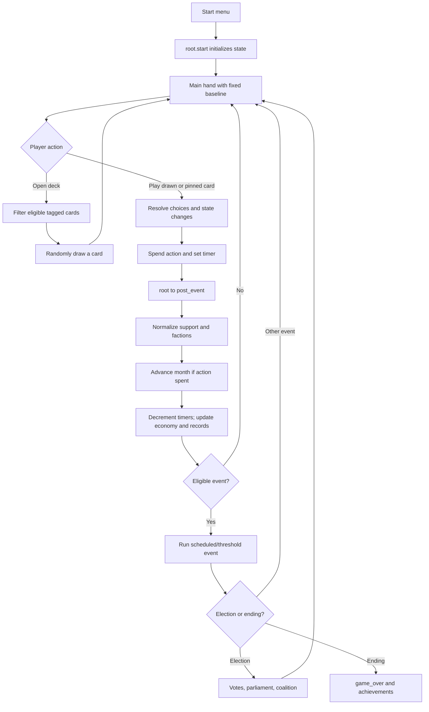
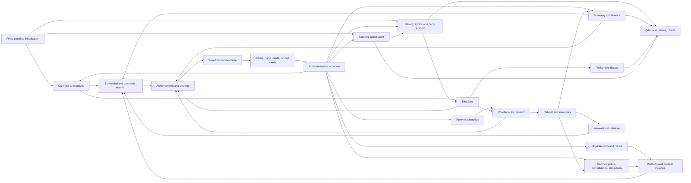

# Mechanics Map

## Purpose and evidence boundary

This document explains the existing game as implemented. It is a map of the
German baseline, not a design proposal for a Polish replacement. The evidence
base is every file under `source/`, plus the build configuration, compiled
`out/game.json`, and the customized browser files needed to trace display,
saving, and mod loading. No external historical research was used.

> **Implemented start-date decision:** New games start in **January 1922**.
> The remaining people, institutions, events, and mechanics still represent
> the German baseline until researched Polish replacements are approved. The
> retained first German election remains May 1928; this is an interim gameplay
> schedule, not a researched Polish equivalent.

> **Implemented PPS-1 decision:** The player-facing party is **PPS — Polska
> Partia Socjalistyczna**, while the internal party ID remains `spd` for
> compatibility with dynamic support keys, elections, coalitions, saves, and
> events. Opening displayed PPS support is 30% of Robotnicy, 15% of
> Inteligencja, 7% of Drobnomieszczaństwo, 7% of Chłopi, 1% of Burżuazja i
> Ziemiaństwo, and 5% of Mniejszości Narodowe. Bezrobotni retain approximately
> 23%. Other parties, advisers, five factions, cards, organizations,
> institutions, and dated events remain the explicit temporary German
> baseline.

The approved next-stage design is documented but not live: Centrum PPS,
Lewica PPS, and Piłsudczycy will replace the five inherited factions at
50/15/35; ZSZ will be an affiliated union power center rather than a faction;
the PPS social world will cover TUR, youth/children, welfare, sport,
cooperatives, and housing; press will center on *Robotnik* without a radio
branch; and Milicja PPS may develop into Akcja Socjalistyczna as a two-stage
organization separate from any future Polish Iron Front equivalent. Every
historical detail remains **TBD — historical research required**, and each
mechanical replacement requires its own bounded implementation and tests.

Repository paths identify evidence, not files to edit automatically. When the
code does not establish a behavior confidently, this document says:
**UNCLEAR — requires code investigation or runtime testing.**

## Contents

1. [The game in plain language](#the-game-in-plain-language)
2. [Dendry concepts used here](#dendry-concepts-used-here)
3. [Normal gameplay loop](#normal-gameplay-loop)
4. [System reference](#system-reference)
5. [Dependency map](#dependency-map)
6. [Glossary](#glossary)
7. [Safe-change checklists](#safe-change-checklists)
8. [Highest-risk systems](#highest-risk-systems)

## The game in plain language

### How DendryNexus is used

DendryNexus is both the story compiler and the game engine. Authors write
plain-text `.dry` files under `source/`. `source/info.dry` supplies game
metadata. Files under `source/scenes/` define narrative scenes, decisions,
cards, events, formulas, and state changes. Files under `source/qdisplays/`
translate numeric state into labels such as “friendly” or “high.”

`npm run build` invokes DendryNexus to compile this material into
`out/game.json` and the browser game under `out/html/`. The same command then
copies D3 and `assets/img/` into the deployed HTML directory. The customized
HTML runtime loads the compiled game, renders scenes and choices, stores saves,
and draws charts. Evidence: `package.json`, `source/info.dry`,
`out/html/index.html`, and `out/html/game.js`.

## Dendry concepts used here

### Scenes, choices, cards, decks, hands, and pinned cards

- A **scene** is the basic unit of content and control flow. A `.scene.dry`
  filename supplies the top-level scene ID; `@name` creates a subscene such as
  `root.start`.
- A **choice** is a route the player may select within a scene. Availability
  can depend on state.
- A **card** is a scene tagged/configured for the hand system. Playing it opens
  its content and normally consumes the month's action.
- A **deck** is a scene whose eligible tagged scenes can be drawn as cards.
  `main.party` draws `#party_affairs`; `main.govt` draws `#govt_affairs`.
- The **hand** holds drawn cards. The single gameplay route limits it to three
  cards.
- A **pinned card** is always presented separately and is not discarded when
  played. Advisers and the leadership-management entry use this behavior.

The browser engine implements draw/play/pinned behavior. Source evidence for
how this game configures it is `source/scenes/main.scene.dry`; engine evidence
is the installed DendryNexus hand logic and documentation.

### State variables (“qualities”)

Dendry calls persistent game-state values **qualities**. In embedded
JavaScript they are properties of `Q`, for example `Q.resources`; in ordinary
Dendry conditions they appear without `Q`, for example `view-if: resources >=
2`. State covers dates, resources, party support, ministries, event flags,
timers, and UI helper values. Most initial values are assigned by
`root.start` in `source/scenes/root.scene.dry`.

State is shared: a party card can alter a demographic preference that is read
months later by the election algorithm and displayed in a graph. This is why a
variable rename is not a local change.

### Important Dendry properties in this repository

| Property or form | Meaning here | Representative evidence |
| --- | --- | --- |
| `@subscene` | Creates a child scene within a file. | `source/scenes/root.scene.dry` |
| `view-if` | Hides a scene/card/choice unless a condition is true. Used heavily for dated events and card eligibility. | `source/scenes/events/black_thursday.scene.dry` |
| `choose-if` | Prevents selection unless a condition is true, while allowing the option to remain visible. | Coalition and policy choices in `source/scenes/events/election_1928.scene.dry` |
| `on-arrival` | Runs state changes when a scene is entered. | Initialization in `source/scenes/root.scene.dry`; monthly reconciliation in `source/scenes/post_event.scene.dry` |
| `on-departure` | Runs changes when leaving. Many action cards use it to spend the action. | Files under `source/scenes/party_affairs/` and `source/scenes/government_affairs/` |
| `go-to` | Routes to one or more valid destinations; conditions choose eligible routes. | `source/scenes/root.scene.dry` |
| `set-jump` | Supplies a return destination across a helper scene. | Election calculation in `source/scenes/events/election_1928.scene.dry` |
| `tags` / `#tag` | Groups scenes and expands a tag into eligible choices. | `#event` in `source/scenes/post_event.scene.dry`; `#advisor` and deck tags in `source/scenes/main.scene.dry` |
| `max-visits` | Limits how often a scene can be entered. Commonly makes an event one-time. | Files under `source/scenes/events/` |
| `is-card`, `is-deck`, `is-pinned` | Participate in Dendry's hand model. | `source/scenes/main.scene.dry` and adviser scenes |
| `{! ... !}` | Embedded JavaScript for loops and multi-step calculations. | `source/scenes/election_algorithm.scene.dry` |
| `[? if ... ?]`, `[+ ... +]` | Conditional content and state interpolation. | Throughout scenes and qdisplays |

## Normal gameplay loop

### How the game starts

The root scene routes on `started`. When it is zero, the player sees the start
menu. `root.start` initializes the state with the former Normal-mode values,
then a single **Begin** choice reaches `main`, which creates the hand/decks.
There is no difficulty selection. Evidence:
`source/scenes/root.scene.dry`, `source/scenes/main.scene.dry`.

### A normal player turn

1. The main screen shows the party deck, and after the time gate, the
   government deck. Adviser/leadership cards are pinned.
2. The player opens a deck. Dendry filters its tagged cards by conditions and
   randomly draws an eligible card if the hand is not full.
3. The player opens a drawn card, chooses an option, and the scene updates
   state. Most actions increment `month_actions` and set a cooldown timer.
4. Control returns through `root` to `post_event`.
5. `post_event` normalizes support and faction values. If at least one action
   was spent, it advances one month, decrements timers, records graph data, and
   applies economic feedback.
6. The event selector evaluates `#event`. An eligible scheduled or threshold
   event may run; otherwise play returns to the main hand.

Eligible cards expose a return-to-hand path that reverses the action marker,
clears the card timer, resets the card visit count, and puts the card back into
the three-card hand. Adviser cancellation has similar targeted rollback
behavior. Evidence:
`source/scenes/easy_discard.scene.dry` and
`source/scenes/cancel_advisor_action.scene.dry`.

### Events, elections, victory, and defeat

Events are ordinary scenes tagged `event`. Their `view-if` conditions encode
dates, prior flags, thresholds, or combinations of state. The post-event
selector exposes the currently eligible event choices. The compiled tag index
contains 69 top-level event scenes. Some are scheduled by `year`/`month`;
others react to values such as coup or capital-strike progress.

The election event becomes eligible at `next_election_year` and
`next_election_month`. It calls `election_algorithm`, processes thresholds and
bans, calculates displayed parliamentary shares, then enters coalition
formation. It schedules the next regular election and records results.

End conditions route to `game_over`, which computes achievements and selects
an eligible tagged ending. Some endings are defeat states, some are victory or
survival outcomes, and the 1934 sequence provides a normal campaign endpoint.
Exact outcome eligibility is distributed across `source/scenes/game_over.scene.dry`
and several event files; it should be retested whenever election, coup, or
institutional state changes.

### Flow diagram

## System reference

Each entry uses the same audit fields so that a later adaptation decision can
be traced back to code.

### 1. Game initialization

- **Purpose:** Create a complete starting state and enter the single playable
  route.
- **Player sees:** Start menu, credits, achievements, an election-simulation
  entry, and one **Begin** action after the introduction.
- **Sequence:** `root` checks `started`; `root.start` assigns arrays, numeric
  state, flags, names, records, and timers using the fixed baseline; control
  enters `main`.
- **Scenes/files:** `root`, `root.start`, `root.start_menu*` in
  `source/scenes/root.scene.dry`; `source/scenes/main.scene.dry`;
  `source/scenes/election_simulation.scene.dry`.
- **Important state:** `started`, `time`, `year`, `month`, legacy compatibility
  flags `difficulty = 0` and `historical_mode = 0`, `classes`, `parties`,
  `factions`, `timers`, and the bulk of the values catalogued in
  `STATE_VARIABLES.md`.
- **Depends on:** Dendry scene routing and embedded JavaScript.
- **Depended on by:** Every gameplay system.
- **Conditions/invariants:** Initialization must occur before normal play;
  array members define dynamic state-key families used by loops.
- **Coupling/risks:** Adding a party, class, faction, or timer changes loops in
  support, election, display, and monthly processing. Several later flags rely
  on Dendry's false/zero behavior rather than explicit initialization.
- **Safe extension points:** Add an explicitly initialized flag and document
  all readers/writers; add new start-menu documentation-only links only after
  runtime review.
- **Polish adaptation reconsideration:** Keep the current initialization
  structure, with the campaign starting in January 1922. Do not shift German
  dated events without approved Polish replacements.
- **Polish equivalent:** Implemented opening calendar: `year = 1922`,
  `month = 1`, and `time = 1`. The retained May 1928 German election is
  relative month `77`; the first Polish election remains **TBD — historical
  research required**.
- **Unresolved:** Whether every apparently unused initial field is retained for
  a planned mechanic or is obsolete is **UNCLEAR — requires code investigation
  or runtime testing.**

### 2. Fixed gameplay baseline

- **Purpose:** Provide one consistent ruleset and starting state without asking
  the player to choose a difficulty.
- **Player sees:** No difficulty or historical-mode selection.
- **Sequence:** `root.start` assigns the former Normal values and a single
  **Begin** action enters the three-card `main` hand.
- **Scenes/files:** `source/scenes/root.scene.dry` and
  `source/scenes/main.scene.dry`.
- **Important state:** `resources = 2`, `dues = 2`, `budget = 4`,
  `rb_strength = 2000`, the baseline relationships and faction dissent, plus
  compatibility values `difficulty = 0` and `historical_mode = 0`.
- **Depends on:** Initialization and the hand system.
- **Depended on by:** Action economy, return-to-hand behavior, saving, polls,
  achievements, and event choices.
- **Conditions/invariants:** New games always use the former Normal mechanics:
  three hand slots, saves and polls available, no historical-mode restrictions,
  and no alternate starting-value overrides.
- **Coupling/risks:** The two compatibility fields remain serialized because
  old saves, runtime code, and mods may still read them. They are no longer
  player-selectable and must stay fixed at zero for new games.
- **Safe extension points:** Balance the fixed baseline directly and test the
  opening state, hand capacity, saving, polls, card return, and achievements.
- **Polish adaptation reconsideration:** Whether a future adaptation should
  continue to use one fixed ruleset.
- **Polish equivalent:** Keep one fixed gameplay baseline, based on the former
  Normal settings. The future Polish equivalent of the Reichsbanner is **Akcja
  Socjalistyczna (AS)**. As part of the bounded Polish replacement, Reichsbanner
  labels and `rb` state names should become Akcja Socjalistyczna labels and
  `as` state names. This is a future migration target, not authorization for a
  mass rename; every reader, writer, display, and save-compatibility effect must
  be audited in a separately approved change. AS starts with zero strength as a
  user-approved gameplay setup for January 1922. Its historical creation date
  remains **TBD — historical research required** until a source is recorded in
  `HISTORICAL_SOURCES.md`.
- **Unresolved:** Compatibility behavior when importing an old non-Normal save
  is **UNCLEAR — requires code investigation or runtime testing.**

### 3. Calendar and month advancement

- **Purpose:** Turn one completed action into one elapsed month and drive all
  dated systems.
- **Player sees:** Month/year in the status display; cards/events appear or
  expire over time.
- **Sequence:** An action increments `month_actions`; `post_event` increments
  `time` and `month`, rolls month 13 to January plus one year, resets the action
  count, decrements positive timers, and appends monthly records.
- **Scenes/files:** `source/scenes/post_event.scene.dry`, action files under
  `source/scenes/party_affairs/` and `source/scenes/government_affairs/`, and
  `source/qdisplays/month.qdisplay.dry`.
- **Important state:** `time`, `year`, `month`, `month_actions`, `timers`, every
  `*_timer`, and `next_election_*`.
- **Depends on:** Action completion and initialized timer names.
- **Depended on by:** Cooldowns, events, elections, economics, charts, and the
  campaign endpoint.
- **Conditions/invariants:** At most one month advances during one
  `post_event` pass because `month_actions` is reset; timers do not go below
  zero through the central decrement loop.
- **Coupling/risks:** Event scenes sometimes manipulate `month_actions` to force
  or prevent advancement. A timer omitted from `timers` will not cool down via
  the central loop.
- **Safe extension points:** Date-gated events and timers added to the central
  array with explicit initialization.
- **Polish adaptation reconsideration:** Calendar span, action cadence,
  election schedule, and dated event ordering.
- **Polish equivalent:** TBD — user historical research required.
- **Unresolved:** Ordering when several `#event` scenes are simultaneously
  eligible is **UNCLEAR — requires code investigation or runtime testing.**

### 4. Action and resource economy

- **Purpose:** Limit how often the player acts and force tradeoffs between
  party capacity and government finance.
- **Player sees:** Resources, dues, government budget, card costs, and disabled
  choices.
- **Sequence:** Cards gate choices with resource/budget conditions, subtract or
  add values, increment `month_actions`, and set cooldowns. Fundraising changes
  dues/resources; government policies use `budget` separately.
- **Scenes/files:** `source/scenes/party_affairs/fundraising.scene.dry`, most files in
  `source/scenes/party_affairs/` and `source/scenes/government_affairs/`, plus
  `source/scenes/post_event.scene.dry`.
- **Important state:** `resources`, `dues`, `budget`, `month_actions`, timers,
  and policy-specific cost variables such as `wtb_budget`.
- **Depends on:** Fixed starting resources, card availability, calendar, and
  coalition or ministry access.
- **Depended on by:** Campaigning, organizations, advisers, policies, media,
  political violence, and economic feedback.
- **Conditions/invariants:** Party resources and government budget are not the
  same pool. Negative budget is allowed and affects inflation.
- **Coupling/risks:** Costs are embedded across many choices. Rebalancing one
  pool changes political, electoral, and economic pacing.
- **Safe extension points:** A bounded card with explicit cost, timer, and
  before/after test cases.
- **Polish adaptation reconsideration:** Meaning and scale of both currencies,
  recurring income, and which actions consume a month.
- **Polish equivalent:** TBD — user historical research required.
- **Unresolved:** A single global balancing target for resource income versus
  costs is **UNCLEAR — requires code investigation or runtime testing.**

### 5. Hand, deck, card, and pinned-card behavior

- **Purpose:** Turn a large event library into a manageable, partly random
  action menu.
- **Player sees:** Party/government decks, drawn cards, and always-available
  pinned adviser/leadership cards.
- **Sequence:** A deck expands a tag, filters cards by current conditions,
  randomly draws one up to hand capacity, and adds it to the hand. Playing an
  ordinary card removes it; a pinned card remains available. Scenes route back
  manually after resolution.
- **Scenes/files:** `source/scenes/main.scene.dry`, adviser files under
  `source/scenes/advisors/`, `source/scenes/easy_discard.scene.dry`, and
  `source/scenes/cancel_advisor_action.scene.dry`; behavior is implemented in
  the DendryNexus browser engine.
- **Important state:** Engine hand state plus `time`, `last_advisor_action`,
  `last_cabinet_action`, and card timers.
- **Depends on:** Dendry runtime, tags, `view-if`, visit counts, and timers.
- **Depended on by:** The entire action-selection loop.
- **Conditions/invariants:** Government deck requires `time >= 6`; hand maximum
  is three; pinned cards are not consumed.
- **Coupling/risks:** Card IDs are reused as timer prefixes by discard/cancel
  logic. Renaming a scene can break that convention.
- **Safe extension points:** A new tagged card with explicit eligibility,
  timer, cost, return route, and hand-capacity smoke test.
- **Polish adaptation reconsideration:** Deck taxonomy, randomness, card
  cadence, and which persistent controls should be pinned.
- **Polish equivalent:** TBD — user historical research required.
- **Unresolved:** Exact random selection guarantees and behavior when every
  card is unavailable are **UNCLEAR — requires code investigation or runtime
  testing.**

### 6. Random and scheduled events

- **Purpose:** Insert dated developments and state-triggered consequences
  between player actions.
- **Player sees:** A narrative event and its choices before returning to the
  hand.
- **Sequence:** `post_event.events_choice` expands `#event`; each event's
  `view-if`, priority, and visit limit determine eligibility; a selected event
  updates flags/state and routes onward.
- **Scenes/files:** `source/scenes/post_event.scene.dry` and all files under
  `source/scenes/events/`; examples include
  `source/scenes/events/black_thursday.scene.dry`,
  `source/scenes/events/capital_strike.scene.dry`, and
  `source/scenes/events/election_1928.scene.dry`.
- **Important state:** `year`, `month`, `time`, `*_seen`, `*_timer`, policy
  flags, `coup_progress`, `capital_strike_progress`, election dates, and
  `has_event`.
- **Depends on:** Calendar, tags, state thresholds, and visit counts.
- **Depended on by:** Economics, elections, coalitions, institutions,
  achievements, and endings.
- **Conditions/invariants:** Many events have `max-visits: 1`; date events rely
  on month/year comparisons; consequence events use threshold gates.
- **Coupling/risks:** Simultaneous eligibility, priority, and flags can change
  chronology. Some events both spend an action and advance time indirectly.
- **Safe extension points:** A one-time event with a unique flag, precise
  eligibility, explicit route, and tests immediately before/at/after its date.
- **Polish adaptation reconsideration:** Entire event chronology, prerequisites,
  ordering, and consequences.
- **Polish equivalent:** TBD — user historical research required.
- **Unresolved:** Whether all priority ties resolve deterministically is
  **UNCLEAR — requires code investigation or runtime testing.**

### 7. Party support and vote share

- **Purpose:** Convert demographic preferences into party-level support and
  displayed votes.
- **Player sees:** Party support, demographic breakdowns, election results, and
  history charts.
- **Sequence:** For each class, negative raw propensities are clamped to zero;
  propensities are normalized within that class; normalized class preferences
  are weighted by class proportions; party totals are normalized; rounded vote
  shares and display fields are produced. Before calculation, the temporary
  compatibility bridge copies the former Catholic party profile into
  `national_minorities_*`.
- **Scenes/files:** `source/scenes/post_event.scene.dry`,
  `source/scenes/election_algorithm.scene.dry`,
  `source/scenes/election_simulation.scene.dry`, campaigning and policy cards,
  and `source/scenes/library.scene.dry`.
- **Important state:** `classes`, `parties`, the five main-class proportions,
  overlapping `unemployed` and `national_minorities` weights; dynamic
  `<class>_<party>`, `_normalized`, and `_display` families; party
  `_support`, `_normalized`, `_votes`, `_votes_dec`, and `_votes_disp` fields;
  `dissent`.
- **Depends on:** Initialization, party membership arrays, card/event effects,
  and nonzero class totals.
- **Depended on by:** Elections, coalition arithmetic, presidential elections,
  charts, and achievements.
- **Conditions/invariants:** Raw class-party values may be unbounded above but
  are clamped at zero; each class is normalized; party normalized support sums
  approximately to one.
- **Coupling/risks:** Dynamic key construction makes renames especially risky.
  If one class total becomes zero, division-by-zero protection is not visible.
- **Safe extension points:** Small changes to an existing raw preference with
  regression snapshots before and after normalization.
- **Polish adaptation reconsideration:** The class list and opening weights are
  implemented. The player-facing PPS identity and approved opening support are
  implemented, but other parties, permanent propensities after the opening,
  persuasion balance, and rounding still require Polish research and testing.
- **Polish equivalent:** Implemented player-facing groups are **Robotnicy**
  (`workers`), **Drobnomieszczaństwo** (`old_middle`), **Inteligencja**
  (`new_middle`), **Chłopi** (`rural`), **Burżuazja i Ziemiaństwo**
  (`bourgeois_landowners`), **Bezrobotni** (`unemployed`), and
  **Mniejszości Narodowe** (`national_minorities`). The five main classes total
  100% in January 1922: 27%, 110/9% (about 12.22%), 50/9% (about 5.56%),
  53%, and 20/9% (about 2.22%), respectively. From January 1922 to December
  1939, Robotnicy rise linearly to exactly 30% and Chłopi decline linearly to
  exactly 50%; the other three main-class shares remain fixed. Bezrobotni start
  at 3% and retain the German crisis mechanics as an overlapping economic
  condition. Mniejszości Narodowe are a 30% overlapping identity group; Polacy
  are the implied complement and are not stored as a separate weight.

  The provisional minority composition is approximately 60% Chłopi, 17%
  Robotnicy, 19% Drobnomieszczaństwo, 3% Inteligencja, and 2% Burżuazja i
  Ziemiaństwo. These approximate descriptive figures do not yet drive another
  calculation. Non-PPS values for Burżuazja i Ziemiaństwo temporarily copy the
  opening Old Middle Class profile; its PPS support is adjusted to the approved
  displayed 1%. Mniejszości Narodowe temporarily copy the Catholic profile and
  receive existing Catholic-targeting effects; the compatibility value is set
  to produce the approved displayed 5% PPS support. Raw `*_spd` values are
  hidden weights chosen so normalization displays the approved 30/15/7/7/1/5
  targets; they are not themselves percentages. Bezrobotni retain the inherited
  raw value, which displays as approximately 23%. These are gameplay
  placeholders; permanent replacements are **TBD — historical research
  required**. Other parties remain the German baseline by explicit scope.
- **Unresolved:** Zero-total class behavior and the intended role of
  `old_demographics` are **UNCLEAR — requires code investigation or runtime
  testing.** The current campaign ending occurs before December 1939, so the
  approved demographic endpoint is implemented and tested but not reachable
  in ordinary play until campaign chronology is extended separately.

### 8. Elections and parliamentary allocation

- **Purpose:** Freeze current support into an election result, enforce legal
  rules, compare with the prior result, and open government formation.
- **Player sees:** Vote shares/changes, largest party, coalition options, and
  ministry bargaining.
- **Sequence:** The event invokes `election_algorithm`; shares below the
  threshold or for banned parties are zeroed; remaining shares are
  renormalized; old/result/change fields are updated; coalition totals and
  largest party are calculated; government/ministry state is reset; results
  are recorded; the next election is scheduled.
- **Scenes/files:** `source/scenes/election_algorithm.scene.dry` and
  `source/scenes/events/election_1928.scene.dry`.
- **Important state:** `next_election_year`, `next_election_month`,
  `n_elections`, `electoral_threshold`, party bans, `<party>_r`,
  `old_<party>_r`, `change_<party>_r`, `largest_party`, coalition totals,
  `leverage`, `election_records`, and `use_decimals`.
- **Depends on:** Party support, calendar, constitutional rules, and party list.
- **Depended on by:** Parliament display, coalitions, ministries, government
  events, and endings.
- **Conditions/invariants:** Regular next election is advanced four years;
  qualifying shares are renormalized; `use_decimals` is marked TODO in source.
- **Coupling/risks:** The code usually treats result percentages as a proxy for
  seats. Coalition formulas contain explicit adjustments, so changing parties
  or thresholds requires a full formula audit.
- **Safe extension points:** An election-specific rule behind a documented
  flag, with fixtures for threshold, ban, rounding, and coalition totals.
- **Polish adaptation reconsideration:** Electoral law, districts/seats,
  parties, term length, bans, coalition arithmetic, and office allocation.
- **Polish equivalent:** TBD — user historical research required.
- **Unresolved:** Exact seat allocation beyond percentage-based approximation
  is **UNCLEAR — requires code investigation or runtime testing.**

### 9. Parliament display

- **Purpose:** Visualize the election result as a semicircular chamber.
- **Player sees:** A colored parliament graphic after elections and in relevant
  display areas.
- **Sequence:** Election result values are passed to the D3 helper; each share
  is multiplied by roughly five to create an approximately 500-seat visual;
  `parliament-svg` lays out colored dots/seats.
- **Scenes/files:** D3 calls in `source/scenes/events/election_1928.scene.dry`
  and `source/scenes/library.scene.dry`; scripts loaded by
  `out/html/index.html`; copied D3 from the build script in `package.json`.
- **Important state:** Party `_r` values, colors/labels in the figure helper,
  and `election_records` for charts.
- **Depends on:** Election results, D3, `parliament-svg`, and browser DOM.
- **Depended on by:** Player interpretation only; no confirmed gameplay writer
  reads the rendered output.
- **Conditions/invariants:** Visualization is approximate and is not evidence
  of a separate electoral seat algorithm.
- **Coupling/risks:** Party order, colors, and hard-coded labels must match
  election state. Removing `parliament-svg` is explicitly out of scope.
- **Safe extension points:** Display-only labels/colors after verifying every
  party and the browser layout.
- **Polish adaptation reconsideration:** Chamber size/layout, party set,
  colors, legend, and whether an exact allocator is required.
- **Polish equivalent:** TBD — user historical research required.
- **Unresolved:** Responsive behavior and accessibility of the SVG are
  **UNCLEAR — requires code investigation or runtime testing.**

### 10. Coalition formation and coalition dissent

- **Purpose:** Translate an election into a government and make unstable
  alliances constrain policy.
- **Player sees:** Available coalition/toleration choices, relationship gates,
  ministry negotiations, coalition disputes, and confidence votes.
- **Sequence:** Election code computes named coalition totals; menus gate paths
  by majority, relationships, leadership, resources, and president; chosen
  routes set `in_*` flags and cabinet access; later actions/events change
  `coalition_dissent`; high dissent can trigger coalition affairs or a vote of
  no confidence.
- **Scenes/files:** Coalition sections of
  `source/scenes/events/election_1928.scene.dry`,
  `source/scenes/government_affairs/coalition_affairs.scene.dry`,
  `source/scenes/events/vote_of_no_confidence.scene.dry`, and KPD/popular-front
  event files.
- **Important state:** Named coalition totals and `in_*` flags,
  `coalition_dissent`, `kpd_coalition_dissent`, `has_majority`,
  `spd_toleration`, `communist_coalition`, party relations, `chancellor`, and
  `chancellor_party`.
- **Depends on:** Election shares, party relations, constitutional state, and
  president/chancellor state.
- **Depended on by:** Government card access, ministries, policy viability,
  no-confidence events, and endings.
- **Conditions/invariants:** Majority checks generally use 50; coalition
  dissent's qdisplay bands are 0, 1, 2, 3, and 4+; the constructive vote flag
  changes confidence-vote logic.
- **Coupling/risks:** Many mutually related flags represent one government.
  Incomplete reset can leave contradictory coalition state.
- **Safe extension points:** A new coalition path that reuses a centralized
  reset/setup sequence and has tests for every government flag.
- **Polish adaptation reconsideration:** Parties, legal majority rules,
  toleration, head-of-state powers, coalition goals, and ministry bargaining.
- **Polish equivalent:** TBD — user historical research required.
- **Unresolved:** Exhaustive mutual exclusivity of all `in_*` flags is
  **UNCLEAR — requires code investigation or runtime testing.**

### 11. Party factions and internal dissent

- **Purpose:** Model internal blocs whose size and dissatisfaction affect
  support and can split the party.
- **Player sees:** Faction strengths/dissent, party-disunity events, leadership
  tradeoffs, and possible resignations/splits.
- **Sequence:** Cards and leaders change faction strength/dissent;
  `post_event` clamps and normalizes strengths, caps dissent, and computes
  weighted overall `dissent`; the party-disunity card and threshold events
  react to high values.
- **Scenes/files:** `source/scenes/post_event.scene.dry`,
  `source/scenes/party_affairs/party_disunity.scene.dry`,
  `source/scenes/party_affairs/shuffle_leadership.scene.dry`, and faction consequence files
  under `source/scenes/events/`.
- **Important state:** `factions`, each `<faction>_strength` and
  `<faction>_dissent`, `dissent`, `dissent_percent`, `left_split`,
  `centrists_resign`, `reformists_resign`/`reformists_resigned`, and
  `unions_independent`.
- **Depends on:** Leadership/advisers, policies, event thresholds, and monthly
  normalization.
- **Depended on by:** Support gains, party unity cards, splinter formation,
  advisers, coalitions, and achievements.
- **Conditions/invariants:** Faction strengths are normalized to total 100;
  individual dissent is clamped to 0–99; overall dissent is capped at 0.95;
  split/resignation events commonly use 60 dissent.
- **Coupling/risks:** A raw strength total of zero would divide by zero. Similar
  singular/plural flag names create maintenance risk.
- **Safe extension points:** An effect on one documented faction value, with
  post-normalization and threshold tests.
- **Polish adaptation reconsideration:** Faction identities, weights,
  ideological disagreements, leaders, and split consequences.
- **Polish equivalent:** **Approved but not implemented.** The future PPS model
  is Centrum PPS 50 strength/0 dissent, Lewica PPS 15/20, and Piłsudczycy 35/5.
  Each has an approved 60-dissent break path and possible successor behavior.
  Replacing the live array alone would orphan existing card, adviser, union,
  split-event, monthly-dissent, and UI writes, so PPS-1 deliberately retains
  the five German factions. The full three-faction conversion must be one
  separately tested slice. Historical validation is **TBD — historical
  research required**.
- **Unresolved:** Intended semantics of `centrist_dissent` versus
  `center_dissent` are **UNCLEAR — requires code investigation or runtime
  testing.**

### 12. Relationships with other parties

- **Purpose:** Make cooperation, coalitions, and cross-party support depend on
  accumulated political choices.
- **Player sees:** Qualitative relationship labels and conditionally available
  cooperation choices.
- **Sequence:** Inter-party and policy scenes add/subtract relationship values;
  coalition and presidential-election choices gate on them; `relations`
  qdisplay converts values to labels.
- **Scenes/files:** `source/scenes/party_affairs/inter_party_relationships.scene.dry`,
  coalition code in `source/scenes/events/election_1928.scene.dry`,
  `source/scenes/events/death_of_hindenburg_president.scene.dry`, and
  `source/qdisplays/relationships.qdisplay.dry`.
- **Important state:** `z_relation`, `kpd_relation`, `ddp_relation`,
  `dvp_relation`, `dnvp_relation`, `nsdap_relation`, plus foreign relationship
  values handled separately.
- **Depends on:** Party/policy choices, leadership, and events.
- **Depended on by:** Coalition access, candidate coordination, no-confidence
  votes, and some events.
- **Conditions/invariants:** Qdisplay bands run from hostile at 5 or below to
  very friendly at 75 or above; individual choices use their own thresholds.
- **Coupling/risks:** Initialization uses uppercase `DNVP_relation` and
  `NSDAP_relation`, while later code reads lowercase forms.
- **Safe extension points:** A clearly named relationship change with a stated
  reason and boundary test at each affected gate.
- **Polish adaptation reconsideration:** Party list, relationship dimensions,
  baseline values, and what cooperation each threshold enables.
- **Polish equivalent:** TBD — user historical research required.
- **Unresolved:** Whether uppercase initial values ever feed lowercase readers
  is **UNCLEAR — requires code investigation or runtime testing.**

### 13. Advisers and leadership

- **Purpose:** Let the player maintain a small roster of persistent specialists
  and use periodic actions with faction consequences.
- **Player sees:** Pinned adviser cards, roster management, adviser-specific
  actions, and cooldown restrictions.
- **Sequence:** `#advisor` supplies 25 top-level adviser/cabinet cards;
  leadership shuffle adds/removes advisers up to `n_advisors`; selected actions
  set `advisor_action_timer` and `last_advisor_action`; cancellation can restore
  the previous card state.
- **Scenes/files:** `source/scenes/party_affairs/shuffle_leadership.scene.dry`, all files under
  `source/scenes/advisors/`, `source/scenes/main.scene.dry`, and
  `source/scenes/cancel_advisor_action.scene.dry`.
- **Important state:** `n_advisors`, every `*_advisor` flag,
  `advisor_action_timer`, `last_advisor_action`, faction strength/dissent, and
  policy-specific state touched by each adviser.
- **Depends on:** Pinned-card runtime, factions, timers, resources, and scene
  visit state.
- **Depended on by:** Most policy systems, party support, organizations,
  coalition management, and institutional actions.
- **Conditions/invariants:** Starting roster maximum is three; a shared adviser
  cooldown is normally six in action scenes; roster changes alter faction
  balance.
- **Coupling/risks:** Adviser effects reach many unrelated systems. IDs, flags,
  tags, and roster choices must agree.
- **Safe extension points:** One adviser with a unique flag, faction tag,
  bounded action, shared timer, and add/remove coverage.
- **Polish adaptation reconsideration:** Entire roster, eligibility, faction
  placement, actions, and biographical presentation.
- **Polish equivalent:** TBD — user historical research required.
- **Unresolved:** Whether every adviser action uses the same intended cooldown
  is **UNCLEAR — requires code investigation or runtime testing.**

### 14. Cabinet and ministries

- **Purpose:** Restrict government actions according to coalition participation
  and offices controlled by the player party.
- **Player sees:** Cabinet access, ministry allocation during coalition talks,
  named office holders, goals, and ministry-specific cards.
- **Sequence:** Election/government formation calculates `leverage`; the player
  spends it to claim ministries; each ministry sets a party ownership field and
  sometimes a named minister; cabinet/government cards gate on ownership and
  government flags; later elections reset office state.
- **Scenes/files:** Ministry sections in
  `source/scenes/events/election_1928.scene.dry`,
  `source/scenes/government_affairs/shuffle_cabinet.scene.dry`, government scenes, and
  the pinned `cabinet` scene.
- **Important state:** `leverage`, `*_minister`, `*_minister_party`,
  `*_goal`, `*_goal_completed`, `last_cabinet_action`,
  `shuffle_cabinet_timer`, and government flags.
- **Depends on:** Elections, coalition choice, hand/pinned behavior, and
  advisers.
- **Depended on by:** Economic, fiscal, foreign, policing, military,
  agricultural, labor, education, welfare, justice, and constitutional cards.
- **Conditions/invariants:** Common ministry costs are 5, 10, or 15 leverage;
  access generally requires an SPD government and/or SPD ownership.
- **Coupling/risks:** Ownership, named minister, goal, and coalition state are
  separate fields and can drift apart.
- **Safe extension points:** One ministry with explicit ownership, goal,
  cabinet route, election reset, and status-display treatment.
- **Polish adaptation reconsideration:** Cabinet structure, offices, appointment
  rules, coalition allocation, and which office gates each policy.
- **Polish equivalent:** TBD — user historical research required.
- **Unresolved:** Whether all named minister fields have gameplay readers is
  **UNCLEAR — requires code investigation or runtime testing.**

### 15. Economic conditions and policies

- **Purpose:** Model crisis pressure and let government programs trade budget,
  inflation, unemployment, growth, political support, and elite resistance.
- **Player sees:** Economic indicators, crisis events, program choices, and D3
  history graphs.
- **Sequence:** Year events and monthly `post_event` logic change baseline
  indicators; `crisis_program` chooses a broad plan; `economic_policy`
  implements stages; deficits feed inflation; works programs alter later
  downturn/recovery effects; extreme policies can advance capital strike or
  coup progress.
- **Scenes/files:** `source/scenes/post_event.scene.dry`,
  `source/scenes/party_affairs/crisis_program.scene.dry`,
  `source/scenes/government_affairs/economic_policy.scene.dry`, economic event files,
  and `source/scenes/library.scene.dry`.
- **Important state:** `unemployed`, `inflation`, `economic_growth`, `budget`,
  `economic_plan`, `wtb_*`, `moderate_plan_*`, `nationalization_*`,
  `works_program`, `capital_strike_progress`, `coup_progress`, and
  `economic_records`.
- **Depends on:** Calendar, government/ministry access, budget, factions,
  coalitions, and events.
- **Depended on by:** Party support, finance, capital/coup events,
  achievements, endings, and charts.
- **Conditions/invariants:** `unemployed` is floored at 1 in monthly processing;
  negative budget is permitted; plan codes are documented in initialization as
  0–3.
- **Coupling/risks:** Similar names (`unemployed` and `unemployment`) coexist.
  Many effects mix simulation variables and political reaction in one block.
- **Safe extension points:** A staged policy that changes existing indicators
  through a single card and is tested across several monthly ticks.
- **Polish adaptation reconsideration:** Indicators, baseline trajectory,
  crisis chronology, policy menu, fiscal effects, and political reactions.
- **Polish equivalent:** TBD — user historical research required.
- **Unresolved:** A formal unit/range contract for all economic variables is
  **UNCLEAR — requires code investigation or runtime testing.**

### 16. Taxation and government finance

- **Purpose:** Make redistribution and spending subject to budget and political
  consequences.
- **Player sees:** Budget, tax-level descriptions, tariffs, and fiscal policy
  options.
- **Sequence:** Fiscal choices change `upper_tax_rates`, `lower_tax_rates`,
  `tariffs`, and `budget`; programs consume budget; monthly feedback converts
  deficits into inflation; business reaction can advance capital strike.
- **Scenes/files:** `source/scenes/government_affairs/fiscal_policy.scene.dry`,
  `source/scenes/post_event.scene.dry`, economic-policy scenes, and
  `source/qdisplays/taxation.qdisplay.dry`.
- **Important state:** `budget`, `upper_tax_rates`, `lower_tax_rates`,
  `tariffs`, `austerity`, program costs, `inflation`, `economic_growth`,
  `unemployed`, and `capital_strike_progress`.
- **Depends on:** Government/ministry access, coalition tolerance, and economic
  state.
- **Depended on by:** Economic outcomes, policy implementation, party
  relations/support, capital-strike events, and endings.
- **Conditions/invariants:** Tax qdisplay maps negative through positive levels
  from extremely low to extremely high; budget may fall below zero.
- **Coupling/risks:** The same budget variable is both spending capacity and a
  monthly macroeconomic input.
- **Safe extension points:** A fiscal choice with explicit immediate cost and
  separately documented monthly consequence.
- **Polish adaptation reconsideration:** Revenue system, units, policy powers,
  budget baseline, borrowing/inflation link, and political responses.
- **Polish equivalent:** TBD — user historical research required.
- **Unresolved:** Whether budget represents a balance, reserve, or abstract
  fiscal capacity is **UNCLEAR — requires code investigation or runtime
  testing.**

### 17. Political organizations

- **Purpose:** Let the player invest in party infrastructure, media, culture,
  campaigning, and allied organizations.
- **Player sees:** Party organization, campaign, media, rally, Reichsbanner,
  Iron Front, and related action cards.
- **Sequence:** Cards spend resources, set timers, and change demographic
  support, faction state, organization strength, or later-event flags.
- **Scenes/files:** `source/scenes/party_affairs/party_organizations.scene.dry`,
  `campaigning.scene.dry`, `media.scene.dry`, `rally.scene.dry`,
  `reichsbanner.scene.dry`, `iron_front.scene.dry`, and related event files.
- **Important state:** `resources`, `party_organizations_timer`,
  `campaign_media`, `commercialized_media`, `radio`,
  `cultural_organizations`, `rb_strength`, `rb_militancy`,
  `iron_front_formed`, and demographic preference values.
- **Depends on:** Action economy, timers, party support, factions, and
  political-violence state.
- **Depended on by:** Elections, street conflict, coup resistance,
  achievements, and events.
- **Conditions/invariants:** Repeated actions are limited by timers and costs;
  organizational strength also feeds power calculations.
- **Coupling/risks:** “Organization” cards can change support, loyalty, and
  violence at once; player-facing labels do not reveal every effect.
- **Safe extension points:** A single organization investment with a bounded
  cost, one primary effect, and explicit downstream tests.
- **Polish adaptation reconsideration:** Organization list, legal status,
  membership/strength scale, media channels, and links to violence.
- **Polish equivalent:** TBD — user historical research required.
- **Unresolved:** Which organization values are intended as people, abstract
  strength, or percentages is **UNCLEAR — requires code investigation or
  runtime testing.**

### 18. Militancy, loyalty, and political violence

- **Purpose:** Turn organization size, willingness to fight, and institutional
  allegiance into coup/civil-war risk and outcomes.
- **Player sees:** Strength, militancy, and loyalty labels; clashes, bans,
  marches, coups, and civil-war events.
- **Sequence:** Party/government choices alter organization strength and
  militancy or police/military loyalty; conflict scenes calculate power from
  combinations of those values; threshold events trigger; outcome scenes set
  victory/defeat flags.
- **Scenes/files:** `source/scenes/party_affairs/streetfighting.scene.dry`,
  `source/scenes/events/civil_war.scene.dry`, organization scenes, and violence/coup
  files under `source/scenes/events/`; qdisplays `loyalty`, `militancy`, and
  `strength`.
- **Important state:** `rb_*`, `sh_*`, `sa_*`, `rfb_*`, police and Reichswehr
  strength/militancy/loyalty, computed `*_power`, `coup_progress`,
  `civil_war_seen`, `coup_victory`, `total_defeat`, and `long_war`.
- **Depends on:** Organizations, police/institutional policy, bans, factions,
  and event scheduling.
- **Depended on by:** Coup outcomes, civil war, achievements, and endings.
- **Conditions/invariants:** Power is derived rather than independently chosen;
  loyalty/militancy qdisplays use nonlinear bands; coup progress events use a
  threshold of 10.
- **Coupling/risks:** Units differ dramatically among strength, militancy, and
  loyalty. Small changes can flip terminal outcomes.
- **Safe extension points:** A bounded modifier with explicit before/after
  power calculation and outcome threshold tests.
- **Polish adaptation reconsideration:** All organizations, legal powers,
  strength units, allegiance model, violence escalation, and end states.
- **Polish equivalent:** TBD — user historical research required.
- **Unresolved:** Whether every computed power helper persists beyond its scene
  is **UNCLEAR — requires code investigation or runtime testing.**

### 19. Police and institutional loyalty

- **Purpose:** Represent whether coercive and constitutional institutions obey,
  resist, or undermine the government.
- **Player sees:** Police/military policy choices, loyalty descriptions,
  investigations, bans, institutional crises, and coups.
- **Sequence:** Ministry cards change police or Reichswehr loyalty/training and
  reform flags; constitutional policy changes presidential/no-confidence
  rules; event checks combine those values with government and violence state.
- **Scenes/files:** `source/scenes/government_affairs/police.scene.dry`,
  `prussian_affairs.scene.dry`, `military_policy.scene.dry`,
  `constitutional_reform.scene.dry`, `judiciary.scene.dry`, and coup/event
  files.
- **Important state:** `interior_police_loyalty`, `prussian_police_*`,
  `reichswehr_*`, `investigate_corruption`, `investigate_far_right`,
  `judicial_reform`, `constitutional_reform`, `constructive_vonc`,
  `presidential_powers`, party bans, and `coup_progress`.
- **Depends on:** Cabinet/ministry ownership, budget, coalition state, and
  calendar events.
- **Depended on by:** Violence outcomes, constitutional crises, coalition
  survival, coups, achievements, and endings.
- **Conditions/invariants:** Loyalty qdisplay treats 0.41–0.54 as divided and
  0.95+ as completely loyal; constitutional flags alter later route logic.
- **Coupling/risks:** National and Prussian police are separate; constitutional
  reforms touch election, coalition, ban, and coup paths.
- **Safe extension points:** One institutional reform flag with explicit
  readers, migration/default behavior, and branch tests.
- **Polish adaptation reconsideration:** Institutional structure, territorial
  levels, constitutional powers, policing, judiciary, armed forces, and legal
  reform paths.
- **Polish equivalent:** TBD — user historical research required.
- **Unresolved:** The intended distinction between all police strength/training
  helpers is **UNCLEAR — requires code investigation or runtime testing.**

### 20. International relations

- **Purpose:** Let foreign-policy direction and international agreements affect
  aid, domestic politics, and long-term outcomes.
- **Player sees:** Party-level international-relations actions, foreign-ministry
  policy, relationship directions, agreements, and international events.
- **Sequence:** Party cards shape orientation; foreign-policy ministry choices
  alter `west_relation`, `east_relation`, `soviet_relation`, aid, reparations,
  union/integration progress, and domestic faction/party reactions; dated
  events read these flags.
- **Scenes/files:** `source/scenes/party_affairs/international_relations.scene.dry`,
  `source/scenes/government_affairs/foreign_policy.scene.dry`, and international event
  files under `source/scenes/events/`.
- **Important state:** `west_relation`, `east_relation`, `soviet_relation`,
  `austria_relation`, `west_aid`, `east_aid`, `soviet_aid`, `reparations`,
  `war_guilt`, `customs_union`, `eu`, `eu_progress`, and related `_seen` flags.
- **Depends on:** Foreign-ministry access, party/faction relations, calendar,
  and budget/economy.
- **Depended on by:** Aid, events, coalition/faction reactions, achievements,
  and endings.
- **Conditions/invariants:** Directions are separate variables, not one axis;
  several policies are multi-stage via progress and seen flags.
- **Coupling/risks:** Source-specific institutions and agreements are embedded
  directly in names and event chronology.
- **Safe extension points:** A self-contained diplomatic event with a unique
  flag and explicitly documented domestic/economic effects.
- **Polish adaptation reconsideration:** Every actor, agreement, orientation,
  date, policy power, and domestic consequence.
- **Polish equivalent:** TBD — user historical research required.
- **Unresolved:** Scale contracts for relation values other than player-facing
  labels are **UNCLEAR — requires code investigation or runtime testing.**

### 21. Achievements, endings, and game over

- **Purpose:** Detect notable play patterns, terminate the campaign, and
  summarize outcomes.
- **Player sees:** Ending narrative and unlocked achievement list.
- **Sequence:** Terminal events or the campaign endpoint route to `game_over`;
  it recalculates relevant totals, sets per-game and persistent achievement
  keys, evaluates `#endings`, then reaches an `game-over: true` scene.
- **Scenes/files:** `source/scenes/game_over.scene.dry`, ending-triggering event
  files, and `source/scenes/root.scene.dry` for the achievements menu.
- **Important state:** `game_over`, `achievement_*`, `game_achievement_*`,
  `republic_victory`, `coup_victory`, `total_defeat`, `long_war`, economic and
  political outcome fields.
- **Depends on:** Almost every major simulation system and Dendry achievement
  persistence.
- **Depended on by:** Final narrative and replay goals.
- **Conditions/invariants:** Compiled tags contain 23 ending scenes; both global
  and current-play achievement fields exist; ending priority/eligibility decide
  the presented result.
- **Coupling/risks:** A state change can unintentionally unlock multiple endings
  or achievements. Renaming an achievement key can break persisted progress.
- **Safe extension points:** One ending/achievement with mutually reviewed
  conditions and fixtures for adjacent outcomes.
- **Polish adaptation reconsideration:** Campaign endpoint, all victory/defeat
  definitions, achievements, narrative summaries, and persistence policy.
- **Polish equivalent:** TBD — user historical research required.
- **Unresolved:** Selection behavior when several endings are simultaneously
  eligible is **UNCLEAR — requires code investigation or runtime testing.**

### 22. Saving, loading, and mod support

- **Purpose:** Preserve browser progress and optionally load alternate compiled
  game data.
- **Player sees:** Autosaves, eight manual save slots, import/export controls,
  and a mod-loading interface where enabled.
- **Sequence:** The customized browser code autosaves on new pages, serializes
  game state to browser storage, restores/imports it, and can pass a remote
  game URL to the UI loader. Saves remain available in the fixed baseline.
- **Scenes/files:** Fixed initialization in `source/scenes/root.scene.dry`, the
  mod-loader scene in `source/scenes/mod_loader.scene.dry`, and customized
  browser behavior in `out/html/game.js` and `out/html/index.html`.
- **Important state:** Entire serialized game state, fixed compatibility value
  `historical_mode = 0`, runtime `disableSaves`, save-slot metadata, and
  `mods_table`.
- **Depends on:** Browser `localStorage`, Dendry serialization, customized UI,
  and network/browser policy for URL loading.
- **Depended on by:** Session continuity, achievements, and mod experimentation.
- **Conditions/invariants:** Two autosave and eight manual slots are visible in
  runtime code; the game ID/IFID helps separate game data.
- **Coupling/risks:** Schema changes can make old saves inconsistent. Mod URLs
  and an external table introduce trust, availability, and CORS concerns.
- **Safe extension points:** Additive state with safe defaults; save-version
  testing before any rename/removal.
- **Polish adaptation reconsideration:** Save compatibility policy, game/IFID
  identity, mod catalog, and user warnings.
- **Polish equivalent:** TBD — user historical research required.
- **Unresolved:** Live URL loading, CORS behavior, malformed-save handling, and
  compatibility guarantees are **UNCLEAR — requires code investigation or
  runtime testing.**

### 23. Qdisplays and player-facing state presentation

- **Purpose:** Convert internal numbers into readable labels and assemble the
  status/sidebar/charts.
- **Player sees:** Date, government, indicators, faction/organization labels,
  charts, settings, and contextual status tabs.
- **Sequence:** Scene content interpolates qualities; qdisplay files map numeric
  bands to phrases; the browser runtime creates status tabs; D3 helpers render
  parliament and line charts from record arrays.
- **Scenes/files:** All eight files under `source/qdisplays/`,
  `source/scenes/library.scene.dry`, source scenes using interpolation, and
  customized files under `out/html/`.
- **Important state:** Values consumed by qdisplays; `*_display`, `*_disp`, and
  `str_change_*` helpers; `party_support_records`, `economic_records`,
  `election_records`; UI settings.
- **Depends on:** Every simulation system that produces visible state, plus D3
  and the DOM.
- **Depended on by:** Player understanding and debugging; no confirmed gameplay
  logic depends on rendered text.
- **Conditions/invariants:** Qdisplay ranges must cover intended values. Current
  files cover coalition dissent, dissent, loyalty, militancy, month,
  relations, strength, and taxation.
- **Coupling/risks:** Several raw and formatted variants coexist. A value can be
  mechanically correct but displayed with the wrong scale or stale helper.
- **Safe extension points:** A new qdisplay with full boundary coverage and a
  browser check at every band.
- **Polish adaptation reconsideration:** Labels, language/localization, party
  names/colors, status priorities, accessibility, and all charts.
- **Polish equivalent:** TBD — user historical research required.
- **Unresolved:** Mobile layout, keyboard navigation, screen-reader behavior,
  and stale display-helper cases are **UNCLEAR — requires code investigation
  or runtime testing.**

## Dependency map

The map is directional but not acyclic: events feed back into almost every
state-producing system, and each completed action returns to the monthly loop.

## Glossary

- **Card ID:** The scene ID used by hand logic and, by convention, as the base
  for a cooldown such as `<id>_timer`.
- **Choose condition (`choose-if`):** A condition controlling whether a visible
  choice can be selected.
- **Compiled game:** `out/game.json`, generated from source and not a manual
  editing target.
- **Deck:** A hand-system scene that draws from a tagged set of card scenes.
- **Dendry/DendryNexus:** The source language, compiler, and browser engine used
  by the repository.
- **Dynamic key:** A state name constructed at runtime, such as
  `class + '_' + party + '_normalized'`.
- **Event:** In project usage, usually a scene tagged `event` and checked after
  monthly reconciliation.
- **Game state / quality / `Q`:** Persistent values carried across scenes.
- **Government affairs:** Government/ministry card deck identified by the
  `govt_affairs` tag.
- **Hand:** The current set of drawn, playable cards.
- **IFID:** Stable interactive-fiction identifier in `source/info.dry`.
- **Invariant:** A condition the code assumes remains true, such as a nonzero
  normalization denominator.
- **On-arrival / on-departure:** Code executed on entering/leaving a scene.
- **Party affairs:** Party-organization/action deck identified by the
  `party_affairs` tag.
- **Pinned card:** A persistent hand choice that remains after play.
- **Qdisplay:** A range-to-label mapping for a quality.
- **Raw propensity:** A class-party preference weight before normalization; it
  is not itself a vote percentage.
- **Scene / subscene:** A routable content node; subscene IDs are prefixed by
  their file's top-level ID.
- **Seen flag:** Usually a boolean-like quality preventing or recording an
  event, conventionally ending `_seen`.
- **Tag:** A named group of scenes expanded with syntax such as `#event`.
- **Timer:** Usually a nonnegative month cooldown ending `_timer`; the central
  loop decrements only timer bases listed in `Q.timers`.
- **View condition (`view-if`):** A condition that removes an ineligible scene,
  card, or option from view.

## Safe-change checklists

### Adding a new event safely

- [ ] Give the scene a unique, stable ID and the `event` tag.
- [ ] State whether it is scheduled, threshold-triggered, or both.
- [ ] Write an exact `view-if`; test just before, at, and after every date or
  threshold boundary.
- [ ] Add and explicitly initialize a unique seen/phase flag if repeat behavior
  is not intended.
- [ ] Decide whether `max-visits: 1` is required.
- [ ] Check simultaneous eligibility and priority against every other event at
  that date/state.
- [ ] List every state read and written; confirm names against
  `STATE_VARIABLES.md`.
- [ ] Keep party resources and government budget distinct.
- [ ] Decide explicitly whether the event spends an action or advances time.
- [ ] Provide an explicit safe return route.
- [ ] Test all choices, including hidden/disabled conditions and cancellation.
- [ ] Run `npm run build`; check D3/images remain in `out/html/`.
- [ ] Browser-smoke-test the fixed gameplay route, including the opening state,
  three-card hand, polls, and save behavior.
- [ ] Add historical evidence to `HISTORICAL_SOURCES.md` before approving
  historical content.

### Adding or replacing a mechanic safely

- [ ] Define the player-facing purpose and acceptance criteria in `PLAN.md`.
- [ ] Map current scenes, tags, variables, timers, qdisplays, and runtime hooks.
- [ ] Identify dynamic-name families; avoid piecemeal renames.
- [ ] Record initialization, type, range, thresholds, and invariants for every
  new or changed variable.
- [ ] Trace dependencies in both directions using the map above.
- [ ] Separate historical fact, gameplay simplification, alternate-history
  departure, and unresolved research.
- [ ] Preserve the German baseline until a replacement is researched and
  approved.
- [ ] Implement one bounded system at a time; do not combine it with unrelated
  balance or architecture work.
- [ ] Verify fresh-start and old-save/default behavior.
- [ ] Exercise threshold boundaries, zero denominators, flag resets, election
  transitions, and terminal outcomes.
- [ ] Build, run available tests, and perform a browser smoke test.
- [ ] Update all four Phase 2 documents with the approved decision and evidence.

## Highest-risk systems

1. **Party support → elections → coalitions.** Dynamic keys, normalization,
   thresholds, rounding, and hard-coded coalition formulas make this the most
   interconnected calculation path.
2. **Calendar → timers → event ordering.** A one-line action or timer change can
   alter chronology and every later opportunity.
3. **Coalition/government/ministry state.** Many flags represent one conceptual
   government, creating contradictory-state risk.
4. **Factions and dissent.** Normalized strengths and weighted dissent feed
   support, splits, leadership, and several achievements.
5. **Economy and government budget.** Policy, macroeconomic feedback, political
   support, capital strikes, coups, graphs, and endings share the same values.
6. **Institutional loyalty and political violence.** Mixed scales feed derived
   power and terminal outcomes.
7. **Achievements/endings.** Broad conditions depend on nearly every system and
   some keys persist across playthroughs.
8. **Save schema and dynamic state names.** Renames or type changes can damage
   existing saves and mod compatibility.
9. **Customized UI/D3 integration.** Source, generated output, copied assets,
   DOM IDs, party labels, and third-party scripts must remain synchronized.

Any replacement of these systems should begin as a documented decision and a
small testable slice, not a broad content rewrite.
