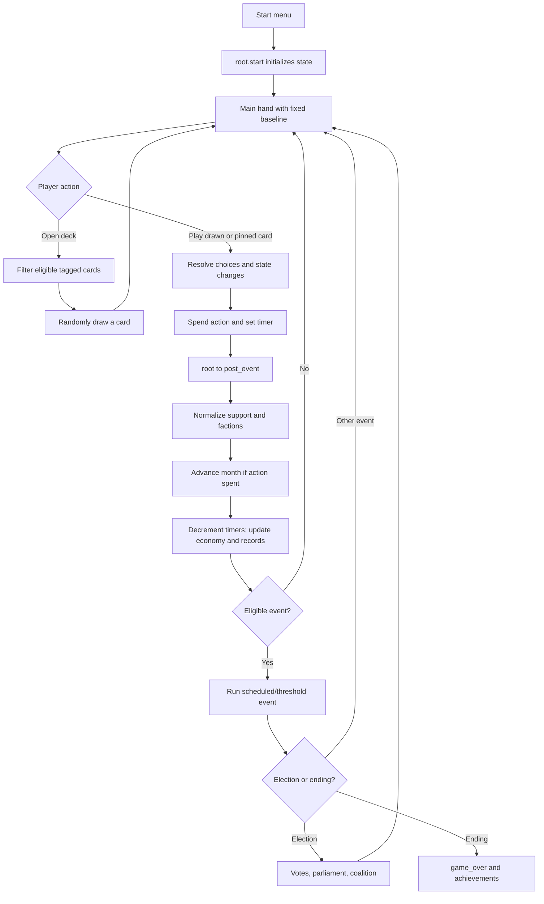
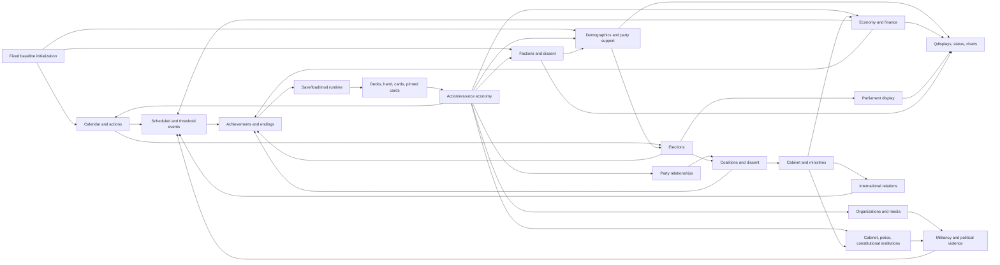

# Mechanics Map

## Current state — reference 0.67, 7 October 2026

This section is the only current summary in this file. This map lists the systems and their proposed Polish equivalents. Everything under "Archive of entries" below is kept unchanged for traceability. It is history, not an implementation instruction; where it differs from the technical reference, the technical reference wins.

- **Canonical specification:** `docs/POLISH_TECHNICAL_REFERENCE.md`, chapters 1–22 (reference 0.67); its chapter 23 holds the decision history.
- **Player-facing description:** `docs/POLISH_DESCRIPTIVE_GUIDE.md`.
- **Audit:** every item of `docs/POLISH_MECHANICS_AUDIT.md` (M01–M19) is closed in documentation; stage 8 measured balance and behaviour in full automated campaigns (`analysis/stage8-campaigns/REPORT.md`).
- **Card catalogue for coding:** `docs/POLISH_CARD_CATALOGUE.md` (reference 0.32) has one table for each of its 69 entries (card families, agenda actions and events): access, options, time and resource cost, effects, end state and cooldown. It creates no rules; where it differs from the technical reference, the reference wins.
- **The formation after the election of 1922 (Z, K, 0.67):** after the election a cabinet with PPS needs 185 MPs of its own clubs without the minority representations (`POST_ELECTION_OWN_SEATS`; 178 historically for PPS, PSL Wyzwolenie, PSL Piast and NPR); a cabinet without PSL Piast that has more votes for than against only thanks to the minorities meets the votes of PSL Piast, NPR, PSChD and ZLN against it (`forecast`, `MINORITY_VOTE_OPPONENTS`, `minority_reaction`); relation gates unchanged (technical 8.8 and 23.40; chapter 36 of the plan; source `PL-1922-ELECTION-MINORITY-VOTES`). `npm test` 488 of 488.
- **Two Treasury cards and ministry badges (Z, K, 0.66):** the Treasury card is split into "Taxes" (`polish_gov_finance`: progressive or wealth tax, indirect taxes, a broader base, customs duties) and "Loan, Savings and Emission" (`polish_gov_finance_funding`: domestic loan, administrative savings, the benefit cut, emission, better collection), both on the rules of 11.9 (`government.finance_package`); every government card carries the name of its ministry as a badge in the hand and a first line on its page (`PolishProjects.CARD_SCENES`, `ministryBadge`, `ministryLine`; `.pl-ministry-badge`) (technical 17.11 and 23.39; chapter 35 of the plan). `npm test` 485 of 485.
- **Sidebar MPs, "Obronność" and the Committee column (Z, K, 0.65):** the user's three notes of 7 October 2026 (technical 20.1 and 23.38; chapter 34 of the plan). The Sejm lines of the Politics tab give only the number of MPs (`[party]_sejm_seats_display`, with the Polish plural), while the parliament legend of the Library keeps the share of seats; the Polish name of the Defense tab is "Obronność"; the cards of the Central Executive Committee stand in a column to the right of the decks, one under another, when the deck board is at least 690 px wide (`#pl-board`, a container query; a window of about 1190 px), and under the decks otherwise (`window.displayPinnedCards` in `out/html/game.js`). No game rule changes. `npm test` 484 of 484.
- **Two cards for the relation to the government (Z, K, 0.64):** "Support for the Government" (Parliament deck) only while PPS tolerates the cabinet from outside (`supportCardAvailable`); "Coalition Affairs" (`polish_coalition_affairs`, Government deck, action `government.coalition_affairs`) only while PPS sits in it (`coalitionCardAvailable`), with the same options worded for a coalition and a new concession to the partners: the tension of each PPS coalition agreement −20, the Left of PPS +5 dissent (`coalitionConcession`). Both share the rhythm of half a year or an act of the cabinet against PPS (technical 9.8 and 23.37; chapter 33 of the plan). `npm test` 484 of 484.
- **Page look (Z, K, 0.63):** on 7 October 2026 the user asked for a wider play field and sidebar, more readable statistics and better cards, with simple means and without the recognisable Claude style (technical 20.1 and 23.36; chapter 32 of the plan). From 900 px the sidebar (18 rem, 21 rem from 1100 px) and the play field (up to 54 rem) stand side by side in one centred grid under a masthead, and the sidebar stays in view while the page scrolls; each sidebar fact is a ledger line — label, dotted leader, value at the right, a long value under its label (`ledgerRows` in `out/html/game.js`); the polls by social group are one table, a row per party and a column per group (`status.scene.dry`); a card is a print on a board with a thin frame, an empty place says so, and the timed-card badge is a red stamp without the hourglass; the page looks like a print of the time (paper, black and red ink, rules, small capitals), with no new fonts. No game rule changes. `npm test` 483 of 483.
- **Routing that survives a display error (Z, K, 0.62):** on 7 October 2026 the user played a game without the Sejm election, the presidency, the assassination of Narutowicz, the cult of Niewiadomski and the cabinet crisis of 1922 (technical 20.1 and 23.35; chapter 31 of the plan). The routing scene `polish_opening_state` computed the route only after about 300 lines of displays, so an exception in any display function (for example a stale cached script next to newer scenes) left the route empty and the game went on without them; 0.60 and 0.61 themselves showed all of them in full automated campaigns. Decisions 1A, 2A, 3A: the routing flags come first and six display parts are guarded one by one (a failure is logged, never silent); the page shows one notice per load asking for a reload without the cache; `tools/play/stable.sh` builds the last commit in a separate copy and serves it on port 8001. Rules unchanged; `npm test` 483 of 483.
- **Cabinet formation in four steps (Z, K, 0.61):** the formation card shows four numbered steps — the cabinet from a list of all ten with clubs, seats, partners' scores and votes (impossible ones greyed with a reason), the role of PPS, the prime minister with one effect each, and the PPS portfolios bought with influence points (PPS share of the cabinet's seats + 10 when it is indispensable; Labour 10, Interior and Treasury 20, others 10); a partner's portfolio is greyed when the partner would refuse without it. A club deciding on a cabinet scores it visibly: 30% relation, 35% programme, 20% portfolio, 15% PPS credibility, minus broken promises, no hidden need, threshold 60 (`formationScoreParts`, `evaluateCabinetPartner`); other bargaining keeps `offerScore`. An accepted PPS offer is appointed at once; the +8 ranking only orders cabinets without PPS; a partner party's leader as prime minister gives +5 relation once. The draft's `portfolio_claim` is now a set bought with points (`portfolio_take`, `portfolio_drop`) (technical 8.3, 8.7, 8.8 and 23.34; chapter 30 of the plan). `npm test` 478 of 478.
- **Decks and hand (Z, K, 0.60):** the three decks are always shown in three rows, each with two places of the hand (`HAND_SIZE` 6, `HAND_PER_DECK` 2; a hand entry keeps `deck`); a closed deck (its `choose-if`) is greyed with a reason; a card is discarded by a button on it, once a month (`PolishRules.discardStatus`, `discardCard`), except the timed cards, the cards of the party's vision and the cards opened by a special event; the separate discard card is gone; a timed card shows a badge with its last month (`registerCardDeadline`); images of the three decks (technical 4.4 and 23.33; chapter 29 of the plan). `npm test` 472 of 472.
- **The Milicja in B5 and the unions card explained (Z, K, 0.59):** the event of the assassin's cult (B5) has a fourth answer, `disrupt`: the Milicja breaks up the services on the model of the retaliation of B4 (0.5 R, the Centrum +8, the Christian Democrats −5, PPS −1 among the peasants and the petty bourgeoisie, an authorised confrontation); the card "Trade Unions" says why it is in the deck, explains its numbers and gives each branch its next step (technical 17.7, 14.1 and 23.32; chapter 28 of the plan). `npm test` 472 of 472.
- **TUR from the start and the joint-list gate (Z, K, 0.58):** by the user's decision PPS can found TUR from January 1922; `S.party_orgs.tur.available_from` (13, January 1923, the founding of the historical TUR) is kept as a record and no longer gates the founding; every partner accepts a joint list only from a relation of 75 (`LIST_GATE`, technical 6.5) (technical 13.2 and 23.31; chapter 27 of the plan). `npm test` 470 of 470.
- **Thirteen items of 5 October 2026 (Z, K, 0.57):** the economic programme has effects (campaigns ×1.10 among the groups its priorities serve; +1/−1 pp for matching or contrary measures, `PolishProjects.PROGRAMME_LINKS`, `S.actors.pps.programme_log`) and opens on "Confirm the present programme" / "Change the programme"; the joint list is the event `polish_list_agreement` two months before the vote (gates 60/70/70, "we go alone", no peasant bloc, 0 T; queue category 4 keyed by election and month); the party agenda, the unions (during a dispute, `PolishUnions.disputeOpen`) and the protection of the unemployed are ordinary deck cards; the army oversight card only when there is something to choose; one wage case per cause (`S.strikes.wage_watch.latched`) and no "demands" at a full offer (`declined_clauses` hold a repeated offer); the decisive presidential ballot explained; the organisations card without a confirmation page; the party character without `allied_reach` (technical 20.1 and 23.30; chapter 26 of the plan). `npm test` 469 of 469.
- **Nine items of 5 October 2026 (Z, K, 0.56):** the money of the original game (collections from the Dues card and the agenda instead of monthly income, upkeep and arrears; the apparatus adds 25% to a collection per level); the union packages in a card of their own (`party.union_investments`); Piłsudski's criticism (B2) as a timed card of the Parliament deck with authentic quotations, silence recorded as `stance_silence` and further speeches at cabinet crises; the constitutional card after the debate event of December 1924 (`S.politics.constitution_debate`); the government card every six months or after an act of the cabinet against PPS (`S.cabinet.support_reviewed_at`); six economic priorities (`cooperatives_housing`); the 1919 votes next to the first election; the minority cabinet explained; fixed returns to the hand and polls from the start (technical 20.1 and 23.29; chapter 25 of the plan). `npm test` 463 of 463.
- **Sidebar readability (Z, K, 0.55):** on 5 October 2026 the user found the sidebar still unreadable after 0.54 and asked for bold text, headings and breaks (technical 20.1 and 23.28; chapter 24 of the plan). Every fact has a bold label; section headings have a rule and space above them; the Main tab opens with the date ("Status" before the game); composite lines are split (dues, membership index and apparatus level; dissent and cohesion); cohesion and membership are whole numbers and the five political indicators show their scale ("60 of 100"); the Defence tab has its own headings for Milicja PPS, the police and the army groups, one fact per line. Empty lines take no space, wrapped lines are indented under their label and no-break spaces keep numbers with their units. Display fields only: `pl_party_dues`, `pl_party_membership`, `pl_party_apparatus`, `pl_party_sales` and `pl_party_cohesion` (instead of `pl_party_base`) from `PolishParty.sidebarDisplay`; the scale in `pl_pol_*` from `PolishPolitics.statusView`; `pl_def_members`, `pl_def_efficiency`, `pl_def_condition`, `pl_def_attachment`, `pl_def_police_*` and `pl_def_force_<id>` with `pl_def_force_<id>_name` from `PolishSecurity.defenseView`. Every local page file carries `?v=0.55`. Rules unchanged; `npm test` 458 of 458.
- **Readable sidebar (Z, K, 0.54):** on 5 October 2026 the user found the Main tab of the sidebar unreadable (technical 20.1 and 23.27; chapter 23 of the plan). The sidebar shows only data, one fact per line under section headings: Main has the party, its organisations, the unions and the government; Politics has the political indicators, the Sejm, the relations and the factions; a new Economy tab has the economy, the projects and the laws in procedure; Defence and Polls are unchanged. The explanations that stood on the sidebar moved unchanged to a Library page, "Notes to the sidebar". The Main and Politics tabs compute their own new lines, so a save from 0.53 shows them at once. The stylesheet and every local script of the page carry one version (`?v=0.54`): a cached older script next to the always fresh `game_pl.json` stopped the game on the "LUTY 1922" page. Rules unchanged; `npm test` 455 of 455.
- **Choice descriptions (Z, K, 0.53):** on 4 October 2026 the user asked for a clear mark of the present line and for an Options choice whether the descriptions of choices show numbers (technical 20.1 and 23.26; chapter 22 of the plan). The present choice of the stance, Dues and Economic Programme cards opens its description with a bold label on its own line ("Present line" / "Obecna linia"). Every effect is named in words and its size stands in a parenthesis that opens with a sign or ×; the Options setting "Numbers in choices" (off by default, kept by the browser under `pps_effect_numbers`) shows or hides these parentheses. Costs are written in words (the month's action, resources, budget units) and stay visible with requirements and current values; the sidebar and the results keep the short forms R, B and T, explained by a legend in the Library. Rules unchanged; `npm test` 451 of 451.
- **Card images (Z, K, 4 October 2026; the technical reference is unchanged):** the user added 58 images for the Polish cards, events and Central Executive Committee cards. They are stored in `assets/img/polish/` as sRGB JPEG of at most 800 px (about 9 MB in all; the original PNG screenshots stay outside the repository). As in the original game, cards and pinned cards show them on the card (`card-image`) and events on their page (`face-image`); the heritage card shows the Wawel on the card and the Royal Castle on its page. Three cards (minority schools, social welfare, the Soviet model) replaced inherited German images. Their sources and licences are not yet recorded: `credits_images.txt` lists each file as to be completed. Test `tests/polish-images.test.js`; `npm test` 447 of 447.
- **Central Executive Committee (Z, K, 0.52):** on 4 October 2026 the user asked that the advisers be called "Centralny Komitet Wykonawczy" in Polish and "Central Executive Committee" in English (technical 10.4 and 23.25; chapter 21 of the plan). Only player-facing texts changed: the main-page header of the pinned cards, the card that changes the composition, the Library page, the opening texts and the action messages; one person is a member of the Committee ("członek CKW"). Rules, identifiers (`advisor`, `party.advisers`) and saves are unchanged, and the documentation keeps the technical term "adviser". The name is documented history (`PL-PPS-CKW-NAME-2026-10-04` in `HISTORICAL_SOURCES.md`); the three seats are a gameplay simplification. The wait before the next Committee action is written with full month forms in both languages. `npm test` 445 of 445.
- **Confirming the present line (Z, K, 0.51):** on 4 October 2026 the user asked that the stance cards also offer the present line and that "Close card" be called something like returning the card to the hand (technical 10.5, 13.1 and 23.24; chapter 20 of the plan). Choosing the present line now confirms it: it costs this month's action and the card waits its usual cooldown (6 months, the Soviet model 12), and nothing else changes — no record in `strategy_history`, no faction reaction, no relation change or one-time bonus. This replaces the 0.32 rule that the present line could not be chosen. The same applies to "Keep" on the Dues card and to the same set on the Economic Programme card; the other cards keep no paid no-effect options. The free exit from a card is now "Return to hand" ("Odłóż na rękę" in Polish); the exit from a card opened by an adviser stays "Close card". Schema 8 unchanged; `npm test` 444 of 444.
- **Polish language version (Z, K, 0.50):** on 4 October 2026 the user asked for a Polish version of the game with a language switch and approved decisions 1A–7A (technical 20.1 and 23.23; chapter 19 of the plan). The game has English (the default) and Polish; the player switches in Options or with the link in the page header, also during a game. The browser keeps the choice (`localStorage` key `pps_language`), not the save, so the same save loads in both languages. Scene texts are translated line by line in `source/i18n/pl/` and built into `out/html/game_pl.json`; rule texts have a Polish twin (`L(en, pl)`). Texts stored in `S` stay English and are translated when shown (`PolishRules.storedText`), so both languages play the same game: the test "Ta sama rozgrywka w obu językach" plays all 13 strategies to the end of the chapter in both languages and requires an identical state and no English line on Polish screens. Limitations: values computed before a mid-game switch keep the old language until the next page; the Credits translate only their headings; the game title in `info.dry` stays English because it keys saves and settings; unreachable German scenes stay untranslated. Dependencies and schema 8 unchanged; `npm test` 444 of 444.
- **Plan complete (Z, 0.49):** on 4 October 2026 the user decided that stage 8 is the last stage of the implementation plan. The first chapter is implemented in full, and the plan has no further stages. One feasibility check of 21.2 is not met: a lawful early election cannot be reached, because the dissolution under the arbitration reform (7.6) is not implemented. On 4 October 2026 the user decided not to implement it, so the limitation stays.
- **Stage 8 implemented (K, 0.49) — the last stage of the plan:** the Normal scenario, its content and calibration. Thirteen automated PPS strategies in `tests/helpers/strategies.js` (the four reference runs of 17.16.7 and the nine strategies of 21.2) play full campaigns in the real engine; `analysis/stage8-campaigns/REPORT.md` records them on 12 shared seeds. Decision 2A scales the opening class rows by one factor per party, so that a passive PPS gets the M02 baseline Sejm within ±5 seats per club. Part 8f researched the items marked TBD (eight new entries in `HISTORICAL_SOURCES.md`), and the user accepted all nine proposals: the military case opens in July 1923; the Niewiadomski ceremony is his funeral at the Powązki cemetery on 6 February 1923; the KPP goal in strikes is `structural`; the starting PPS line on autonomy is `regional_autonomy`; the actor profile `actor_profiles_v2` dates the autonomy topic; and the coup pressure starts at 0. New dated scenario inputs: the Chjeno-Piast offer (May–December 1923), the departure of ten Piast MPs (December 1923, a working value from M02), the public episode of army pressure (from November 1925) and the resignation of Grabski from November 1925 if he governs in a credit or currency crisis (A1). Rule 8.9 lets the NPR accept Industry and Trade instead of Labour in the broad Skrzyński cabinet (A2), and an agreement carried out by the cabinet stays valid while that cabinet governs (A3). Closing fixes: offers of governments with the KPP open after the broader 9.6 agreement; the agenda no longer lists the KPP trial that could never be taken; the text of a government-prepared credit; no German music; the report after a coup names the Marshal of the sitting Sejm. Screens show only Polish data: the Defense tab, Library charts from January 1922, a Polish timeline 1919–1922 and no German photos on 49 Polish scenes (the image files stay). Result: N-A and N-H attempt a coup in March 1926 in 12 of 12 seeds; N-B and N-C reach the 1928 election without an attempt; every strategy has the cabinets Ponikowski → Śliwiński → Nowak → Witos → Grabski → Skrzyński; 156 of 156 campaigns reach a report. The limitations of the finished chapter are in chapter 18 of `docs/POLISH_IMPLEMENTATION_PLAN.md`. Schema 8 is unchanged, so saves of stage 7 still load; `npm test` 438 of 438.
- **Stage 7 implemented (K, 0.48):** two new rules files own democracy and the forces of the state. `source/rules/polish_politics.js` keeps the institutional log and the authority of the Sejm, attachment to democracy, violence, cases and restrictions with a legal profile, the grievance and radicalisation of the electorate cells and the coup pressure with its impulses. `source/rules/polish_security.js` owns the synthetic army groupings (`synthetic_test_v2`) with their effective loyalty, the capacity for an attempt, the force assessment on the Party agenda (1 T and 1 R; the interval narrows 30 → 20 → 10 → 5 pp), the police, army control and nominations, the agreement with Piłsudski with its review, the gates of an attempt and the coup engine `coup_f_v1`, which reproduces the M08 profile exactly. Decision 1A: three dated scenario inputs of the test profile `normal_chapter1_v1` — the dispute of the Chief of State with Ponikowski in June 1922 (the cabinet resigns, card 9.1, and Piłsudski's criticism of parliament, card 9.2, needs one mandatory answer), the military case from January 1925 (a test input; the historical date is TBD — historical research required) and one ceremony from January 1923. Decision 2B: in the historical branch the election of Narutowicz always ends in his assassination, with no protection model; the response (card 9.5) follows only a confirmed death, before the second vote of the National Assembly. Decision 3A: restrictions come from existing actions — strike repression, press confiscation and the authorities' answer to executed unlawful violence of PPS organisations; a repressive cabinet bans the Milicja (a lawful restriction), and the Justice review lifts only an unlawful one. New cards: army oversight in the Sejm, the Interior, Military Affairs and the agreement with Piłsudski; Śliwiński (June–July 1922) and Piłsudski (only after an agreed premiership) are formation candidates. An attempt is possible from March 1926; its steps F3–F11 cost no month, and a resolved coup ends the first chapter with a fuller report (society, democracy, the forces of the state, unfinished matters and what the continuation owes). Twenty-six German scenes that write `coup_progress` or `pro_republic` are guarded by `not polish_security_rules`; their files stay. Two automatic campaign walks ended in a coup in autumn 1927 won by Piłsudski; calibration is stage 8. Saves of schema 7 need a new game. Schema version 8; `npm test` 417 of 417.
- **Stage 6 implemented (K, 0.47):** a new rules file, `source/rules/polish_unions.js`, owns unions and strikes. The pinned "Trade Unions" card has the steps of a dispute for each of the three branches (agree limited or broad demands, a joint meeting on the strike line or on the agreed end, mediation, start the protest; each 1 T). A strike draws once a month on its branch fund, adds fatigue and disrupts output; one recorded draw a month decides the government's offer, the union's consent follows 17.4, and PPS answers an offer in the Sejm response (card 7.10: demands, settlement or order, 0 T). The employers execute a settlement's wage clause the next month (+2 pp times the branch's wage scope for two months); a refusing group of at least 10 points of participation opens E6 (card 9.9). Decision 1A kept grievance in stage 7: the 1923 case (card 9.8) opens after three months of real wages below 80, after a refused demand or with an own strike, and effects on grievance, violence and repression exposure are recorded for stage 7. Decision 3A: the authorities answer from the cabinet profile `strike_state_profiles_v1` (P), and a PPS minister replaces it only within its competence; one clash is drawn per phase, and the Milicja protection costs 0.5 R and loses 2% of its people in a clash. The communist cooperation step (card 9.7) records one trial and one discipline draw; a strike in industry is a joint action with the Bund. Decision 2A: synthetic plants (profile `synthetic_plants_v1`, no names) are recorded by a credit crisis, an active business reaction or a strike ended by exhaustion. The Labour card now has collective agreements (1 T, 0 B, a wage effect through 11.4) and derogations (business pressure −4, grievance +3 for stage 7, six months); the Industry card has the rescue of a plant (2 B for 2 months, then 1 B), public control by law (business pressure +15) and workers' representation in a public plant; Czapiński's two variants open the Industry card. Grabski's protection terms open with apparatus 2, union reach 40 and relation 40; he answers in the same commit, and tolerating him is a six-month agreement with a review after three. The user also chose the M18 order of the party ledger: membership moves before dues income. The German events `labor_unrest` and `unions_declare_independence` are guarded by `not polish_union_rules`; their files stay. Saves of schema 6 need a new game. Schema version 7; `npm test` 360 of 360.
- **Stage 5 implemented (K, 0.46):** two new rules files own the electorate and the party. `source/rules/polish_electorate.js` replaces the seven overlapping class rows with 54 disjoint cells (class × identity 70/10/20 × employment × large city), each with its own preferences, turnout, PPS reach and trust. Decision 1A calibrated the opening so that the national result is exactly the previous one; the class rows are now mirrors, averages of their cells including the minorities of each class. The poll, the votes, the 5.6 flow and the 17.4 outflow run on the cells, and unemployment moves mass between employed and unemployed cells. `source/rules/polish_party.js` owns the monthly party ledger of 13.1 (dues, apparatus, press, TUR, cooperatives, Milicja upkeep, arrears without negative cash, membership moving towards the M18 target), the Organisations card with up to two packages, Milicja and AS on the costs and gates of 13.3, and three union branches (decision 2A: industry, rail and farm labour with reach and a monthly fund; readiness, disputes, strikes and the Grabski protections wait for stage 6). It also owns eight stance cards with the line in `S.actors.pps.strategy`, the economic programme, the Media card (press, union, polemic and turnout campaigns: topic, then audience, with saturation), the KPP agenda and the Bund's trust. The factions live in `S.actors.pps.factions`; a faction with dissent of 60 and a live cause opens a case, and the card E3 `party.faction_split` asks it (decision 3A: the demand takes back the recorded reversible cause with the largest share). Accepting changes the policy; refusing lets 40% of the faction's base leave with its voters and MPs, who go to a technical splinter club (M16). The unity card has a concession, the common KPP line, a postponement and the purge; the adviser change is a separate card, and all adviser actions of 10.4.3 work, with timed effects. The Party deck has the 16 cards of the 10.5 manifest. The inherited party cards are switched off by `not polish_party_rules`, and the three automatic faction crises left the event queue; their files stay. The German bridges for support rows and the five old factions are off, and Niedziałkowski and Próchnik no longer write `pro_republic` (leak 10). Faction reactions to a real break of support run through one hook with an empty test profile. Saves of schema 5 need a new game. Schema version 6; `npm test` 327 of 327.
- **Stage 4 implemented (K, 0.45):** two new rules files own the economy and the work of the state. `source/rules/polish_economy.js` settles the monthly economy of technical 11.1–11.9 (profile `economy_simple_v1`): budget points B, the marka and the złoty, monthly inflation, wages, output, credit, unemployment, agrarian pressure and business pressure, with the dated scenario pressures of 17.16.2; it also runs the living-conditions flow of 5.6 and the outflow of disappointed voters of 17.4 on the existing class rows. `source/rules/polish_projects.js` owns projects, laws (the Sejm vote, a simplified Senate review after 30 days and a return after 60), the fiscal instruments of 11.9, cabinet packages voted at the next settlement, one review a month by the cabinet without PPS (17.16.4), the unemployment bill D, the three constitutional reforms of 7.6, the government cards and three economic events. `S.economy` is the only owner: `Q.budget`, `Q.inflation` (now monthly) and `Q.economic_growth` are its mirrors, and the weight of the unemployed row `Q.unemployed` stays 3. The German monthly economy and support rules in `post_event`, the high-inflation event and nine replaced German government cards are switched off by `not polish_economy_system` (leaks 1 and 9); their files stay. Thirteen Polish government cards (`polish_gov_*`) enter the Government deck only through a PPS portfolio; options that need stages 5–7 are visible and blocked with their reason, and their effects wait in the project record (`pending_effects`). Pinned cards: the Agenda (it launches prepared large programmes and files constitutional motions), the unemployment bill D (after the 1922 election, while PPS is not in the cabinet) and the Budget card (while a cabinet package awaits its vote; 0 T). Programme promises from stage 3 now have projects, due dates and rules, and PPS answers only for promises in its own portfolios. Decision 4 moved nine tests of 21.1 to stages 5–7. Saves of schema 4 need a new game. Schema version 5; `npm test` 251 of 251.
- **Stage 3 implemented (K, 0.44):** a third rules file, `source/rules/polish_government.js`, owns relations, agreements and cabinets. Relations with PPS live in `S.actors` (the `Q.<party>_relation` fields are mirrors), and the minority bloc splits into a Jewish representation (1/3 of its seats) and other minorities (2/3). After the 1922 election the cabinet is formed by one offer on one screen (card 7.1): configuration, prime minister, the role of PPS, a request for minority support and the PPS portfolios; each partner answers yes or no with its reason, and the head of state appoints the best feasible offer, with or without PPS. There are nine portfolios, and public works belong to Labour. A fall opens a mandatory formation; three failed rounds bring an impasse with a caretaker cabinet. A new Parliament deck holds the cabinet initiative (1 T in a crisis), Support for the Government (card 7.6: end support and vote on dismissal, a threat or persuasion about financed worker protection) and, in the list window, the Electoral Agreement (card 7.7). Agreements settle monthly: tension, a warning at 40, an ultimatum at 60 with a 0 T answer, one extension and the partner's withdrawal. Promises that need stage-4 programmes wait without a due date, so no ultimatum occurs in play yet. The Rataj package becomes an agreement with PSL Piast, and a Daszyński victory as Marshal gives reputation +5. The German coalition counter has no effect (leak 2), and card 9.1 moved to stage 7. Schema version 4; `npm test` 185 of 185.
- **Stage 2 implemented (K, 0.43):** a second rules file, `source/rules/polish_institutions.js`, records each Sejm election in one transaction: the result (now `certified`, with its sequence, legal basis and ballot date), one club per party and a 111-seat Senate derived once (`sejm_proxy_v1`). The seat calculation moved there unchanged (20,000 random cases give identical results), and later elections apply no German thresholds or bans. In December 1922 the Sejm elects its Marshal (support Śmiarowski, agree on Rataj or nominate Daszyński) and the National Assembly elects the President (nominate Daszyński or not). Both offices are counted from the clubs' votes with the test profile `office_profiles_1922_v1` (P), with the M06 final, the tie lot and the safety net. Narutowicz's assassination follows only his election, and the elected Marshal then acts as President. The legal calendar puts the next election on 19 February 1928 (t=74); the 21 inherited files that write election dates can no longer move it. Its certified result ends the chapter before any government formation and shows a one-screen report; after that no month is settled. Decision 1 moved card 7.7 and the test "Kompromis listowy a Lewica" to stage 3 and the test "C4" to stage 4. Schema version 3; `npm test` 144 of 144.
- **Stage 1 implemented (K, 0.42):** one monthly clock and one settlement per month (`PolishRules.beginMonthSettlement`); Polish adviser actions commit through the rules module with a dated shared cooldown (t+6), and an adviser opening a card makes that whole step cost no month; closing an inherited card from its first page ("Close card" or "Back to main") undoes exactly what its opening wrote and returns it to the hand; one free discard a month on the "Discard a card" card; card draws pick uniformly among legal cards sorted by ID with a recorded roll; due Polish events come one at a time from the queue (category, then ID) through `polish_event_router`, and German events are no longer offered. Schema version 2; `npm test` 122 of 122.
- **Stage 0 implemented (K, 0.41):** the rules module `source/rules/polish_rules.js` is copied by `npm run build` and loaded by the page and the tests. A new game creates the state tree as `Q.S` (schema version 1). `out/html/game.js` checks every loaded save, and `main` and `post_event` stop an incompatible save at `polish_incompatible_save` before a month is settled. Engine tests now catch every engine error. Gameplay is unchanged: eight order-independent walks, 15,788 steps in total, match the previous build. One inherited error ("Return card to hand") stays until stage 1.
- **Implementation plan (Z, 0.40):** `docs/POLISH_IMPLEMENTATION_PLAN.md` expands technical 20.3 into stages 0–8. Each stage lists its files, state, legacy writers to disable and 21.1 tests, and the plan starts the takeover manifest. Decisions: the rules live in a separate plain-JavaScript module in `source/rules/`, copied by `npm run build` and loaded by the page and the tests; player-facing text is English only for now, keeping Polish proper names; a save without a matching schema version shows a message and requires a new game.
- **Queue categories and research (Z, 0.39):** the seven event-queue categories that the catalogue had inferred from 4.5 are approved unchanged and written in 4.5. Historical research for the five items marked `TBD — historical research required` is deferred by the user; until then the game uses the marked test values.
- **Batch-6 answers (Z, 0.38):** E3 has the ID `party.faction_split` (one definition for all factions, keyed by `case_id`); E6 has the ID `society.strike_settlement_rejection` (keyed by `strike_id + settlement_id`); the answer to Piłsudski's criticism of parliament is mandatory, with no "stay silent" option; the 17.3 row for `cabinet.austerity_1926` now uses the four 9.8 answers, as 17.13 and 17.16.4 already did; only supporting the criticism under the `parliamentarism` line contradicts a lasting line, and then the Centre reacts +3.
- **Batch-5 answers (Z, 0.37):** the government cards have no paid "keep", "postpone" or "leave it to the owners" options, and closing a card is free (the Piłsudski card keeps its refusal, which leads to cabinet formation); a collective agreement and a hardship exemption cost 1 T and 0 B (the exemption: capital pressure −4, grievance of the covered workers +3, and it expires); "expand benefits" raises the scope by 1, up to 3, at +2 B a month per level, while "focus" gives full relief to the neediest half of the recipients for 1 B instead of 2; the finance card gains "burden broad groups" (indirect taxes, a broader tax base or fiscal customs), "money issue" (1–3 points before stabilisation, a temporary coin issue of 1 point for 3 months after it) and `government.collection`; the three investment-fund variants differ in who pays and who must agree; the enterprise rescue is a variant of the conditional credit; police investigations cost 1 T and 1 B for 1 month, and a confirmed one makes that party the addressee of the "unconstitutional force" polemic; the secular school has no faction reaction. Parliamentary card 6 in 17.10 now repeats the 0.36 crisis-only rule for "keep support".
- **Batch-4 answers (Z, 0.36):** "keep support" is only a crisis response; the army-oversight card drops its paid "minister's explanations" and "postpone"; budget-card options use the 11.9 instruments; parliamentary cards 3–5 have no cooldown; the limited army reform is the compromise version (`army=0`, +0.025 legal loyalty, 1 B for 2 months); the Left reacts +3 only to a list that drops labour points, i.e. the early Centrolew; after three failed cabinet proposals the game enters an impasse with a caretaker cabinet.
- **Batch-3 answers (Z, 0.35):** the programme card cannot confirm an unchanged set and the unity card has no plain "hold the line"; "persuade to postpone" delays a faction case for 3 months without lowering dissent; the compromise has two variants (one faction: 1 T, 1 R, cd 3 M, dissent −8; the communist line: 1 T, cd 6 M, +15 acceptance in each faction); the unity card appears only with a faction dissent of at least 30 or an open KPP channel; the adviser change is a separate card; `kpp.contact` sits in the outreach card and `kpp.trial`, `kpp.rules`, `kpp.agreement` in the "Cooperation with the KPP" agenda; the security assessment is a permanent agenda action.
- **Batch-2 answers (Z, 0.34):** the Organisations and Dues cards have no paid no-effect options; the Centre reacts +3 to the first militarisation of the Milicja; the Media card has no card cooldown and includes the turnout campaign and press investigation; the joint political meeting is `union.align`; organisational work adds +2 reach to one union branch or to the cells of one chosen class, not the press or TUR; cooperatives have no separate cap.
- **Stance cards (Z, 0.32):** the current line cannot be chosen again, and closing the card is free. Test faction profile `faction_stance_profile_v1`: the Piłsudczycy reject opposing military interference, and the Centre rejects supporting Piłsudski's influence (technical 10.5). Batch-1 answers (Z, 0.33): the direction works through campaigns; polemic addressees are the ZLN for the national right, parties with fiscal and land ideals ≤ −1 for defenders of capital and land, and a party with an open violence case for unconstitutional force; the Piłsudski line limits concessions but does not gate them; presidential arbitration needs the strong-presidency line; test ideals on the autonomy axis are ZLN −2 and other minorities +1; the Bund is an organisation, not a party; condemning the Soviet model triggers no faction reaction.
- **Code:** the M08–M19 documentation work changed no gameplay code, dependency or scenario metadata (version 5).

| Area | Canonical section of the technical reference | Latest approval |
|---|---|---|
| Rule status, scope and markers | 1 | — |
| State ownership, units, indicators, domain register | 2 | stage 0: `Q.S` (2.4), stage 2 (2.4), stage 4 (2.4), stage 5 (2.4), stage 6 (2.4), stage 7 (2.4) |
| Time, cards, settlement order, event queue | 4 | M06 (4.5), organisational work (4.4), queue categories (4.5), stage 1 (4.1–4.6), stage 4 (4.2, 4.5), stage 5 (4.2, 4.4, 4.5), stage 6 (4.2, 4.5), stage 7 (4.2, 4.5) |
| Electorate, campaigns, support flows | 5 | M09 (5.6), Bund not a party (5.5), stage 4 (5.4, 5.6), stage 5 (5.1–5.6), stage 6 (5.5), stage 8 (5.2) |
| Elections, institutions, presidency and speaker | 6–7 | M06 (7.3, 7.5), arbitration and the PPS line (7.6), list compromise (6.5), stage 2 (6.1, 6.3–6.5, 7.1–7.5), stage 4 (7.2, 7.6), stage 5 (7.6), stage 8 (7.6) |
| Relations, conversations, offers, cabinets | 8 | M11 (8.3), M17 (8.1), autonomy axis (8.6), formation impasse (8.7), stage 4 (8.5, 8.6), stage 5 (8.6), stage 7 (8.7), stage 8 (8.6, 8.9) |
| Agreements, government support, communist cooperation | 9 | M11 (9.8), M13 (9.5–9.6), M17 (9.5), KPP agenda (9.5), keeping support only in a crisis (9.8), stage 4 (9.1, 9.7), stage 5 (9.5, 9.8), stage 6 (9.6–9.8), stage 8 (9.6) |
| Factions, compliance, advisors, strategic cards | 10 | M10 (10.7), M16 (10.2), M17 (10.4.3), card catalogue (10.2, 10.4.2, 10.5–10.10), stage 5 (10.1–10.10), stage 6 (10.4.3), stage 7 (10.7), stage 8 (10.5) |
| Economy, state finances, projects | 11–12 | M01 (0.11), M07 (17.12), budget card and investment-fund variants (11.9), card catalogue (12.7, 12.8), stage 4 (11.1, 11.3, 11.9, 12.2), stage 6 (11.4, 11.7, 12.4) |
| PPS organisations, party finances, Milicja and AS | 13 | M18 (13.1), M15 (13.3–13.4), card catalogue (13.1–13.5), stage 5 (13.1–13.5), stage 6 (13.1), stage 7 (13.4) |
| Unions, strikes, settlements | 14 | M12 (14.4–14.5), `union.align` (14.1), E6 ID (14.5), stage 5 (14.1), stage 6 (14.1–14.5) |
| Grievance, democracy, coup pressure | 15 | M10 (15.2–15.3), stage 7 (15.1–15.3), stage 8 (15.3) |
| Police, army, coup | 16 | M08 (16.8), M10 (16.1), M15 (16.8.3), force assessment (16.8.1), limited oversight reform (16.3), stage 6 (16.5), stage 7 (16.1–16.7, 16.8.8), stage 8 (16.1, 16.8, 16.8.1, 16.8.5) |
| Cards, events, Normal scenario | 17 | M02 (17.16), M05 (17.15), M07 (17.12), M12 (17.4), card catalogue (17.3, 17.10–17.12, 17.15), stage 4 (17.4, 17.10, 17.11, 17.15, 17.16.2, 17.16.4), stage 5 (17.4), stage 6 (17.4, 17.5, 17.5.1, 17.11, 17.12, 17.12.5, 17.16.5), stage 7 (17.5, 17.6, 17.7, 17.10, 17.11, 17.12, 17.12.2–17.12.4, 17.12.6, 17.13, 17.16.3), stage 8 (17.7, 17.10, 17.12.4, 17.16.3, 17.16.6, 17.16.11) |
| Chapter end, report, save | 19 | M08 (19.1), old saves (19.3), stage 2 (19.1–19.2), stage 7 (19.1, 19.2), stage 8 (19.2) |
| Dendry integration and legacy rules to disable | 20 | M09, M10 (20.2), rules module and language (20.1), implementation plan (20.3), stage 2 (20.1, 20.2), stage 4 (20.2), stage 5 (20.2), stage 6 (20.2), stage 7 (20.2) |
| Verification criteria and tests | 21 | all of the above (21.1), stage 8 (21.2) |
| Decision archive | 23 | M19, card catalogue, stages 0–8 (23.14–23.22) |

## Archive of entries — history, not implementation instructions

All sections below this heading are earlier dated entries and the original worksheet, kept as they were written. Read them through the current state above. In 0.31 one link in the 0.5 parliamentary-card entry was pointed at the current heading of technical 17.10; its text is unchanged.

## Current party finance map — reference 0.30, M18

| Step | Mechanism and reader |
|---|---|
| Membership (13.1) | `member_index` 0–150; monthly `+= 0.05 × (target − index)`; target from PPS worker support and average union reach against the opening, × (1 − 0.05 × (dues − 2)), bounded 50–150 |
| Income | `(0.25 × dues + 0.15 × (level − 1)) × member_index/100` R a month |
| Costs | Unchanged: apparatus 0.10 × level, press 0.10, Milicja by size, TUR, cooperatives |
| Departures | Split or purge multiplies the index by (1 − departing share) at once (10.2, 10.9) |
| Dues card | Immediate ×0.95/0.98 on a rise and +2 on a cut as before; the dues level also scales the target |

[Diagnostics](analysis/m18-membership-apparatus/REPORT.md); source
`PL-M18-MEMBERSHIP-APPARATUS-2026-09-26`.

## Current late-advisor and KPP contact map — reference 0.29, M17

| Step | Mechanism and reader |
|---|---|
| Advisor roster (10.4.3) | A12 Próchnik and A13 Drobner: continuation only; no chapter-1 availability |
| Open contact (9.5) | Relation ≥10 (start value); 1 T; channel open, relation +4 |
| Conversations (8.1) | After the channel: +4 (or +2 at ≥70), one action, 3-month cooldown per partner, now including the KPP |
| Joint strikes (9.6) | Limited from relation 20, full from 30, as before |

[Diagnostics](analysis/m17-late-advisors/REPORT.md); source
`PL-M17-LATE-ADVISORS-2026-09-26`.

## Current office-election map — reference 0.28, M06

| Step | Mechanism and reader |
|---|---|
| Presidency (7.3) | Automatic eliminations with fixed transfers; final of two decided by more votes; exact tie by the saved 50/50 lot |
| Marshal (7.5) | One vote with all candidacies, quorum ≥148; runoff of the top two decided by more votes; tie by the lot |
| Guarantees | All clubs attend; at least two valid candidacies checked before the vote |
| Safety net (4.5) | Unresolved election: `no_election`, acting holder from the profile, normal turn, automatic vote next month |

[Diagnostics](analysis/m06-office-elections/REPORT.md); source
`PL-M06-OFFICE-ELECTIONS-2026-09-26`.

## Current faction split map — reference 0.27, M16

| Step | Mechanism and reader |
|---|---|
| E3 (10.2) | Dissent ≥60 plus a concrete demand; two choices: accept the demand, or keep the line and accept the split |
| Accepted split | `removedShare = 0.40 × strength/100`; strength ×0.6 then normalise; members and PPS support ×(1 − removedShare); voters to the manifest recipient or `other`; `round(0.40 × faction_seats)` MPs to the split club; remaining dissent −20 |
| Purge (10.9) | Same machinery with 25%, −15 and no split club |
| MP assignment | Largest remainders after each election; frozen until a real transfer |
| Coup split (16.8.7) | Automatic E3 manifest, same recalculation |

[Diagnostics](analysis/m16-split-recalculation/REPORT.md); source
`PL-M16-SPLIT-RECALCULATION-2026-09-26`.

## Current Milicja and AS map — reference 0.26, M15

| Step | Mechanism and reader |
|---|---|
| Force (13.4) | `effectiveMilitiaF = available/100 × militancy × effectiveCompliance × (1 − fatigue/100)`; AS: `effectiveCompliance = min(1, compliance + 0.15)` |
| Before a coup | Stage 1: one protected matter at a time. AS: up to three concurrent matters, each filled up to 4 F (40% protection), the rest to the next |
| Coup (16.8.2–16.8.3) | One task for both; AS force includes the compliance bonus |
| Costs | Unchanged: AS 2 R once and +0.10 R a month |

[Diagnostics](analysis/m15-as-benefit/REPORT.md); source
`PL-M15-AS-BENEFIT-2026-09-26`.

## Current communist cooperation map — reference 0.25, M13

| Step | Mechanism and reader |
|---|---|
| PPS internal consent (9.5) | `pps_internal_acceptance`: faction-weighted support, start 50; `party.unity` "Compromise" on the cooperation line +15 per faction; breach −15 |
| Joint strike card (9.6) | Full / limited / none; Centre dissent +5 / +2 only while acceptance < 60 |
| KPP discipline | `partnerCompliance = clip((relation + goalFit)/200, 0.10, 0.90)`, one saved roll; `goalFit` from the agreed demand level versus the event profile's `partner_goal` |
| Own structures | Usual 10.3 compliance from their alignment to the line |
| Durable front | Relation ≥65, acceptance ≥60 and accepted rules, as before |

[Diagnostics](analysis/m13-communist-discipline/REPORT.md); source
`PL-M13-COMMUNIST-DISCIPLINE-2026-09-25`.

## Current strike settlement map — reference 0.24, M12

| Step | Mechanism and reader |
|---|---|
| Pressure on the employer (14.2, 14.4) | `negotiatingPressure = 0.5×crediblePressure + 0.3×sectorImportance + 0.2×governmentFragility`; the fund still raises `crediblePressure` |
| Government fragility | Caretaker 100; otherwise `clip(50 − (supportSeats − 222) + 0.5×maxAgreementTension, 0, 100)`; `supportSeats` as responsibility `r>0` in 5.6 |
| Union consent (17.4) | `0.5×fulfilment + 0.3×trust + 0.2×strikeContinuationCost ≥ 50`, red lines kept; `strikeContinuationCost = max(100×(1−fundCoverage), fatigue)` |
| After consent | Unchanged: E6, agreement record, relief once per `settlement_id` |

[Diagnostics](analysis/m12-strike-settlement/REPORT.md); source
`PL-M12-STRIKE-SETTLEMENT-2026-09-25`.

## Current government-support negotiation map — reference 0.23, M11

| Option (9.8) | Score and effect |
|---|---|
| `bargain` | 8.3 score with `needForThisAgreement` (0 if `pps_threat_discounted`); on acceptance each accepting party −3 relation; on refusal an immediate 0 T choice |
| After a refused `bargain` | Carry out the threat: `withdraw` effects. Back down: credibility −5, `S.cabinet.pps_threat_discounted=true` until the cabinet ends |
| `persuade` | 8.3 score with `need=0`; no relation or credibility change on success or refusal; support stays after refusal |
| `withdraw`, `maintain` | Unchanged |

[Diagnostics](analysis/m11-threat-persuasion/REPORT.md); source
`PL-M11-THREAT-PERSUASION-2026-09-25`.

## Current authority and democracy map — reference 0.22, M10

| Step | Mechanism and reader |
|---|---|
| Institutional log | Dated entries `law`, `resolution`, `failure`, `gap`, `breach`, `stance_defense`, `stance_criticism`; each counts for 12 months |
| Authority (4.2 step 6) | Only read from the log with the 15.2 weights; no direct writes |
| Democracy (monthly) | `0.03×(authority−53)`, minus the grievance term, −2 per new case of violence against institutions, +1 per lifted unlawful restriction; one-offs from advisors, reforms and B4/B5 |
| Coup pressure (monthly) | Existing 15.3 terms plus `clip(0.01×(60−democracy), −0.5, 0.5)`, reading democracy from the start of the period |
| Army readiness | Effective loyalty: `s = clip(0.0025×(democracy−60), −0.10, 0.10)` moves Piłsudski share to or from neutral; used by capacity, `initialStrikeForce`, estimates and the F5 roll |
| During an attempt | Settlement trust reads democracy (16.6), as in M08 |
| Not reading democracy | Offers 8.3, elections, the 5.6 voter flow |
| Other readers of authority | Democracy term, pressure `authority<40`; strike fragility read authority until 0.23, and from 0.24 reads cabinet support and disputes (M12) |

The pressure term delays each of the 96 archived M02 attempts by 1–3 months,
with none lost. [Diagnostics](analysis/m10-authority-democracy/REPORT.md);
source `PL-M10-AUTHORITY-DEMOCRACY-2026-09-25`.

## Current economy–voter map — reference 0.21, M09

| Step | Mechanism and reader |
|---|---|
| Economy settles (4.2 step 5) | Real wage, unemployment, agrarian pressure and executed rural tranches as before (11.4–11.6) |
| Class index | `general = (real_wage−100) − 2×(unemployment−3)`; workers ×1, intelligentsia ×0.5, petty bourgeoisie ×0.25, peasants rural index + ×0.2, bourgeoisie/landowners fixed 100 |
| Monthly flow (4.2 step 6) | Change against `S.society.living_conditions_last`; worsening 0.1 pp per point (cap 0.5), improvement 0.05 pp per point (cap 0.25), in every cell of the class |
| Responsibility | Cabinet parties 1; signed toleration 0.5, including PPS `external_support` and expert-cabinet guarantors; opposition 0 |
| Recipients | Non-responsible parties by current cell share; a loss is bounded by `sum(r×share)` |
| Broken promises | Separate 17.4 outflow after the 5.6 flow, own 0.5 pp cap, same share-based split among accepted competitors |
| Not in the index | Benefits, relief and settlement relief (they act via grievance 15.1 and reward 5.4); separate inflation or growth terms; calendar drifts |

Legacy German support rules (`post_event` `pro_republic` erosion and 1929–1932
drifts, `events/high_inflation`) must be disabled when 5.6 is implemented.
[Diagnostics](analysis/m09-living-conditions/REPORT.md); source
`PL-M09-LIVING-CONDITIONS-2026-09-25`.

## Current coup map — reference 0.20, M08

| Step | Mechanism and reader |
|---|---|
| Before an attempt | Pressure ≥55 opens a visible `political_crisis`; an executing Piłsudski agreement (6-month review, extension without new relief) or pressure <40 calls preparations off and sets a 3-month retry delay. Window: spring-1926 floor plus a phase-0 Piłsudski-leaning group |
| F4/F5 | Stance and organization commitment; executed participation from existing compliance 10.3; group allegiances rolled once after F5 |
| Transport | Strike delays each opposing rail-dependent group; threshold measured in the round before (re)scheduled arrival; exhausted fund ends the blockade; `rail_delay_cap` per group |
| Milicja/AS | One F task: combat when supporting/defending, own-people protection when neutral; AS benefit settled in M15 (0.26): +0.15 compliance |
| Rounds | At most four; win after two consecutive rounds above 1.20 or immediately at 2:1, counting the opponent's next-round arrivals |
| Settlement | Three offers (military function, inspectorate law, cabinet change); cost of continuing + offer fit + democracy; no named guarantor; clear-advantage side does not bargain; final assessment after round four |
| F9 | Only with significant PPS participation and an offer both sides already accept; rejection closes settlement for the attempt |
| Outcome | Piłsudski/legal victory, constitutional compromise or approved `prolonged_conflict` chapter ending; counterfactual replay without PPS decides concessions |
| F10+F11 | Working faction reactions, automatic E3 split at dissent ≥60, relations, violence/democracy one-offs and production effect |

Technical 16.8 supersedes conflicting 16.1–16.7, 17.15 and 19.1 details.
Synthetic reserve loyalties are v2. [Diagnostics](analysis/m08-coup-profile/REPORT.md);
source `PL-M08-COUP-PROFILE-2026-09-24`. Historical forces remain research.

## Current M07 execution map — reference 0.19

| Choice | Execution and downstream reader |
|---|---|
| Industrial orders | 1 action; 1 B for 3 contract months; +0.30 pp × coverage through existing output-shock/private-growth calculation, no extra employment bonus; one active package |
| Police professionalism | 1 action; 1 B for 3 full implementation months; command/lawful compliance +10 each once to 100; existing protection formula reads them |
| Limited redress | 1 action; 1 B for 1 full month; competent case review can remove only its confirmed unlawful restriction |
| Broad safeguards | Same democratic_guarantees project and costs; no second reward or legislative track |
| Military appointments | Existing civilian-control project: 2 actions, 1 B for 3 full months; legal loyalty +0.05 to authorized group once, readiness −0.05 for 2 months; +8 pressure only for a concrete conflict |
| Worker representation | Consultation: 1 action/0 B, grievance −2 once. Decision rights: 2 actions/1 B for 2 months, −4 total; actual consent required on covered decisions, private owner agreement or public enterprise |
| Administrative/cultural autonomy | Agreed cabinet programme agenda; 2 actions, 1 B for 3 months; law plus delivery delegates specified local competencies, grievance −3 once for covered people |
| Council state / federation / full political autonomy | Programme and continuation goals; no unfinished executable project or automatic rights |

Technical 10.8 / 11.5 / 12.3–4 / 16.3 / 17.12.1–7 supersedes earlier missing
profiles. Existing records, budgets, delivery and rewards are shared across
card/advisor entry points. M07 closed in documentation; history and balance
remain explicit research/prototype work.

## Office-election finalist ties — reference 0.18

Two tied valid finalists with quorum: one saved 50/50 draw selects the office
holder. Preserve the vote totals and show that selection was by lot; no extra
scene or negotiation. Earlier elimination/ranking rules and legislative votes
are unchanged. This resolves the tie case of M06, not other deadlocks.

## Current D contract — reference 0.17, M05

D1 costs one main action; D2 chooses the bill and immediately reports its Sejm
vote for 0 T. The remaining legal calendar runs automatically (+30 days for
Senate notice, +60 for returned amendments and required Sejm votes). No extra
card or blocked main turn. Same-day promulgation/entry after a successful
final stage is an explicit gameplay simplification. First payment occurs in
the first unsettled period covering entry, with actual fiscal delivery.

The shared Labour programme records PPS authorship, executor, funding and
responsibility (P: PPS 0.40, rewarded once on full delivery). No stacking with
voting/toleration/ministerial credit, duplicate payment or second D initiative.
Failure, withdrawal and dissolution close the attempt; government entry after
D2 does not stop legal processing. Technical 17.15 supersedes older D timing.

## Final M02 rules — reference 0.16, 22 September 2026

An actual return of a previously governing Chjeno-Piast directly after a
stabilization or broad cabinet, with an unresolved army case at appointment,
gives +20 once in the chapter. There is no month/year gate and no retroactive
award when a case opens later. Initial formation alone does not qualify.

Welfare compromise uses the common offer score ≥60 for required consent,
feasible funding and existing hard conditions. Relationships influence that
score; the additional ZLN25/PSChD45 gates are removed. All other numbers and
coup-attempt gates stay unchanged. Technical 15.3 / 17.16.11;
[final check](analysis/m02-robustness/REPORT.md).
M02 is ready for implementation; earlier dated findings below describe prior
rules. Military-case dates are provisional, pending historical validation.

## M02 robustness evidence — 22 September 2026

[Paired monthly replays](analysis/m02-robustness/REPORT.md) combine economy,
offer scores, votes, delivery and pressure. Three chambers give the right/Piast
bloc 230, 218 or 242 seats; a scripted 1923 cabinet cannot bypass those votes.
Rejected credit has no effects; existing benefits survive succession; public
works require actual access and funding. Matching random event keys distinguish
player choices from luck. Baseline H now reaches February 1927; the earlier May
calculation remains conditional on its frozen cabinet history.

No rule change: technical 17.16.10 records 144 main runs plus controls and their
assumptions. The May-only impulse and additional relation gate are unresolved
design questions, not silently removed. Ordinary hand draws remain untested.

## Current pressure calibration — reference 0.15, 22 September 2026

Technical 15.3 / 17.16.9 and [diagnostic evidence](analysis/m02-pressure-calibration/REPORT.md)
separate one-time event impulses from monthly pressure accrual. An actual
public military demand, backed by officers during a formation crisis while its
army case remains unresolved, can use the existing +8 channel once. Date,
ordinary parliamentary criticism and resignation alone do not grant it.
Military settlements close the settled case; renewal does not repeat relief.
Checks run after atomic event batches and monthly history save, before the
clock advances. The +2 rate and 65 threshold remain unchanged. This supersedes
older timing descriptions below, not the German implementation. Controlled
May results do not close full-campaign calibration or military-profile M08.

## Current M02 chain — reference 0.14, 21 September 2026

Technical 17.16.8 and [the step-2 report](analysis/m02-political-chain/REPORT.md)
connect two failed credit offers to actual resignation and scored succession.
No available successor means caretaker obligations and one failed formation,
not a new attempt every month. A real changed offer/support state permits retry.
PPS withdrawal allows independently accepted retention or lawful replacement;
appointment alone cannot cut inherited benefits. Existing pressure and force
gates decide whether the chain reaches a coup. Timing remains uncalibrated.

M02 step 1 (21 IX): [negotiation report](analysis/m02-negotiations/REPORT.md)
and technical 8.9 test four concrete agreements under the existing acceptance
formula. Cabinet tolerance is not consent to its tax bill; a relationship gate
is not acceptance; PPS/NPR cannot both own Labor; a replacement needs actual MP
declarations. The tested NPR Economic fallback and candidate profiles are P.
No new negotiation menu or universal threshold change.

## Current correction — reference 0.13, 21 September 2026

The approved M02 revision supersedes corresponding earlier target descriptions:
crisis offer → programme consent without a separate relationship gate;
six-month benefit review → accept cuts / one compromise / withdraw via existing
government-relationship choices; failed essential Grabski credit package → one
specified tax amendment → resignation only if it fails. No new deck or currency.
Programme costs remain 2/1 B; party departure does not perform a confidence vote.

Slow wage recovery +3, limited protest at 50 or unresolved demands, political
demands without a general-strike bonus, first delivered settlement -4 grievance,
event-based pressure and earliest military resolution at phase 2 are canonical
in technical 0.13. German inspirations are
`source/scenes/events/unemployment_insurance_1.scene.dry` and
`source/scenes/government_affairs/dealing_with_toleration.scene.dry`; their German
automatic succession/election effects are not transferred.
[Verification](analysis/m02-revision-13/REPORT.md); source
`PL-M02-REVISION-2026-09-21`. Gameplay unchanged; M02/M08 remain partially open.

## Approved Normal scenario — reference 0.12, 20 September 2026

Canonical design: [technical 17.16](docs/POLISH_TECHNICAL_REFERENCE.md#1716-scenariusz-normalny--normal_chapter1_v1).
The existing-code audit below is unchanged.

| Mechanism | Scenario integration |
|---|---|
| Economic background | Mutually exclusive marka periods; separate rural/credit/output records; stabilization ends only its own regime's pressure |
| Autonomous state | One new cabinet initiative per month outside PPS portfolios, same legal/fiscal rules, continuing obligations independent of PPS membership |
| Social conflict | Persistent wage loss → addressed demand → rejection/military coercion → eligible protest; completed settlement can avert escalation |
| Cabinet change | Partner obligations, actual votes and resignations; historical preference cannot override consent or remove a viable cabinet |
| Coup | Spring-1926 availability floor plus operational forces and existing pressure/capacity gates; no automatic result from a date |
| No-coup continuation | Shock taper/recovery, financing expiry, delivery of agreements and ordinary electoral preparation; no automatic Sanacja institutions |
| Comparison | N-A/N-B/N-C share initial conditions and scenario; each role has distinct access and responsibility |

Approved structure and draft balance are separate. Full simulation/calibration
remains M02; no new deck or replacement for withdrawn scenes. Source:
`PL-NORMAL-SCENARIO-2026-09-20`.

## Approved economic simplification — 14 September 2026

The current target uses [reference 0.11, sections 11–12](docs/POLISH_TECHNICAL_REFERENCE.md#11-gospodarka-i-finanse-pełny-kontrakt-miesięczny), replacing earlier detailed Polish finance proposals.

| Mechanism | Approved structure and integration |
|---|---|
| Seven readings | Inflation, real wages, budget, production, credit, unemployment, agrarian pressure; growth derived from production |
| One budget | Recomputed fiscal room with phase charges, taxes, temporary financing and its later cost; no cash/debt/payment ledger |
| Delivery | Full/half/stopped at draft fiscal thresholds; promised nominal burden persists until legally changed |
| Political conditions | Ministries, law, coalition consent and toleration still matter; administration executes existing law without PPS |
| Short projects | Small: one implementation action; large: preparation plus implementation; agenda guarantees next stage. D and constitution retain their own procedures |
| Advisors and TUR | Advisor performs one allowed step; TUR course supplies full preparation and −1 execution month, once, without legal or budget authority |
| Capital | One pressure and warning/active state; affected owner groups remain political tags, not three economies |
| Continuation | Keep actual projects, financing expiry/service and outstanding promises in the report; do not reset at cabinet/chapter change |

No new scenes or ministries. Party funds and union/Milicja upkeep stay separate.
Reference 0.12 supplies Normal pressures and independent cabinet profiles;
full campaign calibration remains M02, and stronger voting consequences need M09. This approval does not
claim those tasks or gameplay implementation are complete.

## D–G successor — reference 0.10, 11 September 2026

| System | Approved replacement |
|---|---|
| Standalone opposition legislation | One unemployment-protection initiative, D1/D2; full or real reduced-benefit compromise, automatic vote and execution |
| Cabinet stabilization | Existing constitutional reform, not a second D law |
| Generic project-stage scenes | Removed from D; underlying financing/execution still controls effects through existing cards and monthly processing |
| Faction crisis E3 | A portion of one faction demands a concrete policy change; accept it or execute one departure manifest, normally no advisor |
| Strike settlement E6 | Actual participants reject an accepted settlement; uphold it or continue the strike, with real compliance and costs |
| Coup F | Stance, commitment, one combined execution/transport report, optional feasible compromise only with actual involvement, combined outcome/consequences |
| Information G | No monthly transition or list-lock menus; one end report, direct save restoration |

Only E3/E6 remain as E scenes. F1/F2/F8 and G2/G3/G5 are removed;
F6+F7 and F10+F11 are merged. Numerical project states are not additional
player decisions. See technical 10.2, 14.5, 16 and 17.15; descriptive 5,
6, 11, 14 and 16. No source/runtime change is implied.

## C-scenes successor — reference 0.9, 11 September 2026

C1 uses a single cabinet form/result; C2 has no counteroffer scene or round
loop. C3 reads a fixed alliance profile after one selection, not a terms menu.
C4's votes/Senate processing run automatically from the selected project,
program and agreements. C5–C7 retain their brief choices and actual vote results.
C8's player initiative is removed, while lawful recorded elections still run.
C9 succession updates automatically with notice inside C6/log, no separate screen.
Technical 17.14 supersedes earlier interface/menu contracts; 10 parliamentary
families remain. Other systems and inspected source behavior are unchanged.
Source: `PL-C-SCENES-REVIEW-2026-09-11`.

## Events successor — reference 0.8, 10 September 2026

Technical 17.13 supersedes earlier B menus and the affected card counts:
11 parliament / 16 government families. B8+B10 is one three-option strategy
with authority-scoped state response, not two consecutive menus. B11+B12
shares one offer, settlement response and outcome. B9 remains independent.
B2 supports reform without unlocking it; B13 is a regular party policy.
B7/B18 are cabinet formation contexts, B19 uses government support.
Removed B3/B6/B15/B17/B20/B21 menus do not erase existing historical records,
reform consequences or the actual coup sequence. B5 has condemnation,
a democracy Mass with a consenting host, and nonparticipation.
B14 requires organizational capacity/contact and actual acceptance;
B16 requires authority for the selected instrument. Numerical gates are P.
Source: `PL-EVENTS-B-REVIEW-2026-09-10`; unchanged-code audits below remain evidence.

## Advisor successor — reference 0.7, 10 September 2026

The canonical catalog is technical 10.4 and descriptive section 5: 13 people,
22 actions, with one or two actions per adviser. Earlier generic advisor
descriptions are superseded for future gameplay; source audits remain records
of unchanged code.

| Mechanic | Concrete successor |
|---|---|
| Appointment/dismissal | First appointment +5 raw strength/−5 dissent; dismissal +5 dissent; no repeat benefits or retroactive opening bonus |
| Timing | Three slots, one shared 6 M cooldown, no main month consumed by action; roster changes retain cooldown |
| Political actions | Direct partner relations, coalition tension and faction strength/dissent; no obligatory mediation subgame |
| Organization/media | Pużak increases worker base reach; Perl press effectiveness; Arciszewski union reach and support; Zaremba class tradeoff |
| Government access | One named policy/stage via Arciszewski, Czapiński or Moraczewski; no draw wait, one-use card-cooldown bypass; substantive gates remain |
| Piłsudczyk roles | Jaworowski external relationship; Moraczewski works; Ziemięcki toleration/cities; Malinowski internal faction |
| Democratic left/communists | Próchnik democratic audience and Lewica; Drobner KPP negotiations or a real joint action; neither grants a parliamentary majority |
| Groups and aliases | Municipal audience is a partition, not extra population; KPP is not Lewica; pro_democracy reads existing democracy; later Sanacja/SL require actual scenario state |

German evidence is summarized in technical 10.4.1: Wels, Müller, Hilferding,
Stampfer, Leipart/Seydewitz, Wissell/Radbruch/Woytinsky and Levi/Rosenfeld show
direct numerical changes and reliable policy access. Some retained German
files already contain Polish edits; the original roster audit is explicitly
distinguished from today's Polish selector. Source/design record:
`PL-ADVISORS-REVIEW-2026-09-10`.

## Government-card successor — reference 0.6, 10 September 2026

The approved target now has **nine ministries**. Public Works / Communications
is removed as a portfolio; Labour executes that card's employment,
infrastructure and housing projects. `public_works` remains a program name,
not a valid new cabinet allocation key. Historical ten-portfolio code audits
below remain evidence of unchanged runtime, not the current target.

| Approved card group | Reused mechanic and political choice | Technical contract |
|---|---|---|
| Labour rights and welfare | Inspection / bargaining / lawful exceptions; broad / targeted / maintained / reduced protection | 17.11–17.12, cards 1–2 |
| Finance and stabilization | Who pays; rapid cuts / protected reform / gradual adjustment / defer; one derived budget | Cards 3–4; 11.4, 11.9 |
| Investment and industry | Public / private agreement / cooperative capital; credit / orders / public control / owner adjustment | Cards 5–6 |
| Public works under Labour | Faster employment / delayed infrastructure / housing; actual funding and beneficiaries | Card 7; 8.5, 12.4 |
| Land and agricultural development | Compensation/pace/property and access; equipment / consolidation / cooperative processing and sales | Cards 8–9; 12.6 |
| Education and minority schools | Rural/worker access or secular model; language choice / agreed bilingual / Polish dominance | Cards 10–11; 12.7 |
| Police, justice and army | Specific institutions, authority, cases and forces; neither party militia nor automatic loyal state | Cards 12–14 |
| Piłsudski and heritage | Existing concession contract and bounded Education restoration | Cards 15–16; 16.7, 12.8 |
| Government crisis responses | Three state strike responses; three answers to actual business noncooperation | Cards 17–18; 17.12 |

Initiatives, guaranteed agendas and events share time and existing records.
The 18 families do not add 18 draws or separate project currencies. The
state's strike response precedes force execution; parliament later reacts to
the actual measures. Numbers and incomplete institutional profiles remain P.
Evidence/design: `PL-GOVERNMENT-CARDS-REVIEW-2026-09-10`.

## Parliamentary-card successor — reference 0.5, 10 September 2026

This approved design supersedes earlier card grouping, not inspected runtime.
Canonical manifest: [technical section 17.10](docs/POLISH_TECHNICAL_REFERENCE.md#1710-aktualny-manifest-10-kart-parlamentarnych).

| Mechanic | Approved player-facing rule | Contract |
|---|---|---|
| Cabinet formation and PPS participation | One configuration/candidate/mode/terms/portfolio sequence; Grabski inside it, no negotiation-priority menu | 8.8, 9.7 |
| Coalition availability | Grey out impossible configurations; real possible votes/toleration and red lines matter. Crisis gates broad/stabilization cabinets; normal initial post-election menu cannot select them | 8.6–8.8 |
| Minority support | Optional request within formation; two existing segments must actually agree, external support without portfolios | 8.8 |
| Budget | Only active coalition or actual external support and an active fiscal package; opposition retains ordinary voting and own bills | 11.9, 17.10 |
| Government relations | Withdraw / bargain / persuade / maintain; dismissal is a substep, not another drawn card | 9.8 |
| Early elections | Real cabinet fall opens crisis agenda; active successor closes unused initiative. Existing legal election schedule survives | 7.4 |
| Piłsudski concessions | Government card with executive authority; parliamentary army scrutiny and legal votes remain | 16.7 |
| Żyrardów | Two options: publicise/accountability or restrain publicity; no separate leak/investigation minigame | 17.8 |
| Parliamentary strike response | Three options; reads the same strike and prior commitments, never reselects militia or communist cooperation | 17.5.1 |

Bills, constitutional reform, army oversight, list agreements, speaker and
president retain their own manifest families. Mandatory events and project
agendas do not become additional monthly card draws or extra action budgets.
The simple menu draws on `source/scenes/government_affairs/dealing_with_toleration.scene.dry`
and `source/scenes/government_affairs/coalition_affairs.scene.dry`; their German
automatic election scheduling is not a Polish constitutional rule. Numbers
are proposed; source/design record: `PL-PARLIAMENT-CARDS-REVIEW-2026-09-10`.

## Planned first-chapter successor — updated 10 September 2026

[POLISH_DESCRIPTIVE_GUIDE.md](docs/POLISH_DESCRIPTIVE_GUIDE.md) describes the
new target, while the audit below continues to describe existing behavior.
No source changes accompany this documentation update. In particular, the
currently fixed presidency, immediate AS option, legacy economic feedback and
overlapping electoral weights have not been replaced by writing the guide.

[POLISH_TECHNICAL_REFERENCE.md](docs/POLISH_TECHNICAL_REFERENCE.md) defines the
proposed numerical successor: transaction order, state ownership, ballots,
agreements, abstract public finance, projects, organizations and coup resolution. It
distinguishes inspected code from approved design and test parameters. The
first legal election after 1922, including an early election, is the approved
electoral chapter endpoint. These contracts have not changed the runtime.

The latest user simplification retains only Jewish/other-minority categories
and Normal difficulty. Presidential play is one nomination decision followed
by the final tally; intermediate transfers are automatic. The updated guides
also add bounded program and press choices from the renewed Notion review.
The simpler supporting rules were approved on 14 September 2026; reference
0.11 replaces the fiscal ledger and administrative allocation in the target.

**Party-card successor, reference 0.4 (10 September):** Strategic party
declarations now have explicit options and state consumers. The principal
opponent never means the current cabinet. Piłsudski influence is a persistent
line, while his attack on parliament is an event response. The economic
program selects up to three active priorities; organizational spending
selects up to two different organizations in one transaction. A form-of-power
card offers parliamentarism, stronger presidency or workers' councils before
any legal implementation. Slavic autonomy and Jewish cooperation have separate
cards while retaining two aggregate minority categories; no religion card.

| Approved mechanic | Consumer and tradeoff | Technical reference |
|---|---|---|
| Contextual political direction and electoral base | Real crisis changes campaign value; actual organization builds later compliance | 10.5–10.6 |
| Two Piłsudski choices | Persistent influence policy vs response to a concrete parliamentary attack | 10.7, 16.7 |
| Up to three economic priorities | Agenda and offers; no instant legislation, budget or project execution | 10.5, 12 |
| Four Slavic-autonomy / three Jewish-cooperation variants | Scope of domestic constitutional, cultural and labour agreements; no additional populations | 10.8 |
| Up to two organizational investments | Combined R cost, one T, common action cooldowns and no duplicate recipients | 13.5 |
| Recruitment → militarization → optional AS | Strength threshold and upkeep; no separate militia command upgrade | 13.3–13.4 |
| Dues and faction expulsion | Income/membership; less dissent at cost of voters and potentially parliamentary support | 13.1, 10.9 |
| Strike cooperation / USSR stance | Full, limited or no cooperation; domestic ideological position remains separate | 9.6, 10.10, 17.5 |

This is documentation of a successor, not an edit to German or Polish source.
Old generic program declarations, independent communist-trial cards and the
previous militia command gate are superseded for future work. Constitutional
projects, ministerial Education and independent police/army command remain.
Evidence: `PL-PARTY-CARDS-REVIEW-2026-09-10`.

**Concrete content catalog (technical reference 0.3, retained):** The next Polish
replacement must expose meaningful variants, not only project stages.

| Content | Existing proposed system reused | Reference sections |
|---|---|---|
| Named electoral alliances and cabinet configurations | Lists, independent clubs, negotiations, agreements; minority support stays external | 6.5, 8.6–8.7 |
| Speaker and three constitutional directions | Ballots, actual office holder, legally authorized projects | 7.5–7.6 |
| Grabski toleration, taxes and investment capital | External support, explicit incidence and finite fiscal instruments | 9.7, 11.9 |
| Land redistribution, modernization and consolidation | Different project variants and limited beneficiary tranches | 12.6 |
| School, language and organizational rights; Wawel/Warsaw restoration | Education and cooperating authorities, with real budget and completion | 12.7–12.8 |
| TUR and communist cooperation | Courses with delayed effects; specific jointly completed trials | 13.2, 9.6 |
| Piłsudski concessions | One agreement, separate intent and changes in affected forces | 16.7 |
| Kraków, assassination response, Niewiadomski cult, Żyrardów | Triggered events, organizational compliance, evidence and follow-up obligations | 17.5–17.9 |

These subjects were requested by the user; proposed numerical effects remain
unimplemented. The catalog adds no separate national-minority model, second
capital currency or foreign-policy system. Historical limits and new primary
sources are recorded under `PL-CONTENT-1922-1926-2026-09`.

| System | Planned direction | Existing implementation surface |
| --- | --- | --- |
| Turn and cards | Shared monthly action across party/parliament/government pools; persistent project agenda | `source/scenes/main.scene.dry`, `source/scenes/post_event.scene.dry` |
| Parliament and cabinet | Issue-specific agreements; distinct support withdrawal, confidence, resignation and dissolution; nine target portfolios, public works under Labour | `source/scenes/polish_opening_state.scene.dry`, `source/scenes/events/election_1928.scene.dry`, `source/scenes/government_affairs/` |
| Presidency | One nomination choice and dynamic final tally, actual speaker succession and minimal persistent Senate | `source/scenes/polish_presidential_sequence.scene.dry` |
| Economy | Inflation, real wages, abstract budget, production, credit, unemployment and agrarian pressure | `source/scenes/post_event.scene.dry`, economic/government cards and annual events |
| Organizations | Autonomous unions and rail coordination; party press, education, cooperatives; militarize Milicja PPS before strong/ready organization can become AS | `source/scenes/party_affairs/`, `source/scenes/advisors/` |
| Society | Cross-class Jewish/other-minority categories beside the Polish majority and employment status, requiring calibration | `source/scenes/election_algorithm.scene.dry`, `source/scenes/post_event.scene.dry` |
| Coup and chapter boundary | Separate intent/capacity, commitments before resolution, transferable coup/election report | `source/scenes/events/`, future Polish chapter router |

These are functional design requirements and proposals. The technical
reference adds draft formulas; neither document establishes that German
variables are valid Polish equivalents or that the new rules are implemented.
Early AS is explicitly approved alternate history. State-police militarization
was not requested. The accepted domestic scope leaves MSZ present in the
cabinet but excludes a foreign-policy action system in this chapter.

## Purpose and evidence boundary

This document explains the existing game as implemented. It is a map of the
German baseline and approved Polish slices, not approval for further replacements. The evidence
base is every file under `source/`, plus the build configuration, compiled
`out/game.json`, and the customized browser files needed to trace display,
saving, and mod loading. Historical evidence for approved replacements is
recorded separately in `HISTORICAL_SOURCES.md`.

> **Implemented start-date decision:** New games start in **January 1922**.
> The opening now has Piłsudski as Naczelnik Państwa, Ponikowski as prime
> minister, external PPS toleration and a simplified 444-MP Sejm Ustawodawczy.
> Later cabinets and most events/mechanics still use the temporary baseline.
> The November 1922 Sejm election now records exact seats separately from votes.
> May 1928 remains the temporary next date. No cutoff was introduced.

> **Implemented Polish opening-party slice:** Active election IDs are `kpp`,
> `pps`, `npr`, `psl_wyzwolenie`, `psl_piast`, `pschd`, `zln`,
> `minorities_bloc`, and `other`. The approved eight-party support table is
> proportionally scaled so `other` receives 8% in every row except Chłopi,
> where it receives 12%. The 30% minority identity dimension remains an
> overlapping weight. Campaigning, relationships, polling, charts, election
> records and the first coalition shell use these IDs. A narrow compatibility
> bridge transfers inherited support effects from `spd`, `kpd`, `dvp`, and
> `dnvp` into PPS, KPP, PSChD, and ZLN respectively. The active internal
> faction model is Centrum PPS, Lewica PPS, and Piłsudczycy, with a
> fourteen-person Polish adviser pool. Most cards, institutions and dated
> events remain the explicit temporary German baseline.

The implemented faction slice uses Centrum PPS, Lewica PPS, and Piłsudczycy
at 50/15/35; the inherited Labor values remain a separate affiliated-union
compatibility model rather than a faction. A researched ZSZ replacement,
the PPS social world will cover TUR, youth/children, welfare, sport,
cooperatives, and housing; press will center on *Robotnik* without a radio
branch. The implemented PPS self-defence slice starts with Milicja PPS and
allows its reorganization into Akcja Socjalistyczna as the second stage of one
organization, separate from any future Polish Iron Front equivalent. Every
historical detail remains **TBD — historical research required**, and each
mechanical replacement requires its own bounded implementation and tests.

Repository paths identify evidence, not files to edit automatically. When the
code does not establish a behavior confidently, this document says:
**UNCLEAR — requires code investigation or runtime testing.**

## Contents

1. [The game in plain language](#the-game-in-plain-language)
2. [Dendry concepts used here](#dendry-concepts-used-here)
3. [Normal gameplay loop](#normal-gameplay-loop)
4. [System reference](#system-reference)
5. [Dependency map](#dependency-map)
6. [Glossary](#glossary)
7. [Safe-change checklists](#safe-change-checklists)
8. [Highest-risk systems](#highest-risk-systems)

## The game in plain language

### How DendryNexus is used

DendryNexus is both the story compiler and the game engine. Authors write
plain-text `.dry` files under `source/`. `source/info.dry` supplies game
metadata. Files under `source/scenes/` define narrative scenes, decisions,
cards, events, formulas, and state changes. Files under `source/qdisplays/`
translate numeric state into labels such as “friendly” or “high.”

`npm run build` invokes DendryNexus to compile this material into
`out/game.json` and the browser game under `out/html/`. The same command then
copies D3 and `assets/img/` into the deployed HTML directory. The customized
HTML runtime loads the compiled game, renders scenes and choices, stores saves,
and draws charts. Evidence: `package.json`, `source/info.dry`,
`out/html/index.html`, and `out/html/game.js`.

## Dendry concepts used here

### Scenes, choices, cards, decks, hands, and pinned cards

- A **scene** is the basic unit of content and control flow. A `.scene.dry`
  filename supplies the top-level scene ID; `@name` creates a subscene such as
  `root.start`.
- A **choice** is a route the player may select within a scene. Availability
  can depend on state.
- A **card** is a scene tagged/configured for the hand system. Playing it opens
  its content and normally consumes the month's action.
- A **deck** is a scene whose eligible tagged scenes can be drawn as cards.
  `main.party` draws `#party_affairs`; `main.govt` draws `#govt_affairs`.
- The **hand** holds drawn cards. The single gameplay route limits it to three
  cards.
- A **pinned card** is always presented separately and is not discarded when
  played. Advisers and the leadership-management entry use this behavior.

The browser engine implements draw/play/pinned behavior. Source evidence for
how this game configures it is `source/scenes/main.scene.dry`; engine evidence
is the installed DendryNexus hand logic and documentation.

### State variables (“qualities”)

Dendry calls persistent game-state values **qualities**. In embedded
JavaScript they are properties of `Q`, for example `Q.resources`; in ordinary
Dendry conditions they appear without `Q`, for example `view-if: resources >=
2`. State covers dates, resources, party support, ministries, event flags,
timers, and UI helper values. Most initial values are assigned by
`root.start` in `source/scenes/root.scene.dry`.

State is shared: a party card can alter a demographic preference that is read
months later by the election algorithm and displayed in a graph. This is why a
variable rename is not a local change.

### Important Dendry properties in this repository

| Property or form | Meaning here | Representative evidence |
| --- | --- | --- |
| `@subscene` | Creates a child scene within a file. | `source/scenes/root.scene.dry` |
| `view-if` | Hides a scene/card/choice unless a condition is true. Used heavily for dated events and card eligibility. | `source/scenes/events/black_thursday.scene.dry` |
| `choose-if` | Prevents selection unless a condition is true, while allowing the option to remain visible. | Coalition and policy choices in `source/scenes/events/election_1928.scene.dry` |
| `on-arrival` | Runs state changes when a scene is entered. | Initialization in `source/scenes/root.scene.dry`; monthly reconciliation in `source/scenes/post_event.scene.dry` |
| `on-departure` | Runs changes when leaving. Many action cards use it to spend the action. | Files under `source/scenes/party_affairs/` and `source/scenes/government_affairs/` |
| `go-to` | Routes to one or more valid destinations; conditions choose eligible routes. | `source/scenes/root.scene.dry` |
| `set-jump` | Supplies a return destination across a helper scene. | Election calculation in `source/scenes/events/election_1928.scene.dry` |
| `tags` / `#tag` | Groups scenes and expands a tag into eligible choices. | `#event` in `source/scenes/post_event.scene.dry`; `#advisor` and deck tags in `source/scenes/main.scene.dry` |
| `max-visits` | Limits how often a scene can be entered. Commonly makes an event one-time. | Files under `source/scenes/events/` |
| `is-card`, `is-deck`, `is-pinned` | Participate in Dendry's hand model. | `source/scenes/main.scene.dry` and adviser scenes |
| `{! ... !}` | Embedded JavaScript for loops and multi-step calculations. | `source/scenes/election_algorithm.scene.dry` |
| `[? if ... ?]`, `[+ ... +]` | Conditional content and state interpolation. | Throughout scenes and qdisplays |

## Normal gameplay loop

### How the game starts

The root scene routes on `started`. When it is zero, the player sees the start
menu. `root.start` initializes the state with the former Normal-mode values,
then a single **Begin** choice reaches `main`, which creates the hand/decks.
There is no difficulty selection. Evidence:
`source/scenes/root.scene.dry`, `source/scenes/main.scene.dry`.

### A normal player turn

1. The main screen shows the party deck. Government Affairs also requires the
   time gate and an inactive opening-cabinet guard; external PPS toleration
   grants no executive actions. Adviser/leadership cards are pinned.
2. The player opens a deck. Dendry filters its tagged cards by conditions and
   randomly draws an eligible card if the hand is not full.
3. The player opens a drawn card, chooses an option, and the scene updates
   state. Most actions increment `month_actions` and set a cooldown timer.
4. Control returns through `root` to `post_event`.
5. `post_event` normalizes support and faction values. If at least one action
   was spent, it advances one month, decrements timers, records graph data, and
   applies economic feedback.
6. A due/in-progress Sejm election has an exclusive route before another
   ordinary action. Otherwise the `#event` selector may run an eligible event;
   if none exists, play returns to the main hand.

Eligible cards expose a return-to-hand path that reverses the action marker,
clears the card timer, resets the card visit count, and puts the card back into
the three-card hand. Adviser cancellation has similar targeted rollback
behavior. Evidence:
`source/scenes/easy_discard.scene.dry` and
`source/scenes/cancel_advisor_action.scene.dry`.

### Events, elections, victory, and defeat

Events are ordinary scenes tagged `event`. Their `view-if` conditions encode
dates, prior flags, thresholds, or combinations of state. The post-event
selector exposes the currently eligible event choices. The compiled tag index
contains 69 top-level event scenes. Some are scheduled by `year`/`month`;
others react to values such as coup or capital-strike progress.

After monthly processing, an exclusive route enters `sejm_election` when due
or resumes its saved phase. `election_algorithm` refreshes voting intentions;
`sejm_election_result` records exact votes/seats once, then the existing Polish
government choices use integer-seat majorities. No monthly action is charged.

End conditions route to `game_over`, which computes achievements and selects
an eligible tagged ending. Some endings are defeat states, some are victory or
survival outcomes, and the 1934 sequence provides a normal campaign endpoint.
Exact outcome eligibility is distributed across `source/scenes/game_over.scene.dry`
and several event files; it should be retested whenever election, coup, or
institutional state changes.

### Flow diagram

```mermaid
flowchart TD
    A[Start menu] --> B[root.start initializes state]
    B --> D[Main hand with fixed baseline]
    D --> E{Player action}
    E -->|Open deck| F[Filter eligible tagged cards]
    F --> G[Randomly draw a card]
    G --> D
    E -->|Play drawn or pinned card| H[Resolve choices and state changes]
    H --> I[Spend action and set timer]
    I --> J[root to post_event]
    J --> K[Normalize support and factions]
    K --> L[Advance month if action spent]
    L --> M[Decrement timers; update economy and records]
    M --> N{Eligible event?}
    N -->|No| D
    N -->|Yes| O[Run scheduled/threshold event]
    O --> P{Election or ending?}
    P -->|Election| Q[Votes, parliament, coalition]
    Q --> D
    P -->|Ending| R[game_over and achievements]
    P -->|Other event| D
```

## System reference

Each entry uses the same audit fields so that a later adaptation decision can
be traced back to code.

### 1. Game initialization

- **Purpose:** Create a complete starting state and enter the single playable
  route.
- **Player sees:** Start menu, credits, achievements, an election-simulation
  entry, and one **Begin** action after the introduction.
- **Sequence:** `root` checks `started`; `root.start` assigns arrays, numeric
  state, flags, names, records, and timers using the fixed baseline; control
  enters `main`.
- **Scenes/files:** `root`, `root.start`, `root.start_menu*` in
  `source/scenes/root.scene.dry`; `source/scenes/main.scene.dry`;
  `source/scenes/election_simulation.scene.dry`.
- **Important state:** `started`, `time`, `year`, `month`, legacy compatibility
  flags `difficulty = 0` and `historical_mode = 0`, `classes`, `parties`,
  `factions`, `timers`, and the bulk of the values catalogued in
  `STATE_VARIABLES.md`.
- **Depends on:** Dendry scene routing and embedded JavaScript.
- **Depended on by:** Every gameplay system.
- **Conditions/invariants:** Initialization must occur before normal play;
  array members define dynamic state-key families used by loops.
- **Coupling/risks:** Adding a party, class, faction, or timer changes loops in
  support, election, display, and monthly processing. Several later flags rely
  on Dendry's false/zero behavior rather than explicit initialization.
- **Safe extension points:** Add an explicitly initialized flag and document
  all readers/writers; add new start-menu documentation-only links only after
  runtime review.
- **Polish adaptation reconsideration:** Keep the current initialization
  structure, with the campaign starting in January 1922. Do not shift German
  dated events without approved Polish replacements.
- **Polish equivalent:** Implemented opening calendar: `year = 1922`,
  `month = 1`, and `time = 1`. The first election is November, relative month
  `11`; the temporary next date is May 1928, relative month `77`. See sections
  8–10 and `PLAN.md` for the implemented election and continuation boundary.
- **Unresolved:** Whether every apparently unused initial field is retained for
  a planned mechanic or is obsolete is **UNCLEAR — requires code investigation
  or runtime testing.**

### 2. Fixed gameplay baseline

- **Purpose:** Provide one consistent ruleset and starting state without asking
  the player to choose a difficulty.
- **Player sees:** No difficulty or historical-mode selection.
- **Sequence:** `root.start` assigns the former Normal values and a single
  **Begin** action enters the three-card `main` hand.
- **Scenes/files:** `source/scenes/root.scene.dry` and
  `source/scenes/main.scene.dry`.
- **Important state:** `resources = 2`, `dues = 2`, `budget = 4`,
  `pps_militia_strength = 200`, the baseline relationships and faction dissent, plus
  compatibility values `difficulty = 0` and `historical_mode = 0`.
- **Depends on:** Initialization and the hand system.
- **Depended on by:** Action economy, return-to-hand behavior, saving, polls,
  achievements, and event choices.
- **Conditions/invariants:** New games always use the former Normal mechanics:
  three hand slots, saves and polls available, no historical-mode restrictions,
  and no alternate starting-value overrides.
- **Coupling/risks:** The two compatibility fields remain serialized because
  old saves, runtime code, and mods may still read them. They are no longer
  player-selectable and must stay fixed at zero for new games.
- **Safe extension points:** Balance the fixed baseline directly and test the
  opening state, hand capacity, saving, polls, card return, and achievements.
- **Polish adaptation reconsideration:** Whether a future adaptation should
  continue to use one fixed ruleset.
- **Polish equivalent:** Keep one fixed gameplay baseline, based on the former
  Normal settings. Milicja PPS exists in January 1922 with 200 active organized
  members and 0.10 militancy. A one-time player action reorganizes it into
  Akcja Socjalistyczna, preserves strength and adds 0.10 militancy. Historical
  chronology and scale remain **TBD — historical research required**.
- **Unresolved:** Compatibility behavior when importing an old non-Normal save
  is **UNCLEAR — requires code investigation or runtime testing.**

### 3. Calendar and month advancement

- **Purpose:** Turn one completed action into one elapsed month and drive all
  dated systems.
- **Player sees:** Month/year in the status display; cards/events appear or
  expire over time.
- **Sequence:** An action increments `month_actions`; `post_event` increments
  `time` and `month`, rolls month 13 to January plus one year, resets the action
  count, decrements positive timers, and appends monthly records.
- **Scenes/files:** `source/scenes/post_event.scene.dry`, action files under
  `source/scenes/party_affairs/` and `source/scenes/government_affairs/`, and
  `source/qdisplays/month.qdisplay.dry`.
- **Important state:** `time`, `year`, `month`, `month_actions`, `timers`, every
  `*_timer`, and `next_election_*`.
- **Depends on:** Action completion and initialized timer names.
- **Depended on by:** Cooldowns, events, elections, economics, charts, and the
  campaign endpoint.
- **Conditions/invariants:** At most one month advances during one
  `post_event` pass because `month_actions` is reset; timers do not go below
  zero through the central decrement loop.
- **Coupling/risks:** Event scenes sometimes manipulate `month_actions` to force
  or prevent advancement. A timer omitted from `timers` will not cool down via
  the central loop.
- **Safe extension points:** Date-gated events and timers added to the central
  array with explicit initialization.
- **Polish adaptation reconsideration:** Calendar span, action cadence,
  election schedule, and dated event ordering.
- **Polish equivalent:** TBD — user historical research required.
- **Unresolved:** Ordering when several `#event` scenes are simultaneously
  eligible is **UNCLEAR — requires code investigation or runtime testing.**

### 4. Action and resource economy

- **Purpose:** Limit how often the player acts and force tradeoffs between
  party capacity and government finance.
- **Player sees:** Resources, dues, government budget, card costs, and disabled
  choices.
- **Sequence:** Cards gate choices with resource/budget conditions, subtract or
  add values, increment `month_actions`, and set cooldowns. Fundraising changes
  dues/resources; government policies use `budget` separately.
- **Scenes/files:** `source/scenes/party_affairs/fundraising.scene.dry`, most files in
  `source/scenes/party_affairs/` and `source/scenes/government_affairs/`, plus
  `source/scenes/post_event.scene.dry`.
- **Important state:** `resources`, `dues`, `budget`, `month_actions`, timers,
  and policy-specific cost variables such as `wtb_budget`.
- **Depends on:** Fixed starting resources, card availability, calendar, and
  coalition or ministry access.
- **Depended on by:** Campaigning, organizations, advisers, policies, media,
  political violence, and economic feedback.
- **Conditions/invariants:** Party resources and government budget are not the
  same pool. Negative budget is allowed and affects inflation.
- **Coupling/risks:** Costs are embedded across many choices. Rebalancing one
  pool changes political, electoral, and economic pacing.
- **Safe extension points:** A bounded card with explicit cost, timer, and
  before/after test cases.
- **Polish adaptation reconsideration:** Meaning and scale of both currencies,
  recurring income, and which actions consume a month.
- **Polish equivalent:** TBD — user historical research required.
- **Unresolved:** A single global balancing target for resource income versus
  costs is **UNCLEAR — requires code investigation or runtime testing.**

### 5. Hand, deck, card, and pinned-card behavior

- **Purpose:** Turn a large event library into a manageable, partly random
  action menu.
- **Player sees:** Party/government decks, drawn cards, and always-available
  pinned adviser/leadership cards.
- **Sequence:** A deck expands a tag, filters cards by current conditions,
  randomly draws one up to hand capacity, and adds it to the hand. Playing an
  ordinary card removes it; a pinned card remains available. Scenes route back
  manually after resolution.
- **Scenes/files:** `source/scenes/main.scene.dry`, adviser files under
  `source/scenes/advisors/`, `source/scenes/easy_discard.scene.dry`, and
  `source/scenes/cancel_advisor_action.scene.dry`; behavior is implemented in
  the DendryNexus browser engine.
- **Important state:** Engine hand state plus `time`, `last_advisor_action`,
  `last_cabinet_action`, and card timers.
- **Depends on:** Dendry runtime, tags, `view-if`, visit counts, and timers.
- **Depended on by:** The entire action-selection loop.
- **Conditions/invariants:** Government deck requires `time >= 6`; hand maximum
  is three; pinned cards are not consumed.
- **Coupling/risks:** Card IDs are reused as timer prefixes by discard/cancel
  logic. Renaming a scene can break that convention.
- **Safe extension points:** A new tagged card with explicit eligibility,
  timer, cost, return route, and hand-capacity smoke test.
- **Polish adaptation reconsideration:** Deck taxonomy, randomness, card
  cadence, and which persistent controls should be pinned.
- **Polish equivalent:** TBD — user historical research required.
- **Unresolved:** Exact random selection guarantees and behavior when every
  card is unavailable are **UNCLEAR — requires code investigation or runtime
  testing.**

### 6. Random and scheduled events

- **Purpose:** Insert dated developments and state-triggered consequences
  between player actions.
- **Player sees:** A narrative event and its choices before returning to the
  hand.
- **Sequence:** `post_event.events_choice` expands `#event`; each event's
  `view-if`, priority, and visit limit determine eligibility; a selected event
  updates flags/state and routes onward.
- **Scenes/files:** `source/scenes/post_event.scene.dry` and all files under
  `source/scenes/events/`; examples include
  `source/scenes/events/black_thursday.scene.dry`,
  `source/scenes/events/capital_strike.scene.dry`, and
  `source/scenes/events/election_1928.scene.dry`.
- **Important state:** `year`, `month`, `time`, `*_seen`, `*_timer`, policy
  flags, `coup_progress`, `capital_strike_progress`, election dates, and
  `has_event`.
- **Depends on:** Calendar, tags, state thresholds, and visit counts.
- **Depended on by:** Economics, elections, coalitions, institutions,
  achievements, and endings.
- **Conditions/invariants:** Many events have `max-visits: 1`; date events rely
  on month/year comparisons; consequence events use threshold gates.
- **Coupling/risks:** Simultaneous eligibility, priority, and flags can change
  chronology. Some events both spend an action and advance time indirectly.
- **Safe extension points:** A one-time event with a unique flag, precise
  eligibility, explicit route, and tests immediately before/at/after its date.
- **Polish adaptation reconsideration:** Entire event chronology, prerequisites,
  ordering, and consequences.
- **Polish equivalent:** TBD — user historical research required.
- **Unresolved:** Whether all priority ties resolve deterministically is
  **UNCLEAR — requires code investigation or runtime testing.**

### 7. Party support and vote share

- **Purpose:** Convert demographic preferences into party-level support and
  displayed votes.
- **Player sees:** Party support, demographic breakdowns, election results, and
  history charts.
- **Sequence:** For each class, negative raw propensities are clamped to zero;
  propensities are normalized within that class; normalized class preferences
  are weighted by class proportions; party totals are normalized; rounded vote
  shares and display fields are produced. Before calculation, the compatibility
  bridge transfers only new deltas from the four approved German-ID mappings
  and the inherited Catholic-targeting PPS input into semantic Polish fields.
- **Scenes/files:** `source/scenes/post_event.scene.dry`,
  `source/scenes/election_algorithm.scene.dry`,
  `source/scenes/election_simulation.scene.dry`, campaigning and policy cards,
  and `source/scenes/library.scene.dry`.
- **Important state:** `classes`, `parties`, the five main-class proportions,
  overlapping `unemployed` and `national_minorities` weights; dynamic
  `<class>_<party>`, `_normalized`, and `_display` families; party
  `_support`, `_normalized`, `_votes`, `_votes_dec`, and `_votes_disp` fields;
  `dissent`.
- **Depends on:** Initialization, party membership arrays, card/event effects,
  and nonzero class totals.
- **Depended on by:** Elections, coalition arithmetic, presidential elections,
  charts, and achievements.
- **Conditions/invariants:** Raw class-party values may be unbounded above but
  are clamped at zero; each class is normalized; party normalized support sums
  approximately to one.
- **Coupling/risks:** Dynamic key construction makes renames especially risky.
  If one class total becomes zero, division-by-zero protection is not visible.
- **Safe extension points:** Small changes to an existing raw preference with
  regression snapshots before and after normalization.
- **Polish adaptation reconsideration:** The class list, nine-party opening
  matrix, semantic IDs, direct campaigning and first-cycle election path are
  implemented. Long-term party movement, persuasion balance, later party
  lifecycles and historical validation still require research and testing.
- **Polish equivalent:** Implemented player-facing groups are **Robotnicy**
  (`workers`), **Drobnomieszczaństwo** (`old_middle`), **Inteligencja**
  (`new_middle`), **Chłopi** (`rural`), **Burżuazja i Ziemiaństwo**
  (`bourgeois_landowners`), **Bezrobotni** (`unemployed`), and
  **Mniejszości Narodowe** (`national_minorities`). The five main classes total
  100% in January 1922: 27%, 110/9% (about 12.22%), 50/9% (about 5.56%),
  53%, and 20/9% (about 2.22%), respectively. From January 1922 to December
  1939, Robotnicy rise linearly to exactly 30% and Chłopi decline linearly to
  exactly 50%; the other three main-class shares remain fixed. Bezrobotni start
  at 3% and retain the German crisis mechanics as an overlapping economic
  condition. Mniejszości Narodowe are a 30% overlapping identity group; Polacy
  are the implied complement and are not stored as a separate weight.

  The provisional minority composition is approximately 60% Chłopi, 17%
  Robotnicy, 19% Drobnomieszczaństwo, 3% Inteligencja, and 2% Burżuazja i
  Ziemiaństwo. These approximate descriptive figures do not yet drive another
  intersection calculation. Each population group now has a dedicated
  nine-party opening row. The eight approved named-party values are scaled to
  reserve 8% for `other`, except Chłopi where 12% is reserved. Each row totals
  exactly 100, so the raw values are also the initial within-group percentages.
  The active IDs are `kpp`, `pps`, `npr`, `psl_wyzwolenie`, `psl_piast`,
  `pschd`, `zln`, `minorities_bloc`, and `other`. Legacy Catholic-targeting PPS
  changes and the four approved direct German mappings enter through explicit
  compatibility deltas; they do not overwrite the Polish rows or reactivate a
  German party. Historical validation remains **TBD — historical research
  required**.
- **Unresolved:** Zero-total class behavior and the intended role of
  `old_demographics` are **UNCLEAR — requires code investigation or runtime
  testing.** The current campaign ending occurs before December 1939, so the
  approved demographic endpoint is implemented and tested but not reachable
  in ordinary play until campaign chronology is extended separately.

### 8. Elections and parliamentary allocation

The opening is now a separate, fixed parliamentary snapshot, not a simulated
election: the supplied August shares (total 100.1%) are normalized to 444 MPs by
largest remainder in `source/scenes/root.scene.dry`. Counts in party order are
2/35/22/25/99/27/83/17/134. Current and old `_r` values start at `100 * MPs / 444`;
public-support rows and polls are unchanged. November uses a separate national
heuristic, not historical district allocation.

- **Purpose:** Freeze current support into an election result, apply approved
  allocation rules, compare with the prior parliament, and open government formation.
- **Player sees:** Votes %, MPs and seat %, MP/seat-share changes, distinct
  largest-list/party labels, and Polish coalition choices. No ministry bargaining.
- **Sequence:** After the month's effects, refresh polling, combine first-election
  ZLN+PSChD as ChZJN, split Inne into 2% lists plus a remainder, apply the approved
  bands, normalize weights and allocate integer seats by largest remainder.
  Attribute ChZJN MPs in proportion to election support. Publish one immutable
  `sejm_results` entry and update `sejm_parliament`; reset government/portfolios;
  select an approved government and return to the same month. Exact remainder
  ties use lexical IDs. First election has no new threshold/bans; later
  constitutional-reform exclusions retain their existing compatibility purpose.
- **Scenes/files:** `source/scenes/election_algorithm.scene.dry`,
  `source/scenes/sejm_election.scene.dry`, `source/scenes/sejm_election_result.scene.dry`,
  `source/scenes/polish_opening_state.scene.dry`, and Polish choices retained in
  `source/scenes/events/election_1928.scene.dry`.
- **Important state:** `sejm_pending`, `sejm_results`, `sejm_parliament`,
  `<party>_seats`, `sejm_majority_required`, `next_election_*`, `n_elections`;
  derived `<party>_r`, coalition totals, `leverage` and `election_records`;
  continuation-only `electoral_threshold` and party bans.
- **Depends on:** Party support, calendar, constitutional rules, and party list.
- **Depended on by:** Parliament display, coalitions, ministries, government
  events, and endings.
- **Conditions/invariants:** Exactly 444 integer seats, majority 223; no month
  charged; repeated calculation/navigation/load cannot duplicate results.
  May 1928 follows November temporarily, with later legacy scheduling retained.
- **Coupling/risks:** `_r` and legacy aliases remain seat percentages, never MP
  counts. `leverage` retains percentage units. Polling `_votes` remains a rounded
  display adapter, not recorded votes. Band boundaries intentionally create jumps.
- **Safe extension points:** An election-specific rule behind a documented
  flag, with fixtures for threshold, ban, rounding, and coalition totals.
- **Polish adaptation reconsideration:** Later electoral chronology, parties,
  term length, bans, coalition rules and office allocation. Geographic/district
  modeling is excluded by decision, not required to finish this slice.
- **Polish equivalent:** Approved national heuristic, with user-confirmed
  calibrated weights; no geographical concentration model is planned here.
- **Unresolved:** Later historical Sejm election dates, later presidential
  elections and cabinets remain **TBD — historical research required**.

### 8a. December 1922 presidency and National Assembly

- **Purpose:** Replace the inherited direct-popular German presidential route
  with the approved first Polish constitutional succession.
- **Player sees:** The five first-election candidates, only the final
  Narutowicz–Zamoyski ballot and its supporting parties, Piłsudski's transfer,
  Narutowicz's assassination and PPS response, then the final
  Wojciechowski–Morawski ballot and its supporting parties.
- **Sequence:** After the November government phase is complete and an ordinary
  action advances the game to December, `post_event` routes to the mandatory
  sequence before `#event`. It freezes 444 current Sejm MPs, proportionally
  allocates 111 Senate proxies by largest remainder, and records a 555-member
  Assembly. The sequence uses saved phases, writes each fixed historical ballot
  and transition once, then resumes deferred December events without another
  action or month advance.
- **Scenes/files:** `source/scenes/polish_presidential_sequence.scene.dry`,
  `source/scenes/polish_opening_state.scene.dry`, `source/scenes/main.scene.dry`,
  `source/scenes/post_event.scene.dry`, Status/Library, and narrow guards in the
  German 1932 election and 1934 Hindenburg-death scenes.
- **Important state:** `polish_presidential_system`,
  `polish_presidential_pending`, `polish_presidential_phase`,
  `polish_presidential_sequence_completed`, and canonical `polish_presidency`
  sections `constitution`, `current`, `assembly`, `elections`, `transitions`,
  and `pps_decisions`.
- **Depends on:** A completed `sejm_pending.phase = complete`, the current
  immutable `sejm_parliament`, the December calendar boundary, and
  `daszynski_left_adviser_pool` for the one approved candidacy exception.
- **Depended on by:** Head-of-state Status/Library display, future Polish
  constitutional actions, later cabinet formation and later presidential events.
- **Conditions/invariants:** Fixed winners; 444+111=555; no mutation of the
  Sejm or current cabinet; no numerical effects from nominations or PPS's
  assassination response; no write to legacy `president` or
  `presidential_powers`; no duplicate history after navigation or save/resume.
- **Compatibility boundary:** The German 1932 popular election and both 1934
  Hindenburg succession routes are unavailable under
  `polish_presidential_system`. The rest of the German chronology is not globally
  disabled by this slice. The 1932 annual text reports the missing later Polish
  chronology instead of promising the German election.
- **Approved simplifications:** The Senate has the Sejm's proportional party
  distribution and exists only as an Assembly snapshot. Only final ballots are
  displayed. Maciej Rataj's brief acting presidency is omitted from playable
  state, while the historical record identifies this as a simplification.
- **Unresolved:** Variable results, alternative presidents, later Polish
  presidential elections, actual Senate composition and general Senate powers,
  successor cabinets, and numerical political consequences remain planned.

### 9. Parliament display

- **Purpose:** Visualize the election result as a semicircular chamber.
- **Player sees:** A colored parliament graphic after elections and in relevant
  display areas.
- **Sequence:** While `opening_sejm_active`, Library figures pass the exact
  opening counts to `out/html/d3-parliament.js`: one dot per MP, total 444.
  Elected parliaments also use exact counts, with ChZJN grouped in its first
  election. Recorded history tables separate votes, MPs and seat percentages.
  `sejm_display_rows` and `sejm_history` derive from the same result records.
- **Scenes/files:** D3 calls in `source/scenes/events/election_1928.scene.dry`
  and `source/scenes/library.scene.dry`; scripts loaded by
  `out/html/index.html`; copied D3 from the build script in `package.json`.
- **Important state:** `opening_sejm_active`, `opening_sejm_seats`,
  `sejm_total_seats`, party `_r` values, `parliament_names`, and `election_records`.
- **Depends on:** Opening snapshot/election results, D3, the customized
  `out/html/d3-parliament.js` helper and browser DOM. The installed
  `parliament-svg` dependency remains untouched.
- **Depended on by:** Player interpretation only; no confirmed gameplay writer
  reads the rendered output.
- **Conditions/invariants:** Opening chart and text must agree on all nine
  counts. The opening approximation is not the exact historical January roster.
  Poll changes never change sitting MPs; only the authoritative result writer
  replaces the snapshot. Old `_r` writes are repaired from the parliament.
- **Coupling/risks:** Party order, colors, and hard-coded labels must match
  election state. Removing `parliament-svg` is explicitly out of scope.
- **Safe extension points:** Display-only labels/colors after verifying every
  party and the browser layout.
- **Polish adaptation reconsideration:** Future party set, colors and layout;
  the exact allocator and one-MP-per-dot decision are already implemented.
- **Polish equivalent:** Exact opening/elected counts and combined first-election
  ChZJN display implemented. No historical district/geographical model.
- **Unresolved:** Responsive behavior and accessibility of the SVG are
  **UNCLEAR — requires code investigation or runtime testing.**

### 10. Coalition formation and coalition dissent

**Opening-state contract:** `pps_external_toleration = 1` means support from
outside Ponikowski's cabinet, never inherited German `spd_toleration`, cabinet
membership or ministry access. All coalition/member flags and `spd_toleration`
start false. `source/scenes/polish_opening_state.scene.dry` runs after root
initialization and post-event reconciliation and before main/status/Library
displays. It retires opening metadata if the executive or ministry ownership
is replaced; the new result writer retires the opening cabinet explicitly.
New assignments are preserved and no Polish successor is invented. Parliament
has its own validity flag: a cabinet change alone does not dissolve it.
Past February, the UI warns when the January snapshot persists. This cleanup
does not implement cabinet chronology or freeze the existing event scheduler.

> **Implemented Polish boundary:** Active Polish elections bypass the inherited
> German coalition menu. Exact MP totals compute PPS majority, Koalicja
> Lewicy, centre-left, Chjeno-Piast and minority-toleration totals. Minorities
> Bloc toleration explicitly leaves that party outside the cabinet. The old
> German branches remain in the source as inactive compatibility content.
> Centrolew, Sanacja, United Left, broad democratic/front coalitions, democratic
> classification and broad-coalition crisis rules are planned, not implemented.

- **Purpose:** Translate an election into a government and make unstable
  alliances constrain policy.
- **Player sees:** Available coalition/toleration choices, relationship gates,
  and explicitly temporary government information, not ministry negotiations.
- **Sequence:** Exact seats and retained relationship gates determine the
  choices. Government selection sets member/coalition flags once. External
  minority-bloc toleration never grants it cabinet membership. Dissent still
  changes under retained welfare/adviser rules; German confidence/toleration
  routes are guarded off. A Polish cabinet-crisis replacement remains planned.
- **Scenes/files:** Coalition sections of
  `source/scenes/events/election_1928.scene.dry`,
  `source/scenes/government_affairs/coalition_affairs.scene.dry`,
  `source/scenes/events/vote_of_no_confidence.scene.dry`, and KPD/popular-front
  event files.
- **Important state:** Named coalition totals and `in_*` flags,
  `coalition_dissent`, `kpd_coalition_dissent`, `has_majority`,
  `spd_toleration`, `communist_coalition`, party relations, `chancellor`, and
  `chancellor_party`.
- **Depends on:** Election shares, party relations, constitutional state, and
  president/chancellor state.
- **Depended on by:** Government card access, ministries, policy viability,
  no-confidence events, and endings.
- **Conditions/invariants:** Polish majority checks require 223 of 444; coalition
  dissent's qdisplay bands are 0, 1, 2, 3, and 4+. The constructive-vote flag
  survives only in the guarded inherited confidence logic.
- **Coupling/risks:** Many mutually related flags represent one government.
  Incomplete reset can leave contradictory coalition state.
- **Safe extension points:** A new coalition path that reuses a centralized
  reset/setup sequence and has tests for every government flag.
- **Polish adaptation reconsideration:** Parties, legal majority rules,
  toleration, head-of-state powers, coalition goals, and ministry bargaining.
- **Polish equivalent:** The first-cycle shell above is implemented as approved
  gameplay design. Historical coalition validation and all later systems are
  **TBD — historical research required**.
- **Unresolved:** Exhaustive mutual exclusivity of all `in_*` flags is
  **UNCLEAR — requires code investigation or runtime testing.**

### 11. Party factions and internal dissent

- **Purpose:** Model internal blocs whose size and dissatisfaction affect
  support and can split the party.
- **Player sees:** Faction strengths/dissent, party-disunity events, leadership
  tradeoffs, and possible resignations/splits.
- **Sequence:** Cards and leaders change faction strength/dissent;
  `post_event` clamps and normalizes strengths, caps dissent, and computes
  weighted overall `dissent`; the party-disunity card and threshold events
  react to high values.
- **Scenes/files:** `source/scenes/post_event.scene.dry`,
  `source/scenes/party_affairs/party_disunity.scene.dry`,
  `source/scenes/party_affairs/shuffle_leadership.scene.dry`, and faction consequence files
  under `source/scenes/events/`.
- **Important state:** `factions`, each `<faction>_strength` and
  `<faction>_dissent`, `dissent`, `dissent_percent`, `lewica_split`,
  `centrum_resigned`, `pilsudczycy_split`, `legacy_factions`,
  `legacy_faction_map`, and the separate `labor_*` compatibility fields.
- **Depends on:** Leadership/advisers, policies, event thresholds, and monthly
  normalization.
- **Depended on by:** Support gains, party unity cards, splinter formation,
  advisers, coalitions, and achievements.
- **Conditions/invariants:** Faction strengths are normalized to total 100;
  individual dissent is clamped to 0–99; overall dissent is capped at 0.95;
  split/resignation events commonly use 60 dissent.
- **Coupling/risks:** Inherited cards still write five legacy fields. Their
  deltas are transferred once through an explicit bridge; Polish adviser
  actions bypass the bridge and write semantic PPS fields directly. Mixing
  those paths incorrectly would duplicate or silently lose reactions.
- **Safe extension points:** An effect on one documented faction value, with
  post-normalization and threshold tests.
- **Polish adaptation reconsideration:** Faction identities, weights,
  ideological disagreements, leaders, and split consequences.
- **Polish equivalent:** **Implemented gameplay slice.** Centrum PPS opens at
  50 strength/0 dissent, Lewica PPS at 15/20, and Piłsudczycy at 35/5. Their
  strengths normalize to 100 and alone determine overall party dissent. At 60
  dissent, their approved break consequences fire once: Lewica and
  Piłsudczycy halve their remaining strength, while Centrum falls to 30% of
  its former strength; support and the approved named PPS advisers are lost.
  PPS-L, PPS-dFR, SPP and Sanacja destinations remain planned, not active.
  Historical validation is **TBD — historical research required**.
- **Unresolved:** The exact historically researched card reactions, ZSZ model,
  successor-party profiles and unimplemented adviser-dependent systems remain
  pending.

### 12. Relationships with other parties

- **Purpose:** Make cooperation, coalitions, and cross-party support depend on
  accumulated political choices.
- **Player sees:** Qualitative relationship labels and conditionally available
  cooperation choices.
- **Sequence:** Inter-party and policy scenes add/subtract relationship values;
  coalition and presidential-election choices gate on them; `relations`
  qdisplay converts values to labels.
- **Scenes/files:** `source/scenes/party_affairs/inter_party_relationships.scene.dry`,
  coalition code in `source/scenes/events/election_1928.scene.dry`,
  `source/scenes/events/death_of_hindenburg_president.scene.dry`, and
  `source/qdisplays/relationships.qdisplay.dry`.
- **Important state:** `psl_wyzwolenie_relation`,
  `minorities_bloc_relation`, `psl_piast_relation`, `npr_relation`,
  `pschd_relation`, `kpp_relation`, and `zln_relation`, plus inactive German
  compatibility and foreign relationship values handled separately.
- **Depends on:** Party/policy choices, leadership, and events.
- **Depended on by:** Coalition access, candidate coordination, no-confidence
  votes, and some events.
- **Conditions/invariants:** Qdisplay bands run from hostile at 5 or below to
  very friendly at 75 or above; individual choices use their own thresholds.
- **Coupling/risks:** Inherited German cards still read or write their legacy
  relationship values; those values must not accidentally become Polish
  coalition gates.
- **Safe extension points:** A clearly named relationship change with a stated
  reason and boundary test at each affected gate.
- **Polish adaptation reconsideration:** Party list, relationship dimensions,
  baseline values, and what cooperation each threshold enables.
- **Polish equivalent:** Implemented opening values are 65/50/45/50/30/10/5
  for PSL Wyzwolenie, Minorities Bloc, PSL Piast, NPR, PSChD, KPP and ZLN.
  Existing qdisplay bands remain authoritative. Historical validation and later
  interactions are **TBD — historical research required**.
- **Unresolved:** Detailed bilateral disputes and later regime-dependent
  relationship effects remain planned.

### 13. Advisers and leadership

- **Purpose:** Let the player maintain a small roster of persistent specialists
  and use periodic actions with faction consequences.
- **Player sees:** Pinned adviser cards, roster management, adviser-specific
  actions, and cooldown restrictions.
- **Sequence:** `#advisor` supplies the active Polish adviser cards and the
  inherited cabinet card. Leadership management adds/removes advisers while
  enforcing three active slots. Selected actions set the shared six-month
  `advisor_action_timer`; actions that open another card use
  `last_advisor_action` so cancellation can restore availability.
- **Scenes/files:** `source/scenes/party_affairs/shuffle_leadership.scene.dry`, all files under
  `source/scenes/advisors/`, `source/scenes/main.scene.dry`, and
  `source/scenes/cancel_advisor_action.scene.dry`.
- **Important state:** `n_advisors`, fourteen semantic `<name>_advisor` flags,
  `<name>_appointed_once`, `<name>_left_adviser_pool`,
  `advisor_action_timer`, `last_advisor_action`, faction strength/dissent, year
  and month, and policy-specific state touched by each adviser.
- **Depends on:** Pinned-card runtime, factions, timers, resources, and scene
  visit state.
- **Depended on by:** Most policy systems, party support, organizations,
  coalition management, and institutional actions.
- **Conditions/invariants:** Daszyński, Pużak and Perl fill the three January
  1922 slots. First appointment adds +5 faction strength, removal adds +5
  faction dissent, and reappointment cannot repeat the strength bonus.
  Próchnik/Drobner enter in 1928, Dubois in 1930, Perl leaves in April 1927,
  and Daszyński leaves at the beginning of 1931. A split removes only a named
  adviser whose pool-entry date has arrived.
- **Coupling/risks:** Adviser effects reach many unrelated systems. IDs, flags,
  dates, split departure flags and roster choices must agree. The year-only
  Daszyński departure is provisionally interpreted as January 1931.
- **Safe extension points:** One adviser with a unique flag, faction tag,
  bounded action, shared timer, and add/remove coverage.
- **Polish equivalent:** Implemented fourteen-person PPS pool: five Centrum,
  five Lewica and four Piłsudczyk advisers. Starting actions and conservative
  actions backed by existing state are playable. Missing-system actions are
  labelled planned rather than simulated through unrelated German mechanics.
- **Militia boundary:** Dubois can make the Milicja PPS/Akcja Socjalistyczna
  card immediately available, but neither that action nor youth organizing
  adds free militia strength or militancy. Union and KPP manpower remain
  separate.
- **Unresolved:** Centrolew, Sanacja, PPS-dFR, municipal socialism, the Polish
  socialist economic programme, formal PPS–KPP joint action, repression,
  portraits and historically sourced biographies remain planned.

### 14. Cabinet and ministries

**Implemented opening:** The read-only Library lists ten Polish categories:
Labour (`labor`), Interior (`interior`), Treasury (`finance`), Industry & Trade
(`economic`), Justice (`justice`), Foreign Affairs (`foreign`), Agriculture
(`agriculture`), Military Affairs (`reichswehr`), Education (`education`) and
Public Works / Communications (`public_works`). All use the non-party-ID
sentinel `opening_expert_cabinet`; names are empty and PPS owns none. The two
new keys have no policy cards or allocation algorithm. The combined Public
Works category is a gameplay simplification, not a literal historical roster.

**Authority boundary:** Existing government/ownership checks block tax,
appointment and ministerial actions. Persistent Polish safeguards cover
`source/scenes/government_affairs/{prussian_affairs,dealing_with_toleration,education_science,deport_hitler}.scene.dry`,
police protection in `source/scenes/party_affairs/rally.scene.dry`, and police
training in `source/scenes/party_affairs/streetfighting.scene.dry`. The main
government deck stays hidden while the opening is active, including at its
month-six unlock. `spd_prussia` and force statistics remain for compatibility,
not as authority to command Polish police. Militia-only defence and ordinary
party/adviser actions remain available under existing conditions. After the
election, guards also exclude German War Guilt, cabinet allocation/shuffle,
confidence and toleration routes. Generic welfare remains a labelled temporary
mechanic. The government deck requires at least one eligible remaining card.

The following allocation mechanics remain in source but are **not reached by
the Polish election**. All ten portfolios are cleared and unallocated after
its minimal government choice; no new Polish ministry system is implied:

- **Purpose:** Restrict government actions according to coalition participation
  and offices controlled by the player party.
- **Player sees:** Cabinet access, ministry allocation during coalition talks,
  named office holders, goals, and ministry-specific cards.
- **Sequence:** Election/government formation calculates `leverage`; the player
  spends it to claim ministries; each ministry sets a party ownership field and
  sometimes a named minister; cabinet/government cards gate on ownership and
  government flags; later elections reset office state.
- **Scenes/files:** Ministry sections in
  `source/scenes/events/election_1928.scene.dry`,
  `source/scenes/government_affairs/shuffle_cabinet.scene.dry`, government scenes, and
  the pinned `cabinet` scene.
- **Important state:** `leverage`, `*_minister`, `*_minister_party`,
  `*_goal`, `*_goal_completed`, `last_cabinet_action`,
  `shuffle_cabinet_timer`, and government flags.
- **Depends on:** Elections, coalition choice, hand/pinned behavior, and
  advisers.
- **Depended on by:** Economic, fiscal, foreign, policing, military,
  agricultural, labor, education, welfare, justice, and constitutional cards.
- **Conditions/invariants:** Common ministry costs are 5, 10, or 15 leverage;
  access generally requires an SPD government and/or SPD ownership.
- **Coupling/risks:** Ownership, named minister, goal, and coalition state are
  separate fields and can drift apart.
- **Safe extension points:** One ministry with explicit ownership, goal,
  cabinet route, election reset, and status-display treatment.
- **Polish adaptation reconsideration:** Cabinet structure, offices, appointment
  rules, coalition allocation, and which office gates each policy.
- **Polish equivalent:** TBD — user historical research required.
- **Unresolved:** Whether all named minister fields have gameplay readers is
  **UNCLEAR — requires code investigation or runtime testing.**

### 15. Economic conditions and policies

- **Purpose:** Model crisis pressure and let government programs trade budget,
  inflation, unemployment, growth, political support, and elite resistance.
- **Player sees:** Economic indicators, crisis events, program choices, and D3
  history graphs.
- **Sequence:** Year events and monthly `post_event` logic change baseline
  indicators; `crisis_program` chooses a broad plan; `economic_policy`
  implements stages; deficits feed inflation; works programs alter later
  downturn/recovery effects; extreme policies can advance capital strike or
  coup progress.
- **Scenes/files:** `source/scenes/post_event.scene.dry`,
  `source/scenes/party_affairs/crisis_program.scene.dry`,
  `source/scenes/government_affairs/economic_policy.scene.dry`, economic event files,
  and `source/scenes/library.scene.dry`.
- **Important state:** `unemployed`, `inflation`, `economic_growth`, `budget`,
  `economic_plan`, `wtb_*`, `moderate_plan_*`, `nationalization_*`,
  `works_program`, `capital_strike_progress`, `coup_progress`, and
  `economic_records`.
- **Depends on:** Calendar, government/ministry access, budget, factions,
  coalitions, and events.
- **Depended on by:** Party support, finance, capital/coup events,
  achievements, endings, and charts.
- **Conditions/invariants:** `unemployed` is floored at 1 in monthly processing;
  negative budget is permitted; plan codes are documented in initialization as
  0–3.
- **Coupling/risks:** Similar names (`unemployed` and `unemployment`) coexist.
  Many effects mix simulation variables and political reaction in one block.
- **Safe extension points:** A staged policy that changes existing indicators
  through a single card and is tested across several monthly ticks.
- **Polish adaptation reconsideration:** Indicators, baseline trajectory,
  crisis chronology, policy menu, fiscal effects, and political reactions.
- **Polish equivalent:** TBD — user historical research required.
- **Unresolved:** A formal unit/range contract for all economic variables is
  **UNCLEAR — requires code investigation or runtime testing.**

### 16. Taxation and government finance

- **Purpose:** Make redistribution and spending subject to budget and political
  consequences.
- **Player sees:** Budget, tax-level descriptions, tariffs, and fiscal policy
  options.
- **Sequence:** Fiscal choices change `upper_tax_rates`, `lower_tax_rates`,
  `tariffs`, and `budget`; programs consume budget; monthly feedback converts
  deficits into inflation; business reaction can advance capital strike.
- **Scenes/files:** `source/scenes/government_affairs/fiscal_policy.scene.dry`,
  `source/scenes/post_event.scene.dry`, economic-policy scenes, and
  `source/qdisplays/taxation.qdisplay.dry`.
- **Important state:** `budget`, `upper_tax_rates`, `lower_tax_rates`,
  `tariffs`, `austerity`, program costs, `inflation`, `economic_growth`,
  `unemployed`, and `capital_strike_progress`.
- **Depends on:** Government/ministry access, coalition tolerance, and economic
  state.
- **Depended on by:** Economic outcomes, policy implementation, party
  relations/support, capital-strike events, and endings.
- **Conditions/invariants:** Tax qdisplay maps negative through positive levels
  from extremely low to extremely high; budget may fall below zero.
- **Coupling/risks:** The same budget variable is both spending capacity and a
  monthly macroeconomic input.
- **Safe extension points:** A fiscal choice with explicit immediate cost and
  separately documented monthly consequence.
- **Polish adaptation reconsideration:** Revenue system, units, policy powers,
  budget baseline, borrowing/inflation link, and political responses.
- **Polish equivalent:** TBD — user historical research required.
- **Unresolved:** Whether budget represents a balance, reserve, or abstract
  fiscal capacity is **UNCLEAR — requires code investigation or runtime
  testing.**

### 17. Political organizations

- **Purpose:** Let the player invest in party infrastructure, media, culture,
  campaigning, and allied organizations.
- **Player sees:** Party organization, campaign, media, rally, Milicja PPS or
  Akcja Socjalistyczna, and related action cards.
- **Sequence:** Cards spend resources, set timers, and change demographic
  support, faction state, organization strength, or later-event flags.
- **Scenes/files:** `source/scenes/party_affairs/party_organizations.scene.dry`,
  `campaigning.scene.dry`, `media.scene.dry`, `rally.scene.dry`,
  `reichsbanner.scene.dry` (retained filename, Polish content),
  `iron_front.scene.dry` (German-only gated content), and related event files.
- **Important state:** `resources`, `party_organizations_timer`,
  `campaign_media`, `commercialized_media`, `radio`,
  `cultural_organizations`, `pps_militia_stage`, `pps_militia_strength`,
  `pps_militia_militancy`, `pps_militia_union_cooperation`, and demographic
  preference values.
- **Depends on:** Action economy, timers, party support, factions, and
  political-violence state.
- **Depended on by:** Elections, street conflict, coup resistance,
  achievements, and events.
- **Conditions/invariants:** Repeated actions are limited by timers and costs;
  organizational strength also feeds power calculations.
- **Coupling/risks:** “Organization” cards can change support, loyalty, and
  violence at once; player-facing labels do not reveal every effect.
- **Safe extension points:** A single organization investment with a bounded
  cost, one primary effect, and explicit downstream tests.
- **Polish adaptation reconsideration:** Organization list, legal status,
  membership/strength scale, media channels, and links to violence.
- **Polish equivalent:** **Implemented playable slice.** Strength is the
  approximate number of active organized members available for party
  self-defence. Trade unions can cooperate without adding their manpower.
  Nationalist militias, communist militias and state police are the approved
  opponent categories; their current numerical fields remain inherited
  compatibility state. The Iron Front is not used as AS.
- **Unresolved:** Historical formation date, leadership, recruitment scale,
  state response and Polish opponent values remain **TBD — historical research
  required**.

### 18. Militancy, loyalty, and political violence

- **Purpose:** Turn organization size, willingness to fight, and institutional
  allegiance into coup/civil-war risk and outcomes.
- **Player sees:** Strength, militancy, and loyalty labels; clashes, bans,
  marches, coups, and civil-war events.
- **Sequence:** Party/government choices alter organization strength and
  militancy or police/military loyalty; conflict scenes calculate power from
  combinations of those values; threshold events trigger; outcome scenes set
  victory/defeat flags.
- **Scenes/files:** `source/scenes/party_affairs/streetfighting.scene.dry`,
  `source/scenes/events/civil_war.scene.dry`, organization scenes, and violence/coup
  files under `source/scenes/events/`; qdisplays `loyalty`, `militancy`, and
  `strength`.
- **Important state:** `rb_*`, `sh_*`, `sa_*`, `rfb_*`, police and Reichswehr
  strength/militancy/loyalty, computed `*_power`, `coup_progress`,
  `civil_war_seen`, `coup_victory`, `total_defeat`, and `long_war`.
- **Depends on:** Organizations, police/institutional policy, bans, factions,
  and event scheduling.
- **Depended on by:** Coup outcomes, civil war, achievements, and endings.
- **Conditions/invariants:** Power is derived rather than independently chosen;
  loyalty/militancy qdisplays use nonlinear bands; coup progress events use a
  threshold of 10.
- **Coupling/risks:** Units differ dramatically among strength, militancy, and
  loyalty. Small changes can flip terminal outcomes.
- **Safe extension points:** A bounded modifier with explicit before/after
  power calculation and outcome threshold tests.
- **Polish adaptation reconsideration:** All organizations, legal powers,
  strength units, allegiance model, violence escalation, and end states.
- **Polish equivalent:** TBD — user historical research required.
- **Unresolved:** Whether every computed power helper persists beyond its scene
  is **UNCLEAR — requires code investigation or runtime testing.**

### 19. Police and institutional loyalty

- **Purpose:** Represent whether coercive and constitutional institutions obey,
  resist, or undermine the government.
- **Player sees:** Police/military policy choices, loyalty descriptions,
  investigations, bans, institutional crises, and coups.
- **Sequence:** Ministry cards change police or Reichswehr loyalty/training and
  reform flags; constitutional policy changes presidential/no-confidence
  rules; event checks combine those values with government and violence state.
- **Scenes/files:** `source/scenes/government_affairs/police.scene.dry`,
  `prussian_affairs.scene.dry`, `military_policy.scene.dry`,
  `constitutional_reform.scene.dry`, `judiciary.scene.dry`, and coup/event
  files.
- **Important state:** `interior_police_loyalty`, `prussian_police_*`,
  `reichswehr_*`, `investigate_corruption`, `investigate_far_right`,
  `judicial_reform`, `constitutional_reform`, `constructive_vonc`,
  `presidential_powers`, party bans, and `coup_progress`.
- **Depends on:** Cabinet/ministry ownership, budget, coalition state, and
  calendar events.
- **Depended on by:** Violence outcomes, constitutional crises, coalition
  survival, coups, achievements, and endings.
- **Conditions/invariants:** Loyalty qdisplay treats 0.41–0.54 as divided and
  0.95+ as completely loyal; constitutional flags alter later route logic.
- **Coupling/risks:** National and Prussian police are separate; constitutional
  reforms touch election, coalition, ban, and coup paths.
- **Safe extension points:** One institutional reform flag with explicit
  readers, migration/default behavior, and branch tests.
- **Polish adaptation reconsideration:** Institutional structure, territorial
  levels, constitutional powers, policing, judiciary, armed forces, and legal
  reform paths.
- **Polish equivalent:** TBD — user historical research required.
- **Unresolved:** The intended distinction between all police strength/training
  helpers is **UNCLEAR — requires code investigation or runtime testing.**

### 20. International relations

- **Purpose:** Let foreign-policy direction and international agreements affect
  aid, domestic politics, and long-term outcomes.
- **Player sees:** Party-level international-relations actions, foreign-ministry
  policy, relationship directions, agreements, and international events.
- **Sequence:** Party cards shape orientation; foreign-policy ministry choices
  alter `west_relation`, `east_relation`, `soviet_relation`, aid, reparations,
  union/integration progress, and domestic faction/party reactions; dated
  events read these flags.
- **Scenes/files:** `source/scenes/party_affairs/international_relations.scene.dry`,
  `source/scenes/government_affairs/foreign_policy.scene.dry`, and international event
  files under `source/scenes/events/`.
- **Important state:** `west_relation`, `east_relation`, `soviet_relation`,
  `austria_relation`, `west_aid`, `east_aid`, `soviet_aid`, `reparations`,
  `war_guilt`, `customs_union`, `eu`, `eu_progress`, and related `_seen` flags.
- **Depends on:** Foreign-ministry access, party/faction relations, calendar,
  and budget/economy.
- **Depended on by:** Aid, events, coalition/faction reactions, achievements,
  and endings.
- **Conditions/invariants:** Directions are separate variables, not one axis;
  several policies are multi-stage via progress and seen flags.
- **Coupling/risks:** Source-specific institutions and agreements are embedded
  directly in names and event chronology.
- **Safe extension points:** A self-contained diplomatic event with a unique
  flag and explicitly documented domestic/economic effects.
- **Polish adaptation reconsideration:** Every actor, agreement, orientation,
  date, policy power, and domestic consequence.
- **Polish equivalent:** TBD — user historical research required.
- **Unresolved:** Scale contracts for relation values other than player-facing
  labels are **UNCLEAR — requires code investigation or runtime testing.**

### 21. Achievements, endings, and game over

- **Purpose:** Detect notable play patterns, terminate the campaign, and
  summarize outcomes.
- **Player sees:** Ending narrative and unlocked achievement list.
- **Sequence:** Terminal events or the campaign endpoint route to `game_over`;
  it recalculates relevant totals, sets per-game and persistent achievement
  keys, evaluates `#endings`, then reaches an `game-over: true` scene.
- **Scenes/files:** `source/scenes/game_over.scene.dry`, ending-triggering event
  files, and `source/scenes/root.scene.dry` for the achievements menu.
- **Important state:** `game_over`, `achievement_*`, `game_achievement_*`,
  `republic_victory`, `coup_victory`, `total_defeat`, `long_war`, economic and
  political outcome fields.
- **Depends on:** Almost every major simulation system and Dendry achievement
  persistence.
- **Depended on by:** Final narrative and replay goals.
- **Conditions/invariants:** Compiled tags contain 23 ending scenes; both global
  and current-play achievement fields exist; ending priority/eligibility decide
  the presented result.
- **Coupling/risks:** A state change can unintentionally unlock multiple endings
  or achievements. Renaming an achievement key can break persisted progress.
- **Safe extension points:** One ending/achievement with mutually reviewed
  conditions and fixtures for adjacent outcomes.
- **Polish adaptation reconsideration:** Campaign endpoint, all victory/defeat
  definitions, achievements, narrative summaries, and persistence policy.
- **Polish equivalent:** TBD — user historical research required.
- **Unresolved:** Selection behavior when several endings are simultaneously
  eligible is **UNCLEAR — requires code investigation or runtime testing.**

### 22. Saving, loading, and mod support

- **Purpose:** Preserve browser progress and optionally load alternate compiled
  game data.
- **Player sees:** Autosaves, eight manual save slots, import/export controls,
  and a mod-loading interface where enabled.
- **Sequence:** The customized browser code autosaves on new pages, serializes
  game state to browser storage, restores/imports it, and can pass a remote
  game URL to the UI loader. Saves remain available in the fixed baseline.
- **Scenes/files:** Fixed initialization in `source/scenes/root.scene.dry`, the
  mod-loader scene in `source/scenes/mod_loader.scene.dry`, and customized
  browser behavior in `out/html/game.js` and `out/html/index.html`.
- **Important state:** Entire serialized game state, fixed compatibility value
  `historical_mode = 0`, runtime `disableSaves`, save-slot metadata, and
  `mods_table`.
- **Depends on:** Browser `localStorage`, Dendry serialization, customized UI,
  and network/browser policy for URL loading.
- **Depended on by:** Session continuity, achievements, and mod experimentation.
- **Conditions/invariants:** Two autosave and eight manual slots are visible in
  runtime code; the game ID/IFID helps separate game data.
- **Coupling/risks:** Schema changes can make old saves inconsistent. Mod URLs
  and an external table introduce trust, availability, and CORS concerns.
- **Safe extension points:** Additive state with safe defaults; save-version
  testing before any rename/removal.
- **Polish adaptation reconsideration:** Save compatibility policy, game/IFID
  identity, mod catalog, and user warnings.
- **Polish equivalent:** TBD — user historical research required.
- **Unresolved:** Live URL loading, CORS behavior, malformed-save handling, and
  compatibility guarantees are **UNCLEAR — requires code investigation or
  runtime testing.**

### 23. Qdisplays and player-facing state presentation

- **Purpose:** Convert internal numbers into readable labels and assemble the
  status/sidebar/charts.
- **Player sees:** Date, government, indicators, faction/organization labels,
  charts, settings, and contextual status tabs.
- **Sequence:** Scene content interpolates qualities; qdisplay files map numeric
  bands to phrases; the browser runtime creates status tabs; D3 helpers render
  parliament and line charts from record arrays.
- **Scenes/files:** All eight files under `source/qdisplays/`,
  `source/scenes/library.scene.dry`, source scenes using interpolation, and
  customized files under `out/html/`.
- **Important state:** Values consumed by qdisplays; `*_display`, `*_disp`, and
  `str_change_*` helpers; `party_support_records`, `economic_records`,
  `election_records`; UI settings.
- **Depends on:** Every simulation system that produces visible state, plus D3
  and the DOM.
- **Depended on by:** Player understanding and debugging; no confirmed gameplay
  logic depends on rendered text.
- **Conditions/invariants:** Qdisplay ranges must cover intended values. Current
  files cover coalition dissent, dissent, loyalty, militancy, month,
  relations, strength, and taxation.
- **Coupling/risks:** Several raw and formatted variants coexist. A value can be
  mechanically correct but displayed with the wrong scale or stale helper.
- **Safe extension points:** A new qdisplay with full boundary coverage and a
  browser check at every band.
- **Polish adaptation reconsideration:** Labels, language/localization, party
  names/colors, status priorities, accessibility, and all charts.
- **Polish equivalent:** TBD — user historical research required.
- **Unresolved:** Mobile layout, keyboard navigation, screen-reader behavior,
  and stale display-helper cases are **UNCLEAR — requires code investigation
  or runtime testing.**

## Dependency map

```mermaid
flowchart LR
    Init[Fixed baseline initialization] --> Calendar[Calendar and actions]
    Init --> Support[Demographics and party support]
    Init --> Factions[Factions and dissent]
    Hand[Decks, hand, cards, pinned cards] --> Actions[Action/resource economy]
    Actions --> Calendar
    Actions --> Support
    Actions --> Factions
    Actions --> Relations[Party relationships]
    Actions --> Orgs[Organizations and media]
    Actions --> Economy[Economy and finance]
    Actions --> Institutions[Cabinet, police, constitutional institutions]
    Calendar --> Events[Scheduled and threshold events]
    Calendar --> Elections[Elections]
    Support --> Elections
    Factions --> Support
    Relations --> Coalitions[Coalitions and dissent]
    Elections --> Parliament[Parliament display]
    Elections --> Coalitions
    Coalitions --> Cabinet[Cabinet and ministries]
    Cabinet --> Economy
    Cabinet --> Institutions
    Cabinet --> Foreign[International relations]
    Orgs --> Violence[Militancy and political violence]
    Institutions --> Violence
    Economy --> Events
    Foreign --> Events
    Violence --> Events
    Events --> Endings[Achievements and endings]
    Economy --> Endings
    Coalitions --> Endings
    Elections --> Endings
    Support --> UI[Qdisplays, status, charts]
    Economy --> UI
    Parliament --> UI
    Factions --> UI
    Save[Save/load/mod runtime] --> Hand
    Endings --> Save
```

The map is directional but not acyclic: events feed back into almost every
state-producing system, and each completed action returns to the monthly loop.

## Glossary

- **Card ID:** The scene ID used by hand logic and, by convention, as the base
  for a cooldown such as `<id>_timer`.
- **Choose condition (`choose-if`):** A condition controlling whether a visible
  choice can be selected.
- **Compiled game:** `out/game.json`, generated from source and not a manual
  editing target.
- **Deck:** A hand-system scene that draws from a tagged set of card scenes.
- **Dendry/DendryNexus:** The source language, compiler, and browser engine used
  by the repository.
- **Dynamic key:** A state name constructed at runtime, such as
  `class + '_' + party + '_normalized'`.
- **Event:** In project usage, usually a scene tagged `event` and checked after
  monthly reconciliation.
- **Game state / quality / `Q`:** Persistent values carried across scenes.
- **Government affairs:** Government/ministry card deck identified by the
  `govt_affairs` tag.
- **Hand:** The current set of drawn, playable cards.
- **IFID:** Stable interactive-fiction identifier in `source/info.dry`.
- **Invariant:** A condition the code assumes remains true, such as a nonzero
  normalization denominator.
- **On-arrival / on-departure:** Code executed on entering/leaving a scene.
- **Party affairs:** Party-organization/action deck identified by the
  `party_affairs` tag.
- **Pinned card:** A persistent hand choice that remains after play.
- **Qdisplay:** A range-to-label mapping for a quality.
- **Raw propensity:** A class-party preference weight before normalization; it
  is not itself a vote percentage.
- **Scene / subscene:** A routable content node; subscene IDs are prefixed by
  their file's top-level ID.
- **Seen flag:** Usually a boolean-like quality preventing or recording an
  event, conventionally ending `_seen`.
- **Tag:** A named group of scenes expanded with syntax such as `#event`.
- **Timer:** Usually a nonnegative month cooldown ending `_timer`; the central
  loop decrements only timer bases listed in `Q.timers`.
- **View condition (`view-if`):** A condition that removes an ineligible scene,
  card, or option from view.

## Safe-change checklists

### Adding a new event safely

- [ ] Give the scene a unique, stable ID and the `event` tag.
- [ ] State whether it is scheduled, threshold-triggered, or both.
- [ ] Write an exact `view-if`; test just before, at, and after every date or
  threshold boundary.
- [ ] Add and explicitly initialize a unique seen/phase flag if repeat behavior
  is not intended.
- [ ] Decide whether `max-visits: 1` is required.
- [ ] Check simultaneous eligibility and priority against every other event at
  that date/state.
- [ ] List every state read and written; confirm names against
  `STATE_VARIABLES.md`.
- [ ] Keep party resources and government budget distinct.
- [ ] Decide explicitly whether the event spends an action or advances time.
- [ ] Provide an explicit safe return route.
- [ ] Test all choices, including hidden/disabled conditions and cancellation.
- [ ] Run `npm run build`; check D3/images remain in `out/html/`.
- [ ] Browser-smoke-test the fixed gameplay route, including the opening state,
  three-card hand, polls, and save behavior.
- [ ] Add historical evidence to `HISTORICAL_SOURCES.md` before approving
  historical content.

### Adding or replacing a mechanic safely

- [ ] Define the player-facing purpose and acceptance criteria in `PLAN.md`.
- [ ] Map current scenes, tags, variables, timers, qdisplays, and runtime hooks.
- [ ] Identify dynamic-name families; avoid piecemeal renames.
- [ ] Record initialization, type, range, thresholds, and invariants for every
  new or changed variable.
- [ ] Trace dependencies in both directions using the map above.
- [ ] Separate historical fact, gameplay simplification, alternate-history
  departure, and unresolved research.
- [ ] Preserve the German baseline until a replacement is researched and
  approved.
- [ ] Implement one bounded system at a time; do not combine it with unrelated
  balance or architecture work.
- [ ] Verify fresh-start and old-save/default behavior.
- [ ] Exercise threshold boundaries, zero denominators, flag resets, election
  transitions, and terminal outcomes.
- [ ] Build, run available tests, and perform a browser smoke test.
- [ ] Update all four Phase 2 documents with the approved decision and evidence.

## Highest-risk systems

1. **Party support → elections → coalitions.** Dynamic keys, normalization,
   thresholds, rounding, and hard-coded coalition formulas make this the most
   interconnected calculation path.
2. **Calendar → timers → event ordering.** A one-line action or timer change can
   alter chronology and every later opportunity.
3. **Coalition/government/ministry state.** Many flags represent one conceptual
   government, creating contradictory-state risk.
4. **Factions and dissent.** Normalized strengths and weighted dissent feed
   support, splits, leadership, and several achievements.
5. **Economy and government budget.** Policy, macroeconomic feedback, political
   support, capital strikes, coups, graphs, and endings share the same values.
6. **Institutional loyalty and political violence.** Mixed scales feed derived
   power and terminal outcomes.
7. **Achievements/endings.** Broad conditions depend on nearly every system and
   some keys persist across playthroughs.
8. **Save schema and dynamic state names.** Renames or type changes can damage
   existing saves and mod compatibility.
9. **Customized UI/D3 integration.** Source, generated output, copied assets,
   DOM IDs, party labels, and third-party scripts must remain synchronized.

Any replacement of these systems should begin as a documented decision and a
small testable slice, not a broad content rewrite.
