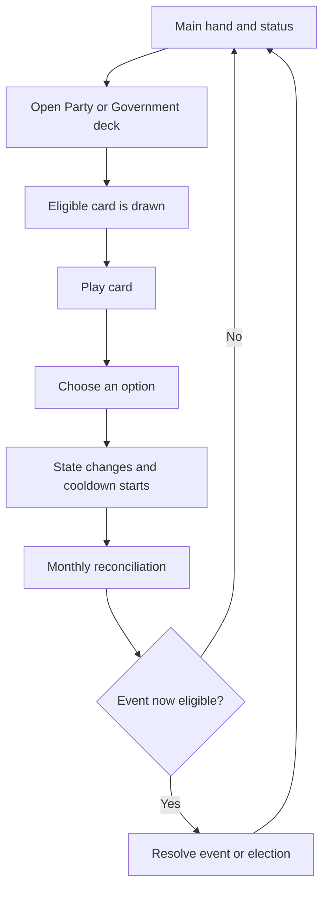
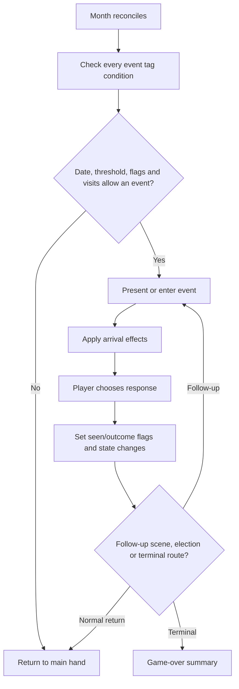
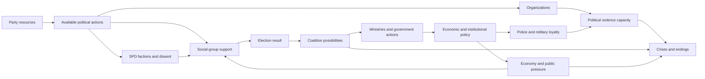

# PPS: An Alternate History

## Executive Game Overview

**A plain-language guide to the Polish opening-party slice over the German baseline**
Prepared from the repository as it exists on 29 August 2026

> **Scope note**
>
> This guide explains what the current game presents and how its source code
> makes that experience work. PPS identity, opening support, population groups,
> the January 1922 start, nine-party electoral model, direct campaigning,
> relationships and first-election coalition shell are implemented; most other
> content remains the German baseline. It is not an independent history. Historical statements are
> described as the game's framing unless independently documented elsewhere.
> Areas that need Polish research or a design choice are marked:
> **TBD — user historical research and design decision required.**

<!-- PDF_PAGE_BREAK -->

## Executive summary

*PPS: An Alternate History* is a political strategy and interactive-fiction
game. The current build identifies the player party as PPS, starts in January
1922, and uses nine semantic Polish party IDs for polling and elections. It
then retains most German-baseline mechanics and the dated event
calendar beginning in 1928 through a period of
elections, economic crisis, unstable governments, political violence, and
possible democratic collapse. The game is less about commanding units on a
map than about managing an organization under pressure. The player chooses
messages, alliances,
leaders, policies, and institutional responses, then watches those decisions
change the political landscape over months and years.

The central rhythm is simple:

1. Return to a main screen that represents the party's current opportunities.
2. Draw an eligible action card from the Party Affairs or Government Affairs
   deck.
3. Play a card and choose how to respond.
4. Spend resources or accept political consequences.
5. Advance one month.
6. Resolve any event that has become due.
7. Recalculate support, factions, the economy, and later election results.

Under that straightforward loop is a highly connected simulation. In the current transitional build, a
policy still pleases one inherited German faction and angers another. A
coalition can unlock ministries but
also create coalition dissent. Economic policy can reduce unemployment while
increasing inflation, spending, or resistance from business and conservative
institutions. Party organizations can help defend democracy, but militancy can
also make violent confrontation more likely. Elections reorganize the entire
decision space because they change parliamentary strength, coalition options,
government access, and cabinet control.

The game does not reduce success to a single score. Its inherited ending system asks what
survived, who controls the state, whether civil war occurred, whether the player party
remains in government, what economic program was achieved, and which special
achievements were unlocked. Survival without an ideal outcome is possible;
political or military defeat is also possible.

Four features are especially important for the project owner to understand:

- **Time is action-driven.** Most played cards spend the month's action. Time
  normally moves only after such an action resolves.
- **Visible percentages are produced from hidden preferences.** Cards usually
  change underlying support among social groups; the game normalizes those
  values into vote shares.
- **Government power is conditional.** Winning votes does not automatically
  grant every policy. Coalitions, ministries, relationships, the president,
  and institutional loyalty all matter.
- **Many systems share the same state.** A small change to one variable can
  affect card availability, elections, events, the interface, and endings.

For a Polish adaptation, the general turn structure is potentially separable
from the German content, but the party model, electoral rules, institutions,
organizations, dated events, leaders, and international framework cannot be
carried across by changing names alone.

**Implemented start-date decision:** New games begin in **January 1922**. The
remaining people, institutions, events, and mechanics still describe the
German baseline. The retained May 1928 election is an interim gameplay
schedule, not a researched Polish equivalent. The Polish end date, first
election date, opening political state, and date-gated event schedule remain
**TBD — user historical research and design decision required.**

**Implemented opening-party decision:** Active elections use KPP, PPS, NPR,
PSL Wyzwolenie, PSL Piast, PSChD, ZLN, Blok Mniejszości Narodowych, and Inne.
The supplied eight-party support values are proportionally scaled so Inne
receives 8% in every population row except Chłopi, where it receives 12%.
Campaigning covers all seven population groups. Polish relationship values and
a limited first-election coalition/toleration shell are active. A narrow
compatibility bridge preserves inherited support effects mapped from SPD, KPD,
DVP and DNVP to PPS, KPP, PSChD and ZLN. Advisers, the live five-faction model,
most action cards, organizations, institutions, dated events and endings remain
a clearly marked German baseline. The ordinary action/month loop is unchanged.

<!-- PDF_PAGE_BREAK -->

## Contents

1. [The game from the player's perspective](#1-the-game-from-the-players-perspective)
2. [Starting a new game](#2-starting-a-new-game)
3. [The normal gameplay loop](#3-the-normal-gameplay-loop)
4. [A concrete turn, event, and month](#4-a-concrete-turn-event-and-month)
5. [Time and events](#5-time-and-events)
6. [Cards, decks, hands, actions, and resources](#6-cards-decks-hands-actions-and-resources)
7. [Support, elections, parliament, and coalitions](#7-support-elections-parliament-and-coalitions)
8. [Factions, relationships, advisers, and government](#8-factions-relationships-advisers-and-government)
9. [Economy, finance, organizations, and institutions](#9-economy-finance-organizations-and-institutions)
10. [International relations, achievements, endings, and saves](#10-international-relations-achievements-endings-and-saves)
11. [How the systems interact](#11-how-the-systems-interact)
12. [Interface and information](#12-interface-and-information)
13. [How the browser game is assembled](#13-how-the-browser-game-is-assembled)
14. [Guidance for a future adaptation](#14-guidance-for-a-future-adaptation)
15. [Appendices](#15-appendices)

### Reading conventions

**Confirmed behavior** is directly visible in `source/`, the compiled game, or
the local running interface. **Interpretation** means the behavior is clear but
its design intention is inferred. **Unclear** means the source or runtime does
not establish a reliable answer without further testing.

The technical references are deliberately placed at the ends of sections and
in the appendices. A reader can understand the main text without knowing
JavaScript or DendryNexus.

<!-- PDF_PAGE_BREAK -->

## 1. The game from the player's perspective

### What the game is about

The game now presents the player as leading the PPS as a political organization,
not in the role of one fixed historical person. The player manages party
strategy across elections and governments while the game's version of the
German Republic still supplies the temporary inherited political setting.

At the opening in January 1922, the status panel labels the player party PPS
but still shows the German-baseline
president and chancellor, the parliamentary shares of the major German
parties, the retained May 1928 election date, party resources, internal
dissent, and basic economic indicators. The opening text explicitly identifies
this material as an interim baseline rather than Polish historical content.

### Who the player controls

The player controls the party's collective strategic choices. Examples include:

- how to campaign among different social groups;
- how high to set membership dues;
- which ideological message to emphasize;
- whether to cooperate with other parties;
- which advisers should form the active leadership team;
- whether to enter, support, or reject a coalition;
- which ministries to seek during government formation;
- which economic, fiscal, social, institutional, and foreign policies to pursue;
- how much to invest in political organizations and democratic defense;
- how to respond to crises and escalating political violence.

The player does not directly move the calendar or command every public event.
Instead, the player acts through cards and choices. The simulation advances and
reacts after those choices.

### Primary goals

The source does not define one universal numeric victory score. The practical
goals implied by the available choices and endings are to keep the SPD
politically effective, preserve or reshape democratic government, prevent a
hostile authoritarian takeover, manage economic collapse, and achieve selected
party programs without triggering terminal political or military failure.

These goals can conflict. A radical policy may satisfy one faction and alienate
another. A broad coalition may keep a government alive but restrict what the
SPD can do. A costly response to unemployment may improve the economy but
weaken the budget or provoke a capital strike. A strong defensive organization
may improve resistance to violence while increasing the importance of
militancy calculations.

### Victory, survival, and defeat

The ending screen is a portfolio of outcomes rather than a single final grade.
Confirmed ending checks include:

- whether Hitler or another Nazi leader controls the state;
- whether the republic won, lost, or remains trapped in civil war;
- whether the SPD still governs and who holds the presidency;
- whether a communist-led outcome occurred;
- whether unemployment was reduced;
- whether a works program, nationalization, stronger works councils, a
  People's Party strategy, or European integration was achieved;
- which achievements were unlocked during this playthrough and across games.

“Victory” therefore means different things to different play styles. A player
may survive without accomplishing every program, or achieve a policy goal while
ending in a politically dangerous situation. The game-over logic is concentrated
in `source/scenes/game_over.scene.dry`.

### What the experience feels like

The tone is one of constrained choice. The player repeatedly chooses between
valuable outcomes that draw on the same limited political capital. Information
is imperfect: the interface summarizes some values in words, hides many raw
timers and progress counters, and reveals consequences through later cards and
events. Much of the tension comes from delayed effects rather than immediate
failure messages.

The local new-game introduction displays January 1922 and explains that the
remaining content retains the German baseline. It provides a single **Begin**
action. There is no difficulty or historical-mode selection.

**Technical reference:** `source/scenes/root.scene.dry`,
`source/scenes/status.scene.dry`, and `source/scenes/game_over.scene.dry`.
Important state includes `started`, `year`, `month`, `resources`, `dissent`,
`spd_in_government`, `president`, `chancellor`, and the ending/achievement flags.

<!-- PDF_PAGE_BREAK -->

## 2. Starting a new game

### How a new game begins

The first menu offers Start game, Election simulation, Credits, and the
achievement screen. Starting a game initializes a large shared record of the
world: the date, party resources, factions, relationships, organizations,
economic conditions, party preferences among social groups, parliamentary
shares, office holders, event flags, advisers, and cooldown timers.

Initialization now uses one fixed baseline: 2 party resources, dues of 2, a
government budget of 4, the baseline relationships and faction dissent, and a
Reichsbanner strength of 2,000. After reading the introduction, the player has
one **Begin** action. It routes directly to the three-card main hand.

### What happens after Begin

The January 1922 introduction leads directly into the main hand. The Government
Affairs deck is initially hidden and becomes available after the internal time
counter reaches six, so the early game focuses on the party before opening the
government-action layer. Saves and polls remain available.

### Fixed-baseline compatibility

The source retains `difficulty = 0` and `historical_mode = 0` as legacy
compatibility fields because old saves, mods, and runtime code may still read
them. They are not player-selectable. New games keep both values fixed at zero,
which preserves the former Normal behavior without exposing a mode system.

**Technical reference:** fixed initialization and the single Begin route in
`source/scenes/root.scene.dry`; the three-card hand and government-deck gate in
`source/scenes/main.scene.dry`. Important state: `difficulty`,
`historical_mode`, `resources`, `dues`, `budget`, `rb_strength`, party
relationships, faction dissent, and `time`.

<!-- PDF_PAGE_BREAK -->

## 3. The normal gameplay loop

### What the main screen represents

The main screen is not a geographic map of orders. It is the party's current
agenda. It has three functional zones:

- **Decks** contain categories of actions. Party Affairs is present from the
  start; Government Affairs appears later and is useful when government access
  exists.
- **Hand** contains the specific action cards already drawn. Drawing creates
  options; playing one begins the decision.
- **Pinned cards** remain available outside the normal draw/discard cycle.
  These are primarily advisers and leadership management.

The left status panel remains visible. It shows enough context to judge a
choice: date, resources, government position, parliament, economic conditions,
relationships, factions, or security organizations depending on the selected
tab.

<!-- PDF_SCREENSHOT: main -->

*Figure 1. The local main hand: one Party Affairs deck, three empty hand slots,
and three pinned advisers at the beginning of the fixed baseline.*

### Step-by-step turn

1. **Review the situation.** Check the status tabs, current resources, election
   timing, faction mood, and any urgent problem.
2. **Draw a card.** Click a deck. Dendry filters its cards to those whose
   conditions are currently satisfied, then draws an eligible card into the
   hand.
3. **Choose whether to play it.** The card remains in the hand until selected.
   Eligible cards can also expose a return-to-hand action that reverses the
   pending action marker and card timer.
4. **Read the card and choose an option.** The card explains the situation and
   usually presents several approaches. Some choices are hidden or disabled if
   the party lacks money, office, support, or another prerequisite.
5. **Apply consequences.** The selected option changes shared game state. It
   may spend resources, adjust support, alter faction dissent, change a
   relationship, advance a policy, or set an event flag.
6. **Spend the month.** Most normal action cards mark that one monthly action
   has been used and start a cooldown.
7. **Reconcile the simulation.** The game recalculates party support and
   faction totals. If an action was spent, it advances the date by one month,
   reduces active cooldowns, records chart data, and updates the economy.
8. **Resolve an event if due.** Dated and conditional events are checked. An
   eligible event can interrupt the return to the main hand.
9. **Return to the hand.** After event resolution, the next cycle begins with
   the changed status visible.



<!-- DIAGRAM: gameplay-loop -->

### Important qualification

The main loop is confirmed, but simultaneous event selection and exact random
draw guarantees are not fully explained by player-facing text. If multiple
events are eligible at once, their priority and Dendry choice behavior need
targeted runtime tests.

**Technical reference:** `source/scenes/main.scene.dry`,
`source/scenes/post_event.scene.dry`, `source/scenes/return.scene.dry`,
`source/scenes/easy_discard.scene.dry`, and
`source/scenes/cancel_advisor_action.scene.dry`. Important state:
`month_actions`, `time`, `year`, `month`, `timers`, and all `*_timer` values.

<!-- PDF_PAGE_BREAK -->

## 4. A concrete turn, event, and month

### Example A: playing a normal Fundraising card

Fundraising is a clear example because it connects actions, resources,
membership dues, faction mood, public support, and time.

At the beginning of the fixed baseline, the party has 2 resources and dues of
2. If the Fundraising card is eligible and drawn:

1. Opening the card starts a six-month fundraising cooldown and marks the
   monthly action as spent.
2. **Maintain dues** adds resources equal to current dues. At the default start,
   that means gaining 2 resources.
3. **Reduce dues** first lowers dues by one, then adds the new dues amount to
   resources. It also reduces dissent in four factions. At the default start,
   dues become 1 and the party gains 1 resource.
4. **Increase dues** raises dues by one and adds the new amount to resources,
   but lowers SPD support among workers and unemployed people. The penalty is
   worse under high unemployment and when dues are already high.

This is a typical design pattern: the player is not choosing “good” versus
“bad.” The player chooses which problem to accept. Higher dues fund future
actions but can damage the electoral base. Lower dues soothe the party but
produce less money.

The card is unavailable while its cooldown is positive. That is an example of
a hidden rule shaping the visible card pool.

### Example B: resolving Black Thursday

The event named Black Thursday becomes eligible when the game reaches 1929 and
the month is October or later. It has a one-visit limit. On arrival, it marks
itself as seen and changes several parts of the simulation at once:

- support shifts among workers, middle-class, rural, and unemployed groups;
- unemployment rises;
- the government budget can fall;
- dues can fall;
- inflation and economic growth decline.

The player then chooses either a general interpretation of the crisis or a
commitment to address suffering. The latter raises `crisis_urgency`, which
affects the later economic-policy debate. The event therefore does more than
tell a story: it changes future card conditions and policy pressure.

### Example C: advancing one month

After Fundraising or another normal action marks `month_actions` as at least
one, the reconciliation scene:

1. recalculates demographic support and overall party vote shares;
2. normalizes faction strengths and recalculates overall dissent;
3. adds one to the internal month counter;
4. advances the calendar month, rolling December into January of the next year;
5. resets `month_actions` to zero;
6. reduces every active timer whose base name is listed in the central timer
   array;
7. appends support and economic values to the chart history;
8. applies monthly economic feedback;
9. checks the event pool before returning to the hand.

The action, not the act of drawing, ends the month. Merely drawing a card does
not advance time.

**Technical reference:** `source/scenes/party_affairs/fundraising.scene.dry`,
`source/scenes/events/black_thursday.scene.dry`, and
`source/scenes/post_event.scene.dry`. Important state: `resources`, `dues`,
`fundraising_timer`, `month_actions`, `crisis_urgency`, `unemployed`,
`inflation`, `economic_growth`, `budget`, and demographic support values.

<!-- PDF_PAGE_BREAK -->

## 5. Time and events

### Three ways of describing time

The game maintains:

- `year`, the displayed year;
- `month`, a number from 1 to 12 translated into a month name by a qdisplay;
- `time`, a simple elapsed-month counter used by some availability conditions.

These values normally move together. A completed monthly action advances
`time` and `month`; month 13 becomes January and adds one to `year`.

### Scheduled events

A scheduled event has a condition based on the date. Black Thursday checks for
1929 and October or later. Annual scenes react to particular years. Elections
compare the current date with the next election date. A one-visit limit or a
seen flag prevents repeated presentation.

### Conditional events

A conditional event responds to state rather than only the calendar. Examples
include escalation of coup progress, capital-strike progress, coalition
dissent, economic stress, party-faction dissent, or the success/failure of an
earlier choice. Many important events combine date and state conditions.

### Random, scheduled, and player-triggered content

These labels describe different sources of uncertainty:

- **Random card draw:** deck cards are drawn from the currently eligible tagged
  set. This is the clearest confirmed use of randomness in ordinary play.
- **Scheduled event:** a date makes a tagged event eligible after the month's
  action.
- **Conditional event:** a threshold or flag makes an event eligible.
- **Player-triggered event:** not a separate Dendry object type. It is an event
  whose eligibility was caused by earlier player choices, such as increasing a
  crisis or coup counter.

It is **unclear** whether simultaneous eligible events are always ordered by
priority, presented as a player choice, or randomly selected in every case.
That requires focused runtime testing.

### Elections and major crises

Elections interrupt the ordinary loop with a larger sequence: recalculate vote
shares, apply thresholds and bans, produce parliamentary shares, show results,
calculate possible coalitions, choose a government path, negotiate ministries,
and schedule the next election.

Major crises can similarly branch into multi-scene sequences. They may change
the action economy, remove government options, force institutional decisions,
or route toward terminal conflict. The source treats them as connected scenes,
not as a separate “crisis engine.”

### Event flags

Flags are memory. A value such as `black_thursday_seen` tells later scenes that
the event occurred. Some flags prevent repeats; some unlock follow-ups; some
record the outcome chosen. Timers can delay follow-up content, and visit counts
provide a second repetition control.



<!-- DIAGRAM: event-lifecycle -->

**Technical reference:** `source/scenes/post_event.scene.dry`, all files under
`source/scenes/events/`, and event tags/conditions in compiled
`out/game.json`. Important state: `year`, `month`, `time`, `has_event`,
`*_seen`, `*_timer`, next-election fields, threshold counters, and scene visit
counts maintained by Dendry.

<!-- PDF_PAGE_BREAK -->

## 6. Cards, decks, hands, actions, and resources

### Cards, decks, and hands

The best analogy is a desk with two filing trays. A deck is a category of
possible work; a card is one specific issue drawn from that category; the hand
is the small set of issues currently on the desk.

The Party Affairs deck contains campaigning, fundraising, ideology, media,
organization, relationships, rallies, leadership, and similar party work. The
Government Affairs deck contains policy and ministerial work and appears after
the early-game time gate. A card can also be hidden by its own requirements,
including cooldown, government position, ministry ownership, date, resources,
or earlier choices.

Pinned cards do not behave like ordinary drawn cards. Advisers and leadership
management remain visible because they represent persistent people or controls,
not a transient agenda item.

<!-- PDF_SCREENSHOT: drawn-card -->

*Figure 2. A Party Affairs draw places Political Rally into the hand while the
advisers remain pinned below it.*

### Action economy

Most normal action cards add one to `month_actions` when opened or resolved.
The reconciliation scene sees that marker and advances one month. The game
therefore gives the player approximately one major party/government action per
month, plus access to pinned adviser actions subject to their own shared
cooldown.

Return/cancel routes can reverse the action marker, clear the matching timer,
reset a card's visit count, and return it to the three-card hand.

### Party resources and government budget

The game has two distinct financial abstractions:

- **Resources** belong to the party and pay for campaigning, media,
  organizations, advisers, and political activity.
- **Budget** belongs to the government and constrains policy. A negative budget
  is allowed, but monthly logic turns deficits into inflation pressure and
  some political/economic consequences.

Membership `dues` help generate party resources through Fundraising. They are
not the same as taxes, and resources are not the government budget.

### What improves or damages this mechanic

Fundraising and some events increase or protect resources. Expensive actions
reduce them. Government revenue/spending choices affect budget. A weak resource
position reduces the party's capacity to solve problems, while a weak budget
restricts government policy and can worsen economic feedback.

### Failure and uncertainty

There is no confirmed universal “bankruptcy” ending for party resources.
Instead, insufficient resources hide or disable choices. Budget can become
negative. Exact balance targets for how often cards should be affordable are
not stated in source.

**Technical reference:** `source/scenes/main.scene.dry`, party/government card
files, `source/scenes/party_affairs/fundraising.scene.dry`, and
`source/scenes/post_event.scene.dry`. Important state: `resources`, `dues`,
`budget`, `month_actions`, `advisor_action_timer`, and card-specific timers.

<!-- PDF_PAGE_BREAK -->

## 7. Support, elections, parliament, and coalitions

### Party support and vote share

The game does not normally add “one percentage point” directly to a national
poll. It stores hidden preference weights for combinations such as workers-SPD
or rural-NSDAP. Cards and events change these raw weights. At reconciliation,
the game performs two normalizations:

1. Within each social group, it converts all party weights into percentages.
2. It weights those group percentages by the group's size and converts the
   result into national party shares.

The implemented player-facing groups are Robotnicy, Drobnomieszczaństwo,
Inteligencja, Chłopi, Burżuazja i Ziemiaństwo, Bezrobotni, and Mniejszości
Narodowe. The five main classes total 100%: in January 1922 they are 27%, about
12.22%, about 5.56%, 53%, and about 2.22%, respectively. Robotnicy rise
linearly to exactly 30% and Chłopi decline linearly to exactly 50% by December
1939; the other three main shares remain fixed. Bezrobotni begin at 3% and are
an overlapping economic condition. Mniejszości Narodowe are a separate 30%
overlapping identity weight; Polacy are the implied complement rather than an
independently weighted group. The active party list is KPP, PPS, NPR, PSL
Wyzwolenie, PSL Piast, PSChD, ZLN, Blok Mniejszości Narodowych, and Inne.

Every group has a dedicated approved nine-party opening row. The eight named
party values are proportionally scaled to reserve exactly 8% for Inne, except
among Chłopi where Inne receives 12%. Because the rows total 100, their opening
raw values also read as within-group percentages. Historical validation remains
**TBD — historical research required**. The approximate minority composition
recorded for later design is 60% Chłopi, 17% Robotnicy, 19%
Drobnomieszczaństwo, 3% Inteligencja, and 2% Burżuazja i Ziemiaństwo; it does
not yet drive an intersection calculation. The 30% minority row remains an
additional overlapping electoral dimension. Inherited Catholic-targeting PPS
effects transfer only as deltas and no longer overwrite the whole row.

This design makes political effects indirect. A card that improves PPS appeal
among workers may have a large national effect because workers have a large
weight. The same raw change among a smaller group may matter less. Overall PPS
dissent can reduce positive support gains in many scenes.

**Failure conditions:** each social group's preference total must remain above
zero for normalization to work. The source clamps negative preferences to zero
but does not visibly guard every possible zero denominator.

### Elections and parliamentary shares

At an election, the game recalculates support, then applies the current
electoral threshold and party bans. Parties that fail the rule receive zero
parliamentary share; qualifying results are normalized again. The game stores
the previous result, calculates the change, finds the largest party, and saves
the result for charts.

The parliamentary display uses percentages as an approximate seat share. The
D3 semicircle multiplies shares into roughly 500 colored positions. The source
contains a `use_decimals` TODO, and there is no confirmed district-level or
remainder-seat allocator. The graphic is therefore a useful overview, not
evidence of a fully exact seat model.

<!-- PDF_SCREENSHOT: charts -->

*Figure 3. The local Library renders the starting Reichstag as an approximate
semicircle and provides space for election, support, and economic history.*

### Coalition formation

The active first-election code computes a deliberately limited Polish shell:

- PPS majority;
- Koalicja Lewicy: PPS + PSL Wyzwolenie + Minorities Bloc;
- centre-left: PPS + PSL Wyzwolenie + PSL Piast + NPR;
- a PPS–PSL Wyzwolenie minority government externally tolerated by the
  Minorities Bloc;
- Chjeno-Piast: ZLN + PSChD + PSL Piast.

Minority toleration explicitly leaves the Minorities Bloc outside the cabinet.
Routes can depend on:

- whether the combination reaches a majority;
- relations with partner parties;
- available resources or leverage;
- party leadership;
- presidential and constitutional conditions;
- earlier failed negotiations.

Entering one of these routes sets first-cycle government flags. Named
chancellors, ministry allocation and detailed coalition programs are left as
**TBD — historical research required** rather than invented. The inherited
German coalition branch remains in the source but Polish elections do not route
through it. Centrolew, Sanacja, United Left, broad fronts/coalitions, democratic
classification and crisis rules remain planned.

### Coalition dissent

Coalition dissent represents conflict among governing partners. Policy choices
can raise it; coalition-management actions can address it. The interface
summarizes it from very low through very high. High dissent can contribute to
coalition crises or confidence votes.

The government is represented by many separate flags rather than one single
government object. That creates a risk: incomplete resets can leave
contradictory states. The intended mutual exclusivity of every coalition flag
requires route testing.

**Technical reference:** `source/scenes/election_algorithm.scene.dry`,
`source/scenes/events/election_1928.scene.dry`,
`source/scenes/government_affairs/coalition_affairs.scene.dry`, and
`source/scenes/library.scene.dry`. Important state includes the dynamic
class-party families, party `_normalized`, `_votes`, and `_r` families,
`electoral_threshold`, party bans, coalition totals, `coalition_dissent`,
government flags, `leverage`, and ministry-party fields.

<!-- PDF_PAGE_BREAK -->

## 8. Factions, relationships, advisers, and government

### Internal party factions

The live PPS-1 build still contains the five inherited German factions: Left,
Center, Labor, Reformist, and Neorevisionist. Each has a strength and a dissent
value. Cards, German placeholder advisers, leadership decisions, coalition
choices, and policies move those values. The interface labels this system as a
temporary baseline rather than presenting it as the finished PPS structure.

After each action, faction strengths are normalized so they add to 100. Overall
party dissent is a weighted result: anger in a strong faction matters more than
the same anger in a weak faction. Individual dissent is kept between 0 and 99;
overall dissent is capped below complete disunity.

Faction dissent matters because it reduces the benefit of some support gains
and can unlock party-disunity content. Several resignation or split events use
60 as an important faction-dissent threshold. This is a feedback loop: a policy
choice produces faction anger; anger weakens electoral gains; weaker results
reduce government options; constrained government can cause more anger.

The approved replacement, which is **planned but not implemented**, is Centrum
PPS at 50 strength/0 dissent, Lewica PPS at 15/20, and Piłsudczycy at 35/5.
Each has an approved 60-dissent consequence design. ZSZ is planned as an
affiliated union power center rather than a faction. Replacing the live array
alone would break card effects, advisers, monthly dissent, union behavior,
split events, and displays, so the three-faction conversion is reserved for a
later coherent slice with its own tests. Historical validation remains **TBD —
historical research required**.

### Relationships with other parties

Separate active numeric values record relations with PSL Wyzwolenie, Blok
Mniejszości Narodowych, PSL Piast, NPR, PSChD, KPP, and ZLN. Their opening
scores are 65, 50, 45, 50, 30, 10, and 5. The existing display bands remain
authoritative, so those values display as friendly, neutral, neutral, neutral,
cool, frigid, and hostile respectively. The implemented first-cycle coalition
routes read the relevant partner values.

The relationship card now offers Polish opening-party outreach. Detailed
historical disputes, presidential negotiations and later coalition effects are
planned. Inactive German relationship values remain only for inherited content
and do not determine Polish first-election eligibility.

### Advisers and leadership

The player begins with three pinned advisers. The broader adviser library
contains people associated with factions or specialist roles. Leadership
management adds or removes advisers and can change faction strength/dissent.

Adviser actions generally use a shared cooldown. They can shortcut or modify
other systems: campaign support, faction management, organizations,
institutional policy, or government work. Because they are pinned, advisers
feel like strategic capabilities rather than random issues.

### Cabinet positions and ministries

Government entry does not grant every policy automatically. The player can
spend election-derived leverage on ministries such as Labor, Interior, Finance,
Economic, Justice, Foreign, Agriculture, and Reichswehr. Ministry-party fields
gate government cards; named minister fields support the narrative; goal fields
track office-specific tasks.

Coalition bargains, office ownership, named ministers, and goals are stored
separately. A government redesign therefore has to update all four layers.

<!-- PDF_SCREENSHOT: politics -->

*Figure 4. The Politics tab translates raw relationships and faction numbers
into readable labels while a card choice remains in the center.*

**Technical reference:** `source/scenes/post_event.scene.dry`,
`source/scenes/party_affairs/party_disunity.scene.dry`,
`source/scenes/party_affairs/inter_party_relationships.scene.dry`,
`source/scenes/party_affairs/shuffle_leadership.scene.dry`, adviser files under
`source/scenes/advisors/`, and ministry sections of
`source/scenes/events/election_1928.scene.dry`. Important state: faction
strength/dissent, `dissent`, party relations, adviser flags,
`advisor_action_timer`, `leverage`, ministry ownership, and government flags.

<!-- PDF_PAGE_BREAK -->

## 9. Economy, finance, organizations, and institutions

### Economic conditions and policy

The visible economic indicators are inflation, unemployment after the crash,
and economic growth. The game also stores the government budget and several
policy-program stages.

Annual and crisis events alter the baseline economy. Monthly reconciliation
adds feedback: deficits can increase inflation; works programs can alter later
unemployment and growth; crisis choices change pressure for action. The player
can debate and adopt broad economic plans, then use government cards to
implement them in stages.

The plan codes distinguish no plan, a WTB/public-works direction, a moderate
plan, and a nationalization direction. Each route has its own support,
adoption, progress, budget, and political consequences. Strong intervention
can advance capital-strike or coup pressure.

### Taxation and government finance

Upper tax rates, lower tax rates, and tariffs are signed policy levels. A
qdisplay turns them into phrases from extremely low through extremely high.
Fiscal choices influence budget and also affect parties, classes, growth,
unemployment, inflation, or business resistance.

The budget is simultaneously a permission to spend and an input into monthly
economic feedback. This makes it tightly coupled and difficult to rebalance in
isolation.

### Political organizations

Party Affairs cards support campaigning, media, cultural organizations,
rallies, party organization, the Reichsbanner, and the Iron Front. These
actions spend party resources and change support, organization strength,
militancy, faction mood, or later event flags.

The source uses different kinds of “strength” values. Some are described as
thousands of members; others are abstract. The interface's strength qdisplay
uses common labels despite those differences. A future design should define
units before rebalancing.

The approved PPS organization design is **planned, not implemented**. ZSZ will
be an affiliated union power center rather than a Labor faction. The PPS
“social world” is intended to abstract TUR, OM TUR, Czerwone Harcerstwo TUR,
RTPD, worker sport, cooperatives, and housing. Press will center on *Robotnik*,
regional papers, outreach choices, and later censorship/resilience, without an
independent radio branch. Exact history, dates, scale, variables, and balance
remain **TBD — historical research required**; PPS-1 preserves the inherited
cards and organization mechanics.

### Militancy and political violence

The game tracks the Reichsbanner, Stahlhelm, SA, and RFB with separate strength,
militancy, and ban state. Conflict scenes derive power by combining these
values. Political choices can strengthen, restrain, militarize, ban, or
persecute organizations.

Violence is connected to party strategy and institutions rather than being a
separate combat minigame. When escalation reaches a crisis, the game compares
friendly and hostile forces and routes toward coup or civil-war outcomes.

The approved future PPS self-defence model treats Milicja PPS and Akcja
Socjalistyczna as two stages of one organization, separate from any later
Polish equivalent of the Iron Front. This is not yet implemented: Reichsbanner
and Iron Front state and events remain the explicit temporary baseline pending
historical research and a bounded replacement slice.

### Police and institutional loyalty

The game separately tracks Prussian police, interior police, and the
Reichswehr. Strength, militancy, loyalty, training, investigation, and reform
choices influence whether institutions protect or threaten the government.

Constitutional policy adds another institutional layer: electoral threshold,
party bans, constructive vote of no confidence, and presidential powers can
change election and government routes.

Important failure thresholds include coup and capital-strike progress at 10.
The precise combined power formulas and mixed units should be treated as
high-risk implementation details.

**Technical reference:** `source/scenes/post_event.scene.dry`,
`source/scenes/party_affairs/crisis_program.scene.dry`,
`source/scenes/government_affairs/economic_policy.scene.dry`,
`source/scenes/government_affairs/fiscal_policy.scene.dry`, organization and
street-fighting cards under `source/scenes/party_affairs/`, institutional cards
under `source/scenes/government_affairs/`, and
`source/scenes/events/civil_war.scene.dry`. Important state: `unemployed`, `inflation`,
`economic_growth`, `budget`, economic-plan families, tax/tariff levels,
organization strength/militancy, institutional loyalty, derived power,
`capital_strike_progress`, and `coup_progress`.

<!-- PDF_PAGE_BREAK -->

## 10. International relations, achievements, endings, and saves

### International relations

International policy appears at both party and government levels. The source
tracks relations and aid associated with western, eastern, Soviet, and Austrian
directions, along with reparations, war-guilt policy, customs-union choices,
and European-integration progress.

These are not a single “foreign relations score.” Separate directions allow a
choice to improve one relationship while harming another, and domestic
factions or coalition partners can respond. Dated international events also
read these choices.

The entire actor list, agreement structure, dates, and domestic consequences
are specific to the current German baseline.

### Achievements and endings

Achievements exist at two levels: current-play fields and persistent unlocks.
The game-over scene evaluates political, economic, institutional, coalition,
and personal-leadership outcomes. It then presents eligible ending summaries
and unlocked achievements.

Because many ending conditions can be true at once, the ending screen is a
collection of consequences. The exact ordering when multiple tagged endings
are eligible needs a targeted terminal-state test.

### Saving and loading

The customized browser interface provides two autosave slots, eight manual
slots, load/delete/export controls, and save-file import. Saves are stored in
browser storage through the Dendry runtime. Saving remains available in the
fixed baseline.

State-variable names are therefore part of the save format. Renaming a quality
can break old saves even when the new code builds successfully.

### Mod support

The browser runtime includes a mod loader that can load alternate game data by
URL and refers to a curated remote table. The source establishes the presence
of this feature, but network access, trust boundaries, CORS behavior, malformed
data handling, and compatibility guarantees were not tested for this guide.

**Technical reference:**
`source/scenes/party_affairs/international_relations.scene.dry`,
`source/scenes/government_affairs/foreign_policy.scene.dry`, international
event scenes, `source/scenes/game_over.scene.dry`,
`source/scenes/mod_loader.scene.dry`, and customized runtime file
`out/html/game.js`.

<!-- PDF_PAGE_BREAK -->

## 11. How the systems interact

No major mechanic is truly isolated. The diagram below shows the most important
direction of influence, not every connection.



<!-- DIAGRAM: system-interactions -->

### Important feedback loops

#### Resource-pressure loop

Low resources hide useful party actions. With fewer campaign, media, or
organization choices, the party may struggle to improve support or respond to
threats. Weak results then reduce government leverage and access to tools that
could relieve the pressure.

#### Faction-support loop

A policy angers a strong faction. Weighted overall dissent rises. Many positive
support gains are reduced by dissent. Weaker electoral support narrows
coalition options, and an unattractive coalition can create further faction
anger.

#### Coalition-survival loop

A coalition grants ministries and the ability to enact policy. Controversial
policy raises coalition dissent. High dissent creates disputes or confidence
votes. Loss of government removes access to the ministries needed to continue
or repair the program.

#### Economic-crisis loop

The economy worsens, changing social-group preferences and increasing pressure
for action. Intervention spends budget and can trigger inflation or resistance.
A weak budget creates additional monthly inflation pressure. Political reaction
can then reduce support or coalition stability.

#### Violence-institution loop

Threatening organizations grow or become more militant. The player invests in
defensive organizations and seeks loyal police or military institutions.
Institutional reform may provoke conservative resistance or coup progress.
Those risks make further defensive investment more urgent.

### Why advisers and ministries matter across systems

Advisers are persistent shortcuts or modifiers; ministries are access keys.
Together they determine not only what a policy does, but whether the player can
attempt it at all. Elections change coalition possibilities; coalitions change
ministry ownership; ministries change the card pool; the card pool changes the
next election. This is the game's broadest strategic cycle.

<!-- PDF_PAGE_BREAK -->

## 12. Interface and information

### What the interface shows

The persistent left panel is divided into tabs:

- **Main:** date, resources, SPD government position, overall dissent,
  president, chancellor, parliament, next election, budget when relevant, and
  headline economic indicators.
- **Politics:** relationships with other parties and SPD faction
  strength/dissent.
- **Defense:** organization strength/militancy and police/military loyalty.
- **Polls:** projected vote shares and detailed social-group results.

The top links open the Library, Save/Load, and Options. The center panel contains
the current narrative, hand, card, event, government negotiation, or reference
page.

### What qdisplays are

A qdisplay is a translation table. It turns a raw number into words. For
example, a relationship number becomes hostile, cold, neutral, warm, friendly,
or very friendly. Other qdisplays cover month names, dissent, coalition dissent,
strength, militancy, loyalty, and taxation.

This reduces cognitive load but hides exact thresholds. A relationship can
change without its label changing, and then unexpectedly cross a coalition
gate. The label used by a qdisplay is also not necessarily the same threshold
used by a particular choice.

### How cards communicate availability

Cards can be completely absent because their `view-if` condition is false. A
choice can remain visible but disabled because its `choose-if` fails. Subtitles
often explain resource gains, costs, or warnings, but not every hidden state
effect is disclosed.

<!-- PDF_SCREENSHOT: card-choice -->

*Figure 5. A normal card presents several political messages and a return
option; the status panel remains visible for context.*

### Parliament and graphs

The Library's parliament graphic is an approximate visual representation of
party result percentages. Election history records election results; party
support history records monthly normalized support; economic history records
inflation and unemployment. At the beginning of a game the history charts are
mostly empty.

### Important hidden state

The player normally cannot see:

- raw class-party preference weights;
- most cooldown numbers;
- exact coup and capital-strike progress;
- many event flags and prerequisites;
- detailed coalition formulas and resets;
- derived combat-power values;
- every ministry goal and achievement predicate;
- scene visit counts and event priority.

### Where comprehension is difficult

1. Qdisplay labels can conceal proximity to a numeric threshold.
2. Raw support changes are difficult to translate into national vote effects.
3. Several government flags describe one conceptual coalition.
4. The same choice can affect support, factions, relationships, budget, and
   event pressure without a consolidated consequences view.
5. The initial start screen shows a zero-filled status panel before state is
   initialized.
6. The parliament looks exact even though it is based on an approximate
   percentage-to-seat rendering.

These are observations about clarity, not requests to change the interface.

**Technical reference:** `source/scenes/status.scene.dry`, all eight files under
`source/qdisplays/`, `source/scenes/library.scene.dry`,
`out/html/index.html`, and `out/html/game.js`.

<!-- PDF_PAGE_BREAK -->

## 13. How the browser game is assembled

### DendryNexus in one paragraph

DendryNexus is the project's story language, compiler, and browser game engine.
It lets the author describe pages, choices, conditions, state changes, and
routes in text files instead of writing the entire interface from scratch.
JavaScript is embedded only where loops or more complicated calculations are
needed.

### The important folders

| Location | Plain-language role | Editing rule |
| --- | --- | --- |
| `source/info.dry` | Game title, author, and identity metadata. | Source input. |
| `source/scenes/` | Narrative, cards, events, choices, calculations, and routing. | Edit here for game content/logic. |
| `source/qdisplays/` | Numeric-to-text labels used by the interface. | Edit here for display bands/wording. |
| `assets/img/` | Source image assets copied into the web build. | Preserve as source assets. |
| `out/game.json` | Compiled machine-readable game. | Generated; do not edit manually. |
| `out/html/` | Deployable browser game and customized runtime/interface files. | Mostly generated; selected tracked files are customized. |

### Scenes and qualities

A **scene** is a page or step in the experience. A file can contain a main
scene and many named subscenes. A choice routes from one scene to another.
Conditions decide whether a scene or choice is available.

A **quality** is a state variable: a named piece of memory such as the year,
resources, dissent, unemployment, or whether an event has occurred. In
embedded JavaScript, qualities live in an object named `Q`. The browser saves
that state so the player can continue later.

### From source to browser

```text
source/info.dry + source/scenes/ + source/qdisplays/
                         |
                         | npm run build
                         v
                   out/game.json
                         +
            out/html/ browser runtime
                         +
              copied D3 and assets/img/
                         |
                         v
               playable browser game
```

`npm run build` runs DendryNexus, then copies the local D3 library and source
images into `out/html/`. `npm run serve` starts a simple local web server for
the built output. The browser loads `out/game.json`, creates the interface,
maintains the hand and scene history, saves state, and calls D3 for charts.

The build proves that files compile. It does not prove that a route is
reachable, a threshold is balanced, an old save is compatible, or a complex
ending is correct.

### Scale of the current source

The repository contains 167 source files: 158 scene files, eight qdisplays, and
one metadata file. Those scene files define 1,117 source-authored scene nodes
(158 top-level scenes and 959 subscenes). The compiled game contains five
additional engine routing scenes. The original audit identified 989 literal or
concretely constructed quality keys; the implemented population slice adds 58,
for a current expanded total of 1,047. Many are display helpers,
candidate/timer families, or route-specific flags rather than independent
headline mechanics.

For the technical detail behind these counts, see `MECHANICS_MAP.md` and
`STATE_VARIABLES.md`.

<!-- PDF_PAGE_BREAK -->

## 14. Guidance for a future adaptation

### Implemented campaign start

The campaign starts in **January 1922**. The source implements this as
`year = 1922`, `month = 1`, and relative `time = 1`. German absolute date gates
retain their original years, so the first retained election is May 1928 at
relative month `77`. The introduction identifies the people, institutions,
events, and mechanics as an interim German baseline.

The campaign end date, first Polish election date, opening office holders and
parliamentary state, and first Polish scheduled events remain **TBD — user
historical research and design decision required.**

### Implemented population model

New games use the approved seven-group support schema described in section 7.
The five main classes are normalized to 100%, while unemployment and national
minority identity overlap them. The January 1922 opening has 3% unemployment
and 30% Mniejszości Narodowe. The demographic trend is implemented through
December 1939, but the retained German campaign ending currently occurs
earlier; reaching 1939 in ordinary play therefore depends on a separately
approved chronology extension. Old saves are not guaranteed compatible, and
no migration layer is included in this slice.

This section classifies implementation patterns. It does not propose Polish
history, institutions, parties, people, dates, or equivalents.

### Probably reusable as general game systems

These are engine-level patterns that can support many political games:

- scene-and-choice narrative flow;
- card, deck, hand, and pinned-card interaction;
- action-driven monthly time;
- cooldown timers;
- tagged event eligibility and seen flags;
- separate source and generated output;
- qdisplays for player-friendly labels;
- save/load and chart-history concepts;
- a status panel alongside the current narrative.

Even these require interface and usability decisions. Their historical content
is not automatically reusable.

**Polish adaptation:** TBD — user historical research and design decision required.

### Reusable but requiring new data and balancing

The following mechanics are general enough to reuse in principle, but their
lists, numbers, effects, thresholds, and feedback require fresh evidence and
design:

- social-group support and vote normalization;
- election scheduling and result storage;
- coalition arithmetic and stability;
- internal factions and weighted dissent;
- relationships with other parties;
- adviser rosters and shared cooldowns;
- ministries as action gates;
- abstract party resources and government budget;
- economic indicators and policy stages;
- political organizations, loyalty, and escalation;
- achievements and multi-part ending summaries.

**Polish adaptation:** TBD — user historical research and design decision required.

### Closely tied to the German baseline and requiring redesign

These systems embed German names, institutions, laws, organizations, or event
chronology directly into variables and routes:

- the still-inherited content and events associated with SPD, KPD, Center/BVP,
  DDP/DStP, DVP, DNVP, NSDAP and SAPD, even though the active electoral roster
  is now Polish;
- detailed Polish parliamentary allocation, later coalition formulas and the
  current approximate percentage-based seat display;
- president/chancellor powers and the no-confidence/emergency-government paths;
- Prussian government and police as a separate political layer;
- Reichsbanner, Iron Front, SA, RFB, Stahlhelm, and Reichswehr systems;
- named leaders, advisers, presidents, ministers, and candidates;
- the 1928-1934 event calendar and election cycle;
- crisis programs, reparations, foreign-policy actors, and named agreements;
- current victory, defeat, and achievement conditions.

These cannot be treated as equivalent to Polish institutions merely because a
similar English label exists.

**Polish adaptation:** TBD — user historical research and design decision required.

### Unclear and requiring a design decision

- Should time remain one major action per month?
- Should the player draw random actions or choose directly from a menu?
- Should party resources and government budget remain abstract?
- Should elections use approximate percentages or an exact seat system?
- How much hidden state should the interface expose?
- Should the fixed baseline continue to expose both saves and polls?
- Should advisers and ministries remain separate unlock layers?
- Should political violence use abstract power multiplication?
- Should old German saves or mods remain compatible with a future adaptation?
- Should outcomes remain a portfolio or become a clearer victory structure?

**Polish adaptation:** TBD — user historical research and design decision required.

<!-- PDF_PAGE_BREAK -->

## 15. Appendices

### Appendix A: plain-language glossary

| Term | Meaning |
| --- | --- |
| Action | A major party or government decision that normally causes one month to pass. |
| Card | One playable issue or activity, implemented as a Dendry scene. |
| Choice | A response inside a scene; it can change state and route to another scene. |
| Cooldown / timer | A month counter that temporarily prevents repeating a card or event. |
| Deck | A category that draws from a tagged group of currently eligible cards. |
| DendryNexus | The story language, compiler, and browser engine used by the game. |
| D3 | The local JavaScript visualization library used for parliament and history charts. |
| Event flag | A stored yes/no or phase value recording that something happened or became possible. |
| Faction dissent | Dissatisfaction within one SPD faction; weighted into overall dissent. |
| Generated output | Files created by the build, especially `out/game.json` and much of `out/html/`. |
| Hand | The small set of drawn action cards currently available to play. |
| Leverage | Election-derived bargaining capacity used to claim ministries. |
| Normalization | Converting raw preference weights into shares that add to 100 percent. |
| Pinned card | A persistent adviser or control that stays available outside the normal draw cycle. |
| Quality / state variable | A named piece of persistent game memory, such as `resources` or `year`. |
| Qdisplay | A table that turns a numeric value into a readable word or month name. |
| Raw support | A hidden class-party preference weight before normalization; not itself a poll percentage. |
| Scene | A page or logical step containing text, choices, conditions, and state changes. |
| Tag | A label grouping scenes, such as party actions, government actions, advisers, events, or endings. |
| Visit count | Dendry's record of how often a scene has been entered, used to enforce limits. |

<!-- PDF_PAGE_BREAK -->

### Appendix B: one-page gameplay loop

**Start**

1. Start game initializes the complete state.
2. Select the single **Begin** action; there is no difficulty choice.
3. Read the January 1922 interim-baseline introduction and enter the three-card
   main hand.

**Each month**

1. Review Main, Politics, Defense, and Polls tabs.
2. Draw from Party Affairs or, when available, Government Affairs.
3. Keep the drawn card in the hand or open it.
4. Choose an enabled response.
5. Pay resources/budget or accept political consequences.
6. Update support, factions, relationships, organizations, policies, or flags.
7. Mark the monthly action and set the card cooldown.
8. Return through the root scene to monthly reconciliation.
9. Normalize demographic voting and faction strength.
10. Advance month/year and reduce timers.
11. Record support/economic history and apply economic feedback.
12. Check scheduled and conditional events.
13. Resolve an event, election, government crisis, or terminal route if due.
14. Return to the changed main hand.

**At elections**

1. Recalculate vote shares.
2. Apply threshold and ban rules.
3. Save parliamentary results and changes.
4. Calculate coalition totals.
5. Choose government, opposition, toleration, or another available path.
6. Use leverage to negotiate ministries.
7. Continue with a new government state and future election date.

**At the end**

1. A terminal event or campaign endpoint reaches `game_over`.
2. The game evaluates political, military, economic, policy, and leadership
   outcomes.
3. Eligible ending summaries and achievements are shown.

<!-- DIAGRAM: one-page-loop -->

<!-- PDF_PAGE_BREAK -->

### Appendix C: major-mechanics reference

| Mechanic | What the player manages | Main downstream effects | Key evidence |
| --- | --- | --- | --- |
| Cards and hand | Which available issue to draw and play | Time, opportunity, randomness | `source/scenes/main.scene.dry` |
| Resources | Party spending and fundraising | Campaigns, media, advisers, organizations | Party Affairs scenes |
| Support | Appeal among six modeled social groups | Vote shares and elections | `post_event`, `election_algorithm` |
| Elections | Thresholds, results, coalition arithmetic | Government, leverage, ministries | `events/election_1928.scene.dry` |
| Coalitions | Partners, stability, confidence | Government survival and policy access | Coalition/government event scenes |
| Factions | Strength and dissent of five SPD blocs | Support effectiveness, splits, leadership | `post_event`, `party_disunity` |
| Relationships | Cooperation with other parties | Coalitions, votes, candidates | `inter_party_relationships` |
| Advisers | Active specialist roster and cooldown | Shortcuts/modifiers across systems | `advisors/`, `shuffle_leadership` |
| Ministries | Offices claimed with leverage | Government card access and goals | Election and Government Affairs scenes |
| Economy | Inflation, unemployment, growth, policy stages | Support, budget, crisis, endings | `post_event`, economic-policy scenes |
| Finance | Taxes, tariffs, budget | Inflation, growth, resistance, policy capacity | `fiscal_policy` |
| Organizations | Party/media/defense investment | Support, militancy, violence capacity | Party Affairs organization scenes |
| Institutions | Police/military loyalty and constitutional rules | Coup, civil war, government survival | Government Affairs and event scenes |
| International | Directional relationships, agreements, aid | Events, economy, factions, endings | Foreign/international scenes |
| Endings | Consequences accumulated across the campaign | Final narrative and achievements | `source/scenes/game_over.scene.dry` |
| Saves/mods | Session continuity and alternate data | Compatibility and runtime trust | `out/html/game.js`, `mod_loader.js` |

<!-- PDF_PAGE_BREAK -->

### Appendix D: high-level source-file map

```text
source/
├── info.dry                         game metadata
├── qdisplays/                       numeric values translated into words
└── scenes/
    ├── root.scene.dry               fixed initialization and opening route
    ├── main.scene.dry               decks, hand and pinned cards
    ├── post_event.scene.dry         monthly reconciliation and event check
    ├── election_algorithm.scene.dry support-to-vote calculation
    ├── events/                      scheduled, conditional and election events
    ├── party_affairs/               party action cards
    ├── government_affairs/          policy and ministry action cards
    ├── advisors/                    pinned adviser actions
    ├── status.scene.dry             persistent information panels
    ├── library.scene.dry            in-game reference and D3 charts
    ├── events/civil_war.scene.dry   derived power and conflict outcomes
    └── game_over.scene.dry          achievements and ending summaries

assets/img/                          source image assets
out/game.json                        generated compiled game
out/html/                            deployable browser game
```

### Appendix E: unclear, inconsistent, or potentially broken behavior

The following are audit findings, not instructions to “clean up” the source:

1. `DNVP_relation`/`NSDAP_relation` are initialized with uppercase prefixes,
   while later code uses lowercase `dnvp_relation`/`nsdap_relation`.
2. `unemployed` is the main economic value, but some conditions reference
   `unemployment`.
3. `advisor_action_time` appears alongside the active
   `advisor_action_timer` convention.
4. `streseman_dead` and `stresemann_dead`, `reformists_resign` and
   `reformists_resigned`, and several singular/plural names coexist.
5. Some event flags and timers are read without explicit root initialization
   and rely on absent-as-false behavior or route order.
6. A zero total in support or faction normalization has no clearly confirmed
   guard.
7. The exact behavior when several events have equal eligibility/priority is
   unclear.
8. The `use_decimals` election option is marked TODO.
9. The parliament display is approximate rather than a confirmed exact seat
   allocator.
10. Government identity is spread across many flags whose complete mutual
    exclusivity has not been runtime-tested.
11. Strength, militancy, loyalty, and power use mixed scales.
12. Some initialized quality-of-life fields are explicitly described as unused.
13. The initial pre-game interface displays zero-filled status before state
    initialization.
14. Save migration/versioning behavior is not documented.
15. Remote mod loading, malformed data, CORS, and trust boundaries are untested.
16. Mobile layout, keyboard navigation, and screen-reader behavior require
    dedicated interface testing.

For each item: **UNCLEAR — requires code investigation or runtime testing.**

### Appendix F: deeper references

- `MECHANICS_MAP.md` contains the detailed system contracts, dependencies,
  thresholds, extension points, and source references.
- `STATE_VARIABLES.md` contains categorized state contracts and the complete
  expanded 1,047-key inventory.
- `PLAN.md` is the user-owned decision worksheet for the future adaptation.
- `HISTORICAL_SOURCES.md` is the empty evidence register for user research.

No historical equivalence should be approved from this overview alone.

**Polish adaptation:** TBD — user historical research and design decision required.
