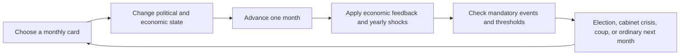

# German Original: Descriptive Plot and Choice Guide

## Purpose and scope

This document explains the German version of *Social Democracy: An Alternate History* as a political story shaped by player decisions. It is intended for understanding what the player is trying to accomplish, why early choices matter later, how major routes overlap, and what kinds of endings those routes produce.

For formulas, exact thresholds, variables, event predicates, implementation defects, and a source-file index, use [GERMAN_ORIGINAL_TECHNICAL_REFERENCE.md](GERMAN_ORIGINAL_TECHNICAL_REFERENCE.md).

The German baseline is repository commit `5e2cfef` (`Establish reproducible upstream baseline`), the last complete German version before the Polish transition. German source references in this guide refer to that commit. The guide describes implemented behavior; it does not certify every historical claim in the game.

The current Polish comparison is included to show which causal patterns may be reusable. It does not approve unresolved Polish historical or design choices.

### Suggested reading paths

- Read **Executive reading**, **How to reason about a choice**, and **Choice-to-consequence map** for the central model.
- Read **Chronological structure** through **How the endings actually work** for the complete campaign arc.
- Read **Worked trajectories** to see how choices combine into recognizable routes.
- Read **Current Polish boundary** and **What the deeper audit adds to the Polish design brief** when planning the PPS version.

## Executive reading: what kind of plot this game has

The German game is not primarily a conventional branching story in which one menu choice sends the player down one permanent path. It is a monthly political state machine. Most choices alter several persistent values, and later scenes check combinations of those values. The plot that the player sees in 1932 or 1933 is therefore often the result of decisions made in 1928–1931.

A useful model is:



The central strategic problem is to keep several systems viable at once:

1. **Electoral strength.** The SPD needs enough support to lead coalitions, protect a minority government, or make an SPD presidential candidacy credible.
2. **Party cohesion.** Every economic and coalition strategy angers at least one SPD faction. Dissent reduces the effectiveness of positive campaigning and, at high levels, causes leaders, unions, or the left wing to leave.
3. **Coalition relations.** Relations with Zentrum, DDP, DVP, and KPD decide whether plausible parliamentary arithmetic can become a working government.
4. **Institutional access.** Being in government is not enough. Specific ministries unlock specific actions. The Justice Ministry is especially important because constitutional reform requires it and a long judicial-reform buildup.
5. **Economic stability.** Unemployment and inflation erode support for the republic and push voters toward anti-democratic parties. Deficits can produce inflation and, at an extreme, a capital strike.
6. **Coercive capacity.** The Reichsbanner, Prussian police, KPD-aligned fighters, and loyal parts of the Reichswehr may decide whether a coup is defeated. Their usefulness depends on earlier organization, relations, government control, and faction unity.
7. **Presidential power.** A friendly president is a major defensive asset, but reforming the office itself is often more durable than relying on a favorable person.

The game rewards preparation across these systems. A player who waits for Hitler's appointment or a coup scene before preparing has usually already lost. Conversely, a player can survive without maximizing the SPD vote if they have built a stable coalition, reduced unemployment, reformed the constitution, and kept a credible democratic defense.

## How to reason about a choice

The third audit of the baseline found that the most useful way to read a choice is across four time horizons. The interface usually emphasizes the immediate change, while the decisive consequence may belong to a later horizon.

| Horizon | What the choice changes | Typical example |
|---|---|---|
| This turn | Resources, support, dissent, relations, budget, or a named decision | Spend party resources to improve relations with Zentrum |
| Next six to twelve months | Card access, cooldowns, cabinet stability, or a timed event response | Secure Justice before a legal crisis; prepare a crisis program before annual unemployment shocks |
| Later crisis | A coalition, presidential endorsement, coup defense, capital strike, or KPD contract | Earlier police reform determines whether a Nazi march becomes a propaganda success or a contained event |
| Final evaluation | Regime survival, employment, social reform, party identity, and achievements | A run can avoid Hitler yet finish with authoritarian government and mass unemployment |

### Decisions that create options

Some actions are valuable because they add capacity or permission rather than because their immediate numbers are large. Ministries unlock verbs. Advisers make specific routes available more reliably. Party relations turn parliamentary arithmetic into a cabinet. Prussian control supplies a second government and police force. Judicial reform makes bans durable and constitutional reform possible. These decisions enlarge the set of responses available in later crises.

### Decisions that close windows

Several important branches are tied to short windows rather than open-ended thresholds:

- the Wittorf chain begins in August–October 1928 and must be carried through foreign policy before the June–August 1929 KPD conference;
- May Day 1929 can preserve or destroy the political trust needed for a later left coalition;
- the 1932 presidential contest occurs in April or May, so resources and party relationships must exist beforehand;
- the June 1932 Altona event and the Prussian Coup from August test police, judicial, and Prussian preparation already completed;
- democratic normalization becomes available only after July 1933 or in 1934, and only if the economic, institutional, and coup conditions have already been stabilized.

The result is path dependence without rigid route selection. The game rarely announces that a path is permanently closed, but a missed date, lost office, dead adviser, broken relationship, or faction split can make the remaining predicate impossible.

### The main route collisions

The deepest choices are conflicts between systems rather than isolated moral dilemmas:

- KPD cooperation helps a United Left, Popular Front, presidential alliance, and armed defense, while many of the same actions damage Zentrum, DDP, or DVP relations.
- WTB can arrest unemployment quickly but may consume budget and coalition tolerance. Moderation is easier to govern through but may be too weak or late. Nationalization produces larger social change while accelerating capital and coup pressure.
- Reichswehr funding raises both raw military strength and loyalty, but can provoke sanctions and empower militarism. Cuts free budget yet leak recruits toward hostile paramilitaries. Reform improves loyalty more efficiently but itself raises coup resistance.
- The People's Party strategy broadens the SPD electorate while risking a left or centrist rupture large enough to erase the gain.
- Emergency compromises can postpone an election or cabinet collapse while reducing democratic legitimacy and making the next crisis harder.

### Two opposing cascades

The collapse cascade is economic contraction → unemployment → declining republican legitimacy → extremist support and armed growth → weaker coalition arithmetic → presidential cabinets and repeated elections → Papen, Schleicher, Hitler, or civil war.

The recovery cascade is early diagnosis → suitable ministries and advisers → executable economic program → lower unemployment → stronger republican legitimacy and electoral support → viable coalition → constitutional and security reform → democratic normalization or a defensible response to a coup.

Individual choices matter because they accelerate one cascade, interrupt the other, or move political capacity between them.

## Chronological structure, 1928–1934

The exact order can vary because of elections, card availability, and triggered crises, but the broad campaign arc is fixed.

| Period | Fixed pressure | Main strategic questions |
|---|---|---|
| Jan–May 1928 | Existing bourgeois-right cabinet falls; Reichstag election is due | Build support and decide what coalition or ministry strategy to pursue |
| Mid–late 1928 | Government formation; Panzerkreuzer and coalition tensions; Wittorf Affair | Govern, tolerate, or oppose; choose ministries; decide whether KPD cooperation is imaginable |
| 1929 | Early downturn, May Day/Blutmai, KPD conference, Young Plan, Black Thursday | Contain street conflict; build crisis-program support before the Depression intensifies |
| 1930 | Severe unemployment jump; possible coalition collapse and new elections | Enact an economic program, manage unemployment insurance, prevent presidential-cabinet drift |
| 1931 | Banking and Depression crisis, Harzburg Front, rising armed forces | Keep the economy and coalition alive; prepare institutional and physical defenses |
| 1932 | Further radicalization, presidential election, Papen/Schleicher danger, Prussian Coup | Replace or constrain Hindenburg, retain Prussia, stop repeated elections and authoritarian cabinets |
| 1933 | Hitler appointment or recovery contest; March on Berlin; global recovery | Survive the decisive regime crisis or qualify for Return to Normalcy |
| 1934 | Austrian crisis flavor; Hindenburg dies; succession election | Convert survival into a stable constitutional settlement or face a final presidential seizure |

The calendar applies major economic shocks even if the player has not drawn the relevant policy cards. The annual scenes and monthly background drift make inaction a decision with consequences.

### The Depression escalator

The baseline begins with unemployment at 8.6 percent, inflation at 2.9, growth at 4.4, and budget capacity at 4. The shocks then intensify:

- January 1929 reduces growth by 4.
- Black Thursday in October 1929 adds unemployment and radical-party support, reduces budget and dues, and worsens growth.
- January 1930 adds 6.8 unemployment, produces sharp deflation, reduces growth, and may reduce budget.
- January 1931 adds 6 unemployment and severe deflation and contraction. A works program offsets much of this; a further program phase offsets more.
- January 1932 adds another large penalty if no works program exists. Stronger programs can produce an improvement instead.
- Mid-1933 global recovery helps, but whether Germany enters democratic normalization depends on the political and economic state the player has preserved.

At the same time, yearly drift moves middle-class and rural voters toward the NSDAP and workers toward the KPD. The drift is stronger without public works. SA and Stahlhelm strength also rises. The player is racing a compound process: unemployment weakens pro-republic sentiment, declining republican legitimacy moves voters toward extremists, and extremist growth strengthens the political and armed threats.

Sources: `source/scenes/events/1929.scene.dry`, `1930.scene.dry`, `1931.scene.dry`, `1932.scene.dry`, `black_thursday.scene.dry`, `source/scenes/post_event.scene.dry`.

### The recovery exit

The late-game democratic off-ramp is `Return to Normalcy`. It requires, in broad terms:

- pro-republic sentiment of at least 50;
- unemployment no higher than 13;
- inflation below 7;
- no Papen or Schleicher chancellorship;
- coup progress below 9.

When it fires, Nazi political and paramilitary strength collapses sharply and more conventional parties recover. This is the game's clearest statement of its theory: fascism is defeated through a combination of economic stabilization, democratic legitimacy, constitutional government, and preventing elite-authoritarian escalation.

The route does not require one exact ideology. It requires the player to arrive at 1933 with the system still functioning.

Source: `source/scenes/events/return_to_normalcy.scene.dry`.

## Elections and government formation

### From votes to coalition arithmetic

After an election, the game calculates several named blocs from represented vote percentages:

| Bloc | Implemented composition |
|---|---|
| Weimar Coalition | SPD + DDP + Zentrum − 3 BVP points; SAPD may join under a KPD-relation condition |
| Grand Coalition | SPD + DDP + Zentrum + DVP |
| Bourgeois coalition | DDP + Zentrum + DVP + Other |
| Center-right | Zentrum + DDP + DVP + Other + DNVP |
| Right | Zentrum + DVP + Other + DNVP |
| Far right | DNVP + NSDAP |
| Left | SPD + KPD + SAPD |
| Popular Front | SPD + KPD + Zentrum + DDP − 3 + SAPD |
| Anti-democratic | KPD + NSDAP + DNVP |
| Neo-Weimar | all represented parties except KPD, DNVP, and NSDAP |

The scene resets the old government state and then presents eligible formations. A mathematical majority is necessary but often insufficient. Relations, party leaders, past failures, the president, the number of inconclusive elections, year, resources, and internal faction strength decide what can actually be formed.

### SPD majority

At `spd_r >= 50`, the SPD controls every ministry and chooses an SPD chancellor: Braun, Breitscheid, Müller, or later Wels depending on availability and mode. This is the cleanest route but difficult to achieve. It removes coalition bargaining while retaining internal-party tradeoffs and the danger of capital strike or coup.

### Weimar Coalition

A Weimar majority puts SPD, Zentrum, and DDP in government. The SPD receives a base five leverage, with another five when the implemented favorable Zentrum leader, Joos, is in place. The player chooses a chancellor and then spends leverage on ministries.

This coalition excludes the DVP and is therefore more permissive for some democratic reforms than the Grand Coalition. It is still vulnerable to conflicts over welfare, economics, policing, and socialist policy.

### Grand Coalition

The Grand Coalition adds the DVP. In the first election, or when the SPD is strong enough, it can be SPD-led. In later elections, a weakened SPD under Hindenburg may face a Zentrum-led cabinet under Brüning.

Low DVP relations can make formation fail. If the SPD cannot lead, it may:

- join Brüning's cabinet;
- tolerate Brüning from outside;
- oppose him;
- under favorable Zentrum leadership, join or tolerate a Wirth unity government;
- attempt to recover DVP support, including an implemented 50/50 branch after Stresemann's death.

The coalition is broad but fragile. It can provide a majority and access to ministries, yet its partners resist labor expansion, nationalization, aggressive fiscal policy, and militant anti-fascism. It often asks the player to choose between immediate cabinet survival and long-run economic or democratic survival.

### A new constitutional coalition

If the ordinary Grand Coalition is below 50 but the broader Neo-Weimar bloc has a majority, the player can spend two resources to form a new coalition of constitutional parties. A Wirth unity government can also become available under favorable Zentrum leadership. These are recovery mechanisms for a fragmented parliament, but they still depend on relationships built earlier.

### United Left

A left majority does not automatically produce a left government. The game checks KPD relations or Conciliator leadership and requires repeated preparation of `communist_coalition`. The final agreement may require three resources, exceptionally strong relations, or a favorable KPD leadership.

The normal success result makes Breitscheid chancellor, gives the SPD every ministry, raises coup progress by 3 and capital-strike progress by 2, and starts the KPD-goals system. If coup progress has already reached 10, civil war begins immediately.

If the SPD left is stronger than the combined reformist and neorevisionist tendency and Braun is president, the player can appoint Thälmann chancellor. That choice immediately drives the game toward civil war. Thus the left-majority route is a demanding coalition-management path, while the communist-chancellor choice is an explicit revolutionary confrontation.

### Popular Front

The Popular Front includes democratic center parties as well as SPD and KPD parliamentary support. It has more complicated gates involving KPD and Zentrum relations and leadership. The player may need four resources, a concession about democracy, or pressure from President Braun. With both favorable party leaders, a special easier formation exists.

Breitscheid becomes chancellor, coup progress rises by 2, and the KPD abstains from ministries. SPD leverage is based on the combined SPD and KPD parliamentary strength. The government then receives KPD policy goals and faces a lower coalition-dissent tolerance than the United Left.

The route broadens parliamentary defense but contains incompatible partners. It is a deliberate high-management coalition rather than a simple “all anti-Nazis cooperate” win button.

### Far-right majority

If DNVP plus NSDAP has at least 50, the outcome depends on timing and the president:

- from 1932 onward, or if the NSDAP has at least 44, a non-Braun president appoints the Nazi leader;
- earlier, Schleicher takes office and schedules another election;
- President Braun can attempt emergency government, another election, or appointment of the Nazis, but a sufficiently strong far right can launch an immediate coup.

### No majority: the collapse ratchet

Under Hindenburg, failure to build a majority starts an escalation:

1. Brüning governs with SPD toleration for up to several inconclusive elections while the anti-democratic bloc remains limited.
2. Further failure or a majority-sized anti-democratic bloc leads to Papen.
3. Another Papen election leads to Schleicher.
4. Another failure under Schleicher leads to Hitler.

Each turn of this ratchet reduces pro-republic sentiment and shifts additional groups toward the NSDAP. Calling another election is therefore not a neutral reroll. It worsens the state that will determine the next election.

President Braun changes this branch. He can support an emergency SPD government, but the government must survive a no-confidence calculation based on party relationships. A far-right bloc of 45 or more instead launches an immediate coup.

### Refusing to govern

The player can refuse government even when a coalition or majority is possible. This produces heavy dissent among reformists, labor, centrists, and neorevisionists, harms support, and often leads to a right-wing government or rapid new election. The route exists to permit ideological refusal, but the code treats abandonment of parliamentary responsibility as a major political failure.

### Ministries are a capability graph

When the SPD leads a coalition, leverage buys portfolios:

| Portfolio | Leverage cost | Main capabilities associated with it |
|---|---:|---|
| Labor | 5 | Labor policy and worker-facing reform |
| Interior | 5 | Police, domestic security, investigation of the far right |
| Finance | 10 | Fiscal policy and parts of economic response |
| Economic | 10 | Economic policy, works programs, economic democracy |
| Justice | 10 | Judiciary reform; later constitutional reform and legal defenses |
| Foreign | 10 | Reparations, European cooperation, external relations |
| Agriculture | 10 | Agricultural and land policy |
| Reichswehr | 15 | Military policy and loyalty |

The cheapest ministries are useful immediately; the expensive ones create distinct strategic routes. Interior plus Prussian control supports policing and the Hitler-deportation route. Justice is the prerequisite for a long constitutional path. Economic and Finance help implement crisis programs. Reichswehr can improve the military side of a future coup calculation.

This is a strong piece of design because cabinet formation is not merely an ending label. The portfolios determine which verbs the player will have for the next government term.

Source for all government branches and ministry costs: `source/scenes/events/election_1928.scene.dry`.

## The main causal routes

The routes below overlap. A good campaign may combine constitutional reform, a works program, anti-Nazi policing, and a Braun presidency. The headings identify clusters of preparation and consequence rather than exclusive classes.

### Parliamentary-democratic survival

This route aims to keep the SPD or a constitutional coalition in office until economic recovery reduces extremist momentum.

The preparation usually consists of:

1. Preserve workable relations with Zentrum and DDP, and often DVP.
2. Win enough support for a Weimar, Grand, or broader constitutional majority.
3. Choose ministries that match the intended policy route.
4. Reduce unemployment before repeated elections and emergency rule destroy pro-republic sentiment.
5. Avoid coalition-dissent thresholds or enact a constructive vote of no confidence.
6. Prevent Papen and Schleicher from becoming the normal solution to parliamentary deadlock.
7. Reach the Return to Normalcy conditions in 1933.

This path is less dramatic than a coup victory but strategically demanding. The central danger is accepting compromises that preserve the cabinet this month while allowing unemployment and republican legitimacy to deteriorate. A cabinet can survive and still lose the regime.

The strongest version combines a workable coalition with constitutional reform. The weaker version relies on good relationships and economic performance alone. If those fail, each no-confidence crisis or inconclusive election moves the game closer to presidential cabinets.

### WTB employment route

The WTB program is the labor faction's crisis answer. The player first needs Black Thursday to occur and crisis urgency to open the crisis-program card. Supporting labor raises `wtb_support`; at 3, the party adopts the program. Adoption strengthens labor, lowers labor and reformist dissent, but angers centrists and somewhat the left.

Implementation checks whether the state can pay the required budget cost. A funded stage avoids additional cabinet and business alarm; a deficit-funded stage adds both coalition dissent and capital-strike pressure, and historical mode or a Brüning chancellorship can add still more coalition dissent. Its benefit is speed: it directly offsets unemployment shocks, increases growth and pro-republic sentiment, and improves SPD support among workers and unemployed people. Later program stages can recover part of the fiscal cost.

The causal chain is:

```text
early crisis recognition
→ spend several scarce turns building WTB support
→ secure the ministries and budget needed to implement it
→ absorb deficit and coalition pressure
→ reduce 1931–1932 unemployment shocks
→ preserve pro-republic sentiment and SPD support
→ weaken the electoral and paramilitary growth of the extremes
→ qualify for democratic recovery
```

The route can fail in four distinct ways:

- the player begins program debate too late;
- the SPD is outside government when implementation is needed;
- coalition concessions dilute or block the program;
- deficit, inflation, or capital-strike pressure creates a second crisis.

The route is therefore not simply “choose Keynesianism and win.” It is a timing and governing-capacity test. Sources: `source/scenes/party_affairs/crisis_program.scene.dry`, `source/scenes/government_affairs/economic_policy.scene.dry`, annual event files, `source/scenes/post_event.scene.dry`.

### Moderate recovery route

The moderate plan requires only two support steps and strengthens the reformist faction. It reduces unemployment and improves growth more gently, helps middle-class and rural support, improves Zentrum relations, and can reduce coalition dissent when unemployment is high.

Its advantages are lower political and fiscal risk. Its weakness is that the Depression shocks are large. If adopted late or implemented weakly, the smaller effects may not keep unemployment below the thresholds that erode the republic and feed the NSDAP.

The moderate route is best understood as a coalition-compatible strategy. Its success depends on early adoption and complementary actions. A player who assumes moderation is automatically safe may arrive in 1932 with a stable cabinet but an unstable society.

### Radical nationalization route

Supporting the left raises `nationalization_support`; at 3 the SPD adopts nationalization as its economic plan. This strengthens the left, improves KPD relations, and immediately raises coup progress. Implementation can help workers and unemployed people, create works activity, and advance social ownership.

The confrontation risks are explicit:

- ordinary adoption and implementation anger reformists, neorevisionists, labor, or coalition partners;
- works councils and economic democracy can add capital-strike pressure;
- uncompensated nationalization and factory takeovers produce much larger capital-strike and coup increases;
- a capital strike causes a large economic and electoral collapse before the player chooses a response;
- a left government already begins with extra coup and capital-strike pressure.

The route can still succeed if the player has prepared political unity, coercive defense, KPD relations, and sufficient governing control. It is designed as a transformation under counter-mobilization. It should not be evaluated only by the immediate support gains displayed on the policy card.

### Centrist inaction

The crisis-program card also allows the player to support the centrist tendency or defer. This preserves the center in the short term but angers labor and the left and does not create an economic plan. Annual shocks then occur with little or no offset.

The consequence is indirect and severe: unemployment rises, pro-republic sentiment falls, extremist parties gain, the coalition becomes harder to reconstruct after elections, and presidential government becomes more likely. The game treats inaction as a plot branch generated by the ordinary economic update rather than a special “failure” scene.

### KPD rapprochement, United Left, and Popular Front

The KPD route has several stages, each of which can be missed.

#### Stage 1: create a relationship

The player uses interparty diplomacy, left-wing positioning, certain advisers, and event choices to raise `kpd_relation` from its low starting value. This often costs relations with bourgeois partners or creates reformist dissent.

#### Stage 2: change the KPD's internal environment

The 1928 Wittorf Affair and 1929 KPD conference can help the Conciliators replace the harder leadership. Favorable resolution depends on strong relations, secrecy or intervention choices, left strength, and in some cases having Paul Levi or Kurt Rosenfeld available. Conciliator leadership makes later cooperation and extensions easier.

#### Stage 3: avoid destroying trust on May Day

The May Day confrontation is a pivotal test:

- banning the demonstration destroys KPD relations, reduces coalition willingness, leads to Blutmai, and moves workers away from the SPD;
- allowing it improves relations but can strengthen the KPD and anger bourgeois partners;
- joining it requires good relations and substantially advances both KPD cooperation and broader communist-coalition preparation, while also contributing to right-wing mobilization.

This is a good example of a choice whose gains and risks sit on different axes. Cooperation may improve the future parliamentary left while worsening coalition dissent and street polarization.

#### Stage 4: prepare coalition willingness

A parliamentary left majority is insufficient. `communist_coalition` must be built through repeated choices, and the relationship or Conciliator thresholds must be met. The player may also need resources at the election.

#### Stage 5: fulfill KPD government goals

Once a left or Popular Front government forms, the KPD supplies a policy list. It can include welfare, land reform, nationalization, progressive tax, labor reform, military reduction, and later foreign policy. The government receives a timer, generally between 12 and 24 months depending on relations, leadership, and institutional reform.

The player must complete all required goals. Partial compliance earns a short extension only under favorable conditions. Failure harms relations and support and leads toward a KPD-backed vote of no confidence. Satisfying every goal secures coalition survival for the term.

This turns the coalition from an electoral reward into a governing contract. The player must have prepared ministries and policies before formation; otherwise the timer can be impossible.

#### Stage 6: manage KPD coalition dissent

KPD coalition dissent triggers a crisis at 3 in a Popular Front or 4 in a United Left. The SPD may spend resources to reduce it, accept Thälmann as chancellor and face civil war, replace the left coalition with a centrist one, or call an election.

WTB and moderate programs can themselves increase KPD dissatisfaction because the game frames them as preserving capitalism. Nationalization fits the KPD goal set more naturally.

Sources: `source/scenes/events/wittorf_affair.scene.dry`, `kpd_conference.scene.dry`, `blutmai.scene.dry`, `kpd_goals.scene.dry`, `kpd_goals_2.scene.dry`, `kpd_ultimatum.scene.dry`, `kpd_vote_of_no_confidence.scene.dry`, `source/scenes/party_affairs/inter_party_relationships.scene.dry`.

### People's Party route

Neorevisionism emerges as a response to the Nazi threat. It supports a broader democratic mass-party strategy, the Iron Front, and constitutional reform. After building enough support, the SPD can attempt to become a People's Party.

The smoother adoption condition compares reformist plus neorevisionist strength with left plus center strength and expects adequate public support for the proposal. Adoption deliberately exchanges part of the SPD's worker orientation for stronger appeal among rural, middle-class, and Catholic voters. It also improves relations with bourgeois-democratic parties.

Forcing the change over internal opposition creates very high dissent in the left and center. Because dissent reduces future support gains, the immediate demographic expansion can be undermined by the party rupture it causes.

This route can help form broader constitutional coalitions and weaken the NSDAP among non-worker groups. Its design question is whether the SPD can change its social coalition without losing the organization and identity that make it effective.

Sources: `source/scenes/party_affairs/neorevisionism.scene.dry`, `peoples_party.scene.dry`, `peoples_party_campaigning.scene.dry`.

### Constitutional-reform route

Constitutional reform is among the most preparation-heavy routes in the game. The card requires:

- the SPD to be in government;
- the Justice Ministry to be controlled by the SPD;
- at least four levels of judicial reform;
- neorevisionism;
- an eligible Weimar, SPD-majority, United Left, or Popular Front government;
- no constitutional-reform cooldown;
- fewer than three completed reforms.

Each reform takes a monthly action and starts a 12-month cooldown. A referendum normally needs 51 percent calculated support; if pro-republic sentiment is below 65, it needs 60 percent. The three central amendments are:

1. **A five-percent electoral threshold.** This removes small parties from future representation and redistributes much of their support. It can simplify coalition arithmetic but angers partners and part of the SPD.
2. **A constructive vote of no confidence.** This prevents the ordinary destructive no-confidence mechanism unless an alternative majority exists. It is the most direct protection against coalition-dissent collapse.
3. **Reduced presidential powers.** This blocks or changes the Papen appointment, Prussian Coup, emergency-government, and later presidential-seizure branches.

The route also interacts with court defenses. Judicial reform can keep paramilitary bans in force, enable land reform and uncompensated nationalization, and allow a constitutional defense when the far right attempts a coup.

This is a classic long-lead route. Choosing Justice during a 1928 coalition negotiation can decide whether the player has a legal answer in 1932–1934. The ministry seems less immediately useful than Labor or Interior, but it changes the shape of the endgame.

Source: `source/scenes/government_affairs/constitutional_reform.scene.dry`, `judiciary.scene.dry`, and the coup and presidential events.

### Deport-Hitler route

The deportation action requires:

- Nazi urgency of at least 3;
- Hitler not already deported;
- Papen or Schleicher not currently governing;
- at least two far-right investigations.

The wider action chain also depends on control of Prussia, an effective police apparatus, and judicial reform. If SA strength is below 200, deportation succeeds automatically. At higher strength the game compares police and Reichsbanner power with the SA.

Success halves SA strength, reduces NSDAP support in all demographic groups, lowers coup progress, and replaces Hitler with Goebbels as party leader. Failure raises Nazi support and coup progress and strengthens the SA.

The route is powerful but not an instant elimination of fascism. The ending code explicitly allows a Nazi outcome despite Hitler's deportation, now associated with Goebbels or Göring. The player still needs economic, parliamentary, and constitutional success.

Sources: `source/scenes/government_affairs/police.scene.dry`, `deport_hitler.scene.dry`, `source/scenes/game_over.scene.dry`.

### Reichsbanner and Iron Front route

Recognizing the Nazi threat raises urgency and can unlock neorevisionism and Iron Front organization. Rallies and organization increase pro-republic sentiment, electoral reach, or defensive strength. Direct Reichsbanner investment raises membership and militancy.

Militancy is double-edged. It makes the organization more useful in a coup or civil war, but high militancy can make Zentrum and DDP threaten to leave the coalition. Under sufficient street strife and good relations, the SPD can justify the force; otherwise it may have to halve militancy to retain partners.

Street-fighting choices can build arms and training, but the scene also strengthens the SA. Choosing violence therefore changes both sides of the later military comparison. Choosing peace preserves political moderation while leaving less defense if institutions fail.

The best use of this route is often deterrence combined with institutional action. A strong Reichsbanner by itself does not reduce unemployment, preserve parliamentary majorities, or control the police.

Sources: `source/scenes/party_affairs/confronting_nazis.scene.dry`, `iron_front.scene.dry`, `reichsbanner.scene.dry`, `streetfighting.scene.dry`, `source/scenes/events/reichsbanner_zentrum.scene.dry`.

### Brüning toleration and austerity route

When no coalition majority exists, the SPD may tolerate Brüning from outside government. This avoids immediate far-right rule and keeps some constitutional continuity, but the SPD lacks ministerial control and shares responsibility for emergency austerity.

The unemployment-insurance and emergency-cuts crises make the tradeoff concrete:

- tolerate benefit cuts and lose worker and unemployed support to KPD and NSDAP while weakening welfare and pro-republic sentiment;
- end toleration and risk another election;
- where available, use resources or relationships to soften the outcome.

The game models toleration as borrowed time. It can be useful if the player is waiting for recovery, a stronger electoral position, or institutional preparation. Repeated reliance becomes the no-majority ratchet that eventually produces Papen, Schleicher, and Hitler.

Sources: `source/scenes/government_affairs/dealing_with_toleration.scene.dry`, `source/scenes/events/emergency_cuts.scene.dry`, `unemployment_insurance_1.scene.dry`, `election_1928.scene.dry`.

### Schleicher's authoritarian survival route

Schleicher proposes suspending the Reichstag while enacting a works program. Acceptance costs ten pro-republic points, creates major faction dissent, and damages SPD support. The parliamentary support test can count the SPD, Zentrum at sufficiently good relations, DVP/Other under favorable DVP relations, and in rare circumstances DNVP.

If the scheme succeeds, the next election is delayed for 13 months and Hitler's immediate appointment is blocked. Economically it may reduce pressure. Constitutionally it is an authoritarian outcome: the SPD has helped replace parliamentary government with executive bargaining.

This is not coded as immediate defeat, because it can stop Hitler and permit survival to the end. The ending text, however, treats Schleicher as paving the way for Hitler or a similar authoritarian future. It is a compromised survival branch.

Source: `source/scenes/events/schleichers_schemes.scene.dry`, `source/scenes/game_over.scene.dry`.

### Capital-strike route

Capital-strike progress accumulates from aggressive taxation, works councils, economic democracy, nationalization, and some left-coalition choices. At progress 6–9, business-confidence warnings allow concessions. At 10, or when the state budget falls to −5 while the SPD governs, the capital strike triggers.

The event applies its main damage immediately on arrival:

- unemployment rises by 5;
- growth falls by 4;
- SPD worker and unemployed support is multiplied by 0.7;
- SPD middle-class and rural support falls sharply;
- pro-republic sentiment falls by 15;
- Zentrum and DVP relations fall;
- Nazi support rises across demographic groups.

Only after that shock does the player choose a response:

- factory seizure recovers some employment and support but raises coup progress by 6 and coalition dissent;
- capital controls recover a smaller amount of employment and growth;
- propaganda restores political support at a resource cost;
- doing nothing leaves the damage intact.

The lesson is that the threshold must be managed before the event. The response cannot cancel the initiating collapse.

Source: `source/scenes/events/businesses_lose_confidence.scene.dry`, `capital_strike.scene.dry`, fiscal and economic-democracy cards.

## Government crises as threshold machines

### Coalition dissent

Coalition dissent is separate from SPD faction dissent. It records how far government partners have been pushed by policy. The rough crisis thresholds are:

- 3 for Grand Coalition, Popular Front, or minority arrangements;
- 4 for a Weimar Coalition;
- special thresholds and logic for the left coalition.

Once crossed, a vote-of-no-confidence event becomes eligible unless the constitution has been reformed. The player may be able to preserve the government by surrendering Prussian control, accepting austerity, spending three resources, or replacing the coalition with a KPD-supported left or Popular Front arrangement. Otherwise an election is scheduled and both republican legitimacy and SPD support suffer.

This makes individual policy costs cumulative. One concession may be affordable; several reforms that each add one dissent can abruptly end the cabinet.

### Unemployment insurance as the model coalition dilemma

The unemployment-insurance conflict is a concentrated version of the whole game:

- **Cut benefits:** preserve employer and conservative preferences, but lose SPD base support, expand KPD/NSDAP appeal, lower welfare, raise unemployment, and reduce republican legitimacy.
- **Raise employer contributions:** defend the base and social state, but raise capital-strike pressure and push Grand Coalition dissent to at least 3.
- **Balance the burden:** accept smaller base losses and smaller coalition damage.

No choice is free. The meaningful question is which reserve the player has prepared: public support, coalition tolerance, resources, constitutional protection, or economic space.

### Why a constructive vote changes the whole game

Without constitutional reform, coalition dissent can let an alliance of parties remove the cabinet even when those parties cannot agree on a replacement. With a constructive vote, this destructive coalition is insufficient. The amendment does not make partners happy or remove economic pressure, but it changes anger from an automatic government-ending event into a political problem the cabinet may survive.

For the Polish adaptation, this demonstrates how one institutional rule can alter many later event predicates without needing bespoke text in every crisis.

## Presidential politics

### The 1932 presidential election

The election is a direct popular contest with two rounds. Party vote shares supply the blocs; relations and resources decide endorsements. The SPD initially chooses among three strategies.

#### Support Hindenburg

This is the default and cheapest anti-Hitler strategy. It can stop an immediate Nazi presidential victory, but preserves the president whose emergency powers enable Brüning, Papen, Schleicher, dismissal of democratic cabinets, and the Prussian Coup. The choice buys short-term electoral coordination at the cost of executive vulnerability.

#### Run Otto Braun

Running Braun costs two resources. The SPD can then seek support from Zentrum, KPD, and DVP. Endorsement depends on party relationships, relative electoral strength, and sometimes further resource expenditure. A Braun victory raises democratic and SPD strength and transforms several later branches:

- an emergency SPD government becomes possible;
- more of the Reichswehr can count on the republican side under the right conditions;
- Hindenburg-specific Papen and Prussian-Coup branches are blocked;
- a no-majority parliament still creates risk, because Braun's government can face a no-confidence vote or a direct far-right coup.

This is a costly alliance-building route whose feasibility is decided before 1932.

#### Support Ernst Thälmann

This requires KPD relations of at least 50 and a left faction stronger than the reformists. It causes major losses among internal moderates and democratic allies. A Thälmann victory provokes an immediate right-wing coup and civil war. The game treats it as a revolutionary polarization route.

#### Ballot resolution

The first round requires a majority; the second uses a plurality. If Braun or Thälmann leads strongly enough, the Nazi candidate can withdraw and endorse Hindenburg. Hitler is replaced by Göring if Hitler has been deported. A Hitler or Göring victory produces Nazi seizure of power.

Source: `source/scenes/events/presidential_election_1932.scene.dry`.

### Why reducing presidential powers can be stronger than electing Braun

Braun's presidency changes the occupant of a dangerous institution. Reducing presidential powers changes the institution. The latter blocks multiple chains regardless of the individual winner and can contain an extremist elected in 1934.

The strongest democratic route can do both, but the distinction is important for design: personal control creates contingent protection; institutional reform creates structural protection.

### Hindenburg's death and the 1934 succession

Hindenburg dies in July 1934 if still president. The succession event assembles a wide candidate field whose availability depends on political development:

- unity or establishment candidates such as Eckener, Adenauer, or Gessler;
- KPD candidates Thälmann or, with Conciliator development, Münzenberg;
- SPD candidates Braun, Schumacher, or Juchacz, with different prerequisites;
- cultural figures including Einstein, Thomas Mann, or Ossietzky when presidential powers are reduced, pro-republic sentiment is high, pacifism has advanced, and additional candidate conditions are met.

The candidates aggregate current party vote shares. Relationships and resources determine party endorsements. The second round consolidates far-right and bourgeois blocs and allows further bargaining or changed endorsements.

Outcomes divide into several families:

- a democratic, SPD, unity, or cultural winner weakens the Nazi front and proceeds to the normal end;
- a far-right winner installs Hitler as chancellor or otherwise initiates Nazi control;
- if presidential powers were reduced, the player may resist an extremist president through a referendum or armed defense;
- a Thälmann victory under unreformed presidential power causes civil war, while reduced power can contain him;
- Münzenberg does not trigger the same coup response.

The referendum against an extremist use of the presidency combines SPD, DDP, Zentrum, and sometimes KPD or DVP support, then adjusts for SA and Reichsbanner pressure. The late presidential result is thus a summary test of electoral support, alliances, constitutional reform, and organized force.

Sources: `source/scenes/events/death_of_hindenburg_president.scene.dry`, `death_of_hindenburg_normal.scene.dry`, `1934.scene.dry`.

## From parliamentary breakdown to dictatorship

### Papen

Papen can replace Brüning or Wirth after May 1932 when Hindenburg remains president, the SPD is outside government, and parliamentary or social conditions have deteriorated. The trigger can be supported by a failed coalition, the NSDAP becoming the largest party, high street strife, an anti-democratic majority, or extreme unemployment. Reduced presidential powers block this route.

His arrival does structural damage:

- two levels of judicial reform are erased;
- the cabinet becomes independent of parliamentary parties;
- a snap election is scheduled;
- the SA is legalized;
- pro-republic sentiment falls;
- control of ministries passes to independents.

Papen is therefore more than a different chancellor portrait. He removes the institutional tools the player spent years developing and accelerates the far right.

### The Prussian Coup

The Prussian Coup can occur under Papen or Schleicher, with Hindenburg as president, after the relevant 1932 date, while the SPD is outside the national government, Prussia remains SPD-controlled, and presidential powers remain unreformed.

The player may surrender or resist. Surrender loses Prussia, removes 1,000 Reichsbanner members, halves Reichsbanner militancy, and damages support. Resistance requires at least 200 raw Reichsbanner power to be offered and compares the republican forces with a coalition that includes hostile Reichswehr strength. Defeat can lead to civil war or permanent loss of the most important regional institutional base.

The chain reveals why Prussian control matters throughout the game. It provides police power, a platform for democratic administration, and part of the armed defense. It is also vulnerable if national constitutional reform is neglected.

Source: `source/scenes/events/prussian_coup.scene.dry`.

### Schleicher

Schleicher follows another failed Papen election or can appear in other no-majority branches. His works-and-suspension scheme offers a last elite-managed alternative to Hitler. Rejecting or failing the scheme returns the game to the no-majority sequence. Another failed election under Schleicher sends the game directly to Hitler's chancellorship.

### Hitler as chancellor

The dedicated appointment condition broadly requires:

- 1933 or later;
- Hindenburg as president;
- Papen or Schleicher as chancellor;
- the SPD outside government;
- the NSDAP as the largest party;
- Hitler not deported;
- unreformed presidential power;
- no successful Schleicher scheme.

When the appointment happens, the player can accept the end or fight, in which case the game moves to civil war. By this point ordinary parliamentary choices have disappeared because the state variables required for appointment encode the collapse of the parliamentary route.

Sources: `source/scenes/events/hitler_chancellor.scene.dry`, `hitler_takes_power.scene.dry`.

### March on Berlin

The March on Berlin can trigger when the SPD governs, coup progress is at least 10, the year is after 1930, and the major far-right paramilitaries are legal. A second path can trigger after February 1933 when normalized NSDAP plus DNVP support reaches 50.

The immediate defense compares:

- effective Reichsbanner power after the party-dissent penalty;
- Prussian police if the SPD still controls Prussia;
- a general-strike contribution based on worker support, unemployment, and party unity;
- loyal Reichswehr strength, especially under a Braun presidency and SPD government;

against SA and Stahlhelm power.

If the democratic force exceeds the attackers, an initial confrontation can produce a major victory; a later or weaker success produces a lesser victory. Otherwise resistance becomes civil war. Judicial reform can unlock a court-centered response, and presidential or electoral conditions may permit a new-election response, but these also rely on preparation.

Source: `source/scenes/events/march_on_berlin.scene.dry`.

## Civil war: the final accounting of earlier choices

The civil-war calculation is one of the most important places where visible choice and implemented causality differ.

### Power is calculated on entry

As soon as the civil-war scene opens, it calculates the two sides.

The republican side can include:

- Reichsbanner power, reduced by SPD dissent;
- Prussian police if Prussia remains controlled;
- loyal Reichswehr strength, with full value only under favorable presidency and government conditions and reduced value otherwise;
- full RFB power if KPD relations are at least 60, or half at relations of at least 45;
- general-strike power derived from SPD and KPD worker support, unemployment, and SPD dissent.

The opposing side combines:

- SA power;
- Stahlhelm power;
- the hostile share of the Reichswehr.

The scene immediately sets one of three outcomes:

- **Republican victory** if allied power is more than 110 percent of enemy power;
- **Long war** if the allied/enemy ratio is at least 0.6 but below the victory threshold;
- **Total defeat** below that.

### The later war prompts do not change the result

The player is then asked to appeal to the army, seek KPD help, call a general strike, or mobilize the police. Those prompts count how many war choices have been inspected and reveal the strengths already included in the calculation. They do not add force or recalculate the result.

This means the real civil-war decisions occurred earlier:

- whether the Reichsbanner was built and made effective;
- whether the SPD remained united;
- whether KPD relations reached 45 or 60;
- whether Prussia and its police were retained;
- whether police and army loyalty were improved;
- whether Braun became president;
- whether SA and Stahlhelm growth was constrained.

Foreign intervention after a long-war result also adds narrative resolution but does not recalculate the initial outcome.

For the Polish iteration, the delayed accounting is valuable, but the presentation should state that the player is activating previously prepared assets or should actually recalculate when a new commitment is made. Otherwise the interface implies agency that the code does not provide.

Source: `source/scenes/events/civil_war.scene.dry`.

## How the endings actually work

### There is a terminal date and there are early terminal crises

The normal campaign reaches Hindenburg's death and the 1934 succession, then routes through `1934_end` and `game_over_1934` to the ending menu. Hitler's undisputed takeover, a decisive civil-war defeat, or related crises can end the game earlier.

The campaign does not select one exclusive epilogue that summarizes everything. `game_over.scene.dry` presents every ending card whose condition is true. The player can therefore receive several simultaneous descriptions of the same state: one for the regime, another for the president, another for government, another for unemployment, and another for ideological or social reform.

### Regime and conflict endings

The main regime lenses include:

- **Hitler in undisputed control:** Hitler is president or chancellor and there was either total defeat or no civil war.
- **Hitler in power but still opposed:** Hitler holds office during a long civil war.
- **Hitler does not yet control Germany:** neither Hitler condition holds and the player is not in the excluded defeat state. The text may still warn that Papen, Schleicher, Brüning, or defeat in the Prussian Coup points toward future authoritarianism.
- **Nazi power despite Hitler's deportation:** Goebbels or Göring can head a Nazi outcome.
- **Civil war won:** `republic_victory == 1`.
- **Civil war lost:** the total-defeat condition.
- **Germany gripped by civil war:** `long_war == 1`.

Avoid reading “Hitler does not yet control Germany” as a clean democratic victory. The text is deliberately contingent. A Papen or Schleicher government can qualify while leaving Germany on an authoritarian path.

### Presidential and government endings

Separate cards recognize outcomes such as:

- Otto Braun victorious;
- Kurt Schumacher victorious;
- Marie Juchacz as president;
- Albert Einstein as president;
- the SPD still governing under an SPD chancellor;
- communist victory;
- an SPD emergency government.

These cards describe who holds office, not the entire health of the regime. The same run can show an SPD-government card and an economic card, or a presidential card and a socialization card.

There is a likely precedence issue in the communist-ending predicate:

```text
chancellor_party == "KPD" or president == "Thälmann" and no defeat and no long war
```

With ordinary boolean precedence, a KPD chancellor qualifies regardless of the defeat/long-war checks, while a Thälmann presidency does not. This should be treated as a bug candidate rather than a deliberate distinction.

### Economic endings

The ending menu separately recognizes:

- a works program;
- unemployment reduced below 10;
- unemployment between 10 and 20;
- unemployment still at 20 or above.

These cards show why survival and economic victory are not identical. A player may prevent Hitler but finish with mass unemployment, or achieve a dramatic economic recovery under a politically compromised government.

### Ideological and social-program endings

Other cards recognize:

- transformation into a People's Party;
- at least two levels of nationalization;
- at least three levels of works councils;
- creation of a European Union.

These are records of the political project pursued during survival. They allow the ending to answer not only “did democracy live?” but “what kind of social democracy emerged?”

### Achievements form a more detailed hidden evaluation

The achievements record is more granular than the visible ending-card structure. It recognizes:

- survival at different difficulties;
- specific coalitions, including sustaining a left or Popular Front government;
- class-pure or broad demographic electoral strategies;
- economic miracle conditions after 1932, including unemployment below the opening 8.6, positive budget, and inflation below 5;
- women's and homosexual rights;
- Heidelberg Program and ideological outcomes;
- constitutional amendments;
- Hitler's deportation;
- special combinations of president and constitutional reform;
- long civil war or victory;
- other policy and foreign-policy achievements.

The 1934 transition also awards a demanding “Brothers to Sun” combination when the campaign ends on normal or higher difficulty with an SPD president, no Hitler, unemployment below 20, no civil war, Hitler deported, substantial reparations progress, and strong women's-rights reform. A separate “Free market” recognition exists for finishing without adopting an economic plan.

The game therefore has two evaluation layers:

1. ending cards explain several dimensions of the final world;
2. achievements recognize difficult routes and combinations.

Sources: `source/scenes/events/1934_end.scene.dry`, `game_over_1934.scene.dry`, `source/scenes/game_over.scene.dry`.

## Choice-to-consequence map

The following table condenses the major delayed connections.

| Earlier decision | State changed | Later consequence |
|---|---|---|
| Campaign within a demographic | Party preference in that group | National polling, then the next election result |
| Change party ideology | Faction strength and dissent; policy support | Which programs and candidates can pass; how effective later campaigning and defense are |
| Improve Zentrum/DDP/DVP relations | Interparty relations | Coalition formation, no-confidence behavior, presidential endorsements |
| Improve KPD relations | KPD relation and coalition willingness | Conciliator route, left/Popular Front, KPD goals, RFB support in civil war |
| Ban or allow May Day | KPD relation, communist coalition, partner dissent, street forces | Feasibility of left cooperation and strength of later conflict |
| Choose Justice Ministry | Portfolio control | Judiciary buildup, constitution, stable bans, land reform, court defense |
| Choose Interior Ministry | Portfolio control | Police loyalty, far-right investigation, Hitler deportation |
| Choose Economic/Finance | Portfolio control and fiscal tools | Ability to implement crisis plan before annual shocks |
| Choose Reichswehr Ministry | Military-policy access | Army loyalty in coup and civil-war calculations |
| Support WTB | WTB support, faction balance | Strong employment program, fiscal/coalition pressure, better recovery chance |
| Support moderate plan | Moderate support and reformist strength | Faster adoption, smaller recovery, easier coalition management |
| Support nationalization | Left strength, coup pressure | Socialist program, capital strike, stronger counterrevolution risk |
| Cut welfare | Budget/coalition relief; base and republic damage | Easier immediate cabinet survival, worse radicalization and elections |
| Tax wealth/business aggressively | Budget and social support; capital-strike progress | More fiscal capacity, possible economic sabotage crisis |
| Build works councils | Worker power and policy efficiency; capital pressure | Cheaper/deeper socialization, higher business confrontation |
| Build Reichsbanner | Strength and militancy | Better coup defense; possible coalition rupture over militancy |
| Preserve Prussia | Regional control and police | Deportation capacity, coup defense, later target of Prussian Coup |
| Elect Braun | Presidency, legitimacy, army alignment | Blocks Hindenburg chain, enables emergency defense, alters coup balance |
| Reduce presidential powers | Constitutional flag | Blocks Papen/Prussian Coup branches and contains later extremist president |
| Enact constructive no confidence | Constitutional flag | Coalition dissent no longer automatically ends a cabinet |
| Repeat elections without a majority | election counters, legitimacy and voter shifts | Brüning → Papen → Schleicher → Hitler escalation |
| Allow budget to reach −5 | Budget threshold | Immediate capital strike while SPD governs |
| Let coup progress reach 10 | Coup threshold | March on Berlin or immediate civil war on radical government formation |
| Keep unemployment above 15/30 | Economy | Monthly republican-legitimacy loss and extremist growth |
| Reach recovery thresholds by 1933 | economy, legitimacy, government, coup | Return to Normalcy and Nazi collapse |

## Worked trajectories

These are causal examples, not guaranteed walkthroughs. Random card access, election results, event order, and difficulty can alter them.

### Institutional social-democratic victory

1. Campaign enough to lead a Weimar or Grand Coalition in 1928.
2. Preserve Zentrum and DDP relations while obtaining Justice and Economic or Finance.
3. Begin judiciary reform early; four levels are needed before constitutional reform becomes available.
4. Recognize the Nazi threat and develop neorevisionism.
5. Adopt WTB or a sufficiently early moderate program, then implement enough phases to blunt the 1931–1932 shocks.
6. Pass the constructive vote and reduce presidential powers when referendum support is available.
7. Keep coalition dissent below its threshold; use resources for a crisis only when necessary.
8. Deport Hitler if Interior, police, Prussian, and judiciary preparation also permits it.
9. Enter 1933 with unemployment at 13 or below, pro-republic at 50 or above, inflation below 7, no Papen/Schleicher cabinet, and coup progress below 9.
10. Trigger Return to Normalcy; contest the 1934 succession from a much stronger democratic position.

This route wins by preventing the late crisis from acquiring its prerequisites.

### Braun defensive presidency

1. Build SPD support and preserve resources before 1932.
2. Improve relations with Zentrum and at least one of KPD or DVP.
3. Pay to run Braun.
4. Use those relationships and further resources to assemble enough endorsements.
5. Win the second-round plurality.
6. If parliament later lacks a majority, use Braun's authority to support an SPD emergency cabinet.
7. Keep far-right parliamentary strength below the immediate-coup threshold and relations high enough to survive no confidence.
8. Combine the presidency with Prussian control, Reichsbanner strength, and army loyalty so that an attempted coup can be defeated.

The presidency is not a substitute for a parliamentary or military base. If the far right is already too strong, Braun's emergency government simply moves the conflict directly to a coup.

### Popular Front survives its term

1. Raise KPD relations early and avoid Blutmai.
2. Help the Conciliators where possible and build `communist_coalition` repeatedly.
3. Preserve workable Zentrum and DDP relations rather than treating every centrist party as an enemy.
4. Build a parliamentary Popular Front majority.
5. Hold enough resources or elect Braun to overcome the final formation barrier.
6. At ministry allocation, secure the portfolios required by likely KPD goals.
7. Pursue those goals immediately; the timer is unforgiving.
8. Avoid moderate or WTB choices that add KPD coalition dissent unless there is enough room to compensate.
9. Keep coup progress below 10 at formation or be ready for civil war.
10. Complete every required goal to secure the coalition for the term.

The route is won before coalition formation by ensuring that the promised program is executable.

### Radical transformation and republican victory in civil war

1. Strengthen the SPD left and build support for nationalization.
2. Keep overall party dissent low enough that the Reichsbanner and strike remain effective.
3. Build KPD relations to at least 60 for full RFB participation.
4. Retain Prussia and improve police loyalty.
5. Expand and train the Reichsbanner.
6. If possible, elect Braun and improve Reichswehr loyalty.
7. Adopt and implement nationalization, accepting that coup and capital-strike pressure will rise.
8. When the capital strike or far-right coup arrives, use prepared social and coercive strength rather than expecting the crisis screen to create it.
9. Enter civil war with allied power above 110 percent of the enemy total.

This is the most confrontational route. It can deliver both socialization and republican victory, but every preparation consumes time that could have gone to electoral or economic stabilization.

### Historical-style collapse through toleration

1. Fail to secure a durable majority after the initial coalition.
2. Tolerate Brüning to avoid an immediate election or right cabinet.
3. Accept emergency cuts to preserve toleration.
4. Lose worker and unemployed support while unemployment weakens the republic.
5. Enter repeated elections with a larger NSDAP and weaker democratic bloc.
6. Exhaust the limited Brüning no-majority cycle.
7. Hindenburg appoints Papen; judicial progress is rolled back and the SA is legalized.
8. Lose Prussia or fail to resist the coup.
9. Another election produces Schleicher.
10. Reject or fail Schleicher's scheme; the next no-majority result appoints Hitler.
11. Surrender for an immediate Nazi ending or fight with whatever forces earlier policy left available.

No single choice here says “appoint Hitler.” The ending emerges from repeated short-term postponements and degrading state.

### Authoritarian anti-Hitler compromise

1. Reach Schleicher after parliamentary failure.
2. Accept the Reichstag suspension and works proposal.
3. Assemble the needed support from SPD plus cooperative center and conservative parties.
4. Delay the next election and block immediate Hitler appointment.
5. Finish without Hitler but under an authoritarian chancellor and with lower pro-republic sentiment and internal SPD cohesion.

The ending may say Hitler does not control Germany while warning that Schleicher's system creates a dangerous future. This is survival without democratic restoration.

### Apparent resistance prepared too late

1. Spend the early game almost entirely on polling and immediate support.
2. Neglect KPD relations, Prussian police, Reichsbanner militancy, army loyalty, and Justice reform.
3. Win respectable parliamentary results but fail to form stable coalitions as relationships deteriorate.
4. Allow Papen or a far-right coup to appear.
5. Choose every defiant option in the coup and civil-war prose.
6. Lose because the civil-war scene calculated weak allied power before those options appeared.

This trajectory explains why a player can feel that brave late choices “did nothing.” They are acknowledgements of previous preparation, not fresh inputs to the result.

## What the implementation communicates well

### It turns political strategy into connected systems

Economic decisions affect unemployment, unemployment affects legitimacy, legitimacy affects voting, voting affects coalition arithmetic, coalition composition affects available ministries, ministries affect institutional reform, and institutional reform affects whether a coup can occur. This connectedness makes the alternate history feel earned.

### It makes compromise costly in different currencies

A policy rarely has a universal “good” or “bad” value. Welfare expansion may help the base while harming budget and coalition stability. Nationalization may improve socialist goals while accelerating capital and military resistance. Moderation may preserve partners while allowing unemployment to remain dangerous. The player chooses which reserve to spend.

### It gives the party an internal life

Faction strength and dissent prevent the SPD from functioning as a unitary actor. The player cannot change ideology, abandon labor, embrace the KPD, or broaden into a People's Party without organizational consequences. This is especially useful for a game centered on a political party rather than a state.

### It makes cabinet portfolios strategically meaningful

Ministries create long-term capabilities. A coalition negotiation is a choice about the actions that will exist during the term. This is a strong model to retain in a Polish form once the historically appropriate cabinet system and portfolios are researched.

### It supports several definitions of success

The ending can recognize survival, economic recovery, constitutional reform, socialist transformation, rights, party realignment, or armed victory. The player is not forced into one score. That fits a political game in which “winning” has ideological content.

## Current Polish boundary compared with the German architecture

This section describes the current Polish transition boundary so that future decisions start from the right point.

### What has already changed

The Polish November 1922 sequence separates votes from seats. It records voting support once, allocates exactly 444 Sejm mandates, and uses 223 as the majority. ChZJN is displayed as a joint ZLN–PSChD electoral list while those parties remain separate for relations and cabinet membership. Parliamentary results remain fixed between elections. A proportional 111-seat Senate snapshot is derived only for the December National Assembly.

This is already a structural improvement over the German baseline's approximate 500-seat display and percentage-based coalition tests.

Current sources: `source/scenes/sejm_election.scene.dry`, `source/scenes/sejm_election_result.scene.dry`.

### Current government outcomes are a transition layer

The election screen exposes six broad outcomes:

1. PPS majority government;
2. Koalicja Lewicy: PPS, PSL Wyzwolenie, and the minority bloc;
3. a centre-left coalition: PPS, PSL Wyzwolenie, PSL Piast, and NPR;
4. a PPS–Wyzwolenie cabinet with external minority-bloc support;
5. a Chjeno-Piast government with PPS in opposition;
6. PPS remaining in opposition.

The source explicitly states that named successor cabinets and ministry allocation are not yet implemented. These choices establish a parliamentary position but do not yet reproduce the German game's deep portfolio-to-action graph.

Current source: `source/scenes/sejm_election.scene.dry`; the linked outcome scenes are currently housed in the inherited election file.

### The current presidential sequence is intentionally fixed

The December sequence records the historical ballot candidates, Narutowicz's election, Piłsudski's transfer of support, the assassination, an approved peaceful PPS response, and Wojciechowski's election. Alternative Daszyński choices are visible but unavailable. The recorded decisions do not change support, relationships, factions, resources, militia, government, or portfolios.

The code also correctly distinguishes the March Constitution presidency from the German direct-popular presidency and emergency-power model. It writes a Polish presidency state instead of granting the inherited German `president` and `presidential_powers` mechanics.

This means the current Polish sequence is a fixed historical anchor, not yet an alternate-history contest like the German 1932 and 1934 presidential elections.

Current source: `source/scenes/polish_presidential_sequence.scene.dry`.

### Most later causal systems remain German legacy

The current Polish transition documentation marks the economy, later violence, foreign policy, later story events, and endings as largely inherited or unresolved. The temporary 1928 election and German events cannot be treated as approved Polish history. The monthly loop is reusable infrastructure, but its political variables and event meanings require Polish replacements.

Current sources: `TRANSITION_MATRIX.md`, `MECHANICS_MAP.md`, `STATE_VARIABLES.md`, `PLAN.md`.

## What the deeper audit adds to the Polish design brief

The German game does not obtain branching depth from elections alone. It makes later choices depend on four kinds of preparation:

1. **Access:** offices, Prussian control, advisors, and card timing determine whether an action can be taken.
2. **Capacity:** budget, resources, loyal police, party organization, and armed strength determine whether it can succeed.
3. **Permission:** parliamentary representation, coalition relations, courts, faction balance, and public legitimacy determine whether it can survive politically.
4. **Timing:** deaths, conferences, fixed events, and election timers can close a route even when the numerical conditions are reached later.

For the Polish iteration, each major PPS branch should identify all four explicitly. A November cabinet choice becomes interesting when it determines which crisis tools are accessible; early party and institutional choices build capacity; Sejm arithmetic and coalition agreements supply permission; and historically researched event windows create timing pressure. The German model also shows the value of intermediate tests such as *All Quiet* and Altona: they let the player discover whether institutional preparation works before the final regime crisis.

## Final design conclusion

The German original's plot is best understood as a contest between compounding crises and compounding preparation. The Depression, party fragmentation, presidential government, fascist mobilization, and armed reaction reinforce one another. The player answers by building a different reinforcing system: electoral support, internal unity, coalition trust, governing portfolios, economic recovery, constitutional protection, and organized democratic force.

The strongest Polish adaptation would preserve this causal form while replacing every German institution and historical chain with researched Polish equivalents. The current exact Sejm allocation and separate constitutional presidency are sound foundations. The next major step is to turn each November government outcome into a researched cabinet with portfolios, obligations, and pressures that can generate later Polish plot branches.
