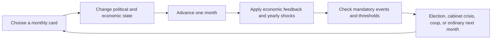

# German Original: Plot, Choice Architecture, and Endings

## Purpose and scope

This report reconstructs how the German version of *Social Democracy: An Alternate History* actually works as a game. It concentrates on the causal questions needed for the Polish adaptation:

- What does the player repeatedly decide?
- Which choices change the plot immediately, and which prepare consequences months or years later?
- How do elections, coalition formation, ministries, party factions, economic policy, constitutional reform, street violence, and presidential politics connect?
- Which routes lead to democratic survival, authoritarian government, a Nazi victory, or civil war?
- Which parts of the design are worth carrying into the Polish game, and which parts should be replaced or corrected?

The German baseline used here is repository commit `5e2cfef` (`Establish reproducible upstream baseline`). This is the last complete German version before the Polish transition began. Unless a section explicitly says otherwise, every German source reference means the file at that commit, for example:

```text
git show 5e2cfef:source/scenes/events/election_1928.scene.dry
```

This is a code analysis, not a claim that every rule is historically correct. It describes implemented behavior even where that behavior appears unintended. Historical assertions embedded in the game would require separate research before reuse in Poland.

The current Polish worktree contains uncommitted election and presidential work. I treated those files as user-owned and did not modify them. The final comparison section describes only the boundary visible in the current code; it does not approve unresolved historical choices.

### Suggested reading paths

- For the central model, read **Executive reading**, **Choice-to-consequence map**, and **Worked trajectories**.
- For a complete reconstruction of play, read sections **1–10** in order.
- For Polish design work, read **Current Polish boundary**, **Recommendations**, and **Proposed Polish design questions**.
- For verification or further implementation work, use the **Source map**.

## Executive reading: what kind of plot this game has

The German game is not primarily a conventional branching story in which one menu choice sends the player down one permanent path. It is a monthly political state machine. Most choices alter several persistent values, and later scenes check combinations of those values. The plot that the player sees in 1932 or 1933 is therefore often the result of decisions made in 1928–1931.

A useful model is:



The central strategic problem is to keep several systems viable at once:

1. **Electoral strength.** The SPD needs enough support to lead coalitions, protect a minority government, or make an SPD presidential candidacy credible.
2. **Party cohesion.** Every economic and coalition strategy angers at least one SPD faction. Dissent reduces the effectiveness of positive campaigning and, at high levels, causes leaders, unions, or the left wing to leave.
3. **Coalition relations.** Relations with Zentrum, DDP, DVP, and KPD decide whether plausible parliamentary arithmetic can become a working government.
4. **Institutional access.** Being in government is not enough. Specific ministries unlock specific actions. The Justice Ministry is especially important because constitutional reform requires it and a long judicial-reform buildup.
5. **Economic stability.** Unemployment and inflation erode support for the republic and push voters toward anti-democratic parties. Deficits can produce inflation and, at an extreme, a capital strike.
6. **Coercive capacity.** The Reichsbanner, Prussian police, KPD-aligned fighters, and loyal parts of the Reichswehr may decide whether a coup is defeated. Their usefulness depends on earlier organization, relations, government control, and faction unity.
7. **Presidential power.** A friendly president is a major defensive asset, but reforming the office itself is often more durable than relying on a favorable person.

The game rewards preparation across these systems. A player who waits for Hitler's appointment or a coup scene before preparing has usually already lost. Conversely, a player can survive without maximizing the SPD vote if they have built a stable coalition, reduced unemployment, reformed the constitution, and kept a credible democratic defense.

## 1. The monthly loop and why choices have delayed effects

### 1.1 The hand of cards

The main screen is a hand with a maximum of three cards on normal difficulty and four on easy difficulty. It exposes a Party Affairs deck from the beginning and a Government Affairs deck after `time >= 6`. Advisors are pinned alongside the hand. The player draws a card and chooses one of the actions inside it. Most actions add one to `month_actions`; `post_event` then advances the date by one month and resets that counter.

This creates a strict opportunity-cost structure. Raising money, campaigning among workers, improving relations with Zentrum, debating an economic program, building the Reichsbanner, reforming the judiciary, and changing welfare policy generally compete for the same monthly turn. A route that needs four judiciary reforms, three crisis-program debates, and repeated KPD diplomacy is expensive because the player cannot do all of those while also maximizing electoral campaigning.

An action can make more than one numerical change, but the month still advances only once as long as `month_actions >= 1`. Some event sequences and election screens do not consume an extra month. Source: `source/scenes/main.scene.dry`, `source/scenes/post_event.scene.dry`, and the individual card files.

### 1.2 Advisors are periodic accelerators

The player begins with Otto Wels, Hermann Müller, and Rudolf Hilferding and can retain three advisors. Advisor actions normally share a six-month cooldown. They do not increment `month_actions`, so they are periodic extra actions alongside the ordinary monthly card action. This makes the chosen roster a substantial source of tempo as well as numerical help.

Changing the leadership has a political cost. Appointing many, though not all, replacement advisors strengthens the associated faction; removing one adds faction dissent. The advisor roster is consequently a statement about the party's internal balance as well as an ability loadout.

There is a likely implementation typo: the pinned leadership-shuffle scene increments `month_activities`, while the calendar checks `month_actions`. As written, that action does not advance time. This should not be copied as an intentional design rule without a decision. Sources: `source/scenes/advisors/*.scene.dry`, `source/scenes/advisors/shuffle_leadership_pinned.scene.dry`, `source/scenes/post_event.scene.dry`.

### 1.3 Mandatory events interrupt the loop

After state updates, `post_event` checks the `#event` collection. Eligible events with the highest priority are presented first. Annual shocks normally use a higher priority than ordinary events; the final ending event is higher still. Elections have low priority, so other events due in the same month can appear before the election.

This matters for causality. A statistic can cross a threshold during the monthly update and immediately trigger a crisis before the player receives another ordinary action. Examples include a capital strike, a vote of no confidence, a coup, and faction rupture.

If several events of the same highest priority are eligible, the player can encounter more than one during the event sequence. The system is therefore less like a single scripted chapter and more like a queue of conditions that have become true.

### 1.4 Randomness is narrower and stranger than it first appears

The ordinary deck draw chooses uniformly among eligible cards. Scene `frequency` values are used when the engine must select a limited subset of choices, but the Party and Government decks do not set such a limit. The apparent card frequencies therefore do not weight ordinary deck draws in the baseline engine.

When a scene has multiple valid `go-to` destinations, the engine randomly chooses one. This creates some explicit or accidental coin flips. The Grand Coalition attempt after Stresemann's death contains `go-to: beg_dvp_succeed; beg_dvp_fail`, which is an even random choice. The rally scene can similarly have both the normal and SA-disruption destinations valid. Presidential ties can set more than one winner flag and leave the engine to select among valid result destinations.

These are important implementation facts because a player may interpret them as a probability derived from political preparation when the code uses a flat random choice. Sources: `node_modules/dendrynexus/lib/engine.js`, `source/scenes/events/election_1928.scene.dry`, `source/scenes/party_affairs/rally.scene.dry`.

### 1.5 What the Party Affairs cards build

Party Affairs remains available whether the SPD governs or sits in opposition. Its recurring card families create the political inputs used by later events.

| Card family | Immediate role | Long-run plot effect |
|---|---|---|
| Campaigning and rallies | Shift selected demographic support; spend organization or resources | Determines polling, election results, strike capacity, and some presidential blocs |
| Fundraising and party organization | Gain resources, dues, or organizational reach | Pays for coalition bargains, presidential endorsements, program adoption, and crisis responses |
| Media | Improve communication and support | Helps compensate for bad events, though gains are weakened by dissent |
| Ideology | Choose left, centrist, labor, reformist, or later neorevisionist emphasis | Changes faction balance and which economic, coalition, and party-transformation routes are feasible |
| Interparty relationships | Improve or damage relations with KPD, Zentrum, DDP, or DVP | Opens coalitions, toleration, endorsements, confidence votes, and civil-war alliances |
| Crisis program | Accumulate support for WTB, moderate recovery, or nationalization | Selects the economic strategy used against the Depression |
| Confronting Nazis | Recognize the threat and choose how directly to oppose it | Builds Nazi urgency, Iron Front access, and conditions for policing or deportation |
| Iron Front | Mobilize a broad republican campaign | Raises democratic legitimacy, organization, and anti-fascist readiness |
| Reichsbanner | Recruit, arm, train, restrain, or politically direct the defense organization | Determines effective force in coups and war and can provoke coalition partners |
| Street fighting | Escalate or de-escalate clashes | Changes both republican and Nazi paramilitary capacity and street strife |
| Neorevisionism and People's Party | Develop and then apply a broad democratic strategy | Enables constitutional reform and changes the SPD's demographic coalition |
| Party disunity | Bargain with or confront a dissenting faction | Can reduce dissent or lead to a permanent split |
| Response to antisemitism | Political and moral response to far-right agitation | Changes affected support, republican position, and anti-Nazi strategy |
| International relations | Party-to-party or international socialist activity | Feeds selected diplomatic and ideological outcomes |

The critical point is that no card family owns one ending. Campaigning helps elections and general strikes; interparty relations affect coalitions, presidential elections, and armed allies; ideology affects programs, candidates, and party rupture.

### 1.6 What the Government Affairs cards build

Government Affairs becomes visible after the opening period, but individual actions require the SPD to govern, tolerate a cabinet, control Prussia, or hold a relevant ministry.

| Card family | Typical requirement | Long-run plot effect |
|---|---|---|
| Coalition affairs | Membership in a coalition | Trades policy concessions and resources for cabinet stability |
| Dealing with toleration | SPD supporting a minority cabinet | Decides whether temporary parliamentary support becomes complicity, withdrawal, or a new election |
| Economic policy | Economic/Finance influence and an adopted program | Implements WTB, moderation, nationalization, or other recovery stages |
| Fiscal policy | Government and fiscal influence | Moves budget, growth, unemployment, inflation, relations, and capital-strike pressure |
| Social welfare | Government influence | Trades budget and partner consent against worker security and legitimacy |
| Labor affairs and rights | Labor portfolio or governing access | Builds worker support and reform, with employer and coalition consequences |
| Economic democracy | Economic authority | Builds works councils and socialization capacity while increasing business resistance |
| Agricultural policy | Agriculture authority and later legal conditions | Affects rural support, tariffs, or land reform |
| Judiciary | Justice Ministry | Accumulates the four reforms needed for constitutional change and strengthens legal defenses |
| Constitutional reform | Justice, four judiciary reforms, neorevisionism, eligible cabinet | Changes electoral threshold, confidence rules, or presidential power |
| Police and domestic enemies | Interior, Prussia, or governing control | Builds police loyalty, investigates extremists, bans organizations, and prepares deportation |
| Deport Hitler | Completed investigation and security/legal prerequisites | Removes Hitler and weakens SA/NSDAP, with a risk of violent failure |
| Prussian affairs | SPD control of Prussia | Develops the police and regional democratic base later tested by the Prussian Coup |
| Military policy | Reichswehr portfolio | Alters army budget, policy, and loyalty used in coup calculations |
| Education and science | Government capacity | Slowly raises republican culture and long-run growth potential |
| Women's and homosexual rights | Suitable government and political support | Delivers social-reform outcomes and can change faction or coalition relations |
| Foreign policy and war guilt | Foreign-policy access | Changes reparations, European cooperation, pacifism, and international outcomes |
| Cabinet shuffle | Coalition leverage or cabinet conditions | Exchanges portfolio control and therefore changes which actions remain available |

Government actions are the bridge between winning office and changing the country. An SPD that enters cabinet without the relevant portfolio can be held responsible for conditions it cannot directly alter. This is why the election's ministry screen is a strategic commitment rather than administrative detail.

## 2. The state model behind the story

### 2.1 Voters are demographic support pools

The game does not simply add and subtract one national SPD percentage. It keeps a preference score for each party inside several demographic groups:

- workers;
- old middle class;
- new middle class;
- rural population;
- unemployed people;
- Catholics.

The first four class weights sum to 100, while unemployment and Catholic identity overlap them. The calculation nevertheless includes all six as separate weighted groups. Within each group, party preference scores are normalized; the normalized results are multiplied by group weights; party totals are then normalized nationally. Displayed party percentages are rounded independently, so the displayed total can differ from 100.

This lets actions have political shape. A workers' policy may gain SPD support among workers and unemployed people while a People's Party strategy exchanges some worker loyalty for middle-class, rural, and Catholic support. Austerity or failed crisis management can move unemployed workers toward the KPD and middle-class or rural voters toward the NSDAP.

It also means support gains are relative. Adding SPD preference to one group changes every party's normalized share within that group. The final national percentage may move less than the raw effect suggests.

Sources: `source/scenes/root.scene.dry`, `source/scenes/post_event.scene.dry`, `source/scenes/election_algorithm.scene.dry`.

### 2.2 Parliamentary results are snapshots, not a permanent mirror of polling

`*_votes` tracks current normalized public support. At an election, the code records represented results in `*_r`. Coalition tests use the frozen `*_r` values until another election. This is conceptually sound: changing polling should not silently change Reichstag membership.

The visual parliament multiplies each represented percentage by five and rounds it, approximating a 500-seat chamber. Coalition formation, however, uses percentages and a 50-percent threshold rather than those displayed seat counts. A threshold reform excludes small parties and renormalizes the represented results. The Center calculation includes a fixed three points for the BVP, with three later removed from some coalition formulas.

The design therefore separates public opinion and legislative power, but it does not maintain a single exact seat ledger. That is one source of occasional visual or arithmetic inconsistency.

Sources: `source/scenes/election_algorithm.scene.dry`, `source/scenes/election_simulation.scene.dry`, `source/scenes/events/election_1928.scene.dry`.

### 2.3 The five SPD factions

The SPD begins with five internal tendencies:

| Faction | Initial strength | Initial dissent | Broad gameplay interest |
|---|---:|---:|---|
| Left | 15 | 20 | KPD cooperation, nationalization, socialist transformation |
| Center | 30 | 0 | Party balance and continuity |
| Labor | 25 | 5 | Trade unions and the WTB employment program |
| Reformist | 25 | 5 | Parliamentary democracy, moderate policy, bourgeois coalitions |
| Neorevisionist | 5 | 10 | Mass democratic strategy, anti-Nazi mobilization, People's Party reform |

Strengths are renormalized after actions. Overall dissent is a strength-weighted average, capped at 95 percent. Many positive support effects are multiplied by `(1 - dissent)`. If overall dissent is 0.40, a nominal gain of 10 is only 6. Internal division therefore reduces the return on campaigning and policy long before a formal split occurs.

At faction dissent above 30, party-disunity content becomes available. At 60 or more, a faction can rupture permanently:

- the left forms the SAPD and takes supporters, advisers, and Reichsbanner members;
- centrist leaders resign and the party loses major figures and organization;
- reformist leaders resign, taking Braun and Severing among others;
- the unions declare independence, producing a large worker, supporter, adviser, and Reichsbanner loss.

This is one of the game's strongest systems. An ideologically coherent policy is easier to execute, but imposing it can destroy the coalition inside the party. Sources: `source/scenes/root.scene.dry`, `source/scenes/post_event.scene.dry`, `source/scenes/party_affairs/party_disunity.scene.dry`, and the four rupture events.

### 2.4 Relationships are permissions as much as opinions

The principal interparty relationship values begin at approximately:

| Party | Initial relation |
|---|---:|
| Zentrum | 50 |
| KPD | 25 |
| DDP | 60 |
| DVP | 35 |

These numbers do more than influence flavor. They are gates for coalitions, presidential endorsements, toleration, votes of no confidence, KPD help in a civil war, and some event resolutions. Improving a relationship early can create a route years later. Allowing Blutmai, repeatedly attacking a coalition partner, or choosing policies hostile to business can close those routes.

The player cannot maximize every relationship. Moving toward the KPD often antagonizes liberal or conservative partners; moderating for Zentrum and DVP often raises left or labor dissent and harms KPD relations.

### 2.5 Resources, budget, and leverage are different currencies

- **Resources** represent the SPD's discretionary political capacity. They pay for campaigns, bargaining, propaganda, and some program adoption. Party dues and fundraising replenish them.
- **Budget** represents state fiscal room. Government programs can push it negative; taxes, cuts, and later program stages can replenish it.
- **Leverage** exists mainly during coalition formation and buys ministries. It is not the same as either party resources or public support.

Conflating these would flatten the strategy. A popular SPD can lack resources to recruit an endorsement. A coalition-leading SPD can lack leverage to secure Justice or Interior. A government can have political resources but no budget for an employment program.

### 2.6 The republic is its own constituency

`pro_republic` measures support for the democratic system. It begins at 59. High unemployment and inflation reduce it. Emergency rule, repeated inconclusive elections, and authoritarian concessions also reduce it. Democratic education, successful mobilization, and economic recovery can raise it.

When pro-republic sentiment falls below the combined support of the Weimar parties, the game applies a monthly drain: some middle-class and rural SPD or liberal support moves toward the NSDAP, and portions of the SPD base erode. Democracy is therefore not merely the sum of democratic parties. If the public's attachment to the system is weaker than the electoral coalition defending it, the coalition loses credibility.

This is a major causal bridge between economic policy and political collapse. A failed economy does not only cost the governing party votes; it changes the electorate's willingness to accept parliamentary democracy.

### 2.7 Armed organizations are accumulated political capital

Initial raw strengths and militancies produce very different effective forces. The Reichsbanner starts large but with very low militancy; the Stahlhelm, SA, RFB, police, and Reichswehr use different multipliers and loyalty shares. The important point is that head count alone is not combat power.

Reichsbanner investment and street-fighting choices can raise strength and militancy. Police reform can raise loyalty. KPD relations determine how much RFB power joins a republican defense. Party dissent reduces Reichsbanner effectiveness and the general-strike contribution. The president and government determine how much of the Reichswehr supports the republic.

This produces a coherent delayed-defense mechanic: the coup scene reveals the coalition of forces that earlier political work assembled.

### 2.8 Opening position and difficulty

The campaign opens in January 1928. Hindenburg is president, Wilhelm Marx of Zentrum is chancellor, the SPD is outside the national government, and the SPD controls Prussia. The May 1928 Reichstag election is the first fixed political deadline.

The starting parliamentary percentages are SPD 26, KPD 9, Zentrum 17, DDP 6, DVP 10, DNVP 20, NSDAP 3, and Other 9. These values describe the inherited Reichstag before the first in-game election; current polling is produced from demographic preferences.

Difficulty changes political capacity rather than only scaling one score:

| Mode | Resources | Dues | Reichsbanner | Budget | Political effect |
|---|---:|---:|---:|---:|---|
| Easy | 4 | 3 | 2,500 | 5 | Better partner relationships, less internal pressure, four-card hand |
| Normal | 2 | 2 | 2,000 | 4 | Baseline relationships and faction state, three-card hand |
| Hard | 0 | 1 | 1,000 | 3 | Weaker relationships and substantially higher faction dissent |
| Historical | 2 | 1 | 2,000 | 2 | Harder political state, no saves or polls, and two resources added each year |

Historical mode also fixes or restricts some character choices to keep the route closer to recorded history. This is not a neutral “ironman” switch: it changes information, resources, internal cohesion, and some available alternatives.

Source: `source/scenes/root.scene.dry`, `source/scenes/main.scene.dry`.

## 3. Chronological structure, 1928–1934

The exact order can vary because of elections, card availability, and triggered crises, but the broad campaign arc is fixed.

| Period | Fixed pressure | Main strategic questions |
|---|---|---|
| Jan–May 1928 | Existing bourgeois-right cabinet falls; Reichstag election is due | Build support and decide what coalition or ministry strategy to pursue |
| Mid–late 1928 | Government formation; Panzerkreuzer and coalition tensions; Wittorf Affair | Govern, tolerate, or oppose; choose ministries; decide whether KPD cooperation is imaginable |
| 1929 | Early downturn, May Day/Blutmai, KPD conference, Young Plan, Black Thursday | Contain street conflict; build crisis-program support before the Depression intensifies |
| 1930 | Severe unemployment jump; possible coalition collapse and new elections | Enact an economic program, manage unemployment insurance, prevent presidential-cabinet drift |
| 1931 | Banking and Depression crisis, Harzburg Front, rising armed forces | Keep the economy and coalition alive; prepare institutional and physical defenses |
| 1932 | Further radicalization, presidential election, Papen/Schleicher danger, Prussian Coup | Replace or constrain Hindenburg, retain Prussia, stop repeated elections and authoritarian cabinets |
| 1933 | Hitler appointment or recovery contest; March on Berlin; global recovery | Survive the decisive regime crisis or qualify for Return to Normalcy |
| 1934 | Austrian crisis flavor; Hindenburg dies; succession election | Convert survival into a stable constitutional settlement or face a final presidential seizure |

The calendar applies major economic shocks even if the player has not drawn the relevant policy cards. The annual scenes and monthly background drift make inaction a decision with consequences.

### 3.1 The Depression escalator

The baseline begins with unemployment at 8.6 percent, inflation at 2.9, growth at 4.4, and budget capacity at 4. The shocks then intensify:

- January 1929 reduces growth by 4.
- Black Thursday in October 1929 adds unemployment and radical-party support, reduces budget and dues, and worsens growth.
- January 1930 adds 6.8 unemployment, produces sharp deflation, reduces growth, and may reduce budget.
- January 1931 adds 6 unemployment and severe deflation and contraction. A works program offsets much of this; a further program phase offsets more.
- January 1932 adds another large penalty if no works program exists. Stronger programs can produce an improvement instead.
- Mid-1933 global recovery helps, but whether Germany enters democratic normalization depends on the political and economic state the player has preserved.

At the same time, yearly drift moves middle-class and rural voters toward the NSDAP and workers toward the KPD. The drift is stronger without public works. SA and Stahlhelm strength also rises. The player is racing a compound process: unemployment weakens pro-republic sentiment, declining republican legitimacy moves voters toward extremists, and extremist growth strengthens the political and armed threats.

Sources: `source/scenes/events/1929.scene.dry`, `1930.scene.dry`, `1931.scene.dry`, `1932.scene.dry`, `black_thursday.scene.dry`, `source/scenes/post_event.scene.dry`.

### 3.2 The recovery exit

The late-game democratic off-ramp is `Return to Normalcy`. It requires, in broad terms:

- pro-republic sentiment of at least 50;
- unemployment no higher than 13;
- inflation below 7;
- no Papen or Schleicher chancellorship;
- coup progress below 9.

When it fires, Nazi political and paramilitary strength collapses sharply and more conventional parties recover. This is the game's clearest statement of its theory: fascism is defeated through a combination of economic stabilization, democratic legitimacy, constitutional government, and preventing elite-authoritarian escalation.

The route does not require one exact ideology. It requires the player to arrive at 1933 with the system still functioning.

Source: `source/scenes/events/return_to_normalcy.scene.dry`.

## 4. Elections and government formation

### 4.1 From votes to coalition arithmetic

After an election, the game calculates several named blocs from represented vote percentages:

| Bloc | Implemented composition |
|---|---|
| Weimar Coalition | SPD + DDP + Zentrum − 3 BVP points; SAPD may join under a KPD-relation condition |
| Grand Coalition | SPD + DDP + Zentrum + DVP |
| Bourgeois coalition | DDP + Zentrum + DVP + Other |
| Center-right | Zentrum + DDP + DVP + Other + DNVP |
| Right | Zentrum + DVP + Other + DNVP |
| Far right | DNVP + NSDAP |
| Left | SPD + KPD + SAPD |
| Popular Front | SPD + KPD + Zentrum + DDP − 3 + SAPD |
| Anti-democratic | KPD + NSDAP + DNVP |
| Neo-Weimar | all represented parties except KPD, DNVP, and NSDAP |

The scene resets the old government state and then presents eligible formations. A mathematical majority is necessary but often insufficient. Relations, party leaders, past failures, the president, the number of inconclusive elections, year, resources, and internal faction strength decide what can actually be formed.

### 4.2 SPD majority

At `spd_r >= 50`, the SPD controls every ministry and chooses an SPD chancellor: Braun, Breitscheid, Müller, or later Wels depending on availability and mode. This is the cleanest route but difficult to achieve. It removes coalition bargaining while retaining internal-party tradeoffs and the danger of capital strike or coup.

### 4.3 Weimar Coalition

A Weimar majority puts SPD, Zentrum, and DDP in government. The SPD receives a base five leverage, with another five when the implemented favorable Zentrum leader, Joos, is in place. The player chooses a chancellor and then spends leverage on ministries.

This coalition excludes the DVP and is therefore more permissive for some democratic reforms than the Grand Coalition. It is still vulnerable to conflicts over welfare, economics, policing, and socialist policy.

### 4.4 Grand Coalition

The Grand Coalition adds the DVP. In the first election, or when the SPD is strong enough, it can be SPD-led. In later elections, a weakened SPD under Hindenburg may face a Zentrum-led cabinet under Brüning.

Low DVP relations can make formation fail. If the SPD cannot lead, it may:

- join Brüning's cabinet;
- tolerate Brüning from outside;
- oppose him;
- under favorable Zentrum leadership, join or tolerate a Wirth unity government;
- attempt to recover DVP support, including an implemented 50/50 branch after Stresemann's death.

The coalition is broad but fragile. It can provide a majority and access to ministries, yet its partners resist labor expansion, nationalization, aggressive fiscal policy, and militant anti-fascism. It often asks the player to choose between immediate cabinet survival and long-run economic or democratic survival.

### 4.5 A new constitutional coalition

If the ordinary Grand Coalition is below 50 but the broader Neo-Weimar bloc has a majority, the player can spend two resources to form a new coalition of constitutional parties. A Wirth unity government can also become available under favorable Zentrum leadership. These are recovery mechanisms for a fragmented parliament, but they still depend on relationships built earlier.

### 4.6 United Left

A left majority does not automatically produce a left government. The game checks KPD relations or Conciliator leadership and requires repeated preparation of `communist_coalition`. The final agreement may require three resources, exceptionally strong relations, or a favorable KPD leadership.

The normal success result makes Breitscheid chancellor, gives the SPD every ministry, raises coup progress by 3 and capital-strike progress by 2, and starts the KPD-goals system. If coup progress has already reached 10, civil war begins immediately.

If the SPD left is stronger than the combined reformist and neorevisionist tendency and Braun is president, the player can appoint Thälmann chancellor. That choice immediately drives the game toward civil war. Thus the left-majority route is a demanding coalition-management path, while the communist-chancellor choice is an explicit revolutionary confrontation.

### 4.7 Popular Front

The Popular Front includes democratic center parties as well as SPD and KPD parliamentary support. It has more complicated gates involving KPD and Zentrum relations and leadership. The player may need four resources, a concession about democracy, or pressure from President Braun. With both favorable party leaders, a special easier formation exists.

Breitscheid becomes chancellor, coup progress rises by 2, and the KPD abstains from ministries. SPD leverage is based on the combined SPD and KPD parliamentary strength. The government then receives KPD policy goals and faces a lower coalition-dissent tolerance than the United Left.

The route broadens parliamentary defense but contains incompatible partners. It is a deliberate high-management coalition rather than a simple “all anti-Nazis cooperate” win button.

### 4.8 Far-right majority

If DNVP plus NSDAP has at least 50, the outcome depends on timing and the president:

- from 1932 onward, or if the NSDAP has at least 44, a non-Braun president appoints the Nazi leader;
- earlier, Schleicher takes office and schedules another election;
- President Braun can attempt emergency government, another election, or appointment of the Nazis, but a sufficiently strong far right can launch an immediate coup.

### 4.9 No majority: the collapse ratchet

Under Hindenburg, failure to build a majority starts an escalation:

1. Brüning governs with SPD toleration for up to several inconclusive elections while the anti-democratic bloc remains limited.
2. Further failure or a majority-sized anti-democratic bloc leads to Papen.
3. Another Papen election leads to Schleicher.
4. Another failure under Schleicher leads to Hitler.

Each turn of this ratchet reduces pro-republic sentiment and shifts additional groups toward the NSDAP. Calling another election is therefore not a neutral reroll. It worsens the state that will determine the next election.

President Braun changes this branch. He can support an emergency SPD government, but the government must survive a no-confidence calculation based on party relationships. A far-right bloc of 45 or more instead launches an immediate coup.

### 4.10 Refusing to govern

The player can refuse government even when a coalition or majority is possible. This produces heavy dissent among reformists, labor, centrists, and neorevisionists, harms support, and often leads to a right-wing government or rapid new election. The route exists to permit ideological refusal, but the code treats abandonment of parliamentary responsibility as a major political failure.

### 4.11 Ministries are a capability graph

When the SPD leads a coalition, leverage buys portfolios:

| Portfolio | Leverage cost | Main capabilities associated with it |
|---|---:|---|
| Labor | 5 | Labor policy and worker-facing reform |
| Interior | 5 | Police, domestic security, investigation of the far right |
| Finance | 10 | Fiscal policy and parts of economic response |
| Economic | 10 | Economic policy, works programs, economic democracy |
| Justice | 10 | Judiciary reform; later constitutional reform and legal defenses |
| Foreign | 10 | Reparations, European cooperation, external relations |
| Agriculture | 10 | Agricultural and land policy |
| Reichswehr | 15 | Military policy and loyalty |

The cheapest ministries are useful immediately; the expensive ones create distinct strategic routes. Interior plus Prussian control supports policing and the Hitler-deportation route. Justice is the prerequisite for a long constitutional path. Economic and Finance help implement crisis programs. Reichswehr can improve the military side of a future coup calculation.

This is a strong piece of design because cabinet formation is not merely an ending label. The portfolios determine which verbs the player will have for the next government term.

Source for all government branches and ministry costs: `source/scenes/events/election_1928.scene.dry`.

## 5. The main causal routes

The routes below overlap. A good campaign may combine constitutional reform, a works program, anti-Nazi policing, and a Braun presidency. The headings identify clusters of preparation and consequence rather than exclusive classes.

### 5.1 Parliamentary-democratic survival

This route aims to keep the SPD or a constitutional coalition in office until economic recovery reduces extremist momentum.

The preparation usually consists of:

1. Preserve workable relations with Zentrum and DDP, and often DVP.
2. Win enough support for a Weimar, Grand, or broader constitutional majority.
3. Choose ministries that match the intended policy route.
4. Reduce unemployment before repeated elections and emergency rule destroy pro-republic sentiment.
5. Avoid coalition-dissent thresholds or enact a constructive vote of no confidence.
6. Prevent Papen and Schleicher from becoming the normal solution to parliamentary deadlock.
7. Reach the Return to Normalcy conditions in 1933.

This path is less dramatic than a coup victory but strategically demanding. The central danger is accepting compromises that preserve the cabinet this month while allowing unemployment and republican legitimacy to deteriorate. A cabinet can survive and still lose the regime.

The strongest version combines a workable coalition with constitutional reform. The weaker version relies on good relationships and economic performance alone. If those fail, each no-confidence crisis or inconclusive election moves the game closer to presidential cabinets.

### 5.2 WTB employment route

The WTB program is the labor faction's crisis answer. The player first needs Black Thursday to occur and crisis urgency to open the crisis-program card. Supporting labor raises `wtb_support`; at 3, the party adopts the program. Adoption strengthens labor, lowers labor and reformist dissent, but angers centrists and somewhat the left.

Implementation checks whether the state can pay the required budget cost. A funded stage avoids additional cabinet and business alarm; a deficit-funded stage adds both coalition dissent and capital-strike pressure, and historical mode or a Brüning chancellorship can add still more coalition dissent. Its benefit is speed: it directly offsets unemployment shocks, increases growth and pro-republic sentiment, and improves SPD support among workers and unemployed people. Later program stages can recover part of the fiscal cost.

The causal chain is:

```text
early crisis recognition
→ spend several scarce turns building WTB support
→ secure the ministries and budget needed to implement it
→ absorb deficit and coalition pressure
→ reduce 1931–1932 unemployment shocks
→ preserve pro-republic sentiment and SPD support
→ weaken the electoral and paramilitary growth of the extremes
→ qualify for democratic recovery
```

The route can fail in four distinct ways:

- the player begins program debate too late;
- the SPD is outside government when implementation is needed;
- coalition concessions dilute or block the program;
- deficit, inflation, or capital-strike pressure creates a second crisis.

The route is therefore not simply “choose Keynesianism and win.” It is a timing and governing-capacity test. Sources: `source/scenes/party_affairs/crisis_program.scene.dry`, `source/scenes/government_affairs/economic_policy.scene.dry`, annual event files, `source/scenes/post_event.scene.dry`.

### 5.3 Moderate recovery route

The moderate plan requires only two support steps and strengthens the reformist faction. It reduces unemployment and improves growth more gently, helps middle-class and rural support, improves Zentrum relations, and can reduce coalition dissent when unemployment is high.

Its advantages are lower political and fiscal risk. Its weakness is that the Depression shocks are large. If adopted late or implemented weakly, the smaller effects may not keep unemployment below the thresholds that erode the republic and feed the NSDAP.

The moderate route is best understood as a coalition-compatible strategy. Its success depends on early adoption and complementary actions. A player who assumes moderation is automatically safe may arrive in 1932 with a stable cabinet but an unstable society.

### 5.4 Radical nationalization route

Supporting the left raises `nationalization_support`; at 3 the SPD adopts nationalization as its economic plan. This strengthens the left, improves KPD relations, and immediately raises coup progress. Implementation can help workers and unemployed people, create works activity, and advance social ownership.

The confrontation risks are explicit:

- ordinary adoption and implementation anger reformists, neorevisionists, labor, or coalition partners;
- works councils and economic democracy can add capital-strike pressure;
- uncompensated nationalization and factory takeovers produce much larger capital-strike and coup increases;
- a capital strike causes a large economic and electoral collapse before the player chooses a response;
- a left government already begins with extra coup and capital-strike pressure.

The route can still succeed if the player has prepared political unity, coercive defense, KPD relations, and sufficient governing control. It is designed as a transformation under counter-mobilization. It should not be evaluated only by the immediate support gains displayed on the policy card.

### 5.5 Centrist inaction

The crisis-program card also allows the player to support the centrist tendency or defer. This preserves the center in the short term but angers labor and the left and does not create an economic plan. Annual shocks then occur with little or no offset.

The consequence is indirect and severe: unemployment rises, pro-republic sentiment falls, extremist parties gain, the coalition becomes harder to reconstruct after elections, and presidential government becomes more likely. The game treats inaction as a plot branch generated by the ordinary economic update rather than a special “failure” scene.

### 5.6 KPD rapprochement, United Left, and Popular Front

The KPD route has several stages, each of which can be missed.

#### Stage 1: create a relationship

The player uses interparty diplomacy, left-wing positioning, certain advisers, and event choices to raise `kpd_relation` from its low starting value. This often costs relations with bourgeois partners or creates reformist dissent.

#### Stage 2: change the KPD's internal environment

The 1928 Wittorf Affair and 1929 KPD conference can help the Conciliators replace the harder leadership. Favorable resolution depends on strong relations, secrecy or intervention choices, left strength, and in some cases having Paul Levi or Kurt Rosenfeld available. Conciliator leadership makes later cooperation and extensions easier.

#### Stage 3: avoid destroying trust on May Day

The May Day confrontation is a pivotal test:

- banning the demonstration destroys KPD relations, reduces coalition willingness, leads to Blutmai, and moves workers away from the SPD;
- allowing it improves relations but can strengthen the KPD and anger bourgeois partners;
- joining it requires good relations and substantially advances both KPD cooperation and broader communist-coalition preparation, while also contributing to right-wing mobilization.

This is a good example of a choice whose gains and risks sit on different axes. Cooperation may improve the future parliamentary left while worsening coalition dissent and street polarization.

#### Stage 4: prepare coalition willingness

A parliamentary left majority is insufficient. `communist_coalition` must be built through repeated choices, and the relationship or Conciliator thresholds must be met. The player may also need resources at the election.

#### Stage 5: fulfill KPD government goals

Once a left or Popular Front government forms, the KPD supplies a policy list. It can include welfare, land reform, nationalization, progressive tax, labor reform, military reduction, and later foreign policy. The government receives a timer, generally between 12 and 24 months depending on relations, leadership, and institutional reform.

The player must complete all required goals. Partial compliance earns a short extension only under favorable conditions. Failure harms relations and support and leads toward a KPD-backed vote of no confidence. Satisfying every goal secures coalition survival for the term.

This turns the coalition from an electoral reward into a governing contract. The player must have prepared ministries and policies before formation; otherwise the timer can be impossible.

#### Stage 6: manage KPD coalition dissent

KPD coalition dissent triggers a crisis at 3 in a Popular Front or 4 in a United Left. The SPD may spend resources to reduce it, accept Thälmann as chancellor and face civil war, replace the left coalition with a centrist one, or call an election.

WTB and moderate programs can themselves increase KPD dissatisfaction because the game frames them as preserving capitalism. Nationalization fits the KPD goal set more naturally.

Sources: `source/scenes/events/wittorf_affair.scene.dry`, `kpd_conference.scene.dry`, `blutmai.scene.dry`, `kpd_goals.scene.dry`, `kpd_goals_2.scene.dry`, `kpd_ultimatum.scene.dry`, `kpd_vote_of_no_confidence.scene.dry`, `source/scenes/party_affairs/inter_party_relationships.scene.dry`.

### 5.7 People's Party route

Neorevisionism emerges as a response to the Nazi threat. It supports a broader democratic mass-party strategy, the Iron Front, and constitutional reform. After building enough support, the SPD can attempt to become a People's Party.

The smoother adoption condition compares reformist plus neorevisionist strength with left plus center strength and expects adequate public support for the proposal. Adoption deliberately exchanges part of the SPD's worker orientation for stronger appeal among rural, middle-class, and Catholic voters. It also improves relations with bourgeois-democratic parties.

Forcing the change over internal opposition creates very high dissent in the left and center. Because dissent reduces future support gains, the immediate demographic expansion can be undermined by the party rupture it causes.

This route can help form broader constitutional coalitions and weaken the NSDAP among non-worker groups. Its design question is whether the SPD can change its social coalition without losing the organization and identity that make it effective.

Sources: `source/scenes/party_affairs/neorevisionism.scene.dry`, `peoples_party.scene.dry`, `peoples_party_campaigning.scene.dry`.

### 5.8 Constitutional-reform route

Constitutional reform is among the most preparation-heavy routes in the game. The card requires:

- the SPD to be in government;
- the Justice Ministry to be controlled by the SPD;
- at least four levels of judicial reform;
- neorevisionism;
- an eligible Weimar, SPD-majority, United Left, or Popular Front government;
- no constitutional-reform cooldown;
- fewer than three completed reforms.

Each reform takes a monthly action and starts a 12-month cooldown. A referendum normally needs 51 percent calculated support; if pro-republic sentiment is below 65, it needs 60 percent. The three central amendments are:

1. **A five-percent electoral threshold.** This removes small parties from future representation and redistributes much of their support. It can simplify coalition arithmetic but angers partners and part of the SPD.
2. **A constructive vote of no confidence.** This prevents the ordinary destructive no-confidence mechanism unless an alternative majority exists. It is the most direct protection against coalition-dissent collapse.
3. **Reduced presidential powers.** This blocks or changes the Papen appointment, Prussian Coup, emergency-government, and later presidential-seizure branches.

The route also interacts with court defenses. Judicial reform can keep paramilitary bans in force, enable land reform and uncompensated nationalization, and allow a constitutional defense when the far right attempts a coup.

This is a classic long-lead route. Choosing Justice during a 1928 coalition negotiation can decide whether the player has a legal answer in 1932–1934. The ministry seems less immediately useful than Labor or Interior, but it changes the shape of the endgame.

Source: `source/scenes/government_affairs/constitutional_reform.scene.dry`, `judiciary.scene.dry`, and the coup and presidential events.

### 5.9 Deport-Hitler route

The deportation action requires:

- Nazi urgency of at least 3;
- Hitler not already deported;
- Papen or Schleicher not currently governing;
- at least two far-right investigations.

The wider action chain also depends on control of Prussia, an effective police apparatus, and judicial reform. If SA strength is below 200, deportation succeeds automatically. At higher strength the game compares police and Reichsbanner power with the SA.

Success halves SA strength, reduces NSDAP support in all demographic groups, lowers coup progress, and replaces Hitler with Goebbels as party leader. Failure raises Nazi support and coup progress and strengthens the SA.

The route is powerful but not an instant elimination of fascism. The ending code explicitly allows a Nazi outcome despite Hitler's deportation, now associated with Goebbels or Göring. The player still needs economic, parliamentary, and constitutional success.

Sources: `source/scenes/government_affairs/police.scene.dry`, `deport_hitler.scene.dry`, `source/scenes/game_over.scene.dry`.

### 5.10 Reichsbanner and Iron Front route

Recognizing the Nazi threat raises urgency and can unlock neorevisionism and Iron Front organization. Rallies and organization increase pro-republic sentiment, electoral reach, or defensive strength. Direct Reichsbanner investment raises membership and militancy.

Militancy is double-edged. It makes the organization more useful in a coup or civil war, but high militancy can make Zentrum and DDP threaten to leave the coalition. Under sufficient street strife and good relations, the SPD can justify the force; otherwise it may have to halve militancy to retain partners.

Street-fighting choices can build arms and training, but the scene also strengthens the SA. Choosing violence therefore changes both sides of the later military comparison. Choosing peace preserves political moderation while leaving less defense if institutions fail.

The best use of this route is often deterrence combined with institutional action. A strong Reichsbanner by itself does not reduce unemployment, preserve parliamentary majorities, or control the police.

Sources: `source/scenes/party_affairs/confronting_nazis.scene.dry`, `iron_front.scene.dry`, `reichsbanner.scene.dry`, `streetfighting.scene.dry`, `source/scenes/events/reichsbanner_zentrum.scene.dry`.

### 5.11 Brüning toleration and austerity route

When no coalition majority exists, the SPD may tolerate Brüning from outside government. This avoids immediate far-right rule and keeps some constitutional continuity, but the SPD lacks ministerial control and shares responsibility for emergency austerity.

The unemployment-insurance and emergency-cuts crises make the tradeoff concrete:

- tolerate benefit cuts and lose worker and unemployed support to KPD and NSDAP while weakening welfare and pro-republic sentiment;
- end toleration and risk another election;
- where available, use resources or relationships to soften the outcome.

The game models toleration as borrowed time. It can be useful if the player is waiting for recovery, a stronger electoral position, or institutional preparation. Repeated reliance becomes the no-majority ratchet that eventually produces Papen, Schleicher, and Hitler.

Sources: `source/scenes/government_affairs/dealing_with_toleration.scene.dry`, `source/scenes/events/emergency_cuts.scene.dry`, `unemployment_insurance_1.scene.dry`, `election_1928.scene.dry`.

### 5.12 Schleicher's authoritarian survival route

Schleicher proposes suspending the Reichstag while enacting a works program. Acceptance costs ten pro-republic points, creates major faction dissent, and damages SPD support. The parliamentary support test can count the SPD, Zentrum at sufficiently good relations, DVP/Other under favorable DVP relations, and in rare circumstances DNVP.

If the scheme succeeds, the next election is delayed for 13 months and Hitler's immediate appointment is blocked. Economically it may reduce pressure. Constitutionally it is an authoritarian outcome: the SPD has helped replace parliamentary government with executive bargaining.

This is not coded as immediate defeat, because it can stop Hitler and permit survival to the end. The ending text, however, treats Schleicher as paving the way for Hitler or a similar authoritarian future. It is a compromised survival branch.

Source: `source/scenes/events/schleichers_schemes.scene.dry`, `source/scenes/game_over.scene.dry`.

### 5.13 Capital-strike route

Capital-strike progress accumulates from aggressive taxation, works councils, economic democracy, nationalization, and some left-coalition choices. At progress 6–9, business-confidence warnings allow concessions. At 10, or when the state budget falls to −5 while the SPD governs, the capital strike triggers.

The event applies its main damage immediately on arrival:

- unemployment rises by 5;
- growth falls by 4;
- SPD worker and unemployed support is multiplied by 0.7;
- SPD middle-class and rural support falls sharply;
- pro-republic sentiment falls by 15;
- Zentrum and DVP relations fall;
- Nazi support rises across demographic groups.

Only after that shock does the player choose a response:

- factory seizure recovers some employment and support but raises coup progress by 6 and coalition dissent;
- capital controls recover a smaller amount of employment and growth;
- propaganda restores political support at a resource cost;
- doing nothing leaves the damage intact.

The lesson is that the threshold must be managed before the event. The response cannot cancel the initiating collapse.

Source: `source/scenes/events/businesses_lose_confidence.scene.dry`, `capital_strike.scene.dry`, fiscal and economic-democracy cards.

## 6. Government crises as threshold machines

### 6.1 Coalition dissent

Coalition dissent is separate from SPD faction dissent. It records how far government partners have been pushed by policy. The rough crisis thresholds are:

- 3 for Grand Coalition, Popular Front, or minority arrangements;
- 4 for a Weimar Coalition;
- special thresholds and logic for the left coalition.

Once crossed, a vote-of-no-confidence event becomes eligible unless the constitution has been reformed. The player may be able to preserve the government by surrendering Prussian control, accepting austerity, spending three resources, or replacing the coalition with a KPD-supported left or Popular Front arrangement. Otherwise an election is scheduled and both republican legitimacy and SPD support suffer.

This makes individual policy costs cumulative. One concession may be affordable; several reforms that each add one dissent can abruptly end the cabinet.

### 6.2 Unemployment insurance as the model coalition dilemma

The unemployment-insurance conflict is a concentrated version of the whole game:

- **Cut benefits:** preserve employer and conservative preferences, but lose SPD base support, expand KPD/NSDAP appeal, lower welfare, raise unemployment, and reduce republican legitimacy.
- **Raise employer contributions:** defend the base and social state, but raise capital-strike pressure and push Grand Coalition dissent to at least 3.
- **Balance the burden:** accept smaller base losses and smaller coalition damage.

No choice is free. The meaningful question is which reserve the player has prepared: public support, coalition tolerance, resources, constitutional protection, or economic space.

### 6.3 Why a constructive vote changes the whole game

Without constitutional reform, coalition dissent can let an alliance of parties remove the cabinet even when those parties cannot agree on a replacement. With a constructive vote, this destructive coalition is insufficient. The amendment does not make partners happy or remove economic pressure, but it changes anger from an automatic government-ending event into a political problem the cabinet may survive.

For the Polish adaptation, this demonstrates how one institutional rule can alter many later event predicates without needing bespoke text in every crisis.

## 7. Presidential politics

### 7.1 The 1932 presidential election

The election is a direct popular contest with two rounds. Party vote shares supply the blocs; relations and resources decide endorsements. The SPD initially chooses among three strategies.

#### Support Hindenburg

This is the default and cheapest anti-Hitler strategy. It can stop an immediate Nazi presidential victory, but preserves the president whose emergency powers enable Brüning, Papen, Schleicher, dismissal of democratic cabinets, and the Prussian Coup. The choice buys short-term electoral coordination at the cost of executive vulnerability.

#### Run Otto Braun

Running Braun costs two resources. The SPD can then seek support from Zentrum, KPD, and DVP. Endorsement depends on party relationships, relative electoral strength, and sometimes further resource expenditure. A Braun victory raises democratic and SPD strength and transforms several later branches:

- an emergency SPD government becomes possible;
- more of the Reichswehr can count on the republican side under the right conditions;
- Hindenburg-specific Papen and Prussian-Coup branches are blocked;
- a no-majority parliament still creates risk, because Braun's government can face a no-confidence vote or a direct far-right coup.

This is a costly alliance-building route whose feasibility is decided before 1932.

#### Support Ernst Thälmann

This requires KPD relations of at least 50 and a left faction stronger than the reformists. It causes major losses among internal moderates and democratic allies. A Thälmann victory provokes an immediate right-wing coup and civil war. The game treats it as a revolutionary polarization route.

#### Ballot resolution

The first round requires a majority; the second uses a plurality. If Braun or Thälmann leads strongly enough, the Nazi candidate can withdraw and endorse Hindenburg. Hitler is replaced by Göring if Hitler has been deported. A Hitler or Göring victory produces Nazi seizure of power.

Source: `source/scenes/events/presidential_election_1932.scene.dry`.

### 7.2 Why reducing presidential powers can be stronger than electing Braun

Braun's presidency changes the occupant of a dangerous institution. Reducing presidential powers changes the institution. The latter blocks multiple chains regardless of the individual winner and can contain an extremist elected in 1934.

The strongest democratic route can do both, but the distinction is important for design: personal control creates contingent protection; institutional reform creates structural protection.

### 7.3 Hindenburg's death and the 1934 succession

Hindenburg dies in July 1934 if still president. The succession event assembles a wide candidate field whose availability depends on political development:

- unity or establishment candidates such as Eckener, Adenauer, or Gessler;
- KPD candidates Thälmann or, with Conciliator development, Münzenberg;
- SPD candidates Braun, Schumacher, or Juchacz, with different prerequisites;
- cultural figures including Einstein, Thomas Mann, or Ossietzky when presidential powers are reduced, pro-republic sentiment is high, pacifism has advanced, and additional candidate conditions are met.

The candidates aggregate current party vote shares. Relationships and resources determine party endorsements. The second round consolidates far-right and bourgeois blocs and allows further bargaining or changed endorsements.

Outcomes divide into several families:

- a democratic, SPD, unity, or cultural winner weakens the Nazi front and proceeds to the normal end;
- a far-right winner installs Hitler as chancellor or otherwise initiates Nazi control;
- if presidential powers were reduced, the player may resist an extremist president through a referendum or armed defense;
- a Thälmann victory under unreformed presidential power causes civil war, while reduced power can contain him;
- Münzenberg does not trigger the same coup response.

The referendum against an extremist use of the presidency combines SPD, DDP, Zentrum, and sometimes KPD or DVP support, then adjusts for SA and Reichsbanner pressure. The late presidential result is thus a summary test of electoral support, alliances, constitutional reform, and organized force.

Sources: `source/scenes/events/death_of_hindenburg_president.scene.dry`, `death_of_hindenburg_normal.scene.dry`, `1934.scene.dry`.

## 8. From parliamentary breakdown to dictatorship

### 8.1 Papen

Papen can replace Brüning or Wirth after May 1932 when Hindenburg remains president, the SPD is outside government, and parliamentary or social conditions have deteriorated. The trigger can be supported by a failed coalition, the NSDAP becoming the largest party, high street strife, an anti-democratic majority, or extreme unemployment. Reduced presidential powers block this route.

His arrival does structural damage:

- two levels of judicial reform are erased;
- the cabinet becomes independent of parliamentary parties;
- a snap election is scheduled;
- the SA is legalized;
- pro-republic sentiment falls;
- control of ministries passes to independents.

Papen is therefore more than a different chancellor portrait. He removes the institutional tools the player spent years developing and accelerates the far right.

### 8.2 The Prussian Coup

The Prussian Coup can occur under Papen or Schleicher, with Hindenburg as president, after the relevant 1932 date, while the SPD is outside the national government, Prussia remains SPD-controlled, and presidential powers remain unreformed.

The player may surrender or resist. Surrender loses Prussia, removes 1,000 Reichsbanner members, halves Reichsbanner militancy, and damages support. Resistance requires at least 200 raw Reichsbanner power to be offered and compares the republican forces with a coalition that includes hostile Reichswehr strength. Defeat can lead to civil war or permanent loss of the most important regional institutional base.

The chain reveals why Prussian control matters throughout the game. It provides police power, a platform for democratic administration, and part of the armed defense. It is also vulnerable if national constitutional reform is neglected.

Source: `source/scenes/events/prussian_coup.scene.dry`.

### 8.3 Schleicher

Schleicher follows another failed Papen election or can appear in other no-majority branches. His works-and-suspension scheme offers a last elite-managed alternative to Hitler. Rejecting or failing the scheme returns the game to the no-majority sequence. Another failed election under Schleicher sends the game directly to Hitler's chancellorship.

### 8.4 Hitler as chancellor

The dedicated appointment condition broadly requires:

- 1933 or later;
- Hindenburg as president;
- Papen or Schleicher as chancellor;
- the SPD outside government;
- the NSDAP as the largest party;
- Hitler not deported;
- unreformed presidential power;
- no successful Schleicher scheme.

When the appointment happens, the player can accept the end or fight, in which case the game moves to civil war. By this point ordinary parliamentary choices have disappeared because the state variables required for appointment encode the collapse of the parliamentary route.

Sources: `source/scenes/events/hitler_chancellor.scene.dry`, `hitler_takes_power.scene.dry`.

### 8.5 March on Berlin

The March on Berlin can trigger when the SPD governs, coup progress is at least 10, the year is after 1930, and the major far-right paramilitaries are legal. A second path can trigger after February 1933 when normalized NSDAP plus DNVP support reaches 50.

The immediate defense compares:

- effective Reichsbanner power after the party-dissent penalty;
- Prussian police if the SPD still controls Prussia;
- a general-strike contribution based on worker support, unemployment, and party unity;
- loyal Reichswehr strength, especially under a Braun presidency and SPD government;

against SA and Stahlhelm power.

If the democratic force exceeds the attackers, an initial confrontation can produce a major victory; a later or weaker success produces a lesser victory. Otherwise resistance becomes civil war. Judicial reform can unlock a court-centered response, and presidential or electoral conditions may permit a new-election response, but these also rely on preparation.

Source: `source/scenes/events/march_on_berlin.scene.dry`.

## 9. Civil war: the final accounting of earlier choices

The civil-war calculation is one of the most important places where visible choice and implemented causality differ.

### 9.1 Power is calculated on entry

As soon as the civil-war scene opens, it calculates the two sides.

The republican side can include:

- Reichsbanner power, reduced by SPD dissent;
- Prussian police if Prussia remains controlled;
- loyal Reichswehr strength, with full value only under favorable presidency and government conditions and reduced value otherwise;
- full RFB power if KPD relations are at least 60, or half at relations of at least 45;
- general-strike power derived from SPD and KPD worker support, unemployment, and SPD dissent.

The opposing side combines:

- SA power;
- Stahlhelm power;
- the hostile share of the Reichswehr.

The scene immediately sets one of three outcomes:

- **Republican victory** if allied power is more than 110 percent of enemy power;
- **Long war** if the allied/enemy ratio is at least 0.6 but below the victory threshold;
- **Total defeat** below that.

### 9.2 The later war prompts do not change the result

The player is then asked to appeal to the army, seek KPD help, call a general strike, or mobilize the police. Those prompts count how many war choices have been inspected and reveal the strengths already included in the calculation. They do not add force or recalculate the result.

This means the real civil-war decisions occurred earlier:

- whether the Reichsbanner was built and made effective;
- whether the SPD remained united;
- whether KPD relations reached 45 or 60;
- whether Prussia and its police were retained;
- whether police and army loyalty were improved;
- whether Braun became president;
- whether SA and Stahlhelm growth was constrained.

Foreign intervention after a long-war result also adds narrative resolution but does not recalculate the initial outcome.

For the Polish iteration, the delayed accounting is valuable, but the presentation should state that the player is activating previously prepared assets or should actually recalculate when a new commitment is made. Otherwise the interface implies agency that the code does not provide.

Source: `source/scenes/events/civil_war.scene.dry`.

## 10. How the endings actually work

### 10.1 There is a terminal date and there are early terminal crises

The normal campaign reaches Hindenburg's death and the 1934 succession, then routes through `1934_end` and `game_over_1934` to the ending menu. Hitler's undisputed takeover, a decisive civil-war defeat, or related crises can end the game earlier.

The campaign does not select one exclusive epilogue that summarizes everything. `game_over.scene.dry` presents every ending card whose condition is true. The player can therefore receive several simultaneous descriptions of the same state: one for the regime, another for the president, another for government, another for unemployment, and another for ideological or social reform.

### 10.2 Regime and conflict endings

The main regime lenses include:

- **Hitler in undisputed control:** Hitler is president or chancellor and there was either total defeat or no civil war.
- **Hitler in power but still opposed:** Hitler holds office during a long civil war.
- **Hitler does not yet control Germany:** neither Hitler condition holds and the player is not in the excluded defeat state. The text may still warn that Papen, Schleicher, Brüning, or defeat in the Prussian Coup points toward future authoritarianism.
- **Nazi power despite Hitler's deportation:** Goebbels or Göring can head a Nazi outcome.
- **Civil war won:** `republic_victory == 1`.
- **Civil war lost:** the total-defeat condition.
- **Germany gripped by civil war:** `long_war == 1`.

Avoid reading “Hitler does not yet control Germany” as a clean democratic victory. The text is deliberately contingent. A Papen or Schleicher government can qualify while leaving Germany on an authoritarian path.

### 10.3 Presidential and government endings

Separate cards recognize outcomes such as:

- Otto Braun victorious;
- Kurt Schumacher victorious;
- Marie Juchacz as president;
- Albert Einstein as president;
- the SPD still governing under an SPD chancellor;
- communist victory;
- an SPD emergency government.

These cards describe who holds office, not the entire health of the regime. The same run can show an SPD-government card and an economic card, or a presidential card and a socialization card.

There is a likely precedence issue in the communist-ending predicate:

```text
chancellor_party == "KPD" or president == "Thälmann" and no defeat and no long war
```

With ordinary boolean precedence, a KPD chancellor qualifies regardless of the defeat/long-war checks, while a Thälmann presidency does not. This should be treated as a bug candidate rather than a deliberate distinction.

### 10.4 Economic endings

The ending menu separately recognizes:

- a works program;
- unemployment reduced below 10;
- unemployment between 10 and 20;
- unemployment still at 20 or above.

These cards show why survival and economic victory are not identical. A player may prevent Hitler but finish with mass unemployment, or achieve a dramatic economic recovery under a politically compromised government.

### 10.5 Ideological and social-program endings

Other cards recognize:

- transformation into a People's Party;
- at least two levels of nationalization;
- at least three levels of works councils;
- creation of a European Union.

These are records of the political project pursued during survival. They allow the ending to answer not only “did democracy live?” but “what kind of social democracy emerged?”

### 10.6 Achievements form a more detailed hidden evaluation

The achievements record is more granular than the visible ending-card structure. It recognizes:

- survival at different difficulties;
- specific coalitions, including sustaining a left or Popular Front government;
- class-pure or broad demographic electoral strategies;
- economic miracle conditions after 1932, including unemployment below the opening 8.6, positive budget, and inflation below 5;
- women's and homosexual rights;
- Heidelberg Program and ideological outcomes;
- constitutional amendments;
- Hitler's deportation;
- special combinations of president and constitutional reform;
- long civil war or victory;
- other policy and foreign-policy achievements.

The 1934 transition also awards a demanding “Brothers to Sun” combination when the campaign ends on normal or higher difficulty with an SPD president, no Hitler, unemployment below 20, no civil war, Hitler deported, substantial reparations progress, and strong women's-rights reform. A separate “Free market” recognition exists for finishing without adopting an economic plan.

The game therefore has two evaluation layers:

1. ending cards explain several dimensions of the final world;
2. achievements recognize difficult routes and combinations.

Sources: `source/scenes/events/1934_end.scene.dry`, `game_over_1934.scene.dry`, `source/scenes/game_over.scene.dry`.

## 11. Choice-to-consequence map

The following table condenses the major delayed connections.

| Earlier decision | State changed | Later consequence |
|---|---|---|
| Campaign within a demographic | Party preference in that group | National polling, then the next election result |
| Change party ideology | Faction strength and dissent; policy support | Which programs and candidates can pass; how effective later campaigning and defense are |
| Improve Zentrum/DDP/DVP relations | Interparty relations | Coalition formation, no-confidence behavior, presidential endorsements |
| Improve KPD relations | KPD relation and coalition willingness | Conciliator route, left/Popular Front, KPD goals, RFB support in civil war |
| Ban or allow May Day | KPD relation, communist coalition, partner dissent, street forces | Feasibility of left cooperation and strength of later conflict |
| Choose Justice Ministry | Portfolio control | Judiciary buildup, constitution, stable bans, land reform, court defense |
| Choose Interior Ministry | Portfolio control | Police loyalty, far-right investigation, Hitler deportation |
| Choose Economic/Finance | Portfolio control and fiscal tools | Ability to implement crisis plan before annual shocks |
| Choose Reichswehr Ministry | Military-policy access | Army loyalty in coup and civil-war calculations |
| Support WTB | WTB support, faction balance | Strong employment program, fiscal/coalition pressure, better recovery chance |
| Support moderate plan | Moderate support and reformist strength | Faster adoption, smaller recovery, easier coalition management |
| Support nationalization | Left strength, coup pressure | Socialist program, capital strike, stronger counterrevolution risk |
| Cut welfare | Budget/coalition relief; base and republic damage | Easier immediate cabinet survival, worse radicalization and elections |
| Tax wealth/business aggressively | Budget and social support; capital-strike progress | More fiscal capacity, possible economic sabotage crisis |
| Build works councils | Worker power and policy efficiency; capital pressure | Cheaper/deeper socialization, higher business confrontation |
| Build Reichsbanner | Strength and militancy | Better coup defense; possible coalition rupture over militancy |
| Preserve Prussia | Regional control and police | Deportation capacity, coup defense, later target of Prussian Coup |
| Elect Braun | Presidency, legitimacy, army alignment | Blocks Hindenburg chain, enables emergency defense, alters coup balance |
| Reduce presidential powers | Constitutional flag | Blocks Papen/Prussian Coup branches and contains later extremist president |
| Enact constructive no confidence | Constitutional flag | Coalition dissent no longer automatically ends a cabinet |
| Repeat elections without a majority | election counters, legitimacy and voter shifts | Brüning → Papen → Schleicher → Hitler escalation |
| Allow budget to reach −5 | Budget threshold | Immediate capital strike while SPD governs |
| Let coup progress reach 10 | Coup threshold | March on Berlin or immediate civil war on radical government formation |
| Keep unemployment above 15/30 | Economy | Monthly republican-legitimacy loss and extremist growth |
| Reach recovery thresholds by 1933 | economy, legitimacy, government, coup | Return to Normalcy and Nazi collapse |

## 12. Worked trajectories

These are causal examples, not guaranteed walkthroughs. Random card access, election results, event order, and difficulty can alter them.

### 12.1 Institutional social-democratic victory

1. Campaign enough to lead a Weimar or Grand Coalition in 1928.
2. Preserve Zentrum and DDP relations while obtaining Justice and Economic or Finance.
3. Begin judiciary reform early; four levels are needed before constitutional reform becomes available.
4. Recognize the Nazi threat and develop neorevisionism.
5. Adopt WTB or a sufficiently early moderate program, then implement enough phases to blunt the 1931–1932 shocks.
6. Pass the constructive vote and reduce presidential powers when referendum support is available.
7. Keep coalition dissent below its threshold; use resources for a crisis only when necessary.
8. Deport Hitler if Interior, police, Prussian, and judiciary preparation also permits it.
9. Enter 1933 with unemployment at 13 or below, pro-republic at 50 or above, inflation below 7, no Papen/Schleicher cabinet, and coup progress below 9.
10. Trigger Return to Normalcy; contest the 1934 succession from a much stronger democratic position.

This route wins by preventing the late crisis from acquiring its prerequisites.

### 12.2 Braun defensive presidency

1. Build SPD support and preserve resources before 1932.
2. Improve relations with Zentrum and at least one of KPD or DVP.
3. Pay to run Braun.
4. Use those relationships and further resources to assemble enough endorsements.
5. Win the second-round plurality.
6. If parliament later lacks a majority, use Braun's authority to support an SPD emergency cabinet.
7. Keep far-right parliamentary strength below the immediate-coup threshold and relations high enough to survive no confidence.
8. Combine the presidency with Prussian control, Reichsbanner strength, and army loyalty so that an attempted coup can be defeated.

The presidency is not a substitute for a parliamentary or military base. If the far right is already too strong, Braun's emergency government simply moves the conflict directly to a coup.

### 12.3 Popular Front survives its term

1. Raise KPD relations early and avoid Blutmai.
2. Help the Conciliators where possible and build `communist_coalition` repeatedly.
3. Preserve workable Zentrum and DDP relations rather than treating every centrist party as an enemy.
4. Build a parliamentary Popular Front majority.
5. Hold enough resources or elect Braun to overcome the final formation barrier.
6. At ministry allocation, secure the portfolios required by likely KPD goals.
7. Pursue those goals immediately; the timer is unforgiving.
8. Avoid moderate or WTB choices that add KPD coalition dissent unless there is enough room to compensate.
9. Keep coup progress below 10 at formation or be ready for civil war.
10. Complete every required goal to secure the coalition for the term.

The route is won before coalition formation by ensuring that the promised program is executable.

### 12.4 Radical transformation and republican victory in civil war

1. Strengthen the SPD left and build support for nationalization.
2. Keep overall party dissent low enough that the Reichsbanner and strike remain effective.
3. Build KPD relations to at least 60 for full RFB participation.
4. Retain Prussia and improve police loyalty.
5. Expand and train the Reichsbanner.
6. If possible, elect Braun and improve Reichswehr loyalty.
7. Adopt and implement nationalization, accepting that coup and capital-strike pressure will rise.
8. When the capital strike or far-right coup arrives, use prepared social and coercive strength rather than expecting the crisis screen to create it.
9. Enter civil war with allied power above 110 percent of the enemy total.

This is the most confrontational route. It can deliver both socialization and republican victory, but every preparation consumes time that could have gone to electoral or economic stabilization.

### 12.5 Historical-style collapse through toleration

1. Fail to secure a durable majority after the initial coalition.
2. Tolerate Brüning to avoid an immediate election or right cabinet.
3. Accept emergency cuts to preserve toleration.
4. Lose worker and unemployed support while unemployment weakens the republic.
5. Enter repeated elections with a larger NSDAP and weaker democratic bloc.
6. Exhaust the limited Brüning no-majority cycle.
7. Hindenburg appoints Papen; judicial progress is rolled back and the SA is legalized.
8. Lose Prussia or fail to resist the coup.
9. Another election produces Schleicher.
10. Reject or fail Schleicher's scheme; the next no-majority result appoints Hitler.
11. Surrender for an immediate Nazi ending or fight with whatever forces earlier policy left available.

No single choice here says “appoint Hitler.” The ending emerges from repeated short-term postponements and degrading state.

### 12.6 Authoritarian anti-Hitler compromise

1. Reach Schleicher after parliamentary failure.
2. Accept the Reichstag suspension and works proposal.
3. Assemble the needed support from SPD plus cooperative center and conservative parties.
4. Delay the next election and block immediate Hitler appointment.
5. Finish without Hitler but under an authoritarian chancellor and with lower pro-republic sentiment and internal SPD cohesion.

The ending may say Hitler does not control Germany while warning that Schleicher's system creates a dangerous future. This is survival without democratic restoration.

### 12.7 Apparent resistance prepared too late

1. Spend the early game almost entirely on polling and immediate support.
2. Neglect KPD relations, Prussian police, Reichsbanner militancy, army loyalty, and Justice reform.
3. Win respectable parliamentary results but fail to form stable coalitions as relationships deteriorate.
4. Allow Papen or a far-right coup to appear.
5. Choose every defiant option in the coup and civil-war prose.
6. Lose because the civil-war scene calculated weak allied power before those options appeared.

This trajectory explains why a player can feel that brave late choices “did nothing.” They are acknowledgements of previous preparation, not fresh inputs to the result.

## 13. What the implementation communicates well

### 13.1 It turns political strategy into connected systems

Economic decisions affect unemployment, unemployment affects legitimacy, legitimacy affects voting, voting affects coalition arithmetic, coalition composition affects available ministries, ministries affect institutional reform, and institutional reform affects whether a coup can occur. This connectedness makes the alternate history feel earned.

### 13.2 It makes compromise costly in different currencies

A policy rarely has a universal “good” or “bad” value. Welfare expansion may help the base while harming budget and coalition stability. Nationalization may improve socialist goals while accelerating capital and military resistance. Moderation may preserve partners while allowing unemployment to remain dangerous. The player chooses which reserve to spend.

### 13.3 It gives the party an internal life

Faction strength and dissent prevent the SPD from functioning as a unitary actor. The player cannot change ideology, abandon labor, embrace the KPD, or broaden into a People's Party without organizational consequences. This is especially useful for a game centered on a political party rather than a state.

### 13.4 It makes cabinet portfolios strategically meaningful

Ministries create long-term capabilities. A coalition negotiation is a choice about the actions that will exist during the term. This is a strong model to retain in a Polish form once the historically appropriate cabinet system and portfolios are researched.

### 13.5 It supports several definitions of success

The ending can recognize survival, economic recovery, constitutional reform, socialist transformation, rights, party realignment, or armed victory. The player is not forced into one score. That fits a political game in which “winning” has ideological content.

## 14. Where the implementation can mislead the player

These observations describe code behavior. Some may be intentional simplifications; others are probable defects.

### 14.1 Displayed seats and coalition math are not one exact ledger

The election freezes represented percentages, but the parliament chart approximates 500 seats through independent rounding while majority tests use percentages. Displayed vote shares are also independently rounded. A player can see totals that do not add to exactly 100 or a seat display that does not perfectly match coalition availability.

**Polish lesson:** calculate votes once, allocate an exact legal chamber size with a documented method, and use those same integer seats for all majority and coalition checks.

### 14.2 Frequency metadata does not weight normal deck draws

Cards declare frequency values, but the ordinary unbounded deck draw is uniform among eligible cards in the baseline engine. Designers may believe a card is rare or common when it is not.

**Polish lesson:** either change the engine/deck configuration so frequency applies, or remove the misleading metadata and design availability with explicit cooldowns and conditions.

### 14.3 Some political uncertainty is a flat coin flip

Multiple valid `go-to` destinations are selected uniformly. The DVP plea can therefore succeed or fail 50/50. Some rally disruptions and tied presidential outcomes can behave similarly.

**Polish lesson:** expose a probability derived from state, resolve deterministically at a threshold, or clearly label a chance event. Do not let an unmarked engine fallback decide an important historical branch.

### 14.4 The civil-war menu suggests agency after the outcome is fixed

The result is calculated on scene entry. The player then chooses which sources of support to inspect, but those choices cannot change the outcome.

**Polish lesson:** present this as an audit of preparations, or postpone calculation and make commitments carry real costs and effects.

### 14.5 Event priority can hide causal ordering

When several events are due, priority determines what appears first. Elections are deliberately low-priority. Without clear dates or a queue, a player may not understand why a crisis intervened before the scheduled election.

**Polish lesson:** show a short timeline or “events due this month” panel when order changes what choices remain available.

### 14.6 Some thresholds are too opaque for long-lead planning

Justice plus four judicial reforms plus neorevisionism plus a specific coalition is a rich route, but a new player may learn the requirement only after it is too late. Similar opacity affects KPD goals, deportation, and armed defense.

**Polish lesson:** advisors, tooltips, or a policy-planning screen should reveal requirements without revealing every future story beat.

### 14.7 Boolean and variable-name defects can change outcomes

The communist-ending precedence issue and `month_activities`/`month_actions` mismatch are examples. The source also includes some inconsistent singular/plural or legacy names. Such problems are particularly risky in Dendry because a valid-looking scene can silently read or write the wrong state.

**Polish lesson:** centralize important predicates, document canonical variables, and test each terminal route and calendar-consuming action.

### 14.8 Historical labels sometimes conceal gameplay abstractions

“Seats” are effectively represented percentages in much of the German logic. Demographic groups overlap but are added as if they were separate weights. Coalition labels contain fixed adjustments such as the BVP subtraction. These abstractions may be suitable for the German game's balance, but their names can imply more precision than they have.

**Polish lesson:** label a value as polling, votes, mandates, relationship, or abstract influence according to what it actually represents.

## 15. Current Polish boundary compared with the German architecture

This section describes the current uncommitted worktree only so that future decisions start from the right boundary.

### 15.1 What has already changed

The Polish November 1922 sequence separates votes from seats. It records voting support once, allocates exactly 444 Sejm mandates, and uses 223 as the majority. ChZJN is displayed as a joint ZLN–PSChD electoral list while those parties remain separate for relations and cabinet membership. Parliamentary results remain fixed between elections. A proportional 111-seat Senate snapshot is derived only for the December National Assembly.

This is already a structural improvement over the German baseline's approximate 500-seat display and percentage-based coalition tests.

Current sources: `source/scenes/sejm_election.scene.dry`, `source/scenes/sejm_election_result.scene.dry`.

### 15.2 Current government outcomes are a transition layer

The election screen exposes six broad outcomes:

1. PPS majority government;
2. Koalicja Lewicy: PPS, PSL Wyzwolenie, and the minority bloc;
3. a centre-left coalition: PPS, PSL Wyzwolenie, PSL Piast, and NPR;
4. a PPS–Wyzwolenie cabinet with external minority-bloc support;
5. a Chjeno-Piast government with PPS in opposition;
6. PPS remaining in opposition.

The source explicitly states that named successor cabinets and ministry allocation are not yet implemented. These choices establish a parliamentary position but do not yet reproduce the German game's deep portfolio-to-action graph.

Current source: `source/scenes/sejm_election.scene.dry`; the linked outcome scenes are currently housed in the inherited election file.

### 15.3 The current presidential sequence is intentionally fixed

The December sequence records the historical ballot candidates, Narutowicz's election, Piłsudski's transfer of support, the assassination, an approved peaceful PPS response, and Wojciechowski's election. Alternative Daszyński choices are visible but unavailable. The recorded decisions do not change support, relationships, factions, resources, militia, government, or portfolios.

The code also correctly distinguishes the March Constitution presidency from the German direct-popular presidency and emergency-power model. It writes a Polish presidency state instead of granting the inherited German `president` and `presidential_powers` mechanics.

This means the current Polish sequence is a fixed historical anchor, not yet an alternate-history contest like the German 1932 and 1934 presidential elections.

Current source: `source/scenes/polish_presidential_sequence.scene.dry`.

### 15.4 Most later causal systems remain German legacy

The current Polish transition documentation marks the economy, later violence, foreign policy, later story events, and endings as largely inherited or unresolved. The temporary 1928 election and German events cannot be treated as approved Polish history. The monthly loop is reusable infrastructure, but its political variables and event meanings require Polish replacements.

Current sources: `TRANSITION_MATRIX.md`, `MECHANICS_MAP.md`, `STATE_VARIABLES.md`, `PLAN.md`.


## 18. Source map

All German paths below refer to commit `5e2cfef`.

### Core loop and state

- `source/scenes/root.scene.dry` — initial date, difficulty, factions, parties, demographics, economy, armed forces, relations, and government.
- `source/scenes/main.scene.dry` — Party/Government decks, hand size, and pinned advisers.
- `source/scenes/post_event.scene.dry` — normalization, calendar, timers, economic feedback, legitimacy, yearly political drift, and event routing.
- `source/scenes/status.scene.dry` — player-facing state display.
- `source/scenes/library.scene.dry` — scene collections and card/event membership.
- `node_modules/dendrynexus/lib/engine.js` — deck selection, choice frequency, event priority, and multi-destination routing.

### Elections, cabinets, and parliament

- `source/scenes/election_algorithm.scene.dry` — electoral normalization and represented results.
- `source/scenes/election_simulation.scene.dry` — election display and simulated result handling.
- `source/scenes/events/election_1928.scene.dry` — every main coalition branch, no-majority escalation, chancellors, and ministry bargaining.
- `source/scenes/set_next_election_time.scene.dry` — election scheduling.
- `source/scenes/government_affairs/coalition_affairs.scene.dry` — routine coalition management.
- `source/scenes/events/vote_of_no_confidence.scene.dry` — coalition collapse.
- `source/scenes/events/unemployment_insurance_1.scene.dry` and `unemployment_insurance_weimar.scene.dry` — major coalition-policy dilemma.

### Party strategy

- `source/scenes/party_affairs/ideology.scene.dry` — periodic ideological decision.
- `source/scenes/party_affairs/party_disunity.scene.dry` — dissent response.
- `source/scenes/events/left_split.scene.dry`, `centrist_leaders_resign.scene.dry`, `reformist_leaders_resign.scene.dry`, `unions_declare_independence.scene.dry` — faction ruptures.
- `source/scenes/party_affairs/inter_party_relationships.scene.dry` — party diplomacy.
- `source/scenes/party_affairs/neorevisionism.scene.dry`, `peoples_party.scene.dry`, `peoples_party_campaigning.scene.dry` — democratic mass-party route.
- `source/scenes/party_affairs/confronting_nazis.scene.dry`, `iron_front.scene.dry`, `reichsbanner.scene.dry`, `streetfighting.scene.dry` — anti-fascist organization and coercive preparation.

### Economy and social policy

- `source/scenes/party_affairs/crisis_program.scene.dry` — adoption of WTB, moderate, or nationalization strategy.
- `source/scenes/government_affairs/economic_policy.scene.dry` — implementation.
- `source/scenes/government_affairs/fiscal_policy.scene.dry` — taxes, cuts, tariffs, and fiscal tradeoffs.
- `source/scenes/government_affairs/economic_democracy.scene.dry` — works councils and socialization preparation.
- `source/scenes/government_affairs/social_welfare.scene.dry` — welfare choices.
- `source/scenes/events/black_thursday.scene.dry` and annual `1929`–`1932` scenes — Depression shocks.
- `source/scenes/events/businesses_lose_confidence.scene.dry`, `capital_strike.scene.dry` — accumulated business confrontation and its crisis.
- `source/scenes/events/economic_recovery.scene.dry`, `return_to_normalcy.scene.dry` — late recovery.

### Institutions, presidency, and conflict

- `source/scenes/government_affairs/judiciary.scene.dry` — judicial-reform buildup.
- `source/scenes/government_affairs/constitutional_reform.scene.dry` — threshold, constructive no confidence, and presidential-power amendments.
- `source/scenes/government_affairs/police.scene.dry`, `deport_hitler.scene.dry` — policing and deportation chain.
- `source/scenes/events/presidential_election_1932.scene.dry` — Hindenburg, Braun, Thälmann, and Nazi candidates.
- `source/scenes/events/papen_chancellor.scene.dry`, `prussian_coup.scene.dry`, `schleichers_schemes.scene.dry`, `hitler_chancellor.scene.dry` — authoritarian escalation.
- `source/scenes/events/march_on_berlin.scene.dry`, `civil_war.scene.dry` — coup and war calculations.
- `source/scenes/events/death_of_hindenburg_president.scene.dry`, `death_of_hindenburg_normal.scene.dry` — 1934 succession.

### Endings

- `source/scenes/events/1934_end.scene.dry` — normal terminal routing.
- `source/scenes/events/game_over_1934.scene.dry` — 1934 combination achievements.
- `source/scenes/game_over.scene.dry` — conditional ending panels and achievement ledger.

## 19. Clarifications and numerical reference

This section answers the questions raised after the first version of the report. It distinguishes stored variables from descriptive phrases used elsewhere in the report. All predicates and effects below describe the German baseline at commit `5e2cfef`; they are not proposals for Polish mechanics.

### 19.1 Which strategic concepts are actually numerical?

Most of the German game is numerical, but several useful descriptions are calculated from several variables rather than stored under one name.

| Concept used in this report | What the code actually stores | Initial value | What it means |
|---|---|---:|---|
| Party resources | `resources` | 2 | SPD funds and discretionary political capacity |
| State budget | `budget` | 4 | Abstract fiscal room for government policy |
| Coalition leverage | `leverage` | Set after an election | Temporary points used to obtain the chancellorship and ministries |
| Democratic legitimacy | `pro_republic` | 59 | Public commitment to the republic; normally kept between 0 and 99 |
| Internal party cohesion | Five faction-dissent values plus calculated `dissent` | 5–20 by faction; about 0.05 overall | Faction opposition and the resulting penalty to SPD actions |
| Coalition stability | `coalition_dissent` | 0 | Anger among the SPD's bourgeois or centrist governing partners |
| Communist coalition stability | `kpd_coalition_dissent` | 0 | KPD anger inside a United Left or Popular Front cabinet |
| KPD willingness to govern | `communist_coalition` | 0 | Accumulated normalization of parliamentary cooperation with the KPD |
| Business confrontation | `capital_strike_progress` | 0 | Accumulated pressure toward an investment stoppage; crisis at 10 |
| Right-wing coup preparation | `coup_progress` | 0 | Accumulated provocation and readiness for a right-wing coup; main threshold at 10 |
| SPD recognition of the Nazi threat | `nazi_urgency` | 0 | How seriously the party takes the NSDAP, described in code as a 0–10 scale |
| Broader polarization | `radicalization` and `strife` | 0 and 0 | Separate political-radicalization and street-conflict pressures |
| Armed organizations | Strength, militancy, and sometimes loyalty for each force | Varies | Inputs to coup and civil-war calculations |
| Electoral support | A preference score for every party in every demographic bloc | Varies | Inputs to normalized vote shares |
| Parliamentary strength | `*_r` represented percentages | Set at an election | Frozen coalition arithmetic until the next election |
| Program support and progress | `wtb_support`, `moderate_plan_support`, `nationalization_support`, adoption flags, and progress counters | 0 | Whether a program can be adopted and how far it has been implemented |
| Institutional preparation | `judicial_reform`, `democratization`, `investigate_far_right`, and amendment flags | 0 | Access to constitutional, legal, and security actions |

Three earlier phrases need qualification:

- **Strike capacity is derived.** There is no `strike_capacity` variable. In civil war the code builds it from normalized SPD worker support and, when relations permit, KPD worker support. It then modifies that total by labor dissent and unemployment.
- **Organization is a category.** There is no single general `organization` score. Resources, dues, welfare organizations, cultural organizations, media, youth work, faction cohesion, and Reichsbanner strength all represent different organizational capacities.
- **Effective force is calculated at the confrontation.** The game combines each formation's strength with militancy and, for state forces, loyalty. The Reichsbanner is also weakened by SPD dissent. A displayed head count therefore does not equal combat power.

Several of these values are hidden from the normal status screen. The screen shows resources, budget, economic indicators, relations, faction state, armed strengths and loyalties, polling, and coalition dissent, but does not expose `coup_progress`, `capital_strike_progress`, `communist_coalition`, or `nazi_urgency` as exact numbers. Sources: `source/scenes/root.scene.dry`, `source/scenes/status.scene.dry`, `source/scenes/post_event.scene.dry`, `source/scenes/events/civil_war.scene.dry`.

### 19.2 Resources, leverage, and budget are three separate currencies

All three are numerical, but they answer different questions.

- **Resources:** can the SPD pay for a party action, political bargain, endorsement, propaganda campaign, or emergency concession? Fundraising and dues replenish them.
- **Leverage:** how much of the cabinet can the SPD claim immediately after an election? It is initialized from the SPD's represented percentage and then spent within the coalition-negotiation sequence.
- **Budget:** can the state finance policy? It changes unemployment, inflation, and economic policy and can become negative.

For example, an SPD represented at 30 percent begins the ordinary negotiation with 30 leverage. Making Braun chancellor costs 10, Interior costs 5, and Justice costs 10, leaving 5 for Labor. This consumes no party resources and no state budget. Dropping a ministry refunds its leverage cost. Conversely, paying three resources to calm a coalition does not repair a negative state budget. A government can therefore be electorally strong, organizationally poor, and fiscally constrained at the same time. Sources: `source/scenes/events/election_1928.scene.dry`, `source/scenes/events/vote_of_no_confidence.scene.dry`.

### 19.3 How an ordinary deck draw works, in plain language

When the player draws from Party Affairs or Government Affairs, the engine first makes a list of every card that is legal now: its `view-if` is true, it has not exceeded `max-visits`, and it is not already in the hand. It then picks one position from that list with equal probability.

If eight cards are eligible, each has a one-in-eight chance. In the baseline, a `frequency: 300` fundraising card is not twelve times as likely to be drawn as a `frequency: 25` constitutional-reform card. The `frequency` field matters only when the engine must reduce a scene's eligible choices to a configured `max-choices` subset. The main decks use `max-cards` to limit hand size; that is a different setting and does not activate frequency weighting. Mandatory events use separate eligibility and priority routing rather than this ordinary deck draw. Sources: `source/scenes/main.scene.dry`, `node_modules/dendrynexus/lib/engine.js`.

### 19.4 Complete economic indicator map

The four principal live economic indicators are:

| Indicator | Initial value | Direct gameplay role |
|---|---:|---|
| `unemployed` | 8.6 | Percentage-style unemployment; weighs the unemployed electoral bloc, gates policies and events, damages legitimacy at high levels, and classifies the ending |
| `inflation` | 2.9 | Percentage-style inflation/deflation; deficits raise it, extreme values slow growth, and inflation at 7 or more triggers a political crisis while the SPD governs |
| `economic_growth` | 4.4 | Rate-like growth counter; changes monthly unemployment at thresholds and contributes to accumulated expansion |
| `budget` | 4 | Abstract fiscal points; pays for programs, influences monthly inflation, and triggers a capital strike at −5 while the SPD governs |

Supporting variables complete the economic model:

- `economic_expansion` accumulates favorable or unfavorable economic movement and gates the economic-expansion event;
- `works_program`, `wtb_implemented`, `moderate_plan_progress`, `nationalization_progress`, `socializations`, `works_councils`, and `factory_takeovers` record policy depth;
- `upper_tax_rates`, `lower_tax_rates`, and `tariffs` record fiscal choices;
- `welfare` and `reparations` support specific events and policies, while the calculated `science_bonus` changes the long-run growth floor;
- `income` is initialized to 1,600 but never read or changed elsewhere in the German baseline;
- `capital_strike_progress` measures political-economic confrontation with capital;
- `workers_qol`, `old_middle_qol`, `new_middle_qol`, and `rural_qol` start at 100 but are marked as currently unused in the root scene.

The initial values are conditions, not a one-time bonus. Unemployment at 8.6 gives the unemployed bloc a weight in every election and leaves job-creation actions barely relevant, but it is below the 15 and 30 legitimacy-loss thresholds. Inflation at 2.9 is below the high-inflation crisis threshold of 7. Growth at 4.4 is healthy, but it does not initially lower unemployment: the monthly rule requires unemployment of at least 12 for growth of at least 4, or unemployment of at least 7 together with growth of at least 6. In January 1929 the annual shock subtracts 4 from growth, bringing an unchanged 4.4 close to stagnation.

Growth is not a hidden GDP multiplier. Each month it affects unemployment in steps:

- growth below −0.5 can add 0.1 unemployment;
- growth below −5 can add another 0.1;
- growth of at least 2 can remove 0.1 when unemployment is at least 17;
- growth of at least 4 can remove another 0.1 when unemployment is at least 12;
- growth of at least 6 can remove another 0.1 when unemployment is at least 7;
- growth of at least 8 can remove another 0.1 when unemployment is at least 3.

High positive growth decays over time. Inflation at roughly 7.5 or above and severe deflation also reduce growth. Positive growth while the SPD governs contributes to `economic_expansion`; that event requires expansion of at least 85, unemployment at most 6, inflation at most 6, and an SPD government. The late Return to Normalcy route does not check growth directly. It checks whether the results have reached unemployment at most 13, inflation below 7, republican support at least 50, no Papen or Schleicher chancellor, and coup progress below 9. Sources: `source/scenes/post_event.scene.dry`, `source/scenes/events/1929.scene.dry`, `economic_recovery.scene.dry`, `return_to_normalcy.scene.dry`, `game_over.scene.dry`.

### 19.5 `coup_progress`, `nazi_urgency`, and capital-strike pressure

`coup_progress` is a hidden abstract counter for how close right-wing forces are to attempting to overthrow an SPD government. It is not a probability and it does not measure the SA alone. Confrontational steps raise it: adopting the nationalization program adds 1; forming a Popular Front adds 2; forming a United Left adds 3; uncompensated nationalization adds 3; worker takeovers add 5; resisting a capital strike through seizures adds 6. Land reform, military cuts, some pacifist or judicial actions, and election postponement can also add points. Successful policing, concessions in foreign policy, recovery, or defeating a march can reduce or reset it.

At 6, the Harzburg Front event can occur early. At 10, from 1930 onward, an SPD government faces the March on Berlin if either SA or Stahlhelm remains legal. A left coalition is checked immediately after its formation, so adding the formation penalty can take an existing 7 or 8 directly into civil war. Return to Normalcy requires less than 9. The practical lesson is to treat 6 as danger, 9 as the last recovery-safe value, and 10 as the main coup trigger. Sources: `source/scenes/events/harzburg_front.scene.dry`, `march_on_berlin.scene.dry`, `election_1928.scene.dry`, `source/scenes/government_affairs/economic_policy.scene.dry`.

`nazi_urgency` means how seriously the SPD takes the Nazi threat. It is not NSDAP popularity, organization, SA strength, or coup readiness. It rises when the player defines the NSDAP as the main enemy, adopts neorevisionism, studies the enemy, investigates the far right, reacts to the Harzburg Front, or uses relevant Mierendorff actions. It unlocks anti-Nazi content: confronting the Nazis needs both meaningful NSDAP representation and urgency above 1; the Iron Front needs at least 3; SA bans, anti-Nazi police work, response to antisemitism, and the deportation route also use urgency thresholds. The root comment calls it a 0–10 scale, but the baseline does not visibly clamp it after every change.

`capital_strike_progress` is the exact business-confrontation counter. A warning scene appears at 6–9 if the SPD governs and the budget is above −5. The capital strike itself occurs once progress reaches 10 **or** the budget reaches −5 while the SPD governs. On arrival it adds 5 unemployment, subtracts 4 growth, cuts SPD worker and unemployed preferences to 70 percent of their former values, damages middle-class and rural support, removes 15 republican legitimacy, worsens Zentrum and DVP relations, and strengthens the NSDAP across several blocs. The response comes after that damage: capital controls or factory seizures can mitigate parts of it, while propaganda repairs political support but not the whole economic shock. Sources: `source/scenes/events/businesses_lose_confidence.scene.dry`, `capital_strike.scene.dry`, `source/scenes/government_affairs/fiscal_policy.scene.dry`, `economic_policy.scene.dry`.

### 19.6 WTB: funded versus deficit implementation, and what “too late” means

The baseline has no variable or choice called “strong WTB” or “weak WTB.” Those phrases obscured the actual distinction. WTB has repeated implementation stages, and each stage can be funded or deficit-funded.

The player first needs Black Thursday, an open Crisis Program card, and `wtb_support >= 3` to adopt WTB. The Economic Policy card then requires an SPD government and SPD control of either Economic or Finance. It has a 12-month cooldown. Its normal cost begins at 4 budget and falls by 1 if the government has at least two works-council levels, at least one socialization, or at least two pro-labor decisions.

For the first implementation:

- **Funded:** pay the full calculated cost; unemployment falls by 4, inflation rises by 2, growth rises by 2.8, and republican and SPD worker support improve. It adds no business pressure or bourgeois coalition dissent.
- **Deficit-funded:** the budget still falls by the calculated cost; unemployment falls by 4, inflation rises by 3, growth rises by 3, coalition dissent rises by 1, and capital-strike progress rises by 1. Historical mode adds another coalition-dissent point, and Brüning as chancellor adds another.

Both versions add 1 KPD coalition dissent and reduce KPD relations by 5 in a United Left or Popular Front, because the KPD treats WTB as preservation of capitalism.

Later stages have their own branches. An early continuation can restore 1 budget, reduce unemployment by 5 when conditions are especially favorable or otherwise by 3, add 1.5 inflation and 1.2 growth, improve Zentrum/DVP relations, remove 1 coalition dissent, and reduce capital-strike pressure by 1 if it is at least 3. Later fully funded stages cost 3 budget, reduce unemployment by 3, add 2 inflation and 1.6 growth. A later deficit stage is available with budget below 3 but at least −3 and unemployment above 10; it adds 1 coalition dissent and 1 capital-strike pressure, with 3 inflation and 1.6 growth.

The yearly shocks inspect `works_program`, which WTB and other job programs increment:

- in January 1931, one or more stages soften the shock; two or more produce an additional improvement;
- in January 1932, two or more stages gain the favorable offset, while zero stages suffer the full additional unemployment and contraction.

Thus “too late” has two concrete meanings. A first implementation completed only after January 1931 cannot reduce that January shock. Entering January 1932 with fewer than two `works_program` stages misses that year's stronger protection. The 12-month Economic Policy cooldown makes that planning constraint severe. WTB choices also disappear when unemployment is too low, and a late deficit continuation requires unemployment above 10. Sources: `source/scenes/party_affairs/crisis_program.scene.dry`, `source/scenes/government_affairs/economic_policy.scene.dry`, `source/scenes/events/1931.scene.dry`, `1932.scene.dry`.

Deficit WTB does not mechanically trigger a capital strike by itself. Each deficit stage adds only 1 pressure. The danger is interaction: repeated deficit stages accumulate pressure, a budget at −5 independently triggers the strike, and the resulting inflation can reach 7, causing the High Inflation event, which adds another capital-strike point and damages support and legitimacy.

The Moderate plan has the actual full/partial distinction. Its full action costs 2 budget, removes 3 unemployment, and adds 1.6 growth. Its partial action costs 1, removes 2 unemployment, and adds 0.7 growth. Both are compatible with a parliamentary-survival strategy. “Moderate” names the economic program; “parliamentary survival” names the political objective of maintaining a democratic government. A player can pursue parliamentary survival with WTB, moderation, nationalization, or even inaction, although each creates a different level of economic, coalition, and coup risk.

### 19.7 Coalition dissent and the constructive vote of no confidence

A normal vote of no confidence allows a parliamentary majority to remove a cabinet even if those parties cannot agree on a successor. A **constructive** vote requires the motion to name and support a replacement chancellor at the same time. In the game's abstraction, passing that constitutional amendment sets `constructive_vonc = 1`. It is intended to block the ordinary right-partner and KPD no-confidence events, and the KPD predicate does so explicitly. KPD contract failure then reduces a left cabinet to a minority government rather than immediately voting it out.

`coalition_dissent` begins at 0 after coalition formation. Confrontational labor, welfare, tax, constitutional, military, land, and socialist policies add points; concessions, some foreign-policy successes, coalition management, and certain program continuations remove them. The intended thresholds are:

- 3 for a Grand Coalition, Popular Front's bourgeois partners, or minority government;
- 4 for a Weimar Coalition.

The baseline predicate lacks outer parentheses: the final `spd_r < 50` and `not constructive_vonc` checks appear syntactically attached only to the Weimar branch. This may allow the 3-point branches to fire despite an SPD majority or constructive amendment, depending on Dendry operator precedence. That is an implementation defect or ambiguity, not a design rule to copy.

Crossing the threshold triggers a crisis rather than silently deleting the cabinet. The player may give up Prussia or enact massive austerity to reset dissent to 0; spend 3 resources to remove 1 point; ask the KPD for a replacement left coalition if `communist_coalition >= 3`, KPD relations are at least 50, and KPD seats can replace the departing pivotal partner; or allow the vote. Allowing it schedules an election in three months. Hindenburg installs Brüning; Braun leaves an SPD caretaker cabinet without policy power. Spending resources only removes one point, so a cabinet already at 4 may remain at the 3-point trigger and face the crisis again.

`kpd_coalition_dissent` is a separate counter. It triggers at 3 in a Popular Front and 4 in a United Left, provided the SPD lacks an outright majority and has not passed the constructive amendment. WTB and the Moderate program each add 1; welfare cuts, anti-labor choices, military support, repression of communists, and concessions to bourgeois partners can add more. The player can spend 3 resources to remove 1 before the KPD's formal ultimatum, switch to a viable Weimar or Grand Coalition, appoint Thälmann under President Braun and provoke civil war, or accept collapse. This separation is why a Popular Front is difficult: policy that satisfies Zentrum/DDP can anger the KPD, while nationalization, labor militancy, secular policy, and redistribution can anger the bourgeois partners. Sources: `source/scenes/events/vote_of_no_confidence.scene.dry`, `kpd_vote_of_no_confidence.scene.dry`, `kpd_ultimatum.scene.dry`, `source/scenes/government_affairs/constitutional_reform.scene.dry`.

### 19.8 Exact parliamentary routes and relations

The routes are not mutually exclusive campaign classes. A player builds overlapping state, then selects among whatever coalition predicates are true after each election. One economic plan is exclusive because adoption sets `economic_plan`, but it can be combined with a coalition route, constitutional reform, a presidential strategy, party broadening, and armed preparation.

The important late coalition alternatives are:

- **New Grand Coalition:** `neo_weimar_coalition >= 50`, ordinary `grand_coalition < 50`, Zentrum relation at least 50, and DVP relation at least 30. Forming it then costs 2 resources.
- **Wirth Government of National Unity:** Joos must lead Zentrum, `neo_weimar_coalition >= 50`, ordinary Weimar Coalition below 50, and Zentrum relation at least 10. Acceptance sets Wirth as chancellor and fixes leverage at 15.
- **Wirth minority toleration under Braun:** Joos must lead Zentrum and Braun must be president.
- **Switching away from an angry KPD:** a Weimar majority needs Zentrum relation at least 40; a Grand majority needs Zentrum at least 45 and DVP at least 30.

The “Neo-Weimar” number is parliamentary arithmetic for the broader constitutional-party bloc. It is not a relationship score. Relations decide whether the arithmetic can become a cabinet. Sources: `source/scenes/events/election_1928.scene.dry`, `kpd_vote_of_no_confidence.scene.dry`.

### 19.9 `communist_coalition`, KPD rapprochement, and the two left cabinets

`communist_coalition` is a hidden number, not a card, party, or cabinet flag. It records whether cooperation with the KPD has become thinkable. The main ways to raise it are:

- choose the left ideological direction: +1;
- use early interparty outreach to the KPD: +1 on each of the first two applicable attempts;
- use Levi or Rosenfeld to promote cooperation: +1 on early applicable uses;
- infiltrate or investigate Comintern networks: +1 on its first applicable result;
- engineer a Conciliator victory at the KPD conference: +3;
- participate with the KPD on May Day: +2;
- support the KPD/Thälmann presidential line: +2;
- seek KPD toleration in a confidence crisis: +1;
- use Soviet contacts to improve KPD cooperation: +1 on the first applicable use.

Banning the RFB or choosing some anti-KPD police responses reduces it. These points do not replace `kpd_relation`; both must normally be high enough.

KPD rapprochement has action-specific costs rather than one standard tariff. The recurring interparty approach typically adds 6 KPD relation multiplied by party cohesion, but also adds 2 reformist dissent, removes 2 Zentrum relation, and removes 3 DVP relation. After a previous coalition it gives 8 KPD relation but costs 3 with Zentrum and 3 with DVP. Levi gives about +6 KPD relation with +3 reformist dissent; Rosenfeld gives about +4 with +2. Letting the KPD demonstrate on May Day gives +10 KPD relation, costs 3 with Zentrum and DVP, and adds 1 coalition dissent; joining the demonstration gives +15 but costs 10 with each and adds 2 coalition dissent. Therefore “move toward the KPD” is a family of trades whose severity depends on the chosen action. Sources: `source/scenes/party_affairs/inter_party_relationships.scene.dry`, `ideology.scene.dry`, `source/scenes/advisors/levi.scene.dry`, `rosenfeld.scene.dry`, `source/scenes/events/may_day.scene.dry`.

The **United Left** requires:

1. `left_coalition >= 50` in represented parliamentary arithmetic;
2. `communist_coalition >= 3`;
3. KPD relation at least 50, or at least 40 if the Conciliators lead;
4. at the final settlement, either 3 resources, KPD relation at least 60, or Conciliator leadership; a special Thälmann option also exists with Braun as president and the SPD left stronger than reformists plus neorevisionists.

Success adds 3 coup progress, 2 capital-strike pressure, and 10 KPD relation. If the new coup total is at least 10, civil war follows immediately.

The **Popular Front** needs a represented majority and a larger web of relations because it combines KPD, SPD, Zentrum/BVP, and DDP. The ordinary entry gate requires:

- `communist_coalition >= 3`;
- DDP relation at least 50;
- with Thälmann, KPD relation at least 65; with Conciliators, at least 45;
- with Joos leading Zentrum, Zentrum relation at least 45; otherwise at least 65 with Thälmann or 55 with Conciliators.

A special favorable combination of Joos and Conciliator leadership bypasses the ordinary DDP and `communist_coalition` gates as well: apart from the parliamentary majority, it requires only Zentrum and KPD relationships of at least 30. At the final settlement outside that special branch, the player needs 4 resources, or KPD relation at least 60 together with `communist_coalition >= 3`, or Conciliator leadership, or Braun as president. Success adds 2 coup progress and is immediately checked against 10.

The “incompatible partners” are incompatible in policy objectives, not blocked by a hardcoded ban. The KPD contract demands welfare, nationalization, progressive taxation, labor support, military cuts, and later Soviet relations. Zentrum and the liberals object to many socialist, secular, anti-military, or confrontational measures. The cabinet can therefore have a parliamentary majority while accumulating dissent on both sides. Sources: `source/scenes/events/election_1928.scene.dry`, `kpd_goals.scene.dry`, `kpd_goals_2.scene.dry`.

### 19.10 How the KPD governing contract is chosen and evaluated

The first successful United Left or Popular Front term generates its contract only if the next election is more than 12 months away. Welfare is always required. Agriculture, nationalization/economic policy, progressive finance, labor support, and military cuts are required when the associated ministry is not held by the KPD. In the implemented coalition-formation route the KPD abstains from taking ministries, so in ordinary play all six become active. Foreign policy is inactive in the first contract.

The starting deadline is 12 months, extended to 16 when KPD relation is at least 60 and to 24 when the Conciliators lead or the constructive-vote amendment exists. Because these assignments occur sequentially, the 24-month rule overrides the 16-month value.

After one successful contract, the next contract is fixed differently: agriculture, economy/nationalization, labor, and improved Soviet relations are active; welfare and finance are inactive. Its deadline is 16 months, 20 with KPD relation at least 60, and 24 with Conciliator leadership. The constructive-vote extension is absent from this second-contract file.

The contract uses completion counters:

- welfare: expand welfare;
- agriculture: enact land reform;
- economy: implement substantial nationalization;
- finance: make taxes more progressive;
- labor: support workers in labor disputes;
- foreign: improve Soviet relations;
- Reichswehr: reduce military funding.

At the ultimatum the code begins `kpd_score` at 6 and subtracts 1 for every active scored goal that remains incomplete. The coalition succeeds only if **every active goal** is complete; a high score by itself is insufficient. Failure immediately costs 10 KPD relation and 8 points of SPD preference among workers and unemployed voters.

The exact six-month extension predicate is:

```text
(kpd_score >= 4 AND kpd_relation > 50 AND kpd_appeal_seen = 0)
OR kpd_party_leader = "Conciliators"
```

Thus Thälmann's KPD grants one appeal only when no more than two scored active goals are unfinished, relations are strictly above 50, and no appeal has already been used. The score always starts at 6, so it is not simply the number of completed goals in a shorter second contract. Conciliator leadership bypasses those three checks in the written predicate. This may even bypass the “one appeal” flag; it should be treated as a likely implementation oversight rather than copied as an intended unlimited extension. The extension adds six months to the remaining timer. Sources: `source/scenes/events/kpd_goals.scene.dry`, `kpd_goals_2.scene.dry`, `kpd_ultimatum.scene.dry`.

### 19.11 Exact Wittorf-to-Conciliator chain

The Conciliator route has three timed gates:

1. **Wittorf Affair, August–October 1928:** it appears only with KPD relation at least 30 and prior Comintern contact. Concealing the information requires Paul Levi or Kurt Rosenfeld as an adviser. It sets `wittorf_secret = 1` and adds 5 dissent to both reformists and the SPD left.
2. **Foreign Policy before June 1929:** with the secret held, select the Wittorf option during 1928 or January–May 1929. It sets `wittorf_soviet_union = 1` and improves KPD relations by 6 multiplied by party cohesion.
3. **KPD Conference, June–August 1929:** the event needs `wittorf_soviet_union = 1` and KPD relation at least 50. A Conciliator victory additionally requires Levi or Rosenfeld, KPD relation at least 50, and SPD left strength at least equal to reformist strength. Success adds 3 `communist_coalition`, 10 KPD relation multiplied by cohesion, 5 left strength, and removes 8 left dissent.

Missing any date window breaks the chain even if relations are raised later. Sources: `source/scenes/events/wittorf_affair.scene.dry`, `source/scenes/government_affairs/foreign_policy.scene.dry`, `source/scenes/events/kpd_conference.scene.dry`.

### 19.12 When the People's Party route causes rupture

The People's Party proposal becomes available after neorevisionism and `peoples_party_support >= 3`. Smooth adoption requires support of at least 4 and combined neorevisionist plus reformist strength at least as large as left plus center strength. It then adds 25 left dissent and 20 center dissent. Forced adoption adds 40 to each.

Party-disunity content becomes eligible when any faction exceeds 30 dissent or overall dissent reaches 0.30. Permanent rupture occurs at 60. With the initial left dissent of 20, forced adoption takes the left directly to 60 and therefore makes a split immediately eligible. Smooth adoption takes it to 45, so it does not split the initial party by itself, but any earlier 15 points of left dissent makes it reach the rupture threshold. Center dissent follows the same logic from its current value.

A left split halves left strength, removes worker and unemployed support, subtracts 300 Reichsbanner strength, loses advisers, and worsens KPD relations. A center rupture removes major leaders, sharply reduces its strength, and also costs organization and worker support. This is the exact sense in which electoral expansion can be cancelled by internal rupture. Sources: `source/scenes/party_affairs/peoples_party.scene.dry`, `party_disunity.scene.dry`, `source/scenes/events/left_split.scene.dry`, `centrist_leaders_resign.scene.dry`.

### 19.13 Ministries as policy routes

Ministries are permissions for action families:

| Portfolio | Principal routes it controls or supports |
|---|---|
| Economic or Finance | Implement WTB, Moderate, or nationalization program; manage economic intervention |
| Finance | Taxes, spending, tariffs, and budget repair; shares access to the crisis plan |
| Interior | Police policy, investigations, bans, and the Hitler-deportation chain |
| Justice | Judicial reform, constitutional amendments, and legal protection for transformative or security policy |
| Labor | Labor disputes, working conditions, and worker-oriented policy |
| Agriculture | Tariffs, rural intervention, and land reform |
| Reichswehr | Military funding, doctrine, loyalty, and the armed balance |
| Foreign | Reparations, Soviet and Western relations, Wittorf diplomacy, customs union, and foreign-policy endings |

The chancellorship is a political and event-routing office rather than another policy card family. Prussian control is also separate from the Reich Interior portfolio and supplies police and regional-government capabilities. Since several actions accept either of two portfolios or use government-wide access, each row is a principal route rather than a claim of exclusive ownership. Sources: `source/scenes/library.scene.dry`, `source/scenes/government_affairs/*.scene.dry`, `source/scenes/events/election_1928.scene.dry`.

### 19.14 Strong and weak parliamentary survival

Parliamentary survival is strongest when the player combines a represented majority with adequate relations, low coalition dissent, economic stabilization, and constitutional protection. The constructive-vote amendment blocks ordinary destructive no-confidence motions. Reduced presidential powers blocks or changes the Papen appointment, Prussian Coup, emergency-government, and extremist-presidency chains. The electoral threshold can simplify later coalition arithmetic. Justice preparation and control of Prussia add legal and police defenses.

Without those amendments, democratic survival remains possible but is contingent. The player must keep coalition dissent below 3 or 4, retain the exact partner relations for each post-election coalition, avoid the Hindenburg appointment chain, maintain Prussia, and reach recovery before repeated no-majority elections strengthen presidential government. Electing Braun helps because it changes appointment and armed-force branches, but under weak parliamentary arithmetic his emergency cabinet can still trigger a coup or no-confidence vote.

Under Braun, a no-majority emergency cabinet faces an immediate far-right coup when NSDAP plus DNVP represented strength is at least **45 percent**. Below 45, the game calculates a confidence vote. Zentrum, DVP, KPD, and minor parties join the opposition when their relevant relationship test is below 45; if total opposition is greater than 50, the cabinet loses. Braun is therefore a defensive asset, not a substitute for parliament and relationships. Sources: `source/scenes/events/election_1928.scene.dry`, `source/scenes/government_affairs/constitutional_reform.scene.dry`, `source/scenes/events/papen_chancellor.scene.dry`, `prussian_coup.scene.dry`.

### 19.15 Modes of losing and mixed endings

Routes can be mixed, and so can outcomes. The end screen checks many conditions independently, so a run can avoid Hitler while still end in authoritarian government, mass unemployment, party collapse, or unresolved civil war. The main failure modes are:

1. **Unopposed Nazi seizure:** Hitler or another Nazi reaches the presidency or chancellorship, and the SPD accepts the takeover or does not enter a successful resistance branch.
2. **Military defeat:** in civil war, total allied power below 60 percent of enemy power produces decisive defeat.
3. **Long civil war:** allied power from 60 percent through 110 percent of enemy power produces prolonged, unresolved war rather than a clean republican victory.
4. **Revolutionary polarization:** Thälmann as president or chancellor under unreformed conditions immediately provokes right-wing civil war, whose outcome still depends on accumulated force.
5. **Authoritarian survival without Hitler:** ending under Papen, Schleicher, or Brüning can avoid an immediate Nazi ending while leaving parliamentary democracy broken or gravely weakened.
6. **No-majority ratchet:** repeated failed coalitions and elections move the chancellorship through emergency cabinets toward Papen, Schleicher, and Hitler.
7. **Economic-democratic collapse:** unemployment at 20 or more receives the worst mass-unemployment ending; high inflation and low republican legitimacy strengthen extremist routes before 1934.
8. **Capital strike:** the one-time shock can destroy economic and electoral capacity even if it does not immediately end the game.
9. **Party rupture:** a left, center, reformist, or union split removes advisers, voters, faction strength, and defensive organization.
10. **Loss of Prussia:** surrendering or losing the state government removes a major police and institutional defense and opens later authoritarian action.
11. **Coalition-contract failure:** excessive ordinary/KPD coalition dissent or failure of the KPD goals collapses a cabinet and schedules another election or leaves an obstructed minority.
12. **Far-right electoral strength:** a 50-percent NSDAP–DNVP coalition can install the far right or, under Braun, turn immediately to a coup; the separate Braun emergency threshold is 45.

A “win” is likewise multidimensional. Parliamentary democracy, low unemployment, socialist transformation, party unity, Hitler's removal, a favorable presidency, and victory in civil war are evaluated by different ending panels and achievements. A player can combine parts of several routes, but cannot assume that success on one axis repairs failure on another. Sources: `source/scenes/events/election_1928.scene.dry`, `march_on_berlin.scene.dry`, `civil_war.scene.dry`, `1934_end.scene.dry`, `source/scenes/game_over.scene.dry`.

## 20. Findings from the second full audit

The first version of this report concentrated on the election-to-collapse spine. A second file-by-file pass found several systems that are strategically important because they determine whether the player can reach that spine with the necessary permissions and preparation. The findings below are additions to, and in a few cases qualifications of, the earlier map.

### 20.1 Advisors form a second route-access system

The three advisor slots do more than provide numerical bonuses. Many advisors can reset a card timer and jump directly into that card's menu. This lets the player use a route without waiting to draw the relevant card, or revisit a route sooner than its ordinary cooldown allows. The shared advisor-action timer is normally six months, with Hilferding's faction-balancing action using five.

The most important access shortcuts are:

| Advisor | Route access or strategic function |
|---|---|
| Müller, Braun, Breitscheid, Wels | Coalition repair, party discipline, or calling an early election when the office gate is met |
| Braun, Severing | Prussian policy; Severing also opens national police policy |
| Radbruch | Judiciary and constitutional reform |
| Hilferding | Fiscal policy and economic democracy |
| Woytinsky | Immediate WTB adoption, economic-policy implementation, and a special London Conference recovery option |
| Baade | Agricultural policy and WTB preparation |
| Wissell | Labor rights |
| Breitscheid | International party relations and Foreign Policy |
| Levi, Rosenfeld | KPD rapprochement and the Wittorf/Conciliator route |
| Pfülf, Leber | People's Party development and campaigning |
| Hirschfeld, Pfülf, Siemsen | Homosexual rights, women's rights, education, science, and curriculum access |
| Mierendorff, Stampfer, Schumacher | Iron Front, media, anti-Nazi urgency, and Reichsbanner capacity |

This changes route planning. A portfolio gives legal authority, a card supplies the ordinary opportunity, and the right advisor supplies reliable or accelerated access. The advisor does not waive the policy's substantive conditions: for example, Radbruch can open constitutional reform, but the referendum still needs enough parliamentary and republican support.

The roster also has irreversible calendar pressure. Levi dies from February 1930 onward and Müller from March 1931 onward; either is removed from the active roster automatically. A faction split can remove whole categories of advisors. Removal normally adds faction dissent, while appointment strengthens only some advisors' factions in the actual code. The report's earlier statement that every appointment raises faction strength was too broad and has been corrected. Sources: `source/scenes/advisors/*.scene.dry`, `source/scenes/party_affairs/shuffle_leadership.scene.dry`, `source/scenes/events/death_of_levi.scene.dry`, `death_of_muller.scene.dry`.

### 20.2 Party leadership changes create long-lead political forks

The December 1928 Center Party conference is one of the earliest choices whose full importance appears years later. If Zentrum relations are at least 70, the player can secure Joseph Joos as leader; at 62–69, the player can spend one resource to campaign for him. Otherwise Ludwig Kaas takes over and Zentrum relations fall by 5.

Joos is not merely favorable flavor text. His leadership:

- lowers the Zentrum relation requirement for keeping its members in a militarized Reichsbanner from 50 to 30;
- adds 5 coalition leverage when forming a Weimar Coalition;
- opens Joseph Wirth as a chancellor and emergency-cabinet option;
- reduces several Zentrum endorsement thresholds in the 1932 and 1934 presidential contests by about 20 points;
- lowers the normal Zentrum gate for a Popular Front from 65 to 45;
- combines with Conciliator KPD leadership to create an exceptional Popular Front gate of only 30 relations with each side.

The practical lesson is that diplomacy with Zentrum before December 1928 is preparation for the presidency, coalition formation, paramilitary unity, and constitutional survival—not simply preparation for the next cabinet.

The DDP has its own programmed decline. From June 1930 it becomes the DStP, losing middle-class and rural support and 5 relationship points. The SPD may recruit its disaffected progressives, gaining new-middle-class support and one People's Party preparation point, but also adding 5 left dissent while strengthening the reformist and neorevisionist factions. Liberal collapse therefore feeds the broad-party route while making internal rupture more likely.

Three deaths also alter the option graph. Stresemann's death from September 1929 reduces DVP relations and changes later attempts to persuade a conservative DVP into a flat random success/failure branch. Levi's death closes the strongest individual KPD bridge. If Müller dies while chancellor, the player must choose a successor immediately: SPD successors cost Zentrum and DVP relations, Brüning improves both, and Wirth is available only under Joos. Sources: `source/scenes/events/center_party_conference.scene.dry`, `ddp_dstp.scene.dry`, `death_of_stresemann.scene.dry`, `death_of_levi.scene.dry`, `death_of_muller.scene.dry`, `source/scenes/events/election_1928.scene.dry`, `presidential_election_1932.scene.dry`, `death_of_hindenburg_president.scene.dry`.

### 20.3 Prussia is a parallel government, not just a coup objective

While `spd_prussia = 1`, the Prussian Bulwark card recurs every six months without requiring the SPD to hold a national ministry. It can add police loyalty, recruit 20 police strength, purge reactionaries from the bureaucracy, negotiate a Prussian concordat, or ban the SA, Stahlhelm, or RFB. This makes Prussia a second executive platform that remains useful during national opposition or toleration.

The alternatives create different defensive profiles:

- police recruitment raises raw force;
- loyalty work raises the proportion of that force which will obey in a crisis;
- bureaucratic purges add loyalty, democratization, and republican support but also 0.5 coup pressure;
- an SA ban cuts its strength by 10 percent, then by another 25 percent when Prussian police loyalty is at least 0.75;
- a Stahlhelm ban cuts its strength by 15 percent, then by another 30 percent at the same loyalty threshold;
- an RFB ban costs 15 KPD relation and one communist-cooperation point while improving bourgeois relations and police loyalty.

National control of the Interior Ministry supplies a related but deeper menu through the Police card. National bans are stronger, and a banned SA can be reduced by another 30 percent when judicial reform is at least 3 and national police loyalty is at least 0.70. Further action against the Stahlhelm needs judicial reform 4. The RFB route is easier legally but directly damages KPD cooperation and left-cabinet stability.

Judicial reform determines whether security action lasts. Six months after an SA or Stahlhelm ban, judges restore the organization if judicial reform is below 2, adding 100 strength and renewed militancy. Police capacity, legal reform, and political relations are therefore a three-part security system. Any Polish equivalent should preserve that layered logic if it retains institutional defense: authority to act, institutions willing to obey, and courts willing to sustain the action. Sources: `source/scenes/government_affairs/prussian_affairs.scene.dry`, `police.scene.dry`, `domestic_enemies.scene.dry`, `source/scenes/events/judges_unban_sa.scene.dry`, `judges_unban_sh.scene.dry`.

### 20.4 Hitler's deportation is the payoff of that layered security route

The deportation option first becomes visible with Nazi urgency at least 3 and two prior far-right investigations, provided Hitler has not already been deported and Papen or Schleicher is not chancellor. Selecting it additionally requires judicial reform at least 2, continued SPD control of Prussia, and action before the 1932 presidential event.

If SA strength is below 200, deportation succeeds without a force test. At 200 or above, forcing the issue compares:

```text
Reichsbanner strength × militancy
+ Prussian police strength × militancy × loyalty

against

SA strength × militancy
```

Success deports Hitler, halves the SA, lowers Nazi preference by 10 in every demographic, reduces coup pressure by 2, and replaces him with Goebbels as party leader. A forced successful confrontation also bans the SA. Failure adds 50 SA strength, 5 Nazi preference in every demographic, and 3 coup pressure. The route therefore rewards early legal and police preparation; opening the button after the SA has grown large can be worse than never attempting it. Source: `source/scenes/government_affairs/deport_hitler.scene.dry`.

### 20.5 Three scripted events test whether institutional preparation is real

The Reichsbanner exodus, *All Quiet on the Western Front*, and Altona events convert abstract preparation into concrete political outcomes.

Once Reichsbanner militancy reaches 0.20, Zentrum and DDP members threaten to leave. The player may halve militancy, accept a 10-percent strength loss and relationship damage, or keep them permanently. Keeping them requires strife at least 5, DDP relations at least 50, and Zentrum relations at least 50—or only 30 under Joos. A larger armed organization can therefore narrow coalition options unless the political case for militarization has already been built.

In December 1930, if the SPD still controls Prussia, the *All Quiet* event tests police loyalty. Banning the anti-war film gives the Nazis a large propaganda and recruitment victory. Allowing it without protection still produces violence and Nazi gains. Loyalty of 0.65 permits effective protection, while 0.75 enables mass public screenings that reduce Nazi support as well as nationalism.

In June 1932, Altona tests the same preparation under harder conditions. Judicial reform 2 permits the march to be prohibited. If the march proceeds with police present, loyalty strictly above 0.75 prevents the massacre and limits the SA gain to 10. At or below 0.75, the police response kills civilians, adds strife, gives the SA 50 strength, costs 8 KPD relation, and removes one communist-cooperation point. Sending no police gives the SA 80 and the RFB 50. These are intermediate examinations of the same capacities later used in the Prussian Coup and civil war. Sources: `source/scenes/events/reichsbanner_zentrum.scene.dry`, `all_quiet.scene.dry`, `altona_clashes.scene.dry`.

### 20.6 The battlecruiser votes distinguish parliamentary position from executive control

Panzerkreuzer A in 1928 shows that an SPD vote is not automatically an SPD policy. If another party holds the Reichswehr Ministry, voting against construction damages coalition relations and adds dissent, but the ship still passes unless Otto Braun is the SPD chancellor. Müller cannot prevent the parliamentary majority from funding it. Abstention also lets it pass. If the SPD controls the Reichswehr portfolio, the same refusal actually stops construction, gains worker and pacifist support, and costs army loyalty and coalition trust.

Panzerkreuzer B returns from February 1931. A parliamentary vote against it succeeds only when represented SPD, KPD, and DDP strength totals at least 50. Control of the Reichswehr Ministry bypasses that arithmetic and stops it directly. Preventing both ships yields one budget point.

This is a compact demonstration of the game's cabinet design. Some policies depend on a vote, some on the responsible ministry, and some on the chancellor's authority. Coalition seat totals alone do not tell the player which promised policies can actually be delivered. Sources: `source/scenes/events/panzerkreuzer.scene.dry`, `panzerkreuzer_ministry.scene.dry`, `panzerkreuzer_b.scene.dry`.

### 20.7 Labor and fiscal policy are repeated pressure engines

The first Labor Affairs dispute opens the longer Labor Rights route. Supporting labor raises worker support and faction strength, but adds coalition dissent and may add one capital-strike point for DVP relations at or below 30, another when unemployment exceeds 15, and another above 24. Working-time reform and safety regulation repeat the same basic exchange. Labor policy is therefore most dangerous precisely when mass unemployment and poor business relations make it most politically attractive.

Unemployment insurance is not only a single historical cabinet crisis. Its threshold begins at 10. The Labor Rights card exposes the issue whenever unemployment is at least four points above the stored threshold. Each settlement stores the current unemployment as the new threshold and starts a ten-month timer. A rising crisis can consequently reopen the conflict at successively higher levels.

Fiscal choices select who pays for budget repair:

- taxing the rich gives 2 budget but raises unemployment by 1, lowers inflation and growth, harms DVP relations, and can add up to 3 capital-strike points as rates climb;
- consumption taxes give 2 budget while directly losing workers and aggravating the KPD side;
- a general tax rise gives 3 budget but adds 2 unemployment and produces the strongest deflationary and growth penalty;
- tax cuts spend budget, reduce unemployment, and raise growth and inflation, with the electoral beneficiary determined by which taxes are cut;
- tariffs give 2 budget and rural support but add 1.5 unemployment, harm growth, Western and Eastern relations, reparations negotiations, and European integration;
- tariff cuts cost 2 budget but improve trade relations, growth, and worker/unemployed support.

Budget is thus not a neutral resource meter. The method used to repair it chooses a coalition conflict, voter loss, foreign-policy setback, or business confrontation. Sources: `source/scenes/government_affairs/labor_affairs.scene.dry`, `labor_rights.scene.dry`, `fiscal_policy.scene.dry`, `source/scenes/events/unemployment_insurance_1.scene.dry`.

### 20.8 Economic democracy is advance investment in cheaper crisis policy

Economic Democracy requires both the Labor portfolio and either Finance or Economic. It is a slow route with a ten-month cooldown. Three stages of works councils each add business pressure and usually coalition friction; the third also reduces unemployment by 2. Socialization and cooperative actions spend budget to reduce unemployment and build institutional capacity.

That capacity changes the price of later transformative policy. WTB implementation falls from 4 budget to 3 when the player has at least two works-council stages, one socialization, or two pro-labor points. Nationalization can become up to 3 budget cheaper: one reduction at works councils 2, another at works councils 3, and a third when socializations plus existing nationalization progress reach 2.

The resulting causal chain is easy to miss because the saving appears in another file months later:

```text
Labor + economic portfolio control
    → works councils / socialization
    → capital and coalition pressure now
    → cheaper WTB or nationalization later
    → faster unemployment reduction before political collapse
```

This is one of the German design's strongest examples of institutional reform changing later action efficiency rather than merely adding an ending label. Sources: `source/scenes/government_affairs/economic_democracy.scene.dry`, `economic_policy.scene.dry`.

### 20.9 Military policy contains a loyalty-strength paradox

Funding the Reichswehr spends 1 budget, adds 20 strength and 0.07 loyalty, and can calm coalition dissent. It also aggravates the SPD left and KPD, harms relations in both directions, reduces reparations and European progress, and eventually provokes sanctions. A one-time Economic Sanctions event fires above 140 Reichswehr strength, adding 3 unemployment, reducing growth, increasing nationalism, and moving voters toward the Nazis.

Cutting the military earns 1 budget and removes 20 strength, but transfers recruits to the Stahlhelm and SA, lowers Reichswehr loyalty, and adds coup pressure. The coup penalty grows again below loyalty 0.20, below 0.10, and at zero. Reform is more efficient for loyalty, adding 0.15 and reducing militancy when loyalty is low, but still costs budget, relations, and one coup point because the officer corps resists democratization.

The player is balancing raw strength, dependable strength, political loyalty, hostile paramilitary growth, and international reaction. “A stronger army” and “a stronger democratic defense” are not synonymous in the model. Sources: `source/scenes/government_affairs/military_policy.scene.dry`, `source/scenes/events/economic_sanctions.scene.dry`, `source/scenes/events/civil_war.scene.dry`.

### 20.10 Rights, education, and science are full strategic routes

The `progressive_coalition` variable is recalculated after elections as represented SPD + KPD + DDP + SAPD strength. It is not a cabinet. It is the parliamentary bloc used to decide whether some social reforms can pass.

Women's Rights requires an SPD government and SPD chancellor and recurs every ten months. Employment equality, family law, welfare, and abortion policy have separate effects. Liberalizing abortion succeeds only with `progressive_coalition >= 50`; an attempted failure still costs relations and creates dissent. The late Marie Juchacz presidential route requires extensive prior work: women's-rights progress at least 6, family law at least 2, women's-work reform at least 2, and positive welfare.

Homosexual Rights requires the same SPD executive control plus a progressive majority. Its three steps repeal §175, reform §183, and legalize change of legal sex. Each improves KPD and DDP relations and slightly raises growth, while costing Zentrum relations, Catholic support, and sometimes coalition cohesion.

Education and Science requires SPD national government, continued control of Prussia, and an SPD chancellor. It is normally available only before Black Thursday or after Return to Normalcy, so it rewards either early investment or successful recovery. Its routes include scientific institutes, applied and medical research, public high schools, elected school boards, secularization, and a curriculum fixed for 50 months. A democratic major curriculum adds 0.5 republican support every month until 60; the minor version adds 0.3. Public high schools also improve police loyalty and republican legitimacy. Secularization needs budget plus a represented progressive bloc with DVP support totaling 50 and can immediately provoke a coalition-confidence crisis.

These routes affect presidential candidates as well as ending cards. Einstein, for example, requires science and a scientific curriculum in 1934; Juchacz requires the accumulated women's program. Social policy is therefore one way the player authors the late-game political cast. Sources: `source/scenes/government_affairs/womens_rights.scene.dry`, `homosexual_rights.scene.dry`, `education_science.scene.dry`, `source/scenes/post_event.scene.dry`, `source/scenes/events/death_of_hindenburg_president.scene.dry`.

### 20.11 Foreign policy is a connected recovery and regime route

Foreign policy is broader than improving abstract relations. The Party Affairs International Relations card can prepare distinct routes: French and British contacts raise Western relations, pacifism, and moderate-plan support; Scandinavian contacts add WTB and moderate-plan support; Comintern observation improves KPD relations and can add communist-cooperation progress; Austrian contacts strengthen the SPD left, Reichsbanner militancy, and later Austrian resistance.

The 1929 Young Plan is an early test of whether prior pacifism can turn an unavoidable treaty dispute into SPD support rather than Nazi mobilization. The Weltbühne case then links Justice control, judicial reform, military loyalty, coup pressure, pacifism, reparations, and foreign relations. Dropping the prosecution improves diplomacy while angering the army and coalition right; allowing it to proceed can lead to conviction in 1931 unless judicial reform has reached 3.

The reparations route can progress through Western diplomacy, pacifism, exposing secret rearmament, the Hoover Moratorium, or the Lausanne Conference. Once reparations are reduced and relations reach West 5 and East 4, two European-integration steps can create the European Union. Formation reduces unemployment, stabilizes extreme inflation, adds budget and growth, raises republican and SPD support, and lowers nationalism.

The Austrian customs union is a rival route. It improves domestic conservative coalition relations when initiated by an SPD foreign minister, but costs two points of both Western and Eastern relations and schedules a banking crisis two months later. If another party controls Foreign in 1931, the event is imposed from outside; the SPD can resist from government or try to end toleration, but parliamentary success then depends on SPD + KPD + DDP reaching 50. The banking crisis adds 3 unemployment and another crisis-urgency point; stabilization costs one budget.

The route continues after German recovery. The March–April 1933 suspension of the Austrian parliament appears only if the SPD controls Foreign or earlier Austrian relations have been built. Diplomatic, EU, party, or material assistance raises `sdapo_strength`. In February–March 1934, strength below 4 means defeat, 4–5 means prolonged war, and 6 means victory. At exactly 5, an SPD foreign minister can instead force a peace. Austrian victory feeds back into German republican support, army loyalty, relations, and reduced coup pressure.

Finally, the June 1933 London Conference distinguishes national from global recovery. German unemployment below 15 routes to a local “Germany has largely recovered” section, while 15 or above routes to a “still deep in crisis” section. Neither local section applies an automatic economic change. Woytinsky with a substantially implemented WTB plan can salvage currency negotiations; a separate peace-and-debt option needs reduced reparations, pacifism at least 3, and either exposed rearmament or adequate Western relations. A separate Global Economic Recovery scene contains automatic unemployment and Nazi-support reductions, but it is disabled and unlinked, as noted below. Sources: `source/scenes/party_affairs/international_relations.scene.dry`, `source/scenes/government_affairs/foreign_policy.scene.dry`, `war_guilt.scene.dry`, `source/scenes/events/young_plan.scene.dry`, `weltbuhne.scene.dry`, `weltbuhne_2.scene.dry`, `hoover_moratorium.scene.dry`, `lausanne_conference.scene.dry`, `austrian_customs_union.scene.dry`, `banking_crisis.scene.dry`, `austrian_parliament.scene.dry`, `austrian_civil_war.scene.dry`, `london_economic_conference.scene.dry`, `economic_recovery.scene.dry`.

### 20.12 Under-described counters connect otherwise separate routes

Several counters deserve explicit treatment because their effects are distributed across many files:

| Counter | What it actually connects |
|---|---|
| `pacifism` | Young Plan reception, reparations speed, foreign-policy credibility, cultural presidential candidates, and some faction/ending results |
| `democratization` | Republican campaigning, bureaucracy and military reform, education, media effects, and democratic candidate preparation |
| `nationalism` | Nazi electoral growth, treaty and military choices, education, censorship, and final ideological evaluation |
| `socialism` | Ideological direction and some social/economic ending or achievement checks |
| `crisis_urgency` | Whether the party can formulate a Depression program; it is raised by Black Thursday and the banking crisis |
| `strife` | The credibility of Reichsbanner militarization, crisis escalation, Papen-era instability, and the approach to armed confrontation |

These are accumulation variables. A choice that appears to give only a small ideological adjustment may be preparing a later diplomatic, presidential, or security gate. Sources: `source/scenes/root.scene.dry`, `post_event.scene.dry`, `source/scenes/party_affairs/*.scene.dry`, `source/scenes/government_affairs/*.scene.dry`, `source/scenes/events/*.scene.dry`.

### 20.13 Dormant content and concrete defects should not be read as intended mechanics

The code audit found several places where readable prose is not live gameplay:

- `nazis_in_crisis.scene.dry` describes an automatic late collapse of Nazi support, but its `tags: event` line is commented out and no scene links to it. It is unreachable.
- `economic_recovery.scene.dry` similarly defines a global recovery shock, but its event tag is commented out and no live scene links to that top-level scene. The same short name used by a local London Conference section does not activate the separate event.
- `kpd_policy.scene.dry` and `popular_front_dispute.scene.dry` contain sketches for recurring left-cabinet conflict, but their event tags are commented out. They are disabled and partly unfinished.
- variables including `constitutional_protection`, `kpd_banned`, `nsdap_banned`, and several party-in-government flags are initialized but never used elsewhere in the German source. Their names should not be treated as implemented capabilities.
- the reparations action writes one bonus to `reparations_negotiations` while the live variable is singular, `reparations_negotiation`; the low-nationalism bonus is therefore lost.
- the reparations-reduction reward checks `hoover_memorandum_seen`, while the event sets `hoover_moratorium_seen`. As written, neither conditional budget reward in that action is reached.
- the science bonus checks `science >= 1` before `>= 3` and `>= 5`, making the larger generic science bonuses unreachable. Applied research and `education_science` still add their separate bonuses.
- the second applied-research action adds `economic_growth += 3`, much larger than the first action's 0.5 and the neighboring research effects; this is likely a decimal or balance defect.
- the Labor Rights unemployment-insurance “balance” option and the grand-coalition crisis's accept/compromise branches directly increment `month += 1` even though the normal turn machinery also advances the month, risking a two-month date jump and inconsistency with `time`.
- `set_next_election_time` uses the requested interval for `next_election_time` but hard-codes `next_election_month = month + 3`. Schleicher's successful 13-month postponement can therefore display a date only three calendar months ahead.
- `largest_party` compares only SPD, NSDAP, and KPD. A different party can never receive that label even if simulation changes make it numerically largest.

These findings strengthen the design lesson in Section 14: the Polish iteration should port causal ideas only after checking that the German path is reachable and that its variables actually affect the result. Sources: `source/scenes/events/nazis_in_crisis.scene.dry`, `kpd_policy.scene.dry`, `popular_front_dispute.scene.dry`, `source/scenes/root.scene.dry`, `source/scenes/government_affairs/foreign_policy.scene.dry`, `education_science.scene.dry`, `labor_rights.scene.dry`, `source/scenes/post_event.scene.dry`, `set_next_election_time.scene.dry`, `source/scenes/events/election_1928.scene.dry`, `schleichers_schemes.scene.dry`.

### 20.14 What this adds to the Polish design brief

The German game does not obtain branching depth from elections alone. It makes later choices depend on four kinds of preparation:

1. **Access:** offices, Prussian control, advisors, and card timing determine whether an action can be taken.
2. **Capacity:** budget, resources, loyal police, party organization, and armed strength determine whether it can succeed.
3. **Permission:** parliamentary representation, coalition relations, courts, faction balance, and public legitimacy determine whether it can survive politically.
4. **Timing:** deaths, conferences, fixed events, and election timers can close a route even when the numerical conditions are reached later.

For the Polish iteration, each major PPS branch should identify all four explicitly. A November cabinet choice becomes interesting when it determines which crisis tools are accessible; early party and institutional choices build capacity; Sejm arithmetic and coalition agreements supply permission; and historically researched event windows create timing pressure. The German model also shows the value of intermediate tests such as *All Quiet* and Altona: they let the player discover whether institutional preparation works before the final regime crisis.

## Final design conclusion

The German original's plot is best understood as a contest between compounding crises and compounding preparation. The Depression, party fragmentation, presidential government, fascist mobilization, and armed reaction reinforce one another. The player answers by building a different reinforcing system: electoral support, internal unity, coalition trust, governing portfolios, economic recovery, constitutional protection, and organized democratic force.

The strongest Polish adaptation would preserve this causal form while replacing every German institution and historical chain with researched Polish equivalents. The current exact Sejm allocation and separate constitutional presidency are sound foundations. The next major step is to turn each November government outcome into a researched cabinet with portfolios, obligations, and pressures that can generate later Polish plot branches.
