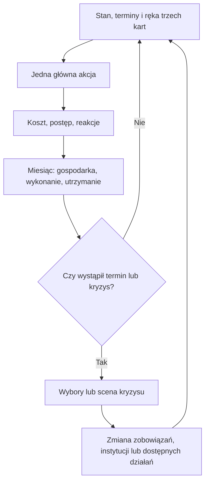

# Polska wersja: przewodnik po mechanice, decyzjach i ścieżkach rozgrywki

**Stan — referencja 0.74, 8 października 2026.** Przewodnik opisuje rozgrywkę pierwszego rozdziału w jednej aktualnej wersji. Gra ma wersję angielską i polską; język zmienia się w Opcjach albo odnośnikiem w nagłówku strony, także w trakcie gry. Opisy wyborów podają skutki słowami; ich wielkość w nawiasach pokazuje ustawienie „Liczby w opisach wyborów” w Opcjach. Pasek boczny ma zakładki Ogólne, Polityka, Gospodarka, Obronność i Sondaże, z pogrubioną etykietą przy każdej informacji; objaśnienia jego danych są w Bibliotece. Rozdział jest wdrożony w kodzie gry w całości; jego ograniczenia wymienia rozdział 18 [planu implementacji](POLISH_IMPLEMENTATION_PLAN.md). Liczby, wzory i kontrakty podaje [referencja techniczna](POLISH_TECHNICAL_REFERENCE.md); gdy przewodnik i referencja się różnią, obowiązuje referencja. Osoba kodująca znajdzie każdą kartę w jednej tabeli w [katalogu kart](POLISH_CARD_CATALOGUE.md). Wszystkie punkty audytu mechanik są zamknięte w dokumentacji. Liczby robocze sprawdzono w pełnych kampaniach etapu 8; liczby oznaczone P pozostają robocze. Historia kolejnych poprawek jest w dodatku na końcu i nie opisuje aktualnych reguł.

Gracz prowadzi kierownictwo PPS od stycznia 1922 do rozstrzygnięcia próby zamachu albo następnych legalnych wyborów parlamentarnych po 1922, jeśli do próby nie dochodzi. Głównym punktem zwrotnym jest kryzys majowy. Zakres obejmuje sprawy wewnętrzne. Raport końca rozdziału zachowuje stan do kontynuacji aż do 1939.

Gra ma jeden poziom trudności: **Normalny**. Nie wybiera się dodatkowego trybu historycznego; historyczna tendencja i możliwość alternatyw należą do tej samej kampanii. Zapisy i sondaże pozostają dostępne.

Najpierw warto przeczytać rozdziały 1–3, aby zrozumieć pętlę i koszty decyzji; rozdział 13 pokazuje główne ścieżki, a 17 — konkretne przebiegi kampanii. Rozdziały 4–12 wyjaśniają systemy potrzebne do ich wykonania. Podstawy historyczne, granica implementacji i otwarte parametry są zebrane na końcu, w rozdziale 19.

## 1. Na czym polega gra

W każdej turze PPS wybiera, w co zamienić ograniczony czas i zasoby: więcej wyborców, sprawniejszą organizację, porozumienie z partnerem, wykonaną reformę czy przygotowanie do kryzysu. Decyzje zmieniają trwały stan. Późniejsze karty sprawdzają ten stan i udostępniają albo blokują odpowiedzi.

Największa liczba głosów nie wystarcza do powodzenia. Partia potrzebuje kilku zdolności jednocześnie:

| Zdolność | Jak gracz ją buduje | Gdzie następuje sprawdzian |
|---|---|---|
| Wpływ wyborczy | Kampania, zasięg prasy, organizacja i wykonane obietnice | Wybory przeliczają głosy na mandaty |
| Wpływ parlamentarny | Relacje i porozumienia dotyczące konkretnych spraw | Głosowanie, wybór prezydenta, tworzenie i ratowanie rządu |
| Spójność PPS | Uzgodniona linia i rozwiązywanie sporów frakcji | Skuteczność kampanii, zgoda na kompromis, wykonanie wezwania do mobilizacji |
| Zaplecze społeczne | Związki, fundusze, TUR, prasa, spółdzielczość | Strajk, negocjacje, odporność na kryzys i działania przeciwników |
| Dostęp do wykonania | Resort albo wiążąca współpraca z odpowiednim ministrem | Wdrożenie ustawy, wypłata świadczeń, działanie administracji |
| Odporność państwa | Wykonalne finansowanie, skuteczny rząd i odpowiedzialne instytucje | Kryzys walutowy, przemoc, konflikt o wojsko |
| Przygotowanie do zamachu | Rozpoznanie, porozumienia, kolej, Milicja/AS i spójne stanowisko | Rzeczywiste zaangażowanie organizacji oraz bilans sił po decyzjach gracza |

Typowy ciąg udanej gry wygląda tak:

```text
rozwój zaplecza PPS
→ możliwość wiarygodnego nacisku lub współpracy
→ konkretne ustępstwo albo ustawa
→ zapewnienie wykonania
→ poprawa sytuacji odbiorców
→ większe zaufanie i lepsza pozycja w następnym sporze
```

Możliwy ciąg załamania:

```text
kosztowna obietnica bez przygotowania
→ brak wykonania
→ niezadowolenie robotników i frakcji
→ słabsza mobilizacja lub utrata partnera
→ utrata narzędzi wykonawczych
→ jeszcze mniejsza zdolność spełnienia obietnicy
```

To sprzężenia, nie obowiązkowe scenariusze. Gracz może przerwać zły ciąg: ograniczyć projekt, zmienić finansowanie, uzyskać innego partnera albo wycofać zobowiązanie, ponosząc jego polityczny koszt.

PPS działa również w opozycji. Może wymusić zmianę polityki albo zbudować organizacje bez wejścia do rządu. Nie otrzymuje jednak dostępu do policji, budżetu państwa czy wojska samą deklaracją, że popiera gabinet.

## 2. Jak czytać wybór i planować kilka tur naprzód

Każda ważna decyzja ma cztery warstwy. Dobry wynik natychmiastowy może okazać się przygotowaniem do późniejszego problemu.

| Horyzont | Co trzeba sprawdzić | Przykład |
|---|---|---|
| Teraz | Koszt akcji, zasobów, środków państwa i natychmiastowe reakcje | Fundusz strajkowy zużywa środki, które mogły pójść na kampanię |
| Następne miesiące | Odblokowane karty, odnowienie, utrzymanie i termin projektu | Przygotowany fundusz pozwala dłużej negocjować po rozpoczęciu strajku |
| Najbliższy kryzys | Czy powstała zdolność, która zadziała w odpowiednim momencie | Związek kolejarzy ma ludzi, zgodę na działanie i koordynację podczas zamachu |
| Koniec rozdziału | Co pozostanie po zużyciu zasobów i zmianie rządu | PPS pomogła zwycięzcy, lecz straciła organizację potrzebną do egzekwowania jego obietnic |

### Decyzje otwierające działania

Sfinansowanie prasy otwiera skuteczną kampanię o większym zasięgu. Uzgodnienie stanowiska z frakcjami zwiększa szansę, że organizacje wykonają późniejsze wezwanie. Objęcie resortu Pracy daje narzędzia do wykonania polityki pracowniczej. Porozumienie ze Skarbem może zapewnić jej finansowanie.

Każde z tych przygotowań usuwa inną blokadę. Prasa nie zastępuje zgody związku na strajk. Większość parlamentarna nie zastępuje właściwego wykonawcy i finansowania reformy. Wysokie poparcie PPS nie tworzy automatycznie pieniędzy w jej kasie.

### Decyzje zamykające możliwości

Okna zamykają się z określonego powodu: kończy się kampania, partner przyjmuje inną ofertę, upływa termin umowy, odchodzi minister, wyczerpuje się fundusz lub zaczyna się walka. Ekran projektu pokazuje, czego zabraknie i kiedy.

Rozwój Milicji po rozpoczęciu zamachu nie daje natychmiast wyszkolonych ludzi. Podwyżka świadczeń przyjęta po upadku popieranego gabinetu wymaga nowego wykonawcy. Dobry sondaż uzyskany po wyborach nie zmienia aktualnych mandatów.

### Najważniejsze kolizje

- Kampania daje szybki efekt wyborczy, ale konkuruje o czas z budową struktur, które pomagają podczas kryzysów.
- Tolerowanie gabinetu daje wpływ bez ministerstw, ale wiąże PPS z częścią jego rezultatów.
- Obrona płac pomaga robotnikom, lecz wymaga wskazania, kto finansuje ustępstwo i czy zaakceptuje je partner.
- Współpraca z komunistami ułatwia wybrane akcje robotnicze, lecz utrudnia porozumienie z partnerami odrzucającymi uzgodniony program tej współpracy.
- Ustępstwo wobec Piłsudskiego może obniżyć presję na zamach i równocześnie wzmocnić jego pozycję w wojsku.
- AS zwiększa możliwości koordynacji samoobrony, ale wymaga utrzymania. Jej użycie w walce może zużyć zaplecze potrzebne do dalszej polityki.

## 3. Tura, trzy talie i projekty

### Co robi gracz w miesiącu

Gracz przegląda stan i terminy, dobiera karty do wspólnej ręki mieszczącej trzy karty, a następnie wykonuje jedną główną akcję. Może zagrać kartę partyjną, parlamentarną lub dostępną rządową, także dotyczącą rozpoczętego projektu. Wszystkie korzystają z tego samego czasu.

Po działaniu rozliczane są bezpośrednie skutki. Następnie mija miesiąc: działają polityki w toku, zmienia się gospodarka, upływają terminy i czasy odnowienia. Na końcu gra sprawdza obowiązkowe wydarzenia i konsekwencje.



Wybory, rozpoczęte głosowania i fazy zamachu mają własne sekwencje. Kolejne kliknięcie nie zużywa w nich automatycznie miesiąca. Gracz nie może ominąć obowiązkowego głosowania, wybierając zamiast niego zbiórkę składek.

### Karty partyjne: jakie decyzje podejmuje gracz

Karty PPS dotyczą kierunku partii, sojuszników, programu i organizacji. Zwykle wybieramy jedną opcję. **Wyjątki to program gospodarczy — do trzech priorytetów — oraz organizacje — do dwóch inwestycji.** Cały zatwierdzony zestaw zajmuje jedną główną akcję; sumuje koszty wybranych inwestycji. Przeglądanie opcji nie uruchamia skutków.

| Karta | Dostępne wybory | Co zmienia strategicznie |
|---|---|---|
| **Kierunek polityczny PPS** | Socjalizm parlamentarny; samodzielna polityka klasowa; obrona zdobyczy robotniczych; szeroki ruch demokratyczny | Priorytet kampanii i organizowania oraz oczekiwania zaplecza; użyteczność zależy od sytuacji |
| **Główny przeciwnik polityczny** | Prawica narodowa; komuniści; partie broniące kapitału i ziemiaństwa; przemoc przeciw konstytucji niezależnie od sprawcy | Cel polemik i przejmowania wyborców; koszt relacji z zaatakowanym środowiskiem. Nie ma opcji „obecny gabinet”. Prawicą narodową jest ZLN; obrońców kapitału i ziemiaństwa oraz sprawców przemocy wskazują ich rzeczywiste stanowiska i czyny. Bez adresata kampanii polemicznej nie da się prowadzić |
| **Stosunki z innymi partiami** | Zbliżenie do Wyzwolenia, Piasta, NPR, chadecji lub innego dostępnego partnera | Przygotowanie przyszłych list, umów i głosowań. Podpisanie konkretnej umowy pozostaje sprawą parlamentarną. Z KPP najpierw trzeba otworzyć kontakt; kolejne kroki pokazuje potem stała pozycja agendy |
| **Wpływ Piłsudskiego na władzę** | Popierać jego wpływ; popierać warunkowo; sprzeciwiać się ingerencji wojska w politykę | Relacja z Piłsudskim, stosunek własnej frakcji i granice późniejszych ustępstw. Linia nie blokuje ustępstw, tylko je ogranicza: przy sprzeciwie nie można dać samodzielnego inspektoratu |
| **Program gospodarczy PPS** | Do trzech: stabilizacja z osłonami; roboty publiczne i zatrudnienie; podatki majątkowe i kapitał na inwestycje; uspołecznienie wybranych przedsiębiorstw; program agrarno-robotniczy | Zestaw programowych priorytetów do przygotowania, negocjowania i wykonania. Ten sam zestaw można potwierdzić za akcję miesiąca, bez innych skutków; odłożenie karty na rękę nic nie kosztuje |
| **Jakiej władzy chcemy** | Parlamentaryzm; silniejsza prezydentura; rady robotnicze | Docelowy model władzy i zgodność oferty PPS z partnerami. Deklaracja nie zmienia obowiązującego ustroju. Tylko przy silniejszej prezydenturze PPS może przygotować reformę arbitrażu prezydenta |
| **Charakter partii i jej elektorat** | Partia robotnicza; robotniczo-chłopska; szeroka partia demokratyczna; zachowanie własnego profilu i rozszerzanie wpływu przez sojusze | Odbiorcy rozbudowy struktur i kampanii, rywalizacja o elektorat oraz spór o tożsamość PPS |
| **Mniejszości słowiańskie — autonomia** | Federacja; autonomia wojewódzka; swobody języka, edukacji i organizacji bez autonomii; polonizacja | Zakres oferty ustrojowej i praw mniejszości oraz jej koszt koalicyjny |
| **Współpraca z organizacjami żydowskimi** | Szeroka współpraca i prawa w programie; współpraca tylko w sprawach pracy; brak współpracy | Dostęp do wspólnych kampanii i porozumień, zwłaszcza z Bundem; bez automatycznego przejęcia żydowskich głosów. Bund jest organizacją robotniczą, nie partią |
| **Organizacje PPS** | Do dwóch różnych organizacji: związki, prasa, TUR, Milicja, spółdzielczość i samopomoc. Zamknięcie karty bez wyboru nic nie kosztuje | Konkretne zdolności do późniejszych działań, przy pełnych kosztach inwestycji i utrzymania |
| **Milicja PPS** | Rekrutacja; militaryzacja; po odpowiednim rozwoju przekształcenie w AS | Liczebność, sprawność i szerszy zakres zadań; reorganizacja jest następstwem przygotowania |
| **Media i kampania** | Wybrać prasę programową lub popularną; przeprowadzić kampanię z wybranym hasłem i odbiorcami; kampania mobilizacyjna przed wyborami; śledztwo prasowe w prawdziwej sprawie | Zasięg, wiarygodność, dochód prasy albo wykorzystanie istniejących mediów do politycznej mobilizacji |
| **Składki partyjne** | Podwyższyć; obniżyć; utrzymać. Utrzymanie kosztuje akcję miesiąca i niczego nie zmienia; odłożenie karty na rękę nic nie kosztuje | Przyszłe dochody PPS i koszt członkostwa, szczególnie odczuwalny w kryzysie |
| **Jedność partii i kierownictwo** | Ustępstwo dla frakcji; uzgodnienie linii współpracy z komunistami; przekonanie do odroczenia; usunięcie części członków frakcji | Wykonalność polityki i skład zaplecza. Karta pojawia się tylko przy sporze w partii albo otwartym kontakcie z KPP. Odroczenie daje 3 miesiące bez groźby rozłamu. Czystka zmniejsza dissent kosztem wpływów i poparcia |
| **Zmiana doradców** | Powołać lub odwołać doradców na trzech miejscach | Skład doradców i ich akcje; osobna karta z półrocznym odnowieniem |
| **PPS wobec modelu sowieckiego** | Solidaryzować się z próbą socjalizmu; zachować samodzielność PPS; potępić autorytaryzm | Zwykła karta partii od początku rozdziału; relacje z KPP i dissent, bez dyplomacji i bez automatycznej koalicji |

Obecną linię można wybrać ponownie jako jej potwierdzenie. Kosztuje to akcję miesiąca, a karta czeka jak po zmianie, ale nic więcej się nie dzieje: frakcje nie reagują, a premie się nie powtarzają. Odłożenie karty na rękę („Odłóż na rękę”) nic nie kosztuje. Zmiana linii może wywołać sprzeciw frakcji: Centrum reaguje na poparcie wpływu Piłsudskiego, a Piłsudczycy na sprzeciw wobec ingerencji wojska.

To katalog rodzin kart; dystrybucja prasy, poszczególne inwestycje i wybór doradców są ich podmenu. Nie dokładamy każdej podakcji jako nowej karty do losowania. Koszty i odnowienia są wspólne niezależnie od drogi wejścia — inwestycja w Milicję przez „Organizacje PPS” nie pozwala ominąć odnowienia jej własnej karty.

### Kierunek ma inne znaczenie przed kryzysem i w jego trakcie

**Szeroki ruch demokratyczny** w spokojnym okresie buduje partnerów, kadry i przywiązanie własnych organizacji do legalnych reguł. Nie daje dużej automatycznej premii za obronę instytucji, którym nic aktualnie nie zagraża. Trzeba sfinansować kampanię, kurs TUR albo uzgodnić wspólne działanie z partnerem.

Gdy pojawia się przemoc polityczna, próba obejścia Sejmu lub realna groźba zamachu, to samo przygotowanie pomaga zorganizować obronę instytucji. Wtedy rośnie znaczenie hasła demokratycznego, a związki i Milicja sprawdzają wcześniej przyjętą linię. Taki konflikt może wystąpić już w kryzysach 1922–1923; gra nie czeka mechanicznie do maja 1926. Po ewentualnym zwycięstwie Piłsudskiego raport zachowa zaplecze do przyszłej walki o demokrację pod Sanacją, ale jej późniejsze rządy należą do następnego rozdziału.

Pozostałe kierunki też zależą od stanu. Obrona zdobyczy robotniczych staje się pilniejsza, gdy rząd ogranicza płace, czas pracy lub świadczenia. Socjalizm parlamentarny potrzebuje partnerów i wykonalnych projektów. Samodzielna polityka klasowa wzmacnia własny profil w sporze z konkurentami, lecz utrudnia kompromis wymagający odłożenia tego programu. Żaden wybór nie wyłącza wszystkich pozostałych działań.

### Dwa różne wybory dotyczące Piłsudskiego

Trwała karta określa, **jakiego wpływu Piłsudskiego PPS chce**. Osobna karta wydarzenia pyta, **jak odpowiedzieć na jego konkretną krytykę parlamentu**:

- poprzeć jego krytykę parlamentaryzmu;
- bronić parlamentu i legalnego sposobu zmiany rządu;
- stwierdzić, że parlament należy reformować, aby działał skuteczniej. Ta odpowiedź wspiera legalny reformizm, ale nie otwiera ścieżki, nie tworzy projektu i nie daje gotowych głosów.

Odpowiedź zmienia autorytet Sejmu na 12 miesięcy: poparcie krytyki o −2, obrona parlamentu o +1, propozycja reformy wcale. To niewielki, ale trwały skutek.

Można popierać jego konstytucyjny udział we władzy i sprzeciwić się atakowi na Sejm. Można też podważać parlament, pozostając krytycznym wobec rządów wojskowych i preferując rady robotnicze. Gra zapisuje oba stanowiska oraz ujawnione sprzeczności; pojedyncza odpowiedź nie przestawia całej polityki PPS. Odpowiedzi nie można pominąć: gracz wybiera jedną z trzech w miesiącu wystąpienia. Za sprzeczność gra uznaje tylko poparcie krytyki parlamentaryzmu przy linii parlamentaryzmu. Przed zatwierdzeniem pojawia się wtedy ostrzeżenie, a sprzeciw Centrum rośnie dodatkowo o 3. Dopiero uzgodnione i wykonane ustępstwo zmienia rzeczywistą pozycję Piłsudskiego w państwie.

### Trzy priorytety programu i dwa wybory organizacyjne

Program gospodarczy ustala **do trzech aktywnych priorytetów łącznie**, nie trzy kolejne dodatki przy każdym pojawieniu się karty. Można połączyć stabilizację z osłonami, podatki majątkowe i roboty publiczne. Wtedy PPS ma konkretną propozycję finansowania zatrudnienia podczas stabilizacji; nadal potrzebuje projektu, umowy, odpowiednich kompetencji i pieniędzy państwa. Dodanie uspołecznienia wymaga zwolnienia jednego miejsca, a jego koszty zależą później od zakresu i rekompensat.

Usunięcie priorytetu nie kasuje przyjętej ustawy ani obietnicy danej partnerowi. Zmiana programu może więc ułatwić nową koalicję i jednocześnie otworzyć konflikt z poprzednim zapleczem.

Na karcie organizacji można np. wybrać **prasę i TUR**: zapłacić za dystrybucję oraz rozpocząć budowę sieci edukacyjnej w jednej głównej akcji. Prasa zyskuje zasięg od razu, TUR wymaga czasu i utrzymania. Przy wyborze związków wskazujemy rozbudowę branży albo jej fundusz; przy Milicji rekrutację albo militaryzację. Dwa miejsca dotyczą dwóch różnych organizacji. Nie dają dwóch etapów rozwoju tej samej Milicji ani natychmiastowej AS.

### Strajki i współpraca komunistyczna należą do wydarzeń

Decyzję o strategii protestu podejmujemy w odpowiedzi na konkretny spór — przede wszystkim w kryzysie krakowskim i strajkach 1923. Wybieramy rokowania, kontrolowany strajk, eskalację żądań albo wycofanie. Rozpoczęta sprawa zostaje w agendzie. Zwykła karta organizacji wcześniej dostarcza jej zaplecza.

Gdy w akcji obecni są komuniści, pojawia się **odrębna karta współpracy**: pełne współdziałanie przy uzgodnionych żądaniach, lekka koordynacja z osobnymi kierownictwami albo brak współpracy. Nie jest to wybór między automatycznym pokojem i automatyczną przemocą. Wspólna organizacja może zwiększyć nacisk i pomóc kontrolować protest; odmowa uzgodnionego końca przez partnera może go rozbić. Reakcja władz, własne instrukcje i posłuch nadal wpływają na brutalizację.

**Jak zacząć współpracę z komunistami.** Od początku rozdziału PPS może otworzyć kontakt z KPP w karcie Stosunki z partiami. Kolejne kroki — uzgodnienie próby, zasad i szerszego układu — pokazuje potem stała pozycja agendy „Współpraca z KPP”. Potem zwykłe rozmowy, najwyżej co trzy miesiące, poprawiają relację. Po kilku miesiącach możliwa jest lekka koordynacja w strajku, a po około roku pełna współpraca. Każdy krok kosztuje akcję, więc to realny wybór kosztem innych planów. Wrogie stanowisko wobec komunistów może zamknąć tę drogę.

**Czy komuniści dotrzymają ustaleń.** Zależy to od dwóch rzeczy: relacji PPS z KPP i tego, czy wspólne żądania odpowiadają celom komunistów w tym strajku. Gdy PPS ogranicza żądania poniżej ich celu, rośnie ryzyko, że zerwą wspólny koniec akcji. Ustąpienie w żądaniach daje pewniejszego partnera; trzymanie ostrożniejszych żądań — większe ryzyko. Nastroje we frakcjach PPS nie zmieniają zachowania komunistów.

**Zgoda własnej partii.** Zanim PPS podejmie współpracę, może uzgodnić dopuszczalną linię opcją „Kompromis” w karcie „Jedność i kierownictwo”. Gdy ta zgoda jest wystarczająca, Centrum nie protestuje przeciw współpracy. Ta sama zgoda jest też warunkiem trwałego frontu.

Zwykła karta partii dotyczy **stanowiska PPS wobec modelu sowieckiego**; jest dostępna od początku rozdziału, bez oczekiwania na osobne wydarzenie. Robocze odpowiedzi to solidarność z sowiecką próbą budowy socjalizmu, niezależne stanowisko dopuszczające współpracę robotniczą bez przyjęcia tego modelu albo potępienie sowieckiego autorytaryzmu. Zmieniają krajowe relacje z KPRP/KPP, spory w PPS i wiarygodność wobec partnerów. To nie nowa talia dyplomacji ani źródło automatycznej pomocy z Moskwy.

Osobną kartę religii pomijamy w pierwszym rozdziale. Sprawy oświaty, konkordatu lub konkretnego nabożeństwa zachowują własne decyzje we właściwych wydarzeniach i resortach.

### Co budują karty parlamentarne

To 10 rodzin decyzji. Część trafia do zwykłego doboru, część otwiera się gwarantowanie po wyborach, upadku rządu lub rozpoczęciu konkretnego kryzysu. Rozpoczęte projekty pozostają w agendzie. Nie dostajemy wszystkich kart i wszystkich opcji w każdym miesiącu.

| Karta | Wybory gracza | Dostępność i znaczenie strategiczne |
|---|---|---|
| **1. Tworzenie gabinetu i udział PPS** | Dostępna konfiguracja i premier; wejście, tolerowanie albo opozycja; poparcie mniejszości, warunki i konkretne resorty | Jedna sekwencja formowania. Niedostępne układy są wyszarzone z powodem; Grabski jest jednym z profili oferty |
| **2. Zabezpieczenie bezrobotnych — D1 i D2** | Rozpocząć inicjatywę albo jej nie podejmować; następnie pełny projekt lub dostępny kompromis, a bez niego wycofanie | Jedna ustawa w rozdziale, dopiero po wyborach 1922 i poza formalnym rządem. Dwie karty; wynik Sejmu w D2, reszta procedury automatycznie według kalendarza |
| **3. Budżet i koszty kryzysu** | Poprzeć, chronić wydatki robotnicze, obciążyć majątek, zaproponować pożyczkę zamiast cięć albo odmówić | Tylko jako koalicjant lub rzeczywiste zewnętrzne zaplecze gabinetu, także eksperckiego; potrzebny aktualny pakiet. „Obciążyć majątek” to podatek progresywny albo majątkowy, a „pożyczka” to krajowa pożyczka przy dobrym kredycie |
| **4. Reforma konstytucyjna** | Gwarancje demokracji, stabilizacja gabinetów przez konstruktywne wotum albo silniejszy prezydent | Przygotowanie i uchwalenie odrębnej reformy; stanowisko partyjne samo jej nie wprowadza |
| **5. Parlamentarna kontrola wojska** | Pełniejszy nadzór cywilny albo ograniczona reforma, łatwiejsza do uchwalenia i o połowę słabsza | Ustawy i kontrola polityczna przy rzeczywistej sprawie; nominacje i ustępstwa wykonawcze pozostają rządowe |
| **6. Stosunek do rządu** | Wycofać poparcie, negocjować ustępstwa albo przekonać rząd; „utrzymać poparcie” tylko jako odpowiedź na ostrzeżenie lub ultimatum partnera | Obejmuje tolerowanie, koalicję i ewentualny wniosek o odwołanie. W opozycji: poprzeć albo odrzucić konkretną inicjatywę odwołania |
| **7. Porozumienie wyborcze** | Własna lista, PPS–Wyzwolenie, PPS–NPR, warunkowy wcześniejszy Centrolew; zabieganie o porozumienie z blokiem ludowym | W oknie przygotowania list; blok Piasta i Wyzwolenia wymaga ich własnej zgody. Lista nie jest automatyczną koalicją. Wcześniejszy Centrolew z samym „minimum społecznym” budzi sprzeciw Lewicy |
| **8. Wybór marszałka** | Poparcie Śmiarowskiego, Rataja albo Daszyńskiego według dostępności | Właściwy wybór lub wakancja; liczą się głosy, a później konsekwencje sukcesji |
| **9. Wybór prezydenta** | Zgłosić własnego dostępnego kandydata albo nie | Jedna decyzja PPS i wynik końcowego głosowania; bez ręcznego przechodzenia przez wiele tur |
| **10. Ugoda i reakcja na represje/strajki 1923** | Żądać cofnięcia represji i ustępstw, szukać ugody albo poprzeć porządek i wezwać do końca strajku | Odpowiedź parlamentarna w rzeczywistym kryzysie; czyta wcześniejsze żądania i posłuch organizacji |

Przy tworzeniu rządu gracz nie ustawia osobnego „priorytetu negocjacyjnego”. Składa konkretną ofertę. Lewica bez wystarczającego poparcia nie może zostać wybrana tylko dlatego, że jest preferowaną ścieżką PPS; szerokie gabinety stabilizacyjne wymagają kryzysu. Zabieganie o mniejszości może otworzyć rozmowy, lecz dopiero uzgodnione warunki dają ich rzeczywiste wsparcie.

Jedyną samodzielną zwykłą inicjatywą ustawodawczą PPS poza rządem jest w tym rozdziale zabezpieczenie bezrobotnych. Reforma konstytucyjna i kontrola parlamentarna mają własne karty, a polityki resortowe pozostają rządowe. Budżetowe negocjacje z pozycji zaplecza gabinetu są niedostępne w opozycji, ale PPS zachowuje prawo do głosowania nad budżetem i wniesienia tej inicjatywy. Parlamentarna reakcja na strajk nie wybiera ponownie Milicji ani współpracy komunistycznej. Kontrakty, tryby pojawiania się i koszty: 17.10 referencji.

### Co dają karty rządowe

Aktualny katalog ma **16 podstawowych rodzin**. Reakcja władz podczas strajku należy do wspólnej sceny B8+B10, a osobna karta konfliktu z przedsiębiorcami została usunięta. Nie wszystkie są stale losowane: reforma walutowa potrzebuje właściwej sytuacji, remont ma ograniczony zakres, a rozpoczęte projekty przechodzą do agendy. Gracz korzysta ze wspólnej jednej akcji miesięcznie. Obowiązkowa reakcja wydarzenia nie tworzy drugiej puli miesięcznych działań.

Posiadanie ministerstwa otwiera jego narzędzia, ale nie zastępuje budżetu, ustawy, wykonawcy ani zgody partnerów. Uzgodniony wykonawca z innego resortu daje dostęp do wskazanego projektu, nie całej jego talii. Niedostępne opcje pokazują powód. Karta wybiera politykę lub kolejny etap; nie wypłaca pełnej korzyści za samą deklarację. Ponowne otwarcie zmienia albo rozszerza istniejący program bez drugiej nagrody za wykonany zakres.

| Nr / karta | Resort i dostęp | Wybory gracza |
|---|---|---|
| **1. Prawa pracownicze** | Praca | Inspekcja i egzekwowanie czasu pracy; układy zbiorowe; ograniczone odstępstwa w zagrożonych zakładach |
| **2. Świadczenia i pomoc bezrobotnym** | Praca | Rozszerzyć ochronę; skupić pomoc na najbardziej potrzebujących; ograniczyć świadczenia |
| **3. Polityka finansowa** | Skarb | Obciążyć wysokie dochody i majątek; obciążyć szerokie grupy (podatki pośrednie, szersza podstawa podatku albo cła); pożyczka krajowa; oszczędności ze wskazaniem wydatków; finansowanie z emisji; usprawnić pobór podatków |
| **4. Stabilizacja waluty** | Skarb; kryzys, potem agenda | Szybka stabilizacja z oszczędnościami; osłony i obciążenie majątku; stopniowe ograniczanie emisji |
| **5. Kapitał na inwestycje** | Skarb / Przemysł i Handel; właściwy wykonawca | Fundusz publiczny; porozumienie z bankami i przemysłem; finansowanie spółdzielcze |
| **6. Polityka wobec przemysłu** | Przemysł i Handel; wskazana branża lub zakład | Warunkowy kredyt, ogólny albo na ratunek wskazanego zakładu; zamówienia publiczne; przejęcie pod kontrolę publiczną; reprezentacja pracownicza w uprawnionym przedsiębiorstwie |
| **7. Roboty publiczne** | Praca; finansowanie | Szybkie zatrudnienie bezrobotnych; transport i infrastruktura; mieszkalnictwo robotnicze |
| **8. Wykonanie reformy rolnej** | Rolnictwo | Parcelacja z odszkodowaniem; przyspieszona parcelacja; wywłaszczenie bez odszkodowania. Następnie: dostęp według potrzeb albo preferencja polskiej większości |
| **9. Modernizacja rolnictwa** | Rolnictwo | Doradztwo i wyposażenie; dobrowolna komasacja; spółdzielcze przetwórstwo i sprzedaż |
| **10. Polityka oświatowa** | Oświata | Szkoły na wsi; edukacja ubogich i dorosłych w ośrodkach robotniczych; świecki model szkoły z wolnością religijną |
| **11. Prawa językowe i szkoły mniejszości** | Oświata; współpraca z MSW w jego kompetencjach | Nauka we własnym języku; uzgodniona dwujęzyczność; dominacja języka polskiego |
| **12. Policja i bezpieczeństwo wewnętrzne** | Sprawy Wewnętrzne | Profesjonalizacja i podporządkowanie legalnym władzom; badanie wskazanej przemocy skrajnej prawicy; badanie wskazanej przemocy komunistów; ochrona zgromadzeń i instytucji |
| **13. Wymiar sprawiedliwości** | Sprawiedliwość | Szeroka reforma gwarancji procesowych i odpowiedzialności za nadużycia; ograniczone usprawnienia i rozliczenie naruszeń |
| **14. Polityka wojskowa** | Sprawy Wojskowe | Wdrożyć nadzór cywilny; legalne zmiany kadrowe; kompromis organizacyjny ograniczający reformę |
| **15. Porozumienie z Piłsudskim** | Właściwa oferta rządowa, 16.7 referencji | Funkcja wojskowa pod nadzorem; samodzielniejszy inspektorat i nominacje; legalne premierostwo; odmówić |
| **16. Wawel albo Zamek Królewski** | Oświata; ograniczona sprawa | Wybrać obiekt, potem: konserwacja albo większy remont z dostępem publicznym |

**1. Prawa pracownicze — skutek strategiczny.** Inspekcja chroni także słabo zorganizowanych pracowników. Układ wymaga zgody związku i pracodawcy; nie obciąża budżetu, bo płaci pracodawca. Odstępstwo może pomóc zakładowi, ale naruszyć obietnicę PPS; musi być prawnie dopuszczalne. Też nie obciąża budżetu i zmniejsza presję przedsiębiorców, ale budzi niezadowolenie objętych pracowników i wygasa w terminie.

**2. Świadczenia i pomoc bezrobotnym — skutek strategiczny.** Pomoc zmniejsza materialny koszt bezrobocia, nie jego stopę. Koszt i korzyści zależą od rzeczywistych odbiorców. Rozszerzenie obejmuje kolejną grupę i podnosi koszt. Skupienie daje pełną pomoc połowie odbiorców, najbardziej potrzebującym, za połowę kosztu. Cięcia rozliczają ich straty i zobowiązania PPS.

**3. Polityka finansowa — skutek strategiczny.** Rząd przygotowuje źródło finansowania. Majątek, konsumpcja, dług i cięcia obciążają różne grupy. Emisja pokrywa lukę tylko w upoważnionym limicie i podnosi inflację. Lepszy pobór daje raz w rozdziale stały, niewielki dochód bez nowego podatku. Parlament nadal podejmuje wymagane decyzje.

**4. Stabilizacja waluty — skutek strategiczny.** Szybkość dostosowania konkuruje z ochroną społeczną. Wariant z osłonami potrzebuje finansowania; stopniowy przedłuża narażenie na inflację. Jedna reforma, bez wielokrotnej premii za zmianę waluty.

**5. Kapitał na inwestycje — skutek strategiczny.** Publiczny wariant daje kontrolę nad środkami i koszt państwu. Prywatny wymaga zgody banków i dobrego kredytu: państwo płaci połowę budowy, a zasługę dzieli z przedsiębiorcami. Spółdzielczy kieruje kredyt do gospodarstw i małych zakładów, ma pełny koszt i ograniczony zasięg. Żaden nie tworzy pieniędzy bez źródła.

**6. Polityka wobec przemysłu — skutek strategiczny.** Kredyt odpowiada na brak płynności, zamówienia na brak popytu, przejęcie na problem kontroli. Kredyt trafia na cały rynek albo ratuje jeden wskazany zakład. Warunki zatrudnienia i praw pracy zapisuje umowa. Zmiana właściciela nie zastępuje środków i zarządzania.

**7. Roboty publiczne — skutek strategiczny.** Pierwszy wariant szybciej daje pracę, drugi przynosi opóźniony efekt infrastruktury, trzeci poprawia warunki mieszkaniowe. To projekty Ministerstwa Pracy; nie wymagają osobnego resortu Komunikacji.

**8. Wykonanie reformy rolnej — skutek strategiczny.** Sposób parcelacji zmienia koszt, tempo i opór właścicieli. Preferencja narodowościowa może złamać umowy mniejszościowe. Radykalny wariant wymaga zmiany sprzecznych gwarancji prawnych.

**9. Modernizacja rolnictwa — skutek strategiczny.** Poprawia gospodarowanie, układ gruntów albo pozycję wobec pośredników. Korzyści nie trafiają automatycznie do bezrolnych i nie zastępują parcelacji.

**10. Polityka oświatowa — skutek strategiczny.** Dwa pierwsze projekty mają różnych odbiorców; trzeci zmienia reguły szkoły i może kolidować z chadecją. Nie budzi osobnego sprzeciwu frakcji PPS; wariant sprzeczny z umową łamie umowę z partnerem. Rozbudowa i świeckość mogą współistnieć. Państwowa oświata nie zwiększa automatycznie TUR.

**11. Prawa językowe i szkoły mniejszości — skutek strategiczny.** Wykonuje lub narusza wcześniejsze porozumienia. Dwujęzyczność jest ugodą tylko po zgodzie zainteresowanych. Dwie istniejące kategorie mniejszości; autonomia nie powstaje przez decyzję szkolną.

**12. Policja i bezpieczeństwo wewnętrzne — skutek strategiczny.** Przygotowanie aparatu poprawia późniejsze wykonanie. Śledztwo wymaga konkretnej sprawy, nie generuje dowodów z etykiety przeciwnika. Kosztuje akcję i 1 B przez miesiąc. Potwierdzone śledztwo przypisuje sprawę partii, którą PPS może potem wskazać jako „przemoc przeciw konstytucji” w wyborze głównego przeciwnika. Państwowa policja pozostaje odrębna od Milicji PPS.

**13. Wymiar sprawiedliwości — skutek strategiczny.** Szeroki wariant prowadzi do istniejącej reformy gwarancji demokratycznych, ze wspólnym projektem i kosztem. Ograniczony kieruje konkretne nadużycie do właściwego organu. Potwierdzone naruszenie może zakończyć daną restrykcję; minister nie wybiera wyroku.

**14. Polityka wojskowa — skutek strategiczny.** Nadzór, kadry i kompromis zmieniają inne elementy systemu. Efekty dotyczą konkretnych dowództw i kompetencji, nie całej armii automatycznie lojalnej wobec PPS.

**15. Porozumienie z Piłsudskim — skutek strategiczny.** Ustępstwo może zmniejszyć motywację do zamachu i zwiększyć możliwości wojskowe. Premierostwo prowadzi do tej samej karty tworzenia gabinetu, bez drugiego kosztu inicjatywy.

**16. Wawel albo Zamek Królewski — skutek strategiczny.** Ograniczony prestiż i korzyść kulturalna, koszt konkurujący ze szkołami. Jedno przedsięwzięcie na obiekt, bez powtarzania nagrody i osobnej minigry remontowej.

**Konkretny zakres wykonania M07.** Wszystkie poniższe działania korzystają z istniejących kart, projektów i umów. Podane B są obciążeniem budżetu w okresie, a miesiące wdrożenia zakładają pełne finansowanie.

| Działanie | Akcje i roboczy koszt | Co gracz rzeczywiście uzyskuje |
|---|---|---|
| **Zamówienia przemysłowe** | Jedna akcja; 1 B przez trzy miesiące kontraktu | Przy wykonaniu +0,30 pp miesięcznego wkładu produkcji; bezrobocie reaguje przez gospodarkę. Jeden aktywny pakiet, bez osobnej premii zatrudnienia |
| **Profesjonalizacja policji** | Jedna akcja; 1 B przez trzy miesiące wdrożenia | Po ukończeniu dowodzenie +10 i wykonywanie legalnych poleceń +10, do 100. Poprawia obecną zdolność ochrony; raz w rozdziale |
| **Przegląd nadużycia** | Jedna akcja; 1 B przez miesiąc | Właściwy organ rozpatruje konkretną represję. Potwierdzona bezprawność pozwala usunąć daną restrykcję; brak podstaw nie daje oczekiwanej ulgi |
| **Szersze gwarancje prawne** | Istniejąca procedura demokratyzacji: dwa etapy przygotowania oraz 1 B przez miesiąc po promulgacji | Te same gwarancje i możliwość prawnej obrony co w projekcie konstytucyjnym; bez drugiego kosztu i premii za wejście przez Sprawiedliwość |
| **Nominacje w ramach kontroli cywilnej** | Dwie akcje; 1 B przez trzy miesiące wdrożenia | Wskazana grupa: +0,05 lojalności wobec legalnych władz, przejściowo −0,05 gotowości przez dwa miesiące od nominacji. Wymagane stanowisko, kandydat i upoważnienie |
| **Konsultacyjna reprezentacja pracowników** | Jedna akcja, bez dodatkowego B | Informacja i obowiązkowe konsultacje, bez weta; niezadowolenie objętych pracowników −2 raz |
| **Współdecydowanie pracowników** | Dwie akcje; 1 B przez dwa miesiące wdrożenia | Zgoda reprezentacji potrzebna przy wskazanych zwolnieniach i zmianach płac; niezadowolenie −4 raz, a po wcześniejszych konsultacjach tylko brakująca różnica −2 |

Zamówienie wymaga dostawców, zamawiającego, przedmiotu i środków. Brak dostaw nie daje produkcji; niepełne wykonanie zmniejsza efekt, a kontrakt wygasa po trzech miesiącach. Roboty publiczne nadal tworzą własne miejsca pracy i infrastrukturę, kredyt poprawia dostęp do finansowania, a przejęcie zmienia kontrolę nad zakładem.

Szkolenie policji pomaga państwu także po odejściu PPS z rządu. Nie dodaje ludzi do partyjnej Milicji. Nominacja wojskowa nie zmienia całej armii: powtórzenie tej samej reformy nie zwiększa ponownie lojalności. **+8 presji zamachowej wymaga konkretnego konfliktu**, nie samego kliknięcia zmiany dowódcy. Porozumienie nadające wpływ Piłsudskiemu zachowuje własną kartę i jeden zestaw skutków.

Reprezentacja pracowników jest dostępna w przedsiębiorstwie publicznym albo prywatnym objętym umową właściciela. Konsultacje wymagają wysłuchania pracowników, ale pozwalają podjąć inną decyzję. Współdecydowanie wymaga ich zgody w zapisanym zakresie; odmowa może zatrzymać plan zwolnień. Podstawa prawna i uprawniony wykonawca są konieczne. Czapiński może przyspieszyć jeden dozwolony etap, lecz zwykła karta przemysłu również pozwala podjąć projekt. Państwo rad nie jest do tego wymagane.

**Ograniczona autonomia administracyjno-kulturalna** przekazuje samorządowi wskazanego obszaru kompetencje w sprawach szkół, języka urzędowego i kultury. Uzgodniony punkt programu gabinetu otwiera zwykłą agendę: dwie akcje, 1 B przez trzy miesiące wdrożenia, potem bez dodatkowego utrzymania samej delegacji. Potrzebne są ustawa, MSW oraz współpraca Oświaty w jej zakresie. Sama deklaracja partyjna nie wykonuje projektu, a opozycja PPS nie otrzymuje przez to drugiej ustawy D.

Po przyjęciu prawa i wykonaniu przekazania następuje jednorazowe −3 niezadowolenia objętej ludności oraz rozliczenie zawartej umowy. Dalsze decyzje państwa muszą respektować kompetencje samorządu albo legalnie zmienić ich zakres; bezprawne naruszenie uruchamia istniejące sprawy nadużyć i zobowiązań. Nie powstaje nowy parlament regionalny, osobna pula wyborców ani darmowe szkoły. Budowa placówek nadal wymaga programu oświatowego i pieniędzy.

**Rady jako ustrój i federacja są celami programu na dalszą część gry.** W pierwszym rozdziale mają znaczenie dla frakcji, kampanii i porozumień. Pierwsze przyjęcie programu rad roboczo wzmacnia Lewicę o 4 surowe punkty przed normalizacją i zwiększa dissent Centrum o 3; powrót do tej samej linii nie daje ponownie siły. Federacja ma własną pozycję przy ocenie ofert; można uzgodnić prawa językowe lub ograniczoną autonomię jako krok pośredni. Nie ma przycisku „wprowadź federację” ani projektu państwa rad bez możliwego finału. Raport przenosi program oddzielnie od rzeczywiście obowiązujących reform.

Niedofinansowanie projektów wdrażanych stopniowo opóźnia lub zatrzymuje wykonanie. Odmowa wymaganych zgód nie daje ustawowych uprawnień, a same deklaracje nie dają nagród za reformę. Zasługa PPS i reakcja przedsiębiorców nadal korzystają ze wspólnych reguł. Dokładne kontrakty: [17.12.1–7 referencji](POLISH_TECHNICAL_REFERENCE.md#17121-zamówienia-przemysłowe--jeden-czasowy-kontrakt).

Reakcja władz podczas strajku jest częścią wspólnej karty B8+B10. Konflikt z przedsiębiorcami wynika z reform i rozliczenia gospodarczego; nie ma osobnej karty B20. Zmiana polityki lub finansowania korzysta ze zwykłych działań resortu.

Parlament ustala wymagane uprawnienia i głosy, rząd przygotowuje lub wykonuje politykę, a partia wybiera własny program i mobilizację. Jedna sprawa może przejść przez te trzy miejsca, ale jej koszty i efekty są zapisywane raz. Szczególnie w strajku kolejność ma znaczenie: przygotowanie PPS i współpraca z partnerami → decyzja władz → rzeczywiste wykonanie → odpowiedź klubu na zastosowane środki i dalsza ugoda. Nie wybieramy ponownie Milicji w menu policyjnym.

Karty rządowe nie mają płatnych opcji „utrzymać”, „zachować”, „odłożyć” ani „pozostawić właścicielom”. Kto nie chce zmiany, zamyka kartę bez kosztu. Odmowa w karcie Piłsudskiego zostaje, bo prowadzi dalej do tworzenia gabinetu. W programach, które mogą współistnieć (np. szkoły i świeckość, infrastruktura i mieszkania), kolejna akcja może rozpocząć inny projekt przy wystarczających środkach. Nie narzucamy jednej wyłącznej „ścieżki gospodarczej”. Szczegóły i robocze parametry: 17.11–17.12 referencji.

Przyjęta ustawa i wykonana inwestycja pozostają w stanie gry po utracie ministra. Zmieniają się dostęp PPS do wykonania i odpowiedzialność gabinetu. Nowy rząd może kontynuować projekt albo zmienić go właściwą procedurą.

### Stała agenda i doradcy

Zwykłe karty są losowane spośród aktualnie dostępnych. Sam parametr `frequency` w odziedziczonej konfiguracji nie zwiększa szans zwykłego dobrania. Kluczowe okna są dostępne gwarantowanie, a rozpoczęty projekt trafia do stałej agendy.

Agenda nie daje dodatkowej tury. Pokazuje stan projektu, koszt, termin i brakujący warunek. Nie zamienia każdej blokady w osobną kartę. Zabezpieczenie bezrobotnych ma tylko D1 i D2; ewentualna późniejsza zmiana polityki korzysta ze zwykłych dostępnych kart, bez łańcucha D o finansowaniu i wykonawcy.

Trzech aktywnych doradców zapewnia specjalistyczne działania ze wspólnym czasem odnowienia; punktem wyjścia jest sześć miesięcy. Doradca może przyspieszyć dostęp do właściwego działania lub pomóc uzyskać porozumienie. Nie płaci automatycznie kosztu projektu i nie zastępuje brakującego urzędu.

## 4. Liczby, które zmieniają rozgrywkę

### Piętnaście głównych wskazań

Limit dotyczy głównego panelu. W zakładkach znajdują się szczegóły frakcji, partnerów, organizacji i instytucji.

| Wskazanie | Co je zmienia | Co od niego zależy |
|---|---|---|
| Zasoby PPS | Zbiórki, zdolność składkowa, wydatki i utrzymanie | Możliwość zapłacenia za akcję lub podtrzymania przedsięwzięcia |
| Poparcie PPS | Skuteczna kampania, wykonane obietnice, warunki życia, zachowanie konkurencji | Głosy w kolejnych wyborach; nie bieżące mandaty |
| Mandaty PPS | Wynik wyborów lub jawne zmiany przynależności posłów | Waga PPS w istniejącym Sejmie |
| Spójność PPS | Siła i niezadowolenie frakcji oraz rozwiązanie ich sporów | Skuteczność działań i wykonanie wspólnego stanowiska |
| Inflacja miesięczna | System finansowania, zmiany podaży i presja cenowa | Płace realne, wartość świadczeń i realne dochody państwa |
| Płace realne | Płace nominalne w relacji do cen | Zaufanie robotników, presja na negocjacje i warunki protestu |
| Bezrobocie | Produkcja, zatrudnienie i wykonane programy | Dochody rodzin i związków, presja społeczna, pozycja w sporze płacowym |
| Budżet państwa | Jeden umowny odczyt przestrzeni finansowej po kosztach programów i czasowym finansowaniu; nie zapas gotówki | Zakres nowych programów i kontynuacja istniejących |
| Produkcja przemysłowa | Popyt, kredyt, zaopatrzenie, inwestycje i zakłócenia działalności | Zatrudnienie i podstawa dochodów państwa |
| Dostępność kredytu | Ograniczenia walutowe, polityka finansowa i kondycja instytucji | Działanie przedsiębiorstw i możliwość inwestowania |
| Presja agrarna | Dostęp do ziemi, zadłużenie, warunki produkcji i sprzedaży | Postulaty ludowców i podatność wsi na mobilizację |
| Niezadowolenie społeczne | Warunki życia, niespełnione żądania i rezultat negocjacji | Chęć protestowania; samo nie oznacza przemocy |
| Przywiązanie do demokracji | Skuteczność Sejmu, przemoc wobec instytucji, skuteczna obrona prawa i niezadowolenie; doradcy i reformy | Gotowość wojska do udziału w zamachu, trochę presji na zamach i szansa na ugodę w jego trakcie |
| Presja na zamach | Konflikt polityczny, brak porozumienia i zachowanie obozu Piłsudskiego | Gotowość do rozpoczęcia konfrontacji |
| Zdolność zamachowa | Dostępne oddziały, dowódcy, gotowość, transport i łączność | Wykonalność próby i pozycja po jej rozpoczęciu |

Płace i produkcja są indeksami z poziomem początkowym 100. Inflacja ma wskazany okres miesięczny. Bezrobocie dotyczy zdefiniowanej miejskiej pracowniczej siły roboczej; nie zastępuje problemów wsi. Pozostałe oceny mają jednostki lub etykiety opisane w interfejsie. Konkretne wartości początkowe, poza już przyjętymi wartościami projektu, pozostają do kalibracji.

### Dlaczego zasoby, budżet i siła negocjacyjna są osobne

Zasoby PPS finansują działalność partii. Finanse państwa pokrywają politykę publiczną. Siła negocjacyjna, roboczo `leverage`, jest liczbową oceną pozycji PPS w danych rozmowach.

Ocena negocjacyjna bierze pod uwagę mandaty, alternatywne większości, relacje i wiarygodność zobowiązań. Nie gromadzi się jej jak pieniędzy. Kiedy kończą się rozmowy, pozostają ich wyniki — resorty i umowy — a nie niewydana waluta.

Przykład: PPS dysponuje niewielkim klubem, ale bez niego partner nie utworzy gabinetu. Może uzyskać resort Pracy oraz ochronę konkretnego świadczenia. Jeśli partner zbuduje inną większość, pozycja PPS spada. Jej zasoby partyjne i sondaż nie muszą się wtedy zmienić.

### Członkowie, składki i aparat

Pieniądze PPS pochodzą głównie ze składek członków. Liczba płacących członków nie jest stała:
- **rośnie powoli**, gdy PPS zdobywa poparcie robotników i rozbudowuje związki — kampanie, organizowanie branż i doradcy organizacyjni przyciągają nowych członków;
- **spada**, gdy partia traci zaplecze, np. przy rozłamie albo czystce;
- **wyższe składki** dają więcej pieniędzy, ale zniechęcają część członków.

Rozbudowa aparatu partyjnego kosztuje 2 R i akcję. Każdy poziom podnosi wpływy tylko trochę ponad własny koszt utrzymania, więc zwraca się dopiero po ponad trzech latach. W dużej partii zarabia więcej. Budowanie związków przestaje być wyłącznie kosztem: więcej zorganizowanych robotników to z czasem więcej płacących członków.

### Oceny szczegółowe i ukryta informacja

Relacja z partią wpływa na gotowość do rozmowy. Konkretne porozumienie określa, czego partner faktycznie się zobowiązał. Wysoka relacja nie daje głosów dla sprzecznego z jego warunkami projektu.

Autorytet Sejmu jest oceną skuteczności instytucji z ostatnich 12 miesięcy, wyliczaną z wykonanych zadań i przebytych kryzysów. Liczy się w nim też publiczna odpowiedź PPS na krytykę parlamentu ze strony Piłsudskiego. Żadna karta nie zmienia autorytetu z pominięciem tego dziennika spraw. Radykalizacja opisuje gotowość określonego środowiska do przemocy lub zerwania legalnych reguł. Nie łączymy jej z niezadowoleniem w jedną zmienną „niepokoje”.

Demokracja rośnie sama tylko powoli: zwykły Sejm dodaje jej około 0,7 punktu rocznie. Szybciej rośnie, gdy instytucje działają lepiej niż zwykle i gdy PPS lub inni aktorzy ją wzmacniają. Spada przy porażkach instytucji, przemocy wobec nich i wysokim niezadowoleniu.

Dokładne mandaty, koszty i terminy są jawne. Rozpoznanie cudzej lojalności może dawać ocenę zamiast pewnej liczby. Przy wyborze gracz otrzymuje powód niepewności oraz przewidywany kierunek skutku. Nieustalonych progów projektowych nie przedstawiamy jako działających już reguł.

## 5. Frakcje i doradcy: kto wykona decyzję PPS

Centrum, Lewica i Piłsudczycy mają oddzielną siłę i niezadowolenie. Siła określa wagę środowiska, a niezadowolenie — stopień sprzeciwu wobec kierownictwa. Spójność całej PPS wynika z ich połączenia. Uspokojenie małej frakcji nie daje tego samego efektu co rozwiązanie sporu obejmującego większość partii.

### E3. Część frakcji grozi odejściem

Przy wysokim niezadowoleniu **część Centrum, Lewicy albo Piłsudczyków** zapowiada odejście, jeśli PPS nie zmieni wskazanej polityki. Nie jest to żądanie jednego działacza. Przed decyzją widzimy, jaka grupa odchodzi, jakie mandaty i struktury może zabrać oraz jak zmaleje zaplecze PPS.

| Wybór | Skutek |
|---|---|
| **Przyjąć żądanie i zachować jedność** | PPS faktycznie zmienia sporną politykę, obniża niezadowolenie tego środowiska i zatrzymuje grupę. Zmiana może pogorszyć relacje z partnerami lub rozgniewać inne frakcje |
| **Utrzymać linię PPS i zaakceptować rozłam** | Partia zachowuje politykę, ale odchodzi zapowiedziana część frakcji. Traci jej ludzi, odpowiednie poparcie i ewentualne mandaty; wynik widzimy od razu |

**Domyślnie żaden doradca nie odchodzi.** Wyjątkowo z grupą może odejść konkretny doradca, lecz karta musi to wyraźnie zapowiedzieć przed wyborem. Sama przynależność do skonfliktowanej frakcji nie usuwa go z obsady.

Centrum szczególnie reaguje na utratę demokratycznej samodzielności PPS; Lewica na porzucenie zdobyczy pracowniczych; Piłsudczycy na konfrontację z Piłsudskim. Liczą się rzeczywiste decyzje i wcześniejsze zobowiązania. Przyjęcie żądania nie jest darmowym przyciskiem zmniejszającym dissent.

### Jak powstaje rozłam

Decyzje PPS zwiększają niezadowolenie frakcji. Panel pokazuje przyczynę i ostrzega o ryzyku. Dopiero groźba odejścia konkretnej grupy otwiera E3. Nie ma osobnych kart rozmów wstępnych, ultimatum ani późniejszego wykonania rozłamu.

Odejście rozliczamy raz: zmniejsza partyjne i organizacyjne zaplecze zgodnie z pokazaną grupą. Posłowie zachowują mandaty, ale opuszczają klub PPS.

**Ile kosztuje rozłam.** Odchodzi 40% zaplecza frakcji. Przykład: Lewica ma 15% siły partii, więc odchodzi 6% całej PPS.
- PPS traci 6% członków i 6% wyborców; ci wyborcy przechodzą do partii wskazanej w karcie, np. do KPP;
- 2 z 5 posłów Lewicy przechodzą do klubu rozłamowego;
- pozostała część Lewicy jest mniej niezadowolona, bo odeszli najbardziej zbuntowani.

Rozłam Piłsudczyków jest znacznie droższy: odchodzi 14% zaplecza i 5 posłów. Czystka tej samej frakcji usuwa mniej ludzi (25% zamiast 40%), ale kosztuje akcję i zasoby.

**Posłowie należą do frakcji od wyborów.** Po każdych wyborach klub PPS dzielimy między frakcje według ich siły. Potem liczba posłów frakcji zmienia się tylko wtedy, gdy ktoś naprawdę odchodzi. Gdy frakcja rośnie w siłę dzięki doradcom, nie przejmuje od razu cudzych posłów. Dzięki temu gracz wie z góry, ilu posłów może stracić przy rozłamie. Zwykłe działania dyscypliny partyjnej, zmiany doradców i wykluczeń nadal istnieją; nie stają się dodatkowymi opcjami E3.

### Czystka może poprawić spójność mniejszej partii

Wykluczenie członków jest świadomą alternatywą wobec kompromisu lub czekania na rozłam. Dotyczy wskazanej skonfliktowanej frakcji. Gracz widzi, ile jej zaplecza odejdzie i jakie będą koszty. Dissent maleje, ponieważ część przeciwników kierownictwa przestaje należeć do PPS; nie oznacza to odzyskania ich wyborców.

Posłowie, którzy opuszczą partię, zachowują mandaty i przechodzą do innego klubu albo pozostają niezrzeszeni. Czystka może przez to odebrać większość własnemu gabinetowi. Usunięty doradca nie jest już dostępny; związki i Milicja tracą tylko konkretnie wskazanych ludzi lub struktury, bez wielokrotnego odejmowania tych samych odejść. Nadal obowiązują wcześniejsze umowy i skutki polityki. Jest to wykluczenie z partii, nie przemoc fizyczna.

### Doradcy: liczby, frakcje i dostęp do kart

W grze doradcy występują jako **Centralny Komitet Wykonawczy PPS (CKW)**, po angielsku *Central Executive Committee*. Tak nazywa się nagłówek ich kart na stronie głównej, karta zmiany składu i strona Biblioteki, a ich działania to akcje CKW. CKW był organem wykonawczym PPS; trzy miejsca i pula czternastu osób to uproszczenie gry, a nie historyczny skład komitetu.

Każdy doradca ma jedną lub dwie konkretne akcje. Zastępują wcześniejsze ogólne „uzgadnianie stanowiska”. Doradcy bezpośrednio poprawiają relacje, zmniejszają dissent, zmieniają siłę frakcji, zdobywają poparcie albo otwierają wskazane polityki. Poniższy katalog rozwija uwagi użytkownika; dokładne parametry są robocze i znajdują się w 10.4 referencji 0.7.

**Powołanie też jest decyzją polityczną.** Proponowany pierwszy wybór doradcy daje jego frakcji +5 surowej siły i −5 dissentu. Odwołanie daje +5 dissentu. Wpływy normalizujemy do 100%; np. surowe +5 nie oznacza automatycznie +5 punktów udziału. Ponowne powołanie tej samej osoby nie odnawia premii. Początkowy zespół Daszyński–Pużak–Perl jest już uwzględniony w stanie otwarcia.

Pozostają trzy miejsca i wspólne odnowienie sześciu miesięcy: użycie jednego doradcy blokuje pozostałych do jego końca. Akcja doradcza nie zużywa głównej akcji miesiąca, ale płaci wskazane koszty. Wymiana osób nie odświeża odnowienia. Nie ma trzech niezależnych darmowych akcji co sześć miesięcy.

| Doradca | Akcja | Co konkretnie robi |
|---|---|---|
| **A1. Daszyński — Centrum** | **Parliamentary Compromise** | Poprawia relacje z Piastem, NPR i PSChD; pomaga osiągnąć warunki tolerowania demokratycznego rządu mniejszościowego. |
| **A1. Daszyński — Centrum** | **Broker a Coalition** | Zmniejsza napięcie istniejącej koalicji albo ułatwia przyjęcie konkretnej szerokiej oferty. |
| **A2. Pużak — Centrum** | **Party Discipline** | Silnie zmniejsza dissent wszystkich trzech frakcji PPS. |
| **A2. Pużak — Centrum** | **Mobilize the Organization** | Zwiększa sprawność organizacyjną PPS wśród robotników i siłę kolejnych kampanii. |
| **A3. Perl — Centrum** | **Define the Party Line** | Wzmacnia Centrum, osłabia Piłsudczyków i ogranicza konkurencję komunistyczną w robotniczym zapleczu PPS. |
| **A3. Perl — Centrum** | **Direct the Party Press** | Poprawia skuteczność „Robotnika” i kampanii medialnych PPS. |
| **A4. Niedziałkowski — Centrum** | **Build Centrolew** | Buduje współpracę z oboma PSL, NPR i PSChD na rzecz porozumienia centrolewicowego. |
| **A4. Niedziałkowski — Centrum** | **Defend Constitutional Democracy** | Zwiększa przywiązanie do demokracji i przygotowanie do sprzeciwu wobec autorytarnej zmiany ustroju. |
| **A5. Arciszewski — Centrum** | **Labour Programme** | Daje natychmiastowy dostęp do praw pracowniczych lub świadczeń albo przyspiesza jeden etap takiego projektu. |
| **A5. Arciszewski — Centrum** | **Organize the Workers** | Zwiększa poparcie robotnicze i siłę wybranego związku. |
| **A6. Zaremba — Lewica** | **Worker-Peasant Front** | Zbliża PPS do Wyzwolenia, a w późniejszym modelu do właściwego SL, przygotowując sojusz robotniczo-chłopski. |
| **A6. Zaremba — Lewica** | **Class Campaign** | Zyskuje robotników i bezrobotnych kosztem poparcia drobnomieszczaństwa. |
| **A7. Czapiński — Lewica** | **Socialist Economic Programme** | Otwiera mocniejsze warianty przejęć publicznych, podatków i demokracji gospodarczej przy rzeczywistym dostępie rządowym. |
| **A7. Czapiński — Lewica** | **Socialist Education** | Wzmacnia Lewicę PPS i ogranicza przejmowanie jej robotniczego zaplecza przez KPP. |
| **A8. Jaworowski — Piłsudczycy** | **Back Piłsudski** | Poprawia relacje z obozem Piłsudskiego i wzmacnia Piłsudczyków wewnątrz PPS. |
| **A9. Moraczewski — Piłsudczycy** | **Public Works Programme** | Otwiera lub przyspiesza inwestycje i zatrudnienie interwencyjne Ministerstwa Pracy. |
| **A10. Ziemięcki — Piłsudczycy** | **Conditional Toleration** | Zmniejsza partyjny koszt rzeczywiście przyjętego tolerowania mniejszościowego gabinetu obozu Piłsudskiego. |
| **A10. Ziemięcki — Piłsudczycy** | **Municipal Socialism** | Zwiększa organizację PPS i poparcie w dużych miastach. |
| **A11. Malinowski — Piłsudczycy** | **Organize the Piłsudczyks** | Zwiększa siłę Piłsudczyków i zmniejsza ich dissent. |
| **A12. Próchnik — Lewica** (kontynuacja) | **Republican Left** | Łączy demokratyczną kampanię wśród robotników i inteligencji ze wzmocnieniem Lewicy. |
| **A13. Drobner — Lewica** (kontynuacja) | **Negotiate with the KPP** | Silnie poprawia relacje z KPP i otwiera przygotowanie Zjednoczonej Lewicy. |
| **A13. Drobner — Lewica** (kontynuacja) | **Joint Workers’ Action** | Otwiera konkretną wspólną akcję: strajk, demonstrację albo ochronę przed wskazaną przemocą faszystowską. |

Próchnik i Drobner należą do obsady kontynuacji: w pierwszym rozdziale się nie pojawiają. Ich akcje czekają na rozdział 2.

**Podział ról jest celowy.** Daszyński poprawia relacje z centrum i naprawia koalicję; Niedziałkowski przygotowuje szerszy Centrolew i demokrację; Zaremba buduje węższy front z ludowcami lub prowadzi klasową kampanię. Pużak daje organizację i dyscyplinę, Arciszewski natychmiastową pracę w związkach oraz dostęp do polityki pracy. Perl wzmacnia Centrum i prasę, Czapiński Lewicę i socjalistyczną politykę gospodarczą.

Wśród Piłsudczyków Jaworowski ma jedną akcję politycznego poparcia, Moraczewski jedną inwestycyjną, Malinowski jedną frakcyjną. Ziemięcki ma dwie: łagodzenie dissentu przy faktycznym tolerowaniu gabinetu obozu Piłsudskiego oraz organizowanie dużych miast. Usuwamy powtarzające się ogólne „Cooperate with Sanacja” i „Support the Government”; ich polityczne możliwości pozostają w istniejących relacjach i kartach gabinetu. Próchnik skupia się na demokratycznej Lewicy, a Drobner na kontaktach i wspólnej akcji komunistycznej.

**„Zbliżenie” oznacza wzrost liczbowej relacji.** „Zmniejszenie dissentu” jest bezpośrednią zmianą odpowiednich wartości. Ani jedno, ani drugie nie przyznaje automatycznie koalicji, tolerowania lub mandatów. Przykładowo Party Discipline ma roboczo −12 dissentu każdej frakcji, zaś Broker a Coalition obniża napięcie umów, ale nie usuwa niezapłaconej osłony. Stronger programme oznacza konkretną opcję polityki, nie ogólny mnożnik całej gospodarki.

Akcja rządowa daje gwarantowane wejście do wskazanej karty albo wykonanie jednego jej etapu bez głównej akcji miesiąca, także przez zwykłe odnowienie tej podakcji. Nadal potrzebne są właściwy resort, prawo i pieniądze. Arciszewski dotyczy praw pracy/świadczeń, Czapiński przejęć, podatków i reprezentacji pracowniczej, Moraczewski robót publicznych Pracy. Zwykłe karty nadal umożliwiają te działania bez danego doradcy.

Centrum, Lewica i Piłsudczycy pozostają trzema frakcjami; KPP nie jest czwartą. Perl ogranicza konkurencję KPP w robotniczym zapleczu, a edukacja Czapińskiego czasowo hamuje odpływ PPS do KPP. Nie oznacza to, że cała Lewica PPS jest komunistyczna. `pro_democracy` oznacza istniejące przywiązanie do demokracji. Nie każdy projekt silniejszej prezydentury jest autorytarny.

Przed zamachem mówimy o obozie Piłsudskiego. Conditional Toleration wymaga faktycznie tolerowanego mniejszościowego gabinetu tego obozu; nie uspokaja partii przy pełnym wejściu do gabinetu ani przy dowolnym rządzie. Późniejsza nazwa Sanacja nie zmienia końca rozdziału. Podobnie SL jest partnerem dopiero właściwej kontynuacji; obecnie Zaremba działa wobec Wyzwolenia. Próchnik i Drobner wchodzą od stycznia 1928 tylko jeśli kampania jeszcze trwa; Dubois od 1930 pozostaje poza tym rozdziałem. Perl wychodzi po marcu 1927 według dotychczasowego profilu.

Municipal Socialism dotyczy istniejącej ludności dużych miast, z określonym zakresem w profilu, a nie dodatkowej puli wyborców. Nie przyznaje PPS samorządu ani bezpłatnych mieszkań. Wspólna akcja Drobnera może dotyczyć strajku, demonstracji albo ochrony przed konkretną przemocą; samo spotkanie nie jest udaną próbą do Zjednoczonej Lewicy. Koszty, zgoda partnera, niezależność PPS i faktyczne zakończenie nadal mają znaczenie.

### Deklaracje programu tworzą zobowiązania

Kierunek partii, preferowany ustrój, program gospodarczy i zakres współpracy z partnerami są osobnymi decyzjami z rozdziału 3. Frakcje oceniają ich konkretną treść: parlamentaryzm nie wymaga zawsze umiarkowanej gospodarki, a rady robotnicze nie oznaczają automatycznie poparcia ZSRR.

Reforma konstytucyjna pozostaje projektem parlamentarnym. Karta „Jakiej władzy chcemy” wybiera między parlamentaryzmem, silniejszą prezydenturą i radami robotniczymi; nie podmienia prezydenta ani nie daje gotowego nowego ustroju. Demokratyzacja i stabilizacja gabinetów nadal są dostępnymi narzędziami z rozdziału 9. Pełne przejęcie państwa przez rady wymaga dalszego opracowania alternatywnej ścieżki; w tym szkicu nie jest ukrytą nagrodą za deklarację.

Zmiana stanowiska wpływa na ocenę następnych ofert, zgody zaplecza i obietnic już przyjętych. Powtarzanie tej samej deklaracji nie usuwa dawnych sporów. Zmiana programu nie wykonuje reformy ani nie unieważnia podpisanej umowy.

## 6. Organizacje: jak zamieniać zasoby w zdolność działania

Organizacje dają PPS narzędzia, których nie zapewnia sam wynik wyborczy. Każda wymaga osobnych przygotowań, a ich efekty łączą się w konkretnych działaniach.

| Organizacja | Co rozwija gracz | Co to odblokowuje | Co ogranicza skuteczność |
|---|---|---|---|
| Związki zawodowe | Członkostwo, koordynację, fundusz i zgodę na postulaty | Negocjacje, strajk, działania kolejarzy | Wyczerpanie środków, bezrobocie, rozbieżne cele |
| Prasa, w tym „Robotnik” | Dystrybucję i wiarygodność; następnie określoną kampanię | Dotarcie do wyborców, nacisk, obronę legalności | Mały zasięg lub wcześniejsze niespełnione obietnice |
| Milicja PPS / AS | Liczebność, sprawność i etap organizacji | Ochronę zebrań, koordynowaną samoobronę, ograniczony udział w walkach | Brak przygotowania, utrzymania lub zgody na wybrane zadanie |
| TUR | Kadry i edukację | Sprawniejsze organizowanie, rozumienie programu, odporność na rozpad | Długi czas uzyskania efektu |
| Spółdzielczość i mieszkalnictwo | Konkretny projekt, finansowanie i wykonawcę | Trwałe korzyści dla objętych nim środowisk | Ograniczony zasięg i koszt utrzymania inwestycji |

**Praca organizacyjna bez pieniędzy.** To działanie jest zawsze dostępne. Za jedną akcję miesiąca, bez wydatków, PPS dodaje +2 zasięgu jednej branży związkowej albo swojemu zasięgowi wśród wyborców jednej klasy, np. chłopów lub inteligencji. Nie rozwija prasy ani TUR. Jest słabe, ale pozwala działać przy pustej kasie i powoli budować zaplecze w nowym środowisku.

### Związek nie jest przyciskiem „wywołaj zwycięski strajk”

Najpierw gracz organizuje branżę i uzgadnia żądanie. Później wybiera, czy wykorzystać samo przygotowanie jako groźbę w negocjacjach, czy rozpocząć akcję. Przeciwnik ocenia jej wiarygodność: ilu ludzi rzeczywiście przyłączy się do protestu, jak długo wytrzymają i co zostanie zakłócone.

| Etap | Decyzja | Skutek i następny test |
|---|---|---|
| Przygotowanie | Rozbudować komórki w danej branży | Większy potencjalny udział; nadal potrzebne są wspólne postulaty |
| Zabezpieczenie | Zgromadzić fundusz i uzgodnić koordynację | Protest może trwać dłużej i wykonywać wspólne decyzje |
| Żądanie | Wybrać osiągalne ustępstwo albo szerszy pakiet | Zmienia poparcie robotników oraz koszt zaakceptowania go przez drugą stronę |
| Nacisk | Negocjować z przygotowanym protestem lub rozpocząć strajk | Powstaje presja na pracodawcę lub rząd; czynna akcja zużywa fundusz |
| Rozszerzenie | Dołączyć kolejne branże | Rośnie zakłócenie i koszt dla państwa, ale także trudność koordynacji |
| Zakończenie | Przyjąć ofertę, ograniczyć akcję albo kontynuować | Wynik zależy od treści oferty, pozostałych zasobów i zgody uczestników |

Strajk przygotowany przy umiarkowanym niezadowoleniu może być skuteczniejszy od spontanicznej fali protestów przy skrajnym kryzysie. W drugim przypadku chętnych jest wielu, ale nie muszą przyjmować żądań ani decyzji PPS.

W czasie akcji fundusz maleje. Przed jego wyczerpaniem pojawia się wybór: zdobyć nowe środki kosztem innych planów, ograniczyć zakres albo przyjąć kompromis. Kontynuowanie po utracie zdolności wsparcia osłabia udział i pozycję negocjacyjną. Zaostrzenie hasła nie odnawia funduszu.

**Kiedy związek zgadza się na ugodę.** Liczą się treść oferty, zaufanie do PPS i koszt dalszej walki. Pełna kasa i wypoczęci strajkujący pozwalają czekać na lepszą ofertę. Pusta kasa albo zmęczenie po miesiącach strajku skłaniają do przyjęcia słabszej. Oferta spełniająca wszystkie żądania jest zawsze przyjmowana, a naruszenie czerwonej linii zawsze odrzucane.

**Kiedy ustępuje rząd.** Na pracodawcę i rząd działa siła protestu, znaczenie branży i słabość samego gabinetu. Rząd z cienką większością albo z otwartymi sporami w koalicji ustępuje łatwiej niż rząd z dużą, zgodną większością. Autorytet Sejmu nie ma tu znaczenia.

Podpisana ugoda tworzy drugi sprawdzian: wykonanie. Jeśli podwyżka zostaje wypłacona, PPS zyskuje wiarygodność. Jeśli administracja lub pracodawca zwleka, partia może kontrolować realizację, wrócić do nacisku albo zaakceptować zmianę umowy. Nie dostaje całego politycznego zysku za sam podpis.

### E6. Uczestnicy odrzucają ugodę

Ta karta pojawia się dopiero po przyjęciu ugody przez PPS, jeżeli część strajkujących chce kontynuować protest. Daje dwa wybory:

- **Podtrzymać ugodę i wezwać do zakończenia strajku.** PPS zachowuje porozumienie, ale rozczarowuje zwolenników dalszej walki. Posłuch rozstrzyga, ilu uczestników zakończy akcję; pozostali mogą strajkować bez poparcia partii.
- **Poprzeć dalszy strajk.** PPS utrzymuje nacisk i wsparcie protestu, zużywa fundusz i może złamać właśnie przyjęte zobowiązanie. Dalszy strajk nie gwarantuje lepszych ustępstw.

Nie ma dodatkowej opcji renegocjacji ani kolejnej karty tej samej odmowy komunistów. E3 i E6 to jedyne osobne reakcje z grupy E; zwykłe skutki niskiego posłuchu lub braku pieniędzy pojawiają się w rozliczeniu działania.

### Kolej ma szczególny użytek w kryzysie

Organizowanie kolejarzy rozwija zdolność wpływania na przewozy. Podczas zwykłego sporu dotyczy ona pracy i żądań branży. Podczas zamachu wpływa na termin przybycia posiłków, jeśli pracownicy przyjmą wybraną instrukcję i mają dostęp do istotnych odcinków.

Nie jest to ogólny bonus bojowy. Silny związek kolejarzy nie tworzy dywizji PPS. Akcja może opóźnić określony transport, pozostawiając inne drogi dostępne. Bez wcześniejszego porozumienia politycznego samo członkostwo nie gwarantuje wykonania wezwania.

### Militaryzacja Milicji, a następnie AS

Milicja PPS jest partyjną organizacją samoobrony. Policja państwowa pozostaje osobną instytucją, z odrębnym dowodzeniem i kompetencjami.

Rozwój przebiega etapami:

1. **Rekrutacja** zwiększa liczbę ludzi, ale także potrzebę wyposażenia i koordynacji.
2. **Militaryzacja** rozwija szkolenie, dyscyplinę i przygotowanie do trudniejszych zadań. Pierwsza militaryzacja budzi sprzeciw Centrum.
3. **Reorganizacja w Akcję Socjalistyczną** odblokowuje się po wcześniejszej militaryzacji i osiągnięciu odpowiedniej siły — testowo 500 członków — przy zdolności utrzymania organizacji. To osobny wybór; sam wzrost liczebności nie zmienia nazwy ani etapu.

Nie ma osobnej opcji poprawy dowodzenia. Militaryzacja obejmuje szkolenie i dyscyplinę, a późniejsze jej etapy mogą nadal rozwijać sprawność. Utrzymanie pozostaje rzeczywistym miesięcznym kosztem.

Wczesne utworzenie AS jest zatwierdzoną alternatywą historyczną. Nie czeka na rok 1934. Nie następuje też automatycznie po jednej karcie zwiększającej sprawność.

**Co daje AS.** Milicja wykonuje jedną akcję naraz: chroni jeden strajk albo jeden wiec, a druga sprawa w tym czasie zostaje bez ochrony. AS jest lepiej skoordynowana:
- więcej jej członków wykonuje wezwanie, więc z tymi samymi ludźmi ma około jednej piątej więcej siły;
- przed zamachem może chronić do trzech spraw jednocześnie. Silnik sam dzieli ludzi: każda sprawa dostaje tyle, ile potrzeba do pełnej ochrony, a reszta idzie do następnej.

Mała AS działa więc jak Milicja; przewaga rośnie z wielkością organizacji. AS nie daje nowych ludzi ani lepszego wyszkolenia, a jej utrzymanie kosztuje więcej.

Reorganizacja wykorzystuje już istniejących ludzi. Nie dodaje drugiej organizacji o tej samej liczebności. Jej przewagą jest możliwość sprawniejszego wspólnego działania; utrzymanie większej struktury nadal konkuruje z kampanią i funduszem związkowym.

Wybór zadania ma znaczenie. Ochrona zebrania zmniejsza ryzyko jego rozbicia. Osłona demonstracji pomaga ograniczyć ataki i utrzymać porządek. Udział w walkach angażuje przygotowaną część organizacji i grozi stratami. Sprawność nie daje automatycznej przewagi nad regularnym wojskiem.

### Prasa, TUR i spółdzielczość pracują w różnych terminach

Karta „Rozszerzyć dystrybucję Robotnika” buduje zasięg. Późniejsza kampania „Rozliczyć niewykonaną ugodę” wykorzystuje ten zasięg oraz rzeczywisty materiał sprawy. Bez zasięgu kampania dociera do małej grupy; bez wiarygodnych ustaleń nie daje efektu udokumentowanego nacisku.

TUR pomaga tworzyć działaczy zdolnych prowadzić kampanie i wykonywać uzgodnioną linię. Jest inwestycją na kolejne miesiące. Rozpoczęcie jej tuż przed głosowaniem nie daje od razu całego zaplecza.

Gracz rozwija kolejno sieć kursów i czytelni, szkolenie organizatorów oraz koordynację ogólnokrajową. Każdy etap potrzebuje utrzymania i czasu. Następnie wybiera, **czym TUR ma się zająć**:

| Zadanie TUR | Zastosowanie w kampanii | Czego wymaga |
|---|---|---|
| Edukacja o prawach obywatelskich i demokracji | Zmniejsza radykalizację odbiorców i przygotowuje skuteczniejszą kampanię republikańską | Istniejące kursy; wybrany krąg odbiorców |
| Szkolenie działaczy związkowych | Pomaga wyjaśnić przyjętą linię i ograniczyć spór związku z kierownictwem | Rozwinięta kadra i rzeczywiście uzgodniona linia |
| Przygotowanie reformy społecznej | Pełne przygotowanie dużego projektu i skrócenie jego wykonania o jeden miesiąc; bez ustawy i finansowania | Rozwinięty TUR, opłacony kurs i wskazany nieuruchomiony projekt; raz na projekt, bez D i konstytucji |
| Kampania edukacyjna w kilku środowiskach | Rozszerza zasięg edukacji demokratycznej | Najwyższy etap organizacji i środki na działanie |

TUR daje więc inne możliwości niż gazeta: przygotowuje ludzi i wybrany temat przez kilka miesięcy. Prasa szybciej nagłaśnia bieżącą sprawę. Kurs o reformie nie uchwala ustawy, a edukacja demokratyczna nie wymusza na związku poparcia dowolnego gabinetu. Doradca może pomóc rozpocząć program, lecz nie usuwa jego czasu dojrzewania.

Spółdzielnia lub przedsięwzięcie mieszkaniowe przechodzi od organizacji przez finansowanie do działania. Korzyść obejmuje odbiorców projektu, a nie automatycznie wszystkich wyborców PPS. Rozwinięte projekty pomagają zachować zaufanie w kryzysie, ponieważ partia ma do pokazania działające instytucje.

Prasa ma także wybór formatu. „Robotnik” może pozostać pismem nastawionym na program i działaczy albo pójść w stronę popularnego wydania o większym zasięgu i wpływach ze sprzedaży. Druga opcja zwiększa dostęp do odbiorców, ale może obniżyć wiarygodność i wywołać sprzeciw działaczy. Większy nakład nie oznacza automatycznie wyższego poparcia.

Usunięto osobną kartę konfiskaty prasy B6. Jeśli rzeczywisty akt władzy ogranicza publikację, jego czasowy skutek nadal obniża zasięg, a zwykłe kampanie mogą korzystać z zebrań i związków. Nie uruchamia to dodatkowego trzywariantowego menu ani automatycznej represji za krytykę rządu.

## 7. Wyborcy: do kogo dociera działanie

Gracz wybiera odbiorców kampanii i programu. Ta sama obietnica ma różną wartość dla robotnika przemysłowego, robotnika rolnego, chłopa, członka klasy średniej i osoby z warstw zamożnych.

Skuteczność zależy od czterech rzeczy: znaczenia postulatu dla danej grupy, zasięgu PPS, wiarygodności wcześniejszych działań i siły konkurencji. Nie ma uniwersalnej karty, która zawsze zwiększa całe poparcie o taki sam procent.

### Jak działa nasycenie kampanii

Pierwsza skuteczna kampania w słabo obsługiwanym środowisku może pozyskać łatwo dostępnych sympatyków. Kolejne powtórzenie trafia do ludzi trudniejszych do przekonania. Gracz zwiększa dalszą skuteczność przez organizację albo wykonanie postulatu, zamiast bez końca powtarzać identyczne hasło.

Rozszerzenie programu na wieś otwiera nowych odbiorców, lecz stwarza zobowiązania dotyczące ziemi, kredytu czy pracy rolnej. Jeśli zostaje sfinansowane porzuceniem obietnicy złożonej robotnikom, strata zaufania występuje w odpowiednim środowisku. Samo dotarcie do nowej grupy nie powoduje automatycznie rozłamu; przyczyną jest konkretna zmiana linii lub podział kosztów.

Poziom około 15% głosów PPS w wyjątkowo udanej kampanii 1922 pozostaje punktem odniesienia dla kalibracji. Nie jest niewidocznym twardym limitem.

### Mniejszości: Żydzi i pozostałe mniejszości

Zachowujemy tylko dwie kategorie mniejszości: **Żydzi** oraz **pozostałe mniejszości**, obok polskiej większości. Każda przecina podział klasowy: żydowski robotnik pozostaje jednym wyborcą, na którego wpływają zarówno płace, jak i równość praw. Nie prowadzimy odrębnych narodowych pul poparcia, relacji ani programów wewnątrz pozostałych mniejszości.

| Partner lub środowisko | Co można uzgodnić | Czego umowa sama nie daje |
|---|---|---|
| Żydzi — reprezentacja polityczna oraz współpraca z Bundem | Obrona równych praw, przeciwdziałanie antysemityzmowi; z Bundem wspólne działania pracownicze | Utożsamienia Bundu ze wszystkimi Żydami ani jego organizacji z mandatami parlamentarnymi |
| Pozostałe mniejszości — jedna zbiorcza reprezentacja | Prawa językowe, szkoła, ziemia, samorząd i poparcie parlamentarne | Automatycznej zgody na cały program PPS po ustępstwie w jednej sprawie |

Jedna pozycja wyborcza reprezentacji mniejszości pozostaje na liście partii. Dwa segmenty negocjacyjne dzielą jej istniejące mandaty; nie tworzą dodatkowych posłów. Bund pozostaje nazwanym partnerem organizacyjnym w kategorii żydowskiej. Nie jest partią: nie ma go na liście partii, na listach wyborczych ani w Sejmie. To uproszczenie gry, nie twierdzenie o historycznej jednolitości środowisk.

Dwie osobne karty określają współpracę z organizacjami żydowskimi oraz stanowisko w sprawie autonomii mniejszości słowiańskich. Pierwsza ma szeroki, pracowniczy i odmowny wariant. Druga — zgodnie z Notion — federację, autonomię wojewódzką, swobody edukacji/języka/organizacji bez autonomii albo polonizację. Federacja jest postulatem alternatywnej krajowej reformy ustrojowej, a nie automatycznym tworzeniem republik, zmianą granic lub dyplomacją. Pełna federalizacja i autonomia polityczna z parlamentem regionalnym należą do kontynuacji. W pierwszym rozdziale można wykonać ograniczoną autonomię administracyjno-kulturalną opisaną poniżej; program federalny może uznawać ją za krok pośredni, ale nie za już osiągniętą federację.

Temat słowiański nie zmienia dwóch kategorii ludności i nie oznacza, że każda pozostała mniejszość jest słowiańska. Konkretna reforma wskazuje objętych nią odbiorców. Deklaracja zmienia dopuszczalny zakres umów oraz oczekiwania; dopiero wykonanie przez właściwą ustawę i resort wpływa na rzeczywiste prawa.

Przykładowy ciąg gry: PPS negocjuje wsparcie kandydata prezydenckiego, uzgadnia postulat równego traktowania, a następnie staje przed głosowaniem nad odpowiednią ustawą. Odrzucenie własnej obietnicy osłabia przyszłą współpracę. Sam wspólny wybór prezydenta nie oznacza, że partner poprze późniejszy budżet.

### Gospodarka zmienia głosy

Wyborcy oceniają rząd także po tym, jak im się żyje. Co miesiąc gra sprawdza, czy warunki życia każdej klasy poprawiły się, czy pogorszyły:
- robotnicy odczuwają w pełni płace realne i bezrobocie;
- inteligencja odczuwa je w połowie, drobnomieszczaństwo w jednej czwartej;
- chłopi reagują przede wszystkim na sytuację wsi, a na ogólną gospodarkę słabiej niż inne klasy;
- burżuazja i ziemiaństwo nie reagują.

Gdy warunki się pogarszają, partie odpowiedzialne za rząd tracą w tej klasie trochę poparcia na rzecz pozostałych partii. Gdy się poprawiają, zyskują, ale dwa razy słabiej, niż traciłyby przy pogorszeniu. Za rząd odpowiadają w pełni partie gabinetu, a w połowie partie, które tolerują go na podstawie umowy. Opozycja nie odpowiada za gospodarkę.

Dla PPS to realny wybór. Tolerowanie rządu daje część zasługi za poprawę, ale w kryzysie także część winy. Opozycja zyskuje na kryzysie, lecz traci, gdy rząd wyprowadza gospodarkę na prostą.

Skala jest umiarkowana. W przebiegach testowych cały rozdział przesuwa poparcie PPS najwyżej o ułamek punktu procentowego. Hiperinflacja 1923 za rządu Chjeno-Piasta kosztuje tam partie rządu około 2 pp wśród robotników. To wynik modelu, nie dane historyczne. Kampanie, wykonane obietnice i złamane zobowiązania pozostają ważniejsze.

Inflacja działa przez płace, a spadek produkcji przez bezrobocie, więc ten sam kryzys nie liczy się dwa razy. Zasiłki nie poprawiają wskaźnika warunków życia, bo działają już przez mniejsze niezadowolenie i nagrodę za wykonany postulat. Liczby są robocze.

## 8. Wybory: zamiana pracy partyjnej na zamrożony układ mandatów

Przed wyborami PPS zmienia preferencje wyborców. W głosowaniu preferencje, uczestnictwo i ustalone listy dają wynik. Dopiero wynik jest przeliczany na mandaty. Po zapisaniu nowego Sejmu kampania wpływa na następne wybory.

Podstawowy model zachowuje dziewięć pozycji: PPS, endecję, chadecję, PSL Piast, PSL Wyzwolenie, NPR, reprezentację komunistyczną, reprezentację mniejszości oraz „Inne”. Są to uproszczenia prezentacji. W negocjacjach gra identyfikuje właściwego rozmówcę; „Inne” nie jest jednolitym klubem, którego wszystkie głosy można kupić jedną ofertą.

### Co robić przed głosowaniem

| Wybór | Bezpośredni cel | Późniejsza konsekwencja |
|---|---|---|
| Samodzielna kampania PPS | Budować własny wynik i program | Więcej swobody w rozmowach, ryzyko mniej korzystnej zamiany głosów na mandaty |
| Porozumienie wyborcze | Uzgodnić listę lub współpracę przed wyborami | Korzyść mandatowa zależna od modelu podziału; ustępstwa przy kandydatach i programie |
| Kampania w nowym środowisku | Pozyskać wyborców poza dotychczasowym zapleczem | Nowa obietnica i potrzeba trwałego dotarcia |
| Mobilizacja istniejących sympatyków | Zamienić poparcie na udział w wyborach | Pomaga tam, gdzie organizacja rzeczywiście może dotrzeć do sympatyków |
| Pokazanie wykonanych ustępstw | Wzmocnić wiarygodność | Efekt zależy od tego, czy odbiorcy już odczuli wykonanie |

Sojusz wyborczy, poparcie kandydata prezydenckiego i umowa gabinetowa są trzema różnymi porozumieniami. Jedno może ułatwić drugie, ale nie zastępuje negocjacji nad inną sprawą.

### Konkretne sojusze wyborcze

Karta porozumienia pokazuje skład listy, postulaty partnera i cenę wspólnego wystawienia kandydatów. Nie jest ogólnym przyciskiem poprawy wyniku.

| Sojusz | Co łączy partnerów | Co gracz musi uzgodnić |
|---|---|---|
| **PPS–PSL Wyzwolenie** | Prawa pracownicze, reforma ziemska i demokratyczne reguły | Tempo parcelacji, równe traktowanie odbiorców i miejsca na liście |
| **PPS–NPR** | Interesy pracowników i organizowanie robotników | Samodzielność organizacji oraz program, który nie wymaga od NPR poparcia konfrontacji religijnej |
| **Blok ludowy: Piast–Wyzwolenie** | Wspólna reprezentacja wsi | Ludowcy zawierają własne porozumienie. PPS może je wspierać i szukać późniejszej umowy, ale nie dostaje ich głosów ani prawa rozdzielania ich kandydatur |
| **Wczesny Centrolew: PPS–Wyzwolenie–Piast–NPR** | Szeroki program parlamentarnej obrony demokracji i spraw społecznych | Dobre relacje ze wszystkimi, co najmniej dwa wykonane wspólne zobowiązania i kompromis programowy. To dopuszczona wcześniejsza alternatywa, nie historyczna data powstania Centrolewu |

Po prawej stronie istnieją również własne sojusze: ChZJN oraz możliwe porozumienie Piasta z chadecją. PPS nie zatwierdza za przeciwników ich decyzji. Wspólna lista może poprawić wykorzystanie głosów, ale koszty programu wpływają na wyborców i frakcje. Po wyborach każda partia zachowuje własny klub.

Porozumienia z reprezentacją mniejszości pozostają odrębnymi zobowiązaniami; w tym rozdziale nie dopisują jej do każdej listy PPS. Warunki liczbowe i sposób przeliczenia list opisuje rozdział 6.5 [referencji](POLISH_TECHNICAL_REFERENCE.md#65-konkretne-sojusze-wyborcze).

### Dlaczego dobry sondaż nie ratuje głosowania

Dla Sejmu liczącego 444 posłów 223 to większość całego składu. Nie jest to próg każdej procedury: zwykłe głosowania zależą także od kworum, obecności i wymaganej większości. Ekran konkretnej decyzji pokazuje właściwą regułę.

**Ilustracja mechaniki:** PPS rośnie w sondażu po skutecznym strajku, ale nadal ma tyle mandatów, ile uzyskała w wyborach. Może wykorzystać popularność jako argument polityczny. Żeby wygrać bieżące głosowanie, musi jednak przekonać aktualnych posłów albo zbudować inne porozumienie.

Nie przewidujemy pełnej mapy każdego okręgu w pierwszym rozdziale. Uproszczona konwersja musi jednak zachowywać sumę mandatów, rozdzielać rezultat list od późniejszych klubów i nie nagradzać dwukrotnego liczenia wyborców. Model przekrojowego elektoratu oraz dokładna siła sojuszy pozostają zadaniem kalibracyjnym.

KPRP, później KPP, jest odróżniona od legalnych list i reprezentantów, przez których komunizm pojawia się w parlamencie. Nawiązanie kontaktu z nielegalną partią nie dopisuje PPS dowolnej liczby legalnych mandatów.

## 9. Parlament i gabinety: jak uzyskać wykonanie swojej polityki

### Trzy sposoby działania wobec rządu

| Pozycja PPS | Co gracz może uzyskać | Z czym wiąże się koszt |
|---|---|---|
| Udział w gabinecie | Resorty, uzgodniony program i bezpośrednie działania wykonawcze | Odpowiedzialność za politykę całego gabinetu i konieczność uzgadniania kosztów |
| Zewnętrzne poparcie | Konkretne ustępstwa za budżet lub umożliwienie trwania gabinetu | Brak własnych resortów i koszt polityczny tolerowanych decyzji |
| Konstruktywna opozycja | Własną kampanię, kontrolę rządu i poparcie wybranych ustaw | Trudniejsze wykonanie projektu oraz brak pewności, że następny rząd będzie korzystniejszy |

„Konstruktywna opozycja” oznacza wybieranie spraw, przy których PPS współpracuje. Nie jest obowiązkiem popierania każdego gabinetu ani konstytucyjnym trybem wotum nieufności.

Wejście do rządu jest opłacalne, gdy uzyskane narzędzie umożliwia konkretny projekt. Sam tytuł ministra niewiele daje, jeśli umowa wyklucza finansowanie tego projektu. Zewnętrzne poparcie bywa lepsze, gdy PPS może egzekwować wąskie ustępstwo, a nie potrafi uzgodnić całego programu.

### Groźba czy perswazja

Gdy PPS chce czegoś od rządu, który popiera, ma dwie drogi:
- **Negocjować ustępstwa**, czyli postawić warunek: „zróbcie to, bo wycofamy poparcie”. Szansa rośnie, gdy rząd bardzo potrzebuje PPS. Wymuszone ustępstwo kosztuje jednak relacje: każda partia, która ustąpiła, ocenia PPS nieco gorzej.
- **Przekonać rząd**, czyli przedstawić postulat bez groźby. Szansa jest mniejsza, ale relacje zostają nietknięte, także po odmowie.

Groźba musi być prawdziwa. Gdy rząd odmówi, PPS od razu wybiera: odejść, jak zapowiedziała, albo się wycofać. Wycofanie obniża wiarygodność PPS u wszystkich partnerów. Ten sam rząd do końca urzędowania nie traktuje już jej groźby poważnie. Gdy rząd ma większość bez PPS, groźba nic nie daje, więc wtedy lepiej przekonywać.

### Formowanie gabinetu

**C1 mieści się w jednej scenie.** Na tym samym ekranie wybieramy układ i premiera, wejście/tolerowanie/opozycję, program, zabieganie o poparcie mniejszości oraz resorty przy wejściu. Jedno zatwierdzenie pokazuje wynik całej oferty. Nie ma drugiej sceny udziału PPS ani późniejszego menu kontrpropozycji. Partnerzy oceniają przygotowaną ofertę; odmowa pokazuje przyczynę, a kolejna własna próba wymaga zwykłego działania.

Gabinet wymaga jednocześnie kandydata, wystarczającego poparcia lub tolerancji, możliwego do przyjęcia programu oraz przejścia właściwej procedury powołania. Popularność PPS nie omija żadnego z tych warunków.

**Impas.** Po trzech nieudanych propozycjach rządzi gabinet pełniący obowiązki. Wykonuje tylko bieżące zadania i jest bardzo słaby w rokowaniach strajkowych. Nowe formowanie zaczyna się, gdy pojawi się nowy kandydat albo zmieni się układ poparcia; PPS może też spróbować sama ze zmienioną ofertą. Rozwiązanie Sejmu jest możliwe tylko wtedy, gdy wcześniej uchwalono reformę arbitrażu prezydenta.

| Układ rozmów | Przygotowanie dające PPS wpływ | Co może zablokować porozumienie |
|---|---|---|
| Gabinet pozaparlamentarny lub ekspercki | Jasne warunki tolerowania, głosy potrzebne do określonych ustaw | Brak zgody na osłony lub próba żądania resortów bez oferty wejścia do gabinetu |
| Lewica, ludowcy i wybrane centrum | Wcześniejsze rozmowy z konkretnymi partiami, wspólny pakiet społeczny | Sprzeczne postulaty ziemskie, finansowe, wyznaniowe albo brak głosów |
| Szeroka koalicja obejmująca PPS i prawicę | Ograniczony program, podział resortów i wiarygodny sposób finansowania | Przerzucenie kosztów na zaplecze jednego partnera |
| Poparcie klubów mniejszości | Uzgodniona sprawa i wykonanie wcześniejszych zobowiązań | Złamanie obietnicy dotyczącej praw lub próba traktowania wszystkich klubów jako jednego partnera |
| Zastąpienie ustępującego gabinetu | Przygotowany kandydat i alternatywa programowa | Istnienie większości zdolnej obalić rząd, która nie zgadza się na jego następcę |

### Krótkie sceny wyborów i rozstrzygnięć — C3–C9

**Porozumienie wyborcze C3:** wybieramy samodzielną listę PPS, PPS–Wyzwolenie, PPS–NPR, dostępny Centrolew albo zabieganie o porozumienie z istniejącym blokiem ludowym. Potem widzimy przyjęcie lub odmowę. Nie ma kolejnego ekranu programu, podziału kandydatur i żądania korekt. Sojusz ma znany profil i wymagania; relacje oraz polityczna zgodność decydują o dostępności. Odmowa nie likwiduje dotychczasowej listy PPS.

**C2 i C4 usunięte:** nie ma sceny kontrpropozycji partnera ani dodatkowego menu prowadzenia ustawy przez Sejm i Senat. W zwykłej karcie programu ustawowego wybieramy politykę; potem gra rozlicza głosy i pokazuje wynik. Nie trzeba drugi raz wybierać kompromisu, etapów lub stosunku do poprawek Senatu. Większość i obowiązujące prawo nadal mają znaczenie.

**C5 — marszałek:** Śmiarowski, Rataj albo Daszyński, zgodnie z dostępnością; następnie wynik. **C6 — prezydent:** zgłosić dostępnego kandydata PPS albo nie; następnie końcowy wynik. **C7 — odwołanie rządu:** poprzeć albo odmówić. Konstruktywne wotum wymaga uzgodnionego następcy, jeśli gracz wcześniej przeprowadził taką reformę.

**C9 usunięte:** po opróżnieniu urzędu gra automatycznie zapisuje właściwego zastępcę prezydenta i przechodzi do wyboru następcy. Informacja o sukcesji jest częścią tego wyboru i dziennika, bez osobnego ekranu. Mobilizacja B4 po rzeczywistym zabójstwie pozostaje odrębną decyzją PPS.

### Jakie koalicje można rzeczywiście zaproponować

Nazwa koalicji wskazuje konkretnych uczestników. Wariant „PPS–PSL–NPR” musi rozstrzygać, czy chodzi o Wyzwolenie, czy również o Piasta. Ich postulatów ziemskich i gotowości do współpracy nie traktujemy jako identycznych.

| Konfiguracja | Skład gabinetowy | Najważniejszy wybór programowy i powód trudności |
|---|---|---|
| Lewicowy rząd mniejszościowy | PPS–Wyzwolenie | Program społeczny i ziemski; potrzebne zewnętrzne głosy lub tolerancja, w tym możliwe wsparcie mniejszości |
| PPS–Wyzwolenie–NPR | PPS, Wyzwolenie, NPR | Prawa pracy i reforma ziemska połączone z kompromisem w sprawach religijnych |
| Koalicja centrolewicowa PPS–PSL–NPR | PPS, oba PSL, NPR | Parcelacja z odszkodowaniem lub uzgodnione przyspieszenie, prawa pracownicze, finansowanie akceptowalne dla Piasta |
| Szersza koalicja centrum | Poprzedni układ oraz PSChD | Więcej możliwych głosów za cenę trudniejszych negocjacji o szkole, religii, własności i resortach |
| Szeroki gabinet typu Skrzyńskiego | PPS, Piast, NPR, PSChD, ZLN | Ograniczony pakiet stabilizacyjny; konflikt o to, czy koszty naprawy finansów ponoszą robotnicy, podatnicy majątkowi czy odbiorcy innych wydatków |
| Jedność narodowa | PPS, oba PSL, NPR, PSChD, ZLN | Czasowa umowa w poważnym kryzysie: minimum działania państwa i legalne reguły. Nie jest zgodą wszystkich na cały program PPS |
| Zjednoczona lewica | PPS, Wyzwolenie, NPR i legalna reprezentacja komunistyczna | Wymaga wcześniejszych wspólnych prób, samodzielności PPS i zgody wszystkich na legalne działania. NPR może odrzucić program rewolucyjnego przejęcia władzy |
| Węższy front robotniczy | PPS i legalni reprezentanci komunistyczni | Łatwiej uzgodnić część żądań robotniczych, trudniej znaleźć większość i utrzymać Centrum PPS |
| Chjeno-Piast | ZLN, PSChD i Piast | Powstaje bez PPS; można negocjować pojedyncze ustępstwo, tolerować określoną sprawę albo przygotować alternatywę |

**Menu pokazuje ograniczenia.** Po wyborach 1922 lewica i centrolewica są wyszarzone, gdy nie mają wystarczających zadeklarowanych lub realnie negocjowalnych głosów i tolerancji. Alternatywny wynik wyborów może zmienić tę ocenę. Przy słabej arytmetyce opcja „zabiegać o zewnętrzne poparcie mniejszości” przelicza możliwość porozumienia; głosy pojawiają się dopiero po zgodzie na konkretne warunki. Żydowscy i pozostali reprezentanci są dwoma istniejącymi segmentami, bez dodatkowych kategorii i resortów.

Szersze centrum, gabinet typu Skrzyńskiego, jedność narodowa i nadzwyczajny wariant stabilizacyjny są niedostępne w zwykłym otwarciu po pierwszych wyborach. Wymagają rzeczywistego kryzysu; poważniejszy kryzys zwiększa skłonność partnerów do kompromisu, lecz nie usuwa ich czerwonych linii. Jedność narodowa wymaga szczególnie ostrej sytuacji. Zwykły ekspert lub gabinet administracyjny nie podlega tej blokadzie tylko dlatego, że nie jest klasyczną koalicją. Ustabilizowanie sytuacji nie rozwiązuje już powołanego szerokiego gabinetu. Robocze progi opisuje 8.8 referencji.

Samodzielny gabinet PPS jest możliwy tylko przy rzeczywiście wystarczającej reprezentacji; nie jest łatwo dostępną nagrodą otwarcia. Reprezentanci mniejszości mogą zapewniać zewnętrzne poparcie w zamian za konkretne prawa i ich wykonanie. Zachowujemy przyjęte w projekcie ograniczenie: w tym rozdziale nie obejmują resortów w tych konfiguracjach.

Przykładowo dodanie PSChD do centrolewicy może dać większość, ale kosztować uzgodnione prowadzenie reformy oświatowej. Dodanie ZLN do nadzwyczajnego porozumienia wyklucza jednoczesne obiecanie wspólnego gabinetu komunistom. Gracz wybiera kompatybilny zakres umowy; sama suma przeciwników zamachu nie tworzy wspólnego programu.

### Kolejne gabinety i alternatywni premierzy

Historyczny ciąg jest punktem odniesienia dla tego, jaka oferta ma szansę pojawić się w danym kryzysie:

| Okno historyczne | Kandydat / gabinet | Co sprawdza gra |
|---|---|---|
| Początek 1922 | Ponikowski | Czy dotychczasowa tolerancja nadal wystarcza i czy konflikt z Naczelnikiem zostaje rozwiązany |
| Lato 1922 | Śliwiński, następnie Nowak | Czy osobisty kandydat lub kompromis centrum znajduje realne oparcie |
| XII 1922 – V 1923 | Sikorski | Czy gabinet potrafi przeprowadzić legalną sukcesję i opanować kryzys |
| V–XII 1923 | Witos / Chjeno-Piast | Czy prawicowo-ludowa umowa utrzyma się wobec inflacji i protestów |
| XII 1923 – XI 1925 | Grabski | Jaką zgodę uzyska na stabilizację i kto poniesie jej koszty |
| XI 1925 – V 1926 | Skrzyński | Czy szeroki program przetrwa spór budżetowy i ewentualne wyjście PPS |
| V 1926 | Ponowny Witos / Chjeno-Piast | Czy ta konfiguracja faktycznie wraca i jakie przygotowania poprzedziły kryzys zamachowy |

Daty nie odwołują skutecznego alternatywnego gabinetu. W tym samym parlamencie mogą pojawić się **Thugutt** jako kandydat porozumienia z ludowcami, **Daszyński** przy silnej PPS i zgodzie partnerów, **Piłsudski** na warunkach legalnego premierostwa albo wcześniejszy kompromis z **Sikorskim lub Skrzyńskim**. Każdy potrzebuje zgody na program, obsadę i właściwe powołanie; nazwisko nie omija arytmetyki.

W szerokim gabinecie typu Skrzyńskiego obecność socjalistycznych ministrów jest rzeczywistym dostępem do polityki pracy i robót publicznych. Moraczewski i Ziemięcki należą do historycznego punktu odniesienia tej współpracy. W aktualnym uproszczeniu gry zadania robót publicznych przypisujemy Pracy; nie odtwarzamy przez to historycznej obsady dwóch stanowisk jako dwóch ministrów jednego resortu. Pozostaje dziewięć kategorii, z jednym formalnym właścicielem każdej. To model gry, nie korekta historycznych biografii. Podstawa chronologii: `PL-1922-1926-CABINETS` w [rejestrze źródeł](../HISTORICAL_SOURCES.md).

### Umowa koalicyjna ma pamięć

Porozumienie zapisuje postulat, zakres, termin, źródło finansowania i granicę dopuszczalnych ustępstw. „Dobre stosunki z Piastem” pomagają rozpocząć rozmowę. Przyjęta obietnica parcelacji określa natomiast, czego Piast oczekuje od danego gabinetu.

Napięcie wzrasta, gdy termin mija bez wykonania, gabinet narusza uzgodnioną granicę albo obciąża zaplecze partnera wbrew umowie. Spada po wykonaniu zobowiązania lub zaakceptowanej renegocjacji. Przypadkowa karta poprawiająca relacje nie usuwa niewykonanego punktu budżetu.

Gracz odpowiada przez jedną kartę **Stosunek do rządu**: **wycofać poparcie**, **wynegocjować ustępstwa jako warunek jego utrzymania**, **przekonać rząd bez ultimatum** albo **utrzymać poparcie**. Wotum nieufności jest możliwym krokiem tej samej sprawy. W opozycji wybór dotyczy poparcia lub odrzucenia konkretnej inicjatywy odwołania, a nie fikcyjnego wychodzenia z koalicji. Odmowa ustępstwa pozwala utrzymać albo zakończyć wsparcie; nie rozpoczyna nieskończonej serii kontrpropozycji.

Poniższy ciąg opisuje pamięć umowy i następstwa, nie dodatkowe karty dla każdego terminu:


```text
niewykonane zobowiązanie
→ skarga partnera i wzrost napięcia
→ ultimatum z terminem
→ wykonanie, renegocjacja albo brak zgody
→ przy braku zgody: wycofanie poparcia
→ ponowne sprawdzenie sytuacji gabinetu
```

**Ilustracja arytmetyczna:** porozumienie obejmuje 250 posłów. Klub z 30 posłami wycofuje poparcie, więc pozostaje 220. Do większości całego składu brakuje trzech głosów. PPS może negocjować nowe wsparcie; gabinet może też próbować funkcjonować bez stałej większości, dopóki pozwalają na to konkretne głosowania. Spadek poniżej 223 sam nie rozwiązuje Sejmu.

Wyjście partnera, upadek gabinetu i przedterminowe wybory są odrębnymi zdarzeniami. Po dymisji najpierw otwierają się rozmowy o rządzie w tym samym parlamencie. Wybory wymagają osobnej legalnej procedury.

### Marszałek, prezydent i Senat jako narzędzia

Gracz buduje poparcie dla marszałka, zanim pojawi się kryzys sukcesji. W razie opróżnienia urzędu prezydenta obowiązki obejmuje faktycznie wybrany marszałek. Rataj pełni tę funkcję w wariancie, w którym wcześniej został wybrany; nazwisko nie jest wstawiane niezależnie od stanu gry.

| Kandydatura marszałkowska | Oferta gracza | Konsekwencja |
|---|---|---|
| **Eugeniusz Śmiarowski** | Poparcie kandydata parlamentarnej lewicy i porozumienia z Wyzwoleniem | Wzmacnia tę współpracę, jeśli jest zgodna z wcześniejszym zobowiązaniem PPS |
| **Maciej Rataj** | Kompromis z Piastem, np. w zamian za uzgodniony porządek prac i komisję reformy rolnej | Ułatwia współpracę ludowców z PPS; może rozczarować tych, którym obiecano wyłącznie lewicowego kandydata |
| **Ignacy Daszyński** | Próba zdobycia urzędu dla PPS, wymagająca poparcia poza własnym klubem | Zwycięstwo daje PPS prestiż i obsadę ważnego urzędu; sama przegrana nominacja nie przynosi tej nagrody |

Śmiarowski i Rataj mają podstawę w rzeczywistym wyborze 1922, wariant Daszyńskiego jest alternatywą. Marszałek kieruje procedurą w granicach prawa; nie dostaje dodatkowych głosów ani prawa dowolnego uchwalania ustaw.

W wyborach prezydenckich gracz podejmuje jedną decyzję: **zgłosić kandydata PPS albo go nie zgłaszać**. Następnie widzi wynik ostatniego głosowania: zwycięzcę, finalistów i liczbę głosów. Gra rozlicza wcześniejsze porozumienia i ewentualne transfery poparcia w tle; gracz nie przechodzi przez kolejne tury ani nie negocjuje ponownie po każdym głosowaniu. Punktem wyjścia w 1922 są kandydatury Narutowicza, Zamoyskiego, Wojciechowskiego, Daszyńskiego i Baudouina de Courtenay, przy czym własna kandydatura PPS zależy od tej decyzji i dostępności osoby.

**Remis w finale:** jeśli dwaj finaliści wyborów prezydenta albo marszałka otrzymają tyle samo głosów, przy spełnionym kworum gra losuje zwycięzcę — każdy ma 50% szans. Widzimy rzeczywiste liczby głosów i informację o losowaniu. Nie ma kolejnej decyzji ani kosztu miesiąca, a wczytanie zachowuje wynik. To przyjęte uproszczenie gry, nie opis historycznych przepisów; nie dotyczy głosowania nad ustawami.

**Wybór zawsze się kończy.** W ostatnim głosowaniu dwóch kandydatów wygrywa ten, kto dostał więcej głosów. Wstrzymujący się posłowie są obecni, ale nie blokują wyniku. Na wybory urzędów przychodzą wszystkie kluby, a kandydatów zawsze jest co najmniej dwóch. Gdyby mimo to wybór się nie rozstrzygnął, urząd tymczasowo pełni osoba zastępująca. Gracz wraca do zwykłej tury i może zmienić porozumienia, a nowe głosowanie odbywa się samo w następnym miesiącu.

Rezygnacja z własnej kandydatury nie usuwa głosów PPS: klub kieruje je zgodnie z wcześniejszym zobowiązaniem albo przyjętą preferencją. Zgłoszenie kandydata może naruszyć obietnicę poparcia partnera; sam udział w wyborach nie daje automatycznej nagrody. Wynik nadal zależy od rzeczywistych posłów, senatorów i zawartych porozumień. Wygrana prezydencka nie daje PPS nowych posłów ani prawa wykonywania polityki rządu bez niego.

Zagrożenie przemocą po wyborze jest osobnym ciągiem. Objęcie urzędu przez dowolnego kandydata lewicy nie oznacza automatycznego zabójstwa. W historycznej gałęzi wybór Narutowicza kończy się jego zabójstwem; pierwszy rozdział nie modeluje ochrony, która mogłaby zmienić ten bieg wydarzeń.

### Reforma reguł wzmacnia drogę parlamentarną

Utrzymywanie gabinetu przez dobre relacje działa tylko tak długo, jak utrzymują się jego umowy i poparcie. Zmiana reguł może pozostawić trwalszy rezultat.

Projekt konstruktywnego wotum nieufności zmienia warunek obalenia rządu: większość musi jednocześnie uzgodnić następcę. Nie wystarczy zgodzić się, kogo usunąć. Jest to proponowana alternatywna reforma, nie obowiązująca reguła startowa.

Reforma nie zapewnia finansowania, nie usuwa rezygnacji premiera i nie zamienia porażki budżetowej w sukces. Usuwa określony mechanizm tworzenia próżni gabinetowej. Projekt przechodzi przez przygotowanie, zdobycie poparcia, właściwą procedurę prawną i wejście w życie.

Gracz ma trzy konkretne kierunki reformy ustrojowej:

| Kierunek | Co zmienia w grze | Cena i ograniczenie |
|---|---|---|
| **Demokratyzacja i gwarancje praw** | Wzmacnia możliwość obrony swobody organizowania, równości i samorządu; daje procedurę podważenia konkretnej bezprawnej represji | Potrzebna właściwa większość konstytucyjna i instytucja egzekwująca prawo; nie jest automatycznym anulowaniem każdej niekorzystnej decyzji |
| **Stabilizacja gabinetów** | Konstruktywne wotum wymaga większości dla nazwanego następcy | Trudniej obalić również gabinet przeciwny PPS. Nie usuwa dobrowolnej dymisji, sporu budżetowego ani końca kadencji |
| **Silniejszy prezydent jako arbiter** | Po dwóch różnych nieudanych próbach utworzenia gabinetu może legalnie zarządzić rozwiązanie bez zgody Senatu, przy zachowaniu kontrasygnaty i kalendarza wyborów | Świadoma zmiana prawa. Narzędzie otrzymuje obecny i przyszły prezydent, a przyspieszone legalne wybory kończą pierwszy rozdział |

Reformy mogą współistnieć, ale każda wymaga własnego uzgodnienia. Wariant prezydencki nie daje dowolnych dekretów ani przedłużania kadencji. Cywilna kontrola wojska jest osobnym projektem zmieniającym obsadę, nadzór i odpowiedzialność w granicach przyjętego prawa; nie odejmuje automatycznie lojalności wszystkich dowódców wobec Piłsudskiego.

## 10. Dziewięć resortów: wybór narzędzi do wybranej ścieżki

Resorty określają, którą część projektu PPS może wykonać bez pośrednictwa partnera. Pozyskanie kolejnych wymaga ustępstw w negocjacjach. Ich wartość zależy od programu oraz czasu pozostałego do kryzysu.

Poniższe nazwy są kategoriami gry; szczegółowe zakresy historyczne pozostają w rejestrze badań.

| Resort | Przykładowe działanie | Wymagana współpraca lub ograniczenie | Najbliższa korzyść strategiczna |
|---|---|---|---|
| Pracy | Inspekcja, prawa pracy, świadczenia, roboty publiczne, infrastruktura i mieszkalnictwo robotnicze | Środki, prawo i wykonawcy; finansowanie uzgodnione ze Skarbem | Ochrona robotników, miejsca pracy i późniejszy efekt inwestycji |
| Spraw Wewnętrznych | Ochrona legalnych zgromadzeń, nadzór nad administracją i policją | Legalne kompetencje i rzeczywiste wykonywanie poleceń | Ograniczenie represji i przemocy w kryzysie |
| Skarbu | Dochody, finansowanie i uzgodnienie budżetu | Nie zastępuje zgody parlamentu ani możliwości emisji w danym systemie | Utrzymanie wykonalności innych reform |
| Przemysłu i Handlu | Polityka przemysłowa, kredytowa i przedsiębiorstw | Finansowanie, prawo oraz zdolność działania instytucji | Ochrona produkcji i zatrudnienia |
| Sprawiedliwości | Przygotowanie ustaw, legalne procedury, rozliczanie naruszeń | Brak prawa wydawania sądom dowolnego wyniku; reforma wymaga właściwej większości | Trwalsze instytucjonalne zabezpieczenia |
| Rolnictwa | Parcelacja, modernizacja gospodarstw i komasacja gruntów | Ustawa, administracja, zgody oraz finansowanie | Wiarygodne porozumienie z ludowcami i poprawa warunków na wsi |
| Spraw Wojskowych | Organizacja, nadzór i zgodna z prawem polityka kadrowa | Armia ma własną strukturę i lojalności; minister nie staje się jej właścicielem | Przygotowanie legalnego dowodzenia do kryzysu |
| Oświaty | Szkoła, polityka językowa, remont Wawelu lub Zamku Królewskiego | Właściwy wykonawca, budżet i przyjęte prawo | Wykonanie umów społecznych albo ograniczony projekt dziedzictwa i dostępu publicznego |
| Spraw Zagranicznych | Udział w podziale gabinetowym | Brak osobnej puli decyzji dyplomatycznych w tym rozdziale | Ograniczona bezpośrednia użyteczność dla programu krajowego |

### Jak łączyć kompetencje

**Praca i Skarb** pozwalają przygotować osłonę i zapewnić jej finansowanie. Bez porozumienia ze Skarbem PPS może kontrolować przestrzeganie istniejących przepisów, lecz nie wypłaci nowego niepokrytego świadczenia.

**Praca i uzgodnienie finansowe ze Skarbem** tworzą ścieżkę zatrudnieniową. Roboty publiczne są kartą Pracy; nie potrzeba osobnego portfela inwestycyjnego lub Komunikacji. Wystarczy własna kompetencja oraz przyjęty plan finansowania albo właściwa umowa wykonania z partnerem. Jej utrata może zablokować dalszą realizację.

**Rolnictwo, Skarb i poparcie ustawowe** pozwalają przejść od hasła ziemi do wykonania reformy. Rozdanie obietnic przed uzyskaniem finansowania zwiększa przyszłe napięcie z ludowcami.

**Sprawiedliwość, Sprawy Wewnętrzne oraz współpraca w sprawach wojska** pomagają przygotować legalną obronę państwa. Ochrona zebrań, reforma odpowiedzialności i faktyczna lojalność dowódców pozostają osobnymi elementami.

Wartość resortu zmienia się w czasie. Pozyskanie Pracy dla programu inwestycyjnego ma większą użyteczność, gdy istnieje projekt i czas na wykonanie. Tuż przed rozstrzygnięciem zamachu cenniejsze może być już przygotowane porozumienie z kolejarzami niż nowy tytuł w gabinecie.

### Co wybrać w Rolnictwie

**Parcelacja** odpowiada na pytanie, kto dostanie ziemię i na jakich warunkach. Gracz wybiera zwykły wariant z odszkodowaniem, droższe przyspieszenie albo radykalne wywłaszczenie bez odszkodowania. Ostatnia droga wymaga zmiany sprzecznych gwarancji prawnych i wywołuje silniejszy opór właścicieli oraz finansów. Minister nie może jej uruchomić samą deklaracją.

Drugi wybór dotyczy beneficjentów: równe kryteria dostępu albo preferencja polskiej większości. Preferencja może zerwać umowy z mniejszościami i zderzyć się z obowiązującymi prawami. To samo hasło reformy rolnej może więc oznaczać bardzo różne porozumienie parlamentarne.

**Modernizacja rolnictwa** finansuje doradztwo, narzędzia i spółdzielcze usprawnienia gospodarowania. **Komasacja** porządkuje rozproszone grunty w procedurze wymagającej zgód i rozwiązania sporów. Trzeci wariant to **spółdzielcze przetwórstwo i sprzedaż**, poprawiające pozycję gospodarujących wobec pośredników; państwowy projekt wymaga wykonawcy i nie staje się automatycznie majątkiem PPS. Obie poprawiają warunki gospodarowania, lecz nie zastępują parcelacji dla tych, którzy potrzebują ziemi. Zamożniejszy gospodarz i bezrolny pracownik mają inne oczekiwania.

Przykładowy ciąg: PPS uzgadnia z Piastem parcelację z odszkodowaniem, z Wyzwoleniem tempo i równy dostęp, a potem wybiera, czy pozostałe środki przeznaczyć na kredyt i modernizację, czy na szybsze wykonanie samej parcelacji. Korzyści pojawiają się na objętych obszarach. Powtarzanie remontu tej samej struktury gruntów nie daje nieskończonych premii ogólnokrajowych.

### Co wybrać w Oświacie i prawach mniejszości

| Decyzja | Korzyść po wykonaniu | Spór, który trzeba rozwiązać |
|---|---|---|
| Szkoły i dostęp do nauki dla ubogich | Realizacja postulatu określonych środowisk, trwalsze zaufanie | Koszt nauczycieli i utrzymania; projekt państwowy nie zastępuje partyjnego TUR |
| Świecka szkoła z wolnością religijną | Wykonanie programu PPS i demokratycznych gwarancji | Negocjowany model może być częścią koalicji; konfrontacja sprzeczna z umową grozi odejściem partnera |
| Wybór języka i ochrona organizowania | Wykonanie porozumienia z żydowską reprezentacją lub pozostałymi mniejszościami | Potrzebna ustawa, wykonawca i usunięcie konkretnych ograniczeń |
| Uzgodniona dwujęzyczność | Możliwy kompromis o funkcjonowaniu szkoły | Działa jako ugoda dopiero po przyjęciu przez partnerów |
| Narzucona asymilacja | Realizacja odmiennej linii państwowej | Utrata zaufania dotkniętych mniejszości, konflikt podpisanych umów i możliwa blokada prawna |

Ochrona praw obejmuje także możliwość interwencji w konkretnej bezprawnej represji. PPS może wnieść sprawę, zażądać dokumentów i szukać rozstrzygnięcia. Oświata nie przejmuje jednak kompetencji sądu lub MSW. Równość praw staje się przez to wykonywanym zobowiązaniem, a nie wyłącznie bonusem relacji po przemówieniu.

### Mała decyzja Oświaty: Wawel lub Zamek Królewski

Ministerstwo Oświaty otrzymuje kartę **prac na Wawelu albo w Zamku Królewskim w Warszawie**. Gracz wybiera obiekt, ograniczoną konserwację lub większy remont z dostępem publicznym. Kto woli zająć się szkołami, zamyka kartę bez kosztu.

Ukończony projekt daje ograniczony prestiż i, w szerszym wariancie, korzyść dla odbiorców kulturalnych. Zajmuje czas oraz środki, które mogłyby pokryć inne zadanie. Nie jest wielką strategią gospodarczą ani budową przemysłową. Prace mają uzasadnienie w ówczesnej historii obiektów; przypisanie całej decyzji Oświacie jest przyjętym uproszczeniem gry. Nie chodzi o powojenną odbudowę Warszawy.

## 11. Gospodarka: jak polityka przechodzi w wynik społeczny

Gracz nie wybiera jednego programu, który po przyjęciu stale poprawia wszystkie wskaźniki. Reaguje na zmieniające się ograniczenie: najpierw utratę siły nabywczej i problem finansowania państwa, później także koszt stabilizacji, dostępność kredytu i zatrudnienie.

### Złożoność wobec gry niemieckiej

**Obowiązuje zatwierdzony prostszy model.** Niemiecka gra ma cztery główne odczyty: bezrobocie, inflację, wzrost i budżet. Polska zachowuje siedem: inflację, płace realne, budżet, produkcję, kredyt, bezrobocie i presję agrarną. Pozwala to rozróżnić zatrudnionego robotnika tracącego siłę nabywczą, bezrobotnego i niezadowolenie wsi. Tempo wzrostu wynika ze zmiany produkcji, bez kolejnego niezależnego wskaźnika.

Obsługa opiera się na kartach politycznych. Nie prowadzimy księgi gotówki, długu i zaległości państwa, nie rezerwujemy pieniędzy na wiele miesięcy i nie przydzielamy ręcznie urzędników do projektów. Program wymaga właściwego wykonawcy, prawa i zgody politycznej. Jego koszt obciąża jeden wspólny budżet. Zasoby PPS, fundusze strajkowe oraz koszty organizacji pozostają odrębne.

### Co oznacza budżet

Budżet to **umowna przestrzeń finansowa**, wyliczana z koniunktury, podatków, kosztów programów i czasowego finansowania. Dodatnia wartość nie gromadzi gotówki na przyszłość. Ujemna pokazuje napięcie i może ograniczać wykonanie.

**Ilustracja:** baza +2, program kosztuje 2 punkty podczas budowy, więc przez trzy miesiące budżet wynosi 0 przy niezmienionych innych warunkach. Później koszt utrzymania 1 punkt zostawia +1. Nie odejmujemy tych samych dwóch punktów ponownie od poprzedniego wyniku co miesiąc.

Podgląd pokazuje budżet po decyzji i daty znanych zmian, np. wygaśnięcia podatku lub pożyczki. Pożyczka pomaga czasowo, potem obciąża budżet obsługą; anulowanie inwestycji nie usuwa tego kosztu. Emisja pomaga tylko w dopuszczonym zakresie i zwiększa inflację w miarę faktycznego wykorzystania. Nie ma osobnej karty obsługi rachunków.

### Cztery główne ciągi gospodarcze

| Ciąg | Co następuje po czym | Gdzie może zadziałać PPS |
|---|---|---|
| Inflacja i płace | Ceny rosną szybciej od płac → spada siła nabywcza → nasilają się żądania → rośnie gotowość protestu | Negocjacje płac, osłony i zmiana sposobu finansowania; samo hasło stabilizacji nie wypłaca podwyżki |
| Kredyt i zatrudnienie | Firmy tracą dostęp do finansowania → ograniczają działalność → spada produkcja → rośnie bezrobocie | Warunki kredytu, zamówienia i wykonalny program zatrudnienia |
| Finanse i wykonanie | Nowe zobowiązania pogarszają budżet → wykonanie zostaje ograniczone → mniejsza osłona i wolniejsze inwestycje → utrata zaufania i konflikt koalicyjny | Dochód, przesunięcie wydatków, dostępne finansowanie albo ograniczenie zakresu |
| Ziemia i zadłużenie | Brak dostępu do ziemi lub drogi kredyt → narasta presja agrarna → ludowcy żądają zmiany → zagrożone porozumienie | Uzgodnienie reformy, finansowanie oraz wykonanie na obszarach objętych projektem |

Wskaźniki wpływają na politykę przez konkretne grupy. Wzrost bezrobocia ogranicza także składki i zdolność prowadzenia długiego strajku. Spadek produkcji osłabia podstawę dochodów państwa. Poprawa stabilności pieniądza może pomóc płacom realnym, ale nie przywraca automatycznie utraconego zatrudnienia. Płace realne, bezrobocie i sytuacja wsi zmieniają też co miesiąc poparcie partii odpowiedzialnych za rząd (rozdział 7, „Gospodarka zmienia głosy”).

**Ilustracja, nie dane historyczne:** płaca nominalna rośnie o 10%, a ceny w tym samym okresie o 25%. Siła nabywcza zmienia się w proporcji 1,10 / 1,25, czyli spada do 88% poprzedniego poziomu. Gracz uzyskał podwyżkę, lecz robotnicy nadal odczuwają pogorszenie. Dlatego gra pokazuje płace realne obok inflacji.

### Jedna lub dwie decyzje o reformie

Mała reforma oparta na istniejących kompetencjach wymaga **jednej decyzji wdrożeniowej**. Duży program zwykle wymaga **przygotowania oraz wdrożenia**. Wariant, zakres, zgody, ewentualne głosowanie i finansowanie mieszczą się w tych krokach; nie są dodatkowymi kartami. Brak większości nadal może zablokować ofertę. Potem program postępuje automatycznie przy miesięcznym rozliczeniu.

Gotowy projekt trafia do agendy: następny etap nie czeka na ponowne wylosowanie karty ani odnowienie pierwszego kroku. Doradca może zastąpić jeden dozwolony krok, zachowując wspólny czas odnowienia i rzeczywiste koszty. Reforma konstytucyjna oraz D1–D2 mają własne zatwierdzone procedury.

**Ilustracja robót publicznych:** przygotowanie w listopadzie, wdrożenie w grudniu, wykonanie w grudniu–lutym, działanie od marca. Zaczęcie wdrożenia dopiero w marcu oznacza efekt od czerwca — za późno na majowy zamach, jeżeli do niego dojdzie. Przy gorszym finansowaniu realizacja może potrwać dłużej.

### Co może zahamować program

Przy wystarczającej przestrzeni finansowej realizowany jest pełny przyjęty zakres. Duży niedobór ogranicza tempo i bieżące świadczenia do połowy; skrajny niedobór je wstrzymuje. Robocze progi i wzory są w 11.3–12.3 referencji. Nie ma osobnego mnożnika ręcznie przydzielonej kadry.

Niewykonanie nie kasuje kosztu obiecanego programu ani jego podstawy prawnej. Potrzebna jest poprawa finansowania lub legalna zmiana zakresu, podejmowana przez istniejącą kartę. Przywrócenie warunków automatycznie wznawia postęp; nie wymaga nowego wyboru „uruchom ponownie”.

Mniejszy **uzgodniony** program może być wykonany w pełni. Połowiczne wykonanie większej obietnicy jest naruszeniem, nawet gdy obie sytuacje dają chwilowo podobne świadczenie. Umowy koalicyjne oceniają przyjęty wariant i termin.

Zmiana rządu albo wyjście PPS nie kasuje obowiązującej ustawy. Administracja wykonuje ją zgodnie ze swoimi kompetencjami i budżetem. Dostęp PPS do nowej decyzji jest osobną sprawą: tolerowanie daje prawo negocjowania ustępstw, a nie bezpośrednie kierowanie każdym resortem.

### D1 i D2. Ustawa o zabezpieczeniu bezrobotnych

Po wyborach 1922 PPS może podjąć **jedną własną zwykłą inicjatywę ustawodawczą**, jeżeli nie należy do rządu. Dotyczy to także zewnętrznego poparcia gabinetu. To projekt rozgrywki; nie opis historycznego głosowania.

| Karta | Wybory i konsekwencje |
|---|---|
| **D1. Projekt zabezpieczenia bezrobotnych** | **Rozpocząć inicjatywę ustawodawczą PPS** albo **Nie podejmować inicjatywy**. Rozpoczęcie zużywa główną akcję, wprowadza gotowy projekt świadczeń i gwarantuje dostęp do D2 |
| **D2. Poparcie dla ustawy** | **Podtrzymać pełny projekt PPS** albo **Przyjąć ograniczony wariant dla uzyskania szerszego poparcia**. Jeśli żaden partner nie oferuje kompromisu, drugim wyborem jest **Wycofać projekt** |

Pełny projekt daje większe świadczenie i trudniej zebrać dla niego głosy. Kompromis obniża świadczenie i koszt utrzymania, dzięki czemu może uzyskać szersze poparcie. D2 kosztuje zero dodatkowych miesięcy i pokazuje wynik Sejmu; kompromis nie gwarantuje większości. Zgoda Sejmu oznacza „projekt czeka na Senat”, a nie działające świadczenie. Nie ma trzeciej karty procedowania ani wdrożenia.

W roboczym kalendarzu gry Senat rozpatruje sprawę po 30 dniach. Bez zarzutów procedura się kończy; przy zmianach zwraca tekst po kolejnych 30 dniach, a Sejm automatycznie głosuje według stanowisk partii i właściwych większości. Po pomyślnym finale ustawa zostaje ogłoszona i wchodzi w życie tego dnia — to uproszczenie rozgrywki. W trakcie oczekiwania gracz nadal wykonuje zwykłe akcje. Brak wymaganej większości kończy inicjatywę, bez ponownego wybierania wersji lub darmowego D1.

Administracja Pracy wykonuje uchwaloną ustawę automatycznie od pierwszego rozliczenia po jej wejściu w życie, również bez ministra PPS i w ramach bieżących obowiązków rządu ustępującego. Pełny wariant obciąża budżet bardziej niż ograniczony; niedobór zmniejsza lub zatrzymuje rzeczywistą osłonę. Nie ma D3. Ustawa i rządowa karta osłon korzystają z jednego programu, bez podwójnych świadczeń. Przed wejściem w życie nie ma kosztu świadczenia ani wypłat; później budżet jest sprawdzany na bieżąco. D1 wskazuje istniejące finansowanie lub budżet ogólny, a D2 pokazuje prognozę. Wskazanie finansowania nie tworzy pieniędzy ani nowego podatku.

PPS jest zapisana jako autor, a administracja Pracy jako wykonawca. Roboczy udział PPS w zasłudze wynosi 40% i daje jednorazową premię dopiero po pierwszym pełnym wykonaniu przyjętego wariantu. Częściowa wypłata przynosi odpowiednią ulgę społeczną, ale nie pełną nagrodę za realizację obietnicy. Samo głosowanie lub późniejsze objęcie Pracy nie daje drugiej premii.

Wejście do rządu przed D2 zawiesza tę kartę, a nie odnawia limit inicjatyw. Wejście po D2 nie zatrzymuje procedury. Uchwalona ustawa nadal działa po zmianie pozycji PPS. Wycofanej lub odrzuconej inicjatywy nie można ponownie złożyć przez ogólną kartę projektu ani doradcę. Rozwiązanie Sejmu kończy niezakończone D; raport końca rozdziału nie wykonuje przyszłych wypłat. **Stabilizacja gabinetów pozostaje częścią reformy konstytucyjnej** z rozdziału 9, obok gwarancji demokracji i silniejszej prezydentury; nie zajmuje miejsca drugiej ustawy D.

### Stabilizacja z osłonami

Spadek inflacji zatrzymuje dalszą utratę płac, ale nie zwraca automatycznie wcześniejszych strat. Przy stabilnych cenach i dostępnym kredycie płace stopniowo wracają do poziomu wyjściowego — testowo najwyżej o 3 punkty miesięcznie. Wynegocjowane podwyżki mają osobny efekt. Pierwsza pełna wykonana korzyść ugody zmniejsza niezadowolenie jej odbiorców; samo podpisanie nie daje tej nagrody, a kolejne wypłaty nie powtarzają jej co miesiąc.

Warunki stabilizacji w karcie tworzenia gabinetu, a później dostępna dla jego zaplecza karta budżetowa, otwierają negocjacje nad pakietem: dochodami państwa, oszczędnościami, finansowaniem i ochroną wskazanych grup. PPS wybiera, które ustępstwo jest warunkiem dalszego poparcia.

- Ochrona czasu pracy broni istniejącego standardu, ale sama nie tworzy zatrudnienia.
- Wypłata osłon pomaga objętym nią gospodarstwom, lecz zużywa środki.
- Dochód podatkowy może pokryć osłonę, jeżeli został uchwalony i rzeczywiście wpływa.
- Oszczędność ogranicza potrzebę finansowania, ale jej koszt ponosi określona grupa lub program.

Jeżeli gabinet utrzymuje walutę kosztem niewykonanej osłony, PPS staje przed wyborem egzekwowania umowy, zmiany pakietu lub wycofania poparcia. Nie uznaje automatycznie całej reformy za sukces tylko dlatego, że inflacja spadła.

### Jak tolerować Grabskiego i wpływać na koszty stabilizacji

Grabski jest kandydatem z profilem stabilizacji we wspólnej karcie tworzenia gabinetu, bez osobnej karty i dodatkowego kosztu czasu. PPS wybiera: **tolerować za osłony i obciążenie majątku**, **tolerować za pożyczkę i ograniczenie cięć** albo **pozostać w opozycji**. Warunki można skutecznie negocjować dopiero przy przygotowanej organizacji PPS, zasięgu związkowym i rzeczywistym kontakcie z kandydatem lub jego zapleczem. Dobre kontakty otwierają rozmowę; gabinet nadal może odmówić, a osłony wymagają finansowania i wykonania.

Warunkowe tolerowanie zapisuje, czego rząd nie powinien ciąć, jakie finansowanie ma wprowadzić i kiedy następuje przegląd. Po kilku miesiącach gracz widzi osobno wynik walutowy i sytuację robotników. Może uznać stabilizację pieniądza za osiągnięcie, a równocześnie krytykować spadek płac realnych lub niewypłacenie osłon.

Po nowym kryzysie kredytowym Grabski proponuje konkretny instrument wsparcia. Jeżeli zwykłe finansowanie nie uzyskuje zgody, ma jedną poprawkę opartą na podatku majątkowym, o ile usuwa ona faktyczną przeszkodę. Odrzucenie koniecznego pakietu i brak przyjętej poprawki prowadzą do dymisji; odmowa opcjonalnej inwestycji nie. Wykonane już wsparcie nie jest proponowane ponownie, żeby odtworzyć historyczną datę upadku rządu.

Przegląd otwiera zwykły Stosunek do rządu: negocjować ustępstwa, przekonać gabinet bez ultimatum, utrzymać poparcie albo je zakończyć. Inne dochody, osłony i zakres cięć są treścią konkretnej propozycji, nie osobnym zestawem kart Grabskiego. To samo dotyczy późniejszej szerokiej koalicji. Różnica polega na tym, czy PPS ma własnych ministrów, czy egzekwuje cudze zobowiązanie. Wycofanie poparcia nie powołuje automatycznie nowego premiera.

### Podatki i zebranie kapitału na inwestycje

Karta finansowa pokazuje, skąd mają pochodzić środki i kto odczuje obciążenie:

| Instrument | Co daje | Główna cena |
|---|---|---|
| Progresywne opodatkowanie | Trwalszą podstawę dochodów z większym ciężarem po stronie zamożnych | Konflikt z sektorem kapitału i partnerami broniącymi własności |
| Szersza podstawa podatkowa | Dochody rozłożone na szerszą grupę | Niezadowolenie także w klasie średniej |
| Podatki pośrednie | Dochód bez tej samej struktury obciążenia majątku | Silniej odczuwany koszt przez gospodarstwa o małych dochodach |
| Nadzwyczajny podatek majątkowy | Czasowe wpływy na stabilizację lub program | Opór obciążonych i konieczność znalezienia następcy dochodu po wygaśnięciu |
| Krajowa pożyczka | Możliwość wcześniejszego rozpoczęcia wydatku | Czasowa poprawa budżetu, później koszt obsługi; tego samego instrumentu nie można powielać |
| Cła fiskalne | Dodatkowy dochód i krajowa ochrona producentów | Droższe towary lub nakłady, co osłabia część korzyści |
| Oszczędności administracyjne albo cięcia świadczeń | Mniejszą potrzebę finansowania | Pierwsze dotykają pracowników publicznych, drugie odbiorców osłon i gwarancji PPS |
| Przejściowa emisja, w wariancie złotego ograniczony bilon | Pokrycie części luki przy osobnym upoważnieniu | Wpływ rzeczywistej emisji na ceny; brak prawa do dowolnego drukowania pieniędzy |

**Konsolidacja kapitału na inwestycje** oznacza powiązanie źródła z konkretnym zastosowaniem: funduszem publicznym, umową kredytową z bankami i przemysłem albo przedsięwzięciem spółdzielczym. Gracz wybiera sposób kierowania kapitałem i jego odbiorców. Nie pojawia się druga waluta „kapitał”, którą sama karta produkuje bez kosztu.

Przykładowo pożyczka może zapewnić przestrzeń na budowę robót, a podatek na ich dalsze utrzymanie. Po zakończeniu czasowego finansowania budżet się pogarsza, co może ograniczyć wykonanie i wywołać spór koalicyjny. Składniki, terminy i robocze koszty określa 11.9 referencji; nie ma osobnego planu poborów pożyczki i księgi wypłat.

### Roboty publiczne i interwencja przemysłowa

Roboty publiczne wymagają przygotowania i wdrożenia przez Pracę z przyjętym finansowaniem. Wariant zatrudnieniowy zaczyna działać wcześniej; infrastrukturalny później, ale silniej wspiera produkcję podczas działania. Mieszkalnictwo pomaga wskazanym odbiorcom, bez drugiego doliczenia miejsc pracy. Czas i skalę podglądu wyznacza wybrany profil; nie ma dodatkowego menu rozdzielania personelu.

Interwencja wobec zagrożonego przedsiębiorstwa może dotyczyć kredytu, zamówienia, warunkowego wsparcia albo przejęcia kontroli w prawnie przygotowanym wariancie. Każdy wybór usuwa inny problem. Kredyt nie zastępuje popytu na niesprzedawalną produkcję; zmiana właściciela nie zastępuje kapitału obrotowego i zarządzania.

To polska ścieżka gospodarcza, bez przenoszenia niemieckiego WTB jako gotowej recepty. Gracz łączy projekty odpowiednie dla przyczyny kryzysu.

### Kiedy reagują przedsiębiorcy i kapitał

Jeden liczbowy poziom presji kapitału rośnie po konkretnych podatkach, konfliktach płacowych lub przejęciach własności. Przy większej presji pojawia się ostrzeżenie; jeśli wysoka presja utrzyma się po ostrzeżeniu, zaczyna się faktyczne ograniczanie inwestycji, pogarszające kredyt i produkcję. To szczegółowy odczyt, bez powiększania piętnastu głównych wskazań.

Nie ma trzech osobnych modeli przemysłowców, banków i ziemian. Karta nadal nazywa, kogo dotyczy koszt i których partnerów może poróżnić. Ta sama reforma może zwiększyć presję kapitału oraz dissent koalicjanta, lecz nie otrzymuje trzech gospodarczych kar za trzy etykiety właścicieli.

Przyjęte i wykonane porozumienie albo wycofanie spornego punktu obniża presję. Aktywny opór ustaje po utrzymaniu jej niskiego poziomu przez dwa miesiące. Korekta reformy odbywa się przez właściwą zwykłą kartę ministerstwa; nie przywracamy B20. Deficyt nie jest automatycznym strajkiem kapitału. Niedobór kredytu z innych przyczyn nadal może szkodzić gospodarce bez zorganizowanej odmowy przedsiębiorców.

### Jak powstaje drugi kryzys i kiedy projekt jest spóźniony

Program zatrudnienia może najpierw obniżyć bezrobocie, a potem utracić finansowanie. Jeśli PPS nie uzgodniła trwałych wpływów, kolejne wypłaty konkurują z innymi zobowiązaniami. Rząd może ograniczyć projekt, zmienić dochody lub użyć dostępnego finansowania. Emisyjne pokrycie luki wpływa na ceny tylko w systemie, który faktycznie je umożliwia.

Możliwy zły ciąg to: częściowo uruchomione prace → wyczerpanie środków → zatrzymanie wypłat → protest nowych pracowników → ultimatum partnera. Nie jest to kara za sam wybór aktywnej polityki; wynika z niedoboru budżetu lub wygaśnięcia finansowania.

„Za późno” oznacza konkretną utratę okna. Do następnych wyborów nie zdążą pojawić się miejsca pracy. Gabinet traci poparcie przed uchwaleniem finansowania. Kryzys zaczyna się, zanim powstanie wykonawca. Ekran projektu porównuje przewidywany czas pierwszych efektów z dostępnym terminem. Nie ma jednej tajnej daty, po której wszystkie inwestycje tracą sens.

## 12. Kalendarz jako seria sprawdzianów przygotowania

Zatwierdzony scenariusz `normal_chapter1_v1` łączy historyczne presje z decyzjami gracza i samodzielnym działaniem pozostałych aktorów. Daty określają dostępność tematów i narastanie presji. Wynik wydarzenia sprawdza stan wytworzony przez gracza. Jeśli wcześniejsze działania usunęły przyczynę kryzysu, pojawia się zmieniona scena lub zwykłe rozliczenie polityki. Zwykłe karty pozostają losowane; wymagane odpowiedzi i rozpoczęte projekty zachowują istniejącą agendę.

| Okres | Co trafia do gry | Jakie wcześniejsze działania mają zastosowanie | Możliwe rozgałęzienie |
|---|---|---|---|
| Początek i lato 1922 | Organizowanie PPS, stosunek do gabinetów, spór o rolę Piłsudskiego | Zasoby, program, kontakty z centrum i ludowcami | Warunkowe poparcie, kompromis albo konflikt bez gotowej alternatywy |
| Jesień i grudzień 1922 | Wybory, marszałek, prezydent, uznanie legalnego wyniku | Kampania, listy, relacje i uzgodnione poparcie | Inna obsada urzędów, skuteczna ochrona legalności albo przemoc i sukcesja |
| 1923 | Większość Chjeno-Piasta, utrata siły nabywczej, protesty | Porozumienie z ludowcami, związki, fundusz, koordynacja | Alternatywna większość, ugoda, strajk albo eskalacja |
| 1924 | Stabilizacja pieniądza, zakres pełnomocnictw, koszty społeczne | Warunki poparcia, program finansowy, kontrola wykonania | Stabilizacja z osłonami albo przerzucenie kosztów i zerwanie umowy |
| 1925 | Presja kredytowa, ziemia, szkoła i administracja, rozmowy o szerokim gabinecie | Projekty gotowe do wykonania, kontakty z ludowcami i mniejszościami | Utrzymanie skutecznej polityki albo poszukiwanie nowego rządu |
| Początek 1926 | Spór budżetowy, trwałość gabinetu, organizacja wojska | Finansowanie osłon, alternatywna większość, organizacje i stanowisko PPS | Utrzymanie legalnego rozwiązania albo otwarcie kryzysu zamachowego |

### Jakie naciski wywiera scenariusz Normalny

Początek 1922 daje czas na kampanię, organizacje i relacje, ale nie jest okresem wolnym od drożyzny. Presja na markę rośnie w drugiej połowie 1922, następnie w kolejnych częściach 1923. W referencji ma robocze wartości 8 → 15 → 30 → 60 → 120: to wejścia do modelu cen, nie narzucone odczyty inflacji. **Skuteczna wcześniejsza reforma walutowa usuwa późniejsze impulsy marki.** Nie trzeba czekać do historycznej daty Grabskiego, jeżeli inny gabinet wcześniej spełni warunki działania.

W latach 1924–1925 pojawiają się inne problemy: koszty stabilizacji, niekorzystne warunki rolnicze i ograniczenie kredytu oraz produkcji. Złoty nie usuwa tych presji. Z kolei osłona pracowników nie stabilizuje sama pieniądza. Reforma i ochrona jej społecznych skutków są powiązanymi, lecz odrębnymi zadaniami.

Szok kredytowy nasila się w drugiej połowie 1925, jest słabszy w pierwszej połowie 1926, a potem wygasa. Od połowy 1926 do połowy 1927 tło produkcyjne staje się korzystniejsze także w gałęzi **bez zamachu**. To nie premia za dojście Piłsudskiego do władzy. Aktywne konflikty, źle finansowane programy lub opór kapitału mogą ograniczyć poprawę. Od drugiej połowy 1927 nie dokładamy zastępczej katastrofy na czas kampanii wyborczej. Wszystkie skale są propozycjami balansu; tabela 17.16.2 referencji rozstrzyga jednostki i terminy.

### Rządy działają również bez PPS

Gabinet może podjąć najwyżej jedną nową inicjatywę miesięcznie w resortach poza kontrolą PPS. Przyjęte programy wykonują się automatycznie. Obowiązują zwykłe koszty państwa, prawo, zgody partnerów i kolejne etapy dużej reformy. Samodzielny rząd nie wydaje zasobów partyjnych i nie otrzymuje ukrytej drugiej decyzji za ministra PPS.

| Gabinet | Co próbuje osiągnąć | Gdzie PPS może zmienić przebieg |
|---|---|---|
| Ponikowski / Nowak | Utrzymać bieżące funkcjonowanie państwa i poparcie; odpowiedzieć na problem finansów | Tolerowanie, wybór strony w sporze z Naczelnikiem, budowa alternatywnego porozumienia |
| Sikorski po kryzysie prezydenckim | Chronić legalne instytucje i uspokoić przemoc | Mobilizacja republikańska, współpraca parlamentarna, konkretne ugody |
| Chjeno-Piast | Wykonać kompromis ziemski, uzyskać dochody, utrzymać porządek | Wpływ na Piasta, nacisk pracowniczy, rokowania; strajk sam nie zmienia premiera |
| Grabski | Ustabilizować walutę przez dochody i oszczędności, potem utrzymać program | Warunki tolerowania: osłony, finansowanie, czas pracy; bez przyjętej umowy nie ma weta PPS |
| Skrzyński / szeroka koalicja | Utrzymać wspólne minimum przy sprzecznych oczekiwaniach partnerów | Wejście do gabinetu, poparcie zewnętrzne, korekta programu albo odejście |
| Alternatywna centrolewica | Wykonać uzgodniony program socjalny i rolny | Własne resorty i reformy, ale też konieczność utrzymania Piasta, NPR i poparcia mniejszości |
| Konstytucyjny gabinet Piłsudskiego | Realizować przyjętą umowę, w tym rolę wojska | Konkretne granice współpracy; nazwisko premiera nie uchyla kontroli i kosztów |

Najpierw rząd zajmuje się zagrożonymi obowiązkami i przygotowanymi projektami, potem kryzysem i kolejnymi punktami programu. Odmowa PPS nie zatrzymuje świata: pozostali szukają wykonalnego poparcia. Jeśli jego głosy nie są niezbędne, Grabski może przeprowadzić reformę lub utrzymać urząd mimo przejścia PPS do opozycji.

### Kiedy zmienia się gabinet, a kiedy tylko jego położenie

W lecie 1922 spór Piłsudskiego z Ponikowskim otwiera rzeczywistą sprawę polityczną. Brak kompromisu może doprowadzić do dymisji, próby Śliwińskiego i porozumienia wokół Nowaka. Kolejne kandydatury wymagają jednak poparcia. Nie odtwarzamy tej sekwencji wbrew skutecznie utrzymanemu innemu gabinetowi.

Wiosną 1923 Piast może otrzymać atrakcyjną ofertę od prawicy. Wykonane wcześniejsze porozumienie z PPS daje powód, by przy nim pozostać. Po utworzeniu Chjeno-Piasta wykonanie obietnicy ziemskiej nadal ma znaczenie: rząd może opanować strajk, a potem utracić partnera przez niedotrzymanie programu rolnego.

Gabinet upada przez właściwe głosowanie albo dymisję, nie z nadejściem daty następnego historycznego premiera. Kryzys kredytu w 1925 wymaga reakcji, lecz sam nie usuwa Grabskiego. Wyjście PPS z szerokiej koalicji w 1926 również nie jest automatyczną dymisją całego rządu. Premier sprawdza, czy ma poparcie dla dalszego wykonalnego programu. Nowy gabinet tworzymy w już istniejącej scenie, bez dodatkowej rundy negocjacyjnej.

### Od kryzysu kredytowego do możliwego zamachu

Ten ciąg ma teraz określone przyczyny i alternatywy. **Nie musi przejść przez wszystkie historyczne nazwiska.**

| Sytuacja | Wybór PPS i stanowiska pozostałych | Co dzieje się z rządem |
|---|---|---|
| Grabski potrzebuje odpowiedzi kredytowej | PPS popiera konkretny pakiet, stawia dopuszczalny warunek albo odmawia. Skarb, wykonawca i kluby oceniają środki oraz treść | Przyjęty wykonalny pakiet utrzymuje Grabskiego, także bez PPS. Nieprzygotowany instrument wymaga najpierw przygotowania |
| Pierwsza oferta nie przeszła | Premier ma jedną poprawkę z podatkiem majątkowym przy następnym przeglądzie. Partnerzy mogą poprzeć inne finansowanie albo odrzucić jego koszty | Przyjęcie poprawki kończy sprawę. Niepowodzenie obu ofert albo brak dopuszczalnej poprawki oznacza dymisję; nie naprawiamy braku wykonawcy dodatkowym podatkiem |
| Trzeba powołać następcę | W istniejącej karcie PPS proponuje dostępny układ lub pozostaje w opozycji. Piast może przygotować ofertę z prawicą | Powstaje zaakceptowany, wykonalny gabinet. Gdy nie ma takiej oferty, rząd pełni obowiązki i wypłaca legalne świadczenia; nie dostajemy co miesiąc darmowej powtórki negocjacji |
| Szeroki gabinet dochodzi do uzgodnionego przeglądu | Prawica żąda mniejszych osłon; PPS negocjuje, przekonuje, utrzymuje albo wycofuje poparcie | Kompromis pozwala pozostać, jeśli wymagani partnerzy przyjmują finansowaną ofertę bez naruszenia twardych warunków. Relacje wpływają na wspólną ocenę ≥60, bez dodatkowego minimum. Same żądania nie zmieniają świadczeń, a odejście PPS nie jest dymisją premiera |
| PPS wyszła z gabinetu | Pozostali porównują dalsze poparcie Skrzyńskiego i własną ofertę Witosa. Liczą się aktualne deklaracje posłów | Skrzyński może pozostać bez PPS. Witos potrzebuje swojego porozumienia i legalnej zmiany rządu; dziedziczy osłony, które dopiero osobną decyzją może próbować ograniczyć |
| Narasta konflikt wojskowy i nieskuteczność instytucji | PPS może przygotowywać organizacje, bronić instytucji albo zabiegać o dostępny kompromis. Piłsudski nadal potrzebuje realnych sił | Próba rusza dopiero po spełnieniu warunków presji, zdolności i sposobności. Bez nich kampania trwa dalej |

Sprawdziliśmy również **przegraną obu politycznych ofert Grabskiego**: pierwszy pakiet ma środki, lecz nie daje części klubów gwarancji wydzielonego finansowania; drugi zapewnia tę gwarancję podatkiem majątkowym, ale traci głosy prawicy. W syntetycznym Sejmie wyniki 201:243 i 178:266 prowadzą do dymisji, a następnie do rzeczywiście ocenionego i powołanego następcy. Przy uzgodnionym dodatkowym poparciu poprawka może przejść i Grabski zostaje.

Wyniki i warunki: [raport kroku 2 M02](../analysis/m02-political-chain/REPORT.md), [techniczna referencja 17.16.8](POLISH_TECHNICAL_REFERENCE.md#17168-zamknięty-ciąg-polityczny-kryzys-kredytu--następca--osłony--próba). To testy ciągu politycznego, bez ponownego przeliczenia całej gospodarki od 1922. Pokazały też, że szybka reakcja na czerwcowy kryzys może dać dymisję już w lipcu lub sierpniu i przesunąć przegląd następcy. Tempo presji sprawdzono następnie w kroku 3 (rozdział 14), a połączenie z gospodarką w kroku 4 i końcowej korekcie 0.16. Dalszy balans należy do prototypu. Nie wymuszamy dat historycznych.

### Od drożyzny do strajku — bez obowiązkowej masakry

Roboczo płace realne poniżej 80 przez trzy miesiące uruchamiają konkretne żądanie wyrównania. Odmowa lub brak porozumienia w terminie podnosi raz niezadowolenie objętych pracowników o 8; rzeczywista militaryzacja kolei dodaje raz 10 kolejarzom. Nie są to premie niezadowolenia całej ludności ani comiesięczne kary za zbliżanie się listopada. Czas i adresaci znajdują się w historii sprawy.

Duży protest nadal potrzebuje odpowiedniej gotowości objętych robotników, organizacji, funduszy i posłuchu. Bierność PPS nie usuwa żądań pracowników, ale nie organizuje za nią skutecznego strajku generalnego. Przyjęta i wykonana ugoda może zatrzymać ciąg przed militaryzacją lub starciem. Krakowski kontekst z jesieni 1923 nie wymusza historycznej liczby ofiar. Szczegółowe trzy wybory i współpracę z komunistami zachowujemy poniżej.

### Spór o gabinet w 1922 — B1

Przy rzeczywistym kryzysie wydarzenie opowiada spór i prowadzi do formowania gabinetu. Tam PPS wybiera raz: **poprzeć z zewnątrz kandydata Piłsudskiego** (w 1922 r. Śliwińskiego), **szukać kompromisu** (Nowak jako kandydat kompromisu Sejmu, historycznie dopiero po upadku Śliwińskiego) albo innego gabinetu, albo **pozostać w opozycji**. Nie ma osobnej odpowiedzi uzależniającej poparcie od ustępstwa.

Dwa pierwsze wybory prowadzą do jednej istniejącej sekwencji tworzenia gabinetu. Jej normalne reguły oceny programu i poparcia pozostają; kandydat nie otrzymuje większości samym wyborem PPS. Poparcie personalne i kompromis parlamentarny wspierają odpowiednio relacje z obozem Piłsudskiego albo partnerami parlamentarnymi według faktycznie zawartego porozumienia.

### Wynik wyboru prezydenta i późniejsze następstwa

Pomijamy osobną kartę B3 o zagrożeniu po wyborze. Przemoc rozstrzyga się bez dodatkowego menu mobilizacji, mediacji i ochrony: w historycznej gałęzi wybór Narutowicza kończy się jego zabójstwem, a ochrony prezydenta pierwszy rozdział nie modeluje. Nie zakładamy automatycznej śmierci każdego zwycięskiego kandydata lewicy. Jeśli następuje śmierć prezydenta, obowiązki przejmuje aktualny marszałek i uruchamia się właściwa procedura wyboru następcy.

**Po zabójstwie prezydenta** PPS dostaje osobną decyzję o własnym zapleczu:

| Odpowiedź | Co robi w rozgrywce | Cena lub ograniczenie |
|---|---|---|
| Masowa obrona republiki | Uruchamia kampanię i zgromadzenia, których pokojowe wykonanie wzmacnia przywiązanie do demokracji | Potrzebne środki, zasięg i posłuch; Milicja musi zostać rzeczywiście przydzielona do ochrony |
| Powściągliwość i legalna sukcesja | Skupia wysiłek na urzędach oraz następnym wyborze | Pozostawia mniej publicznej mobilizacji; rozczarowuje tych, którym wcześniej obiecano ją przeprowadzić |
| Odwetowa konfrontacja | Kieruje dostępne oddziały Milicji do eskalacyjnej odpowiedzi | Ryzyko starć, reakcji władz i konfliktu z Centrum; deklaracja nie gwarantuje posłuchu |

Takie wydarzenie wymaga rzeczywistego zabójstwa w danym przebiegu. Gra nie zabija automatycznie każdego wybranego kandydata lewicy. Zmiana następcy nie usuwa zapisanych strat, zobowiązań i reakcji frakcji.

### Kult Niewiadomskiego: sprzeciw wobec kultu i granice działania Milicji

W historycznej gałęzi śmierci Narutowicza pojawia się temat publicznego kultu sprawcy. Konkretna karta dotyczy uroczystości upamiętniającej Niewiadomskiego, a nie dowolnego nabożeństwa. W grze jest nią jego pogrzeb na Powązkach 6 lutego 1923 roku, po egzekucji 31 stycznia; tekst wspomina też lutowe nabożeństwa w innych miastach.

PPS ma trzy odpowiedzi: **potępić kult i nakazać Milicji niezakłócanie nabożeństwa**, **zorganizować mszę w intencji obrony demokracji** albo **nie angażować organizacji**. Usunięto osobną kampanię republikańską i zgodę na zakłócanie uroczystości.

Msza wymaga zgody konkretnego duchownego lub gospodarza, dostępnego miejsca i zaplecza do zorganizowania udziału. Udane pokojowe wydarzenie wspiera przywiązanie do demokracji wśród jego odbiorców. Nie oznacza zgody całego Kościoła, nowego sojuszu z chadecją ani porzucenia świeckiego programu PPS. Jest alternatywą projektową, nie twierdzeniem o historycznej inicjatywie PPS.

Milicja otrzymuje polecenie powściągliwości; wykonanie zależy od jej posłuchu. Niekontrolowane zachowanie pozostaje możliwym skutkiem wcześniejszej radykalizacji, a nie dodatkową opcją wybraną przez gracza.

### Protesty i kolej w 1923

**B8 i B10 tworzą jedną kartę z trzema wyborami:**

| Wybór PPS | Co robi i jaka jest stawka |
|---|---|
| Podjąć rokowania przed rozszerzeniem protestu | Próba uzyskania ustępstw przy mniejszym zużyciu funduszu; rząd musi przyjąć rzeczywistą ofertę |
| Prowadzić ograniczony strajk o płace i warunki pracy | Nacisk ekonomiczny bez żądania dymisji. Potrzebne zgoda branż, środki i uzgodniony koniec |
| Połączyć strajk z żądaniem ustąpienia gabinetu | Większa stawka polityczna i trudniejsze porozumienie; wymaga szerszego nacisku i może zwiększyć dissent Centrum |

Reakcja państwa rozlicza się w tej samej sprawie. Przy kompetencjach PPS rokowania obejmują zlecenie mediacji; w wariantach strajkowych własne upoważnione władze chronią pokojowy protest i reagują na konkretne akty przemocy. Praca nie daje kontroli policji, do której potrzebne jest MSW i legalny mandat. Poza własnymi kompetencjami decyzję podejmuje rząd. Nie pojawia się drugie menu B10 z kolejnymi trzema odpowiedziami.

**B9 pozostaje osobną decyzją o partnerze:** pełna współpraca z komunistami, lekka koordynacja albo odmowa. Nie zmienia samoczynnie wybranego celu strajku.

Militaryzacja kolei przez państwo zmienia warunki protestu; nie jest rozwojem Milicji PPS. Lokalne starcie nie daje automatycznie rewolucji ani dymisji gabinetu.

Właściwa **ugoda krakowska** ma konkretne części: płace i powrót do pracy, cofnięcie wojskowego podporządkowania kolei oraz wycofanie określonego nadzwyczajnego trybu represji lub przegląd zatrzymań. Dostępne punkty odpowiadają temu, co rząd faktycznie zrobił. Można uzyskać jeden punkt i spierać się o pozostałe.

Alternatywą jest rozszerzenie celu na ustąpienie gabinetu, samodzielnie albo po przyjęciu ograniczonej wspólnej akcji z komunistami. Stawia to większe wymagania funduszowi, posłuchowi i politycznej wykonalności. Gdy rząd proponuje ustępstwa, gracz musi jeszcze przekonać uczestników do zakończenia. Właśnie tu wcześniejsze uzgodnienie granic współpracy ma znaczenie: partner, który odmawia umówionego końca, nie zalicza udanej próby współdziałania.

**B11 i B12 są jednym menu ugody i odpowiedzi parlamentarnej:**

- **Żądać cofnięcia represji i ustępstw dla robotników** — przedstawić brakujący postulat albo uzupełnienie istniejącej oferty.
- **Szukać ugody i zakończyć strajk na uzgodnionych warunkach** — przyjąć wykonalny pakiet albo przedstawić ograniczoną ofertę, następnie uzyskać zgodę uczestników na koniec.
- **Poprzeć przywrócenie porządku i wezwać do zakończenia strajku** — wycofać poparcie dla kontynuacji bez nowych ustępstw, ponosząc koszt porzuconych obietnic.

Nie ma drugiej karty z ponownym przyjmowaniem tej samej ugody. Każdy warunek jest wykonany i rozliczony raz; wezwanie do zakończenia nie daje automatycznego posłuchu ani prawa do użycia policji.

Nierozwiązane żądania otwierają ograniczony protest nawet przed osiągnięciem wysokiego niezadowolenia. PPS może nadać istniejącej akcji cel polityczny i żądać dymisji; ta deklaracja sama nie tworzy strajku generalnego. Szersza mobilizacja nadal potrzebuje niezadowolenia, przygotowania i zgody organizacji, a wymuszenie politycznego ustępstwa jest trudniejsze od ograniczonej ugody płacowej.

### Kryzys kredytowy — B16

Karta interwencji pojawia się tylko wtedy, gdy PPS ma odpowiednie kompetencje. Może **uruchomić warunkowy kredyt**, **podtrzymać zatrudnienie przez zamówienia lub przygotowane roboty publiczne**, **skupić środki na osłonach dla tracących pracę** albo **nie podejmować nowej interwencji**. Każdy wariant wymaga właściwego resortu lub konkretnej przyjętej umowy wykonania, środków i podstawy prawnej. Sam kryzys nie otwiera PPS dostępu do całej gospodarki. Bez kompetencji widzimy jego skutki i korzystamy ze zwykłych rozmów z rządem.

### Negocjacje gabinetowe i usunięte osobne sceny

B7 (Chjeno-Piast 1923) i B18 (szeroki gabinet) korzystają z istniejącej karty tworzenia rządu. Przy szerokiej ofercie PPS **wchodzi do gabinetu**, **popiera go z zewnątrz** albo **pozostaje w opozycji**; konkretne resorty i warunki uzgadnia w tej samej sekwencji. Nadal wymagane są kryzys, dostępny kandydat i rzeczywiste poparcie.

Ratunkowy gabinet Skrzyńskiego nie wymaga wcześniejszego przekroczenia osobnego progu relacji PPS z każdym partnerem. Otwiera go rzeczywisty kryzys, także kredytowy, oraz przyjęte wspólne minimum. Dobre kontakty nadal zwiększają szansę zgody i pomagają później obronić osłony. Wejście nie przyznaje automatycznie Pracy ani nie uchyla twardych sprzeciwów partnerów.

B14 korzysta z opisanych wcześniej wariantów stabilizacji Skarbu lub warunków tolerowania eksperta. B13 jest zwykłą kartą partyjną z trzema stanowiskami wobec modelu sowieckiego, a nie dodatkową reakcją wydarzenia.

Usunięto osobne B3 (zagrożenie prezydenta), B6 (konfiskata), B15 (Żyrardów), B17 (spór ziemski/językowy), B20 (odmowa przedsiębiorców) oraz przygotowawcze B21. Reformy rolne, szkoły, ograniczenia prasy, reakcje kapitału i właściwy zamach nadal działają w swoich systemach. Nie przywracamy usuniętych menu pod innymi nazwami.

### Oszczędności w szerokiej koalicji — B19

Jeżeli PPS weszła do szerokiego gabinetu, projekt budżetu sprawdza jej wcześniejsze warunki. Utrzymanie ochrony robotników wymaga wskazania finansowania albo zaakceptowanej zmiany zakresu.

Konkretny domyślny spór: w szóstym miesiącu wspólnego gabinetu, jeśli kryzys kredytowy nadal trwa i działa pełna osłona, prawicowi partnerzy proponują jej ograniczenie. Mogą chcieć zmniejszyć wydatki socjalne także przy wypłacalnym budżecie. To polityczny postulat, nie ukryty nowy koszt. PPS zna termin przeglądu już przy wejściu, lecz nie zgadza się z góry na cięcia.

Przyjęte cięcie obniża koszt istniejącej osłony z 2 do 1 i odpowiednio zmniejsza pomoc. Jedyny domyślny kompromis pozostawia pełną osłonę z wykonalnym finansowaniem; dobre relacje z ZLN i chadecją pomagają przekonać prawicę. Odmowa nie otwiera serii nowych ofert. Po wyjściu PPS rząd może pozostać, jeśli inne partie nadal go popierają, albo ustąpić na rzecz przyjętej alternatywy Witosa. Jeżeli spór nie wystąpił, nie tworzymy go samą datą kwietnia 1926.

Gracz wybiera jedną z czterech odpowiedzi istniejącej karty stosunku do rządu: **wynegocjować ustępstwa jako warunek dalszego poparcia**, **przekonać rząd bez ultimatum**, **utrzymać poparcie mimo sporu** albo **wycofać tolerowanie lub ministrów**. Ochrona świadczeń, inne dochody i ograniczenie cięć są treścią negocjacji. Wyjście odbiera własnych wykonawców, ale nie obala automatycznie gabinetu.

Powrót Chjeno-Piasta w konfiguracji 1926 aktualizuje presję i stan kryzysu polityczno-wojskowego, bez osobnej przygotowawczej karty B21. Nie traktujemy go jak pierwszego gabinetu tego typu w 1923. Dalszy przebieg sprawdza zamiar działania, stan armii i możliwość kompromisu; sam tytuł wydarzenia nie przesądza zwycięstwa Piłsudskiego.

## 13. Główne ścieżki: przygotowanie, rezultat i załamanie

Ścieżki są sposobami łączenia działań. Nie wybiera się jednej klasy postaci na początku kampanii. Gracz może budować organizację, negocjować stabilizację i przygotowywać legalną obronę równocześnie, lecz wszystkie te cele konkurują o miesiące, zasoby i zobowiązania.

### 13.1. Parlamentarna obrona demokracji

**Cel:** utrzymać możliwość rozwiązywania konfliktów przez ustawę, zmianę gabinetu i legalne wybory.

```text
kontakty z partiami i wiarygodny program minimum
→ poparcie dla określonego gabinetu oraz ustaw
→ wykonanie uzgodnionych ustępstw
→ mniejsze napięcie partnerów i większa wiarygodność Sejmu
→ utrzymanie legalnej alternatywy w następnym kryzysie
```

Gracz zaczyna od ustalenia, z kim da się przeprowadzić konkretną sprawę. Może połączyć PPS z ludowcami, wybranym centrum i poparciem wskazanych klubów mniejszości. Każdy partner dostaje własne warunki. Nie musi to być jedna stała koalicja do wszystkiego.

Najbliższe użyteczne działania to rozmowy programowe, poprawka budżetowa z wykonawcą, kontrola umowy oraz przygotowanie następcy gabinetu przed zerwaniem poparcia. Wybór marszałka i prezydenta pomaga ukształtować zachowanie instytucji podczas kryzysu.

**Silniejszy wariant** dodaje reformę reguł: konstruktywne wotum nieufności, odpowiedzialność wykonawczą lub cywilny nadzór nad wojskiem w prawnie przygotowanym zakresie. Po zmianie gabinetu pozostaje instytucja, która ogranicza określony rodzaj kryzysu.

**Słabszy wariant** opiera się na osobistych relacjach i bieżących sukcesach. Może doprowadzić do wyborów, ale ponowny kryzys gospodarczy wystawia te same kruche porozumienia na próbę.

**Załamanie:** PPS ratuje kolejne gabinety bez wykonania własnych postulatów. Robotnicy tracą zaufanie, Lewica zwiększa sprzeciw, organizacje słabiej przyjmują wezwanie do obrony porządku. Legalne instytucje formalnie działają, lecz PPS traci zdolność ich społecznej obrony.

**Korekta:** ograniczyć zakres poparcia do umów możliwych do wykonania, wymusić zaległy punkt albo zbudować następcę przed wyjściem. Droga łączy się szczególnie dobrze ze stabilizacją z osłonami; nie wymaga pełnego sukcesu każdego programu gospodarczego.

### 13.2. Stabilizacja z ochroną robotników

**Cel:** zatrzymać pogorszenie sytuacji materialnej, zachowując wiarygodność PPS jako reprezentacji pracowniczej.

```text
związki i rozpoznanie kosztów kryzysu
→ konkretne warunki poparcia reformy
→ dochody lub oszczędności pokrywające osłonę
→ stabilizacja oraz wykonanie świadczenia
→ poprawa płac realnych lub ograniczenie strat
→ mniejsza presja protestacyjna
```

Gracz wybiera ochronę, którą jest w stanie wynegocjować i sprawdzić: czas pracy, określone świadczenie lub zakres cięć. Korzysta z zewnętrznego poparcia albo z resortu Pracy, zależnie od osiągalnej oferty. Równolegle uzgadnia część finansową.

Najważniejszym momentem jest pierwsze rozliczenie wykonania. Spadek inflacji przy rosnącym bezrobociu może wymagać przejścia do programu kredytowego lub zatrudnieniowego. Samo powtórzenie poparcia stabilizacji nie usuwa nowego problemu.

**Załamanie:** gabinet uzyskuje głosy PPS, lecz odkłada osłony. PPS nadal go podtrzymuje, więc jej zaplecze przypisuje jej część kosztu. Albo osłona działa, ale bez trwałego pokrycia doprowadza do kolejnego sporu budżetowego.

**Korekta:** egzekwować termin, zmienić finansowanie lub przyjąć jawnie ograniczony zakres. W razie braku porozumienia przygotować dalszą politykę po wycofaniu poparcia.

To inna ścieżka niż parlamentarne przetrwanie. Jej bezpośrednim wynikiem jest poprawa sytuacji materialnej. Można ją osiągnąć pod gabinetem eksperckim, nie wprowadzając trwałej reformy ustroju. Można też utrzymać procedury parlamentarne, nie osiągając tej poprawy. Połączenie obu celów jest mocniejsze, ale kosztuje więcej przygotowań.

### 13.3. Porozumienie z ludowcami

**Cel:** uzyskać partnera do programu społecznego i stworzyć alternatywę dla porozumienia Piasta z prawicą.

```text
kontakt z konkretną partią ludową
→ uzgodniony zakres reformy ziemskiej i kredytu
→ poparcie ustawowe oraz finansowanie
→ wykonanie pierwszego etapu
→ wiarygodność wspólnego programu
→ możliwość kolejnych wspólnych głosowań
```

PSL Piast, PSL Wyzwolenie i środowiska pracowników rolnych nie są jednym rozmówcą. PPS uzgadnia, kto zyskuje ziemię, jakie są warunki nabycia, jak finansuje się wykonanie i jakie prawa zachowują pracownicy.

Najbliższe działania to rozmowy z wybranym partnerem, przygotowanie projektu z Rolnictwem oraz porozumienie ze Skarbem. Uzyskanie wspólnej deklaracji nie kończy sprawy: gra wraca do tego, czy reforma ruszyła w umówionym zakresie.

**Załamanie:** PPS obiecuje szybkie wykonanie bez środków. Ludowcy otrzymują korzystniejszą wykonalną ofertę od innego partnera i wycofują poparcie. Alternatywnie PPS przyjmuje kompromis krzywdzący własne zaplecze pracowników rolnych i wywołuje spór wewnętrzny.

**Korekta:** etapować projekt z uzgodnionym terminem, poszukać innego finansowania albo zmienić układ partnerów. W sprawach narodowościowych negocjować z konkretnymi środowiskami; reforma ziemska nie rozwiązuje automatycznie sporu o język czy administrację.

Droga poszerza zasięg PPS, ale nie przekształca wszystkich chłopów w jej wyborców. Uczestnik może przypisać korzyść partii ludowej. Dla PPS wartością bywa trwały partner, nawet jeśli jej własny sondaż rośnie niewiele.

### 13.4. Samodzielna partia masowa w opozycji

**Cel:** zbudować organizację, która potrafi wymuszać ustępstwa i przetrwać kryzysy bez uzależnienia od gabinetu.

```text
stałe zasoby oraz kadry
→ związki, prasa i fundusze
→ przygotowana kampania lub nacisk
→ weryfikowalna ugoda
→ większe zaufanie i zdolność kolejnego działania
```

Gracz przeznacza część pierwszych tur na podstawy, nawet kosztem szybkiego wyniku wyborczego. Rozwija prasę przed dużą kampanią, organizuje branżę przed strajkiem, zabezpiecza fundusz przed eskalacją. TUR i spółdzielczość zwiększają trwałość zaplecza.

Opozycja nadal popiera korzystną ustawę i negocjuje jej wykonanie. Nie odrzuca ustępstwa tylko dlatego, że przedstawił je obcy gabinet. Unika natomiast obietnicy wykonania czegoś, do czego nie ma ani resortu, ani porozumienia z wykonawcą.

**Załamanie:** partia zamienia każdą porażkę negocjacyjną w większy protest. Fundusze maleją, organizacje nie odpoczywają, a ustępstw nie przybywa. Albo gromadzi członków, lecz nie wykorzystuje ich do żadnego widocznego rezultatu i traci wiarygodność.

**Korekta:** wybrać osiągalne żądanie, zakończyć akcję po jego wykonaniu i odbudować zaplecze. Do kryzysu majowego przygotować osobno linię polityczną: duża organizacja bez zgody na stanowisko kierownictwa może działać wbrew niemu.

Militaryzacja Milicji i AS mogą być częścią tej drogi, ale konkurują z pozostałymi inwestycjami. Największa AS nie musi oznaczać najsilniejszej PPS, jeśli zabrakło funduszu, prasy i porozumienia ze związkami.

### 13.5. Zatrudnienie i aktywna polityka gospodarcza

**Cel:** odpowiedzieć na spadek produkcji i bezrobocie wykonaną inwestycją lub wsparciem działalności.

```text
rozpoznanie przyczyny ograniczenia produkcji
→ wybór inwestycji, kredytu albo zamówienia
→ wykonawca i pokrycie kosztu
→ uruchomienie działalności
→ miejsca pracy i dochody
→ większa odporność gospodarstw oraz zaplecza PPS
```

Gracz wybiera projekt odpowiadający problemowi. Dla przygotowanych robót publicznych pozyskuje Pracę albo umowę wykonania z jej ministrem oraz finansowanie ze Skarbu. Dla przedsiębiorstwa bada, czy blokadą jest kredyt, popyt, zarządzanie czy spór własnościowy.

Wcześniejsze działania parlamentarne pozwalają wejść do rządu z gotowym programem. Objęcie resortu po wielu miesiącach bezczynności dopiero rozpoczyna przygotowanie. Opóźnienie ma znaczenie, bo zatrudnienie i produkcja nie rosną w chwili nominacji ministra.

**Załamanie:** projekt przekracza dostępne środki; wykonawca nie jest gotowy; partner wycofuje finansowanie; albo wybrany instrument nie usuwa faktycznej przyczyny kryzysu. Wariant przejęcia przedsiębiorstwa może dodatkowo wymagać zastąpienia zarządu i zapewnienia kapitału obrotowego.

**Korekta:** zmniejszyć zakres do wykonalnej części, zmienić instrument lub odbudować porozumienie. Samo rozszerzenie przejęć nie naprawia niewykonania pierwszego.

Droga łączy się ze stabilizacją, jeżeli finansowanie nie podważa osiągniętej poprawy. Wymaga więcej czasu i dostępu wykonawczego niż doraźna osłona. Jej późniejsze korzyści mogą przejść do następnego rozdziału.

### 13.6. Radykalny nacisk i ograniczona współpraca z komunistami

**Cel:** zwiększyć zdolność wspólnej akcji robotniczej lub przeprowadzić głębszą reformę, zachowując zdolność kierowania własnym zapleczem.

Współpraca z KPRP, od 1925 KPP, powstaje przez kolejne uzgodnienia. Nie jest jedną kartą „zbuduj koalicję komunistyczną” ani automatyczną nagrodą za wysoką relację.

| Etap przygotowania | Co konkretnie robi PPS | Co zostaje zapisane i sprawdzone później |
|---|---|---|
| Kontakt | Otwiera rozmowy wokół określonego żądania | Istnienie kanału i gotowość rozmówców |
| Próba współdziałania | Uzgadnia ograniczoną akcję pracowniczą | Czy partnerzy dotrzymali zakresu i uznali uzgodnione zakończenie |
| Granice współpracy | Negocjuje stosunek do legalności, przemocy i samodzielności PPS | Akceptowane zasady oraz punkty sporne |
| Zgoda własnego zaplecza | Przedstawia umowę frakcjom i organizacjom | Kto ją wykona, kto protestuje i jakie powstają koszty |
| Kolejne porozumienie | Rozszerza współpracę tylko na uzgodniony cel | Zakres wspólnej akcji; osobno stanowisko legalnych reprezentantów parlamentarnych |

Pomyślna wcześniejsza próba zwiększa wiarygodność następnej oferty. Jeżeli partner odrzuca zakończenie akcji lub uzgodnione granice, dobra relacja nie wystarcza do szerszego porozumienia. Wysokie poparcie uliczne także nie zastępuje legalnych głosów dla reformy.

Próby mogą wynikać z karty konkretnego strajku: **pełna współpraca**, **lekka koordynacja** albo **brak współpracy**. Wspólny komitet, ochrona i obrona praw mogą być treścią umowy, ale nie są trzema niezależnymi kartami zbierania sukcesów. Otwarcie rozmów nie zalicza próby; obie strony muszą dotrzymać jej zakresu i uzgodnionego końca. Ponowne wejście do tego samego strajku nie tworzy kolejnego doświadczenia współpracy.

Po powtarzanym współdziałaniu gracz może pozostać przy doraźnych akcjach, zawrzeć porozumienie pracownicze albo przygotować układ parlamentarny. W referencji przygotowanie wymaga dwóch odrębnych udanych wspólnych akcji, w tym przynajmniej jednej pełnej. Mogą to być strajki, rzeczywiste demonstracje lub wspólna ochrona; różne czynności w jednym wydarzeniu liczą się tylko raz. Trwały front wymaga dodatkowo mocniejszej relacji i zgody zaplecza PPS. Stanowisko wobec ZSRR wpływa na rozmowy i dissent, ale nie zastępuje wcześniejszego współdziałania. Zjednoczona lewica dodatkowo potrzebuje przyjęcia legalnego głosowania, samodzielności PPS i uzgodnionych reguł zakończenia strajku. Legalni posłowie przyjmują zobowiązanie osobno.

**Koszt dla pozostałych partnerów** pojawia się, gdy treść umowy narusza ich warunki: dopuszcza odrzucane metody, podważa uzgodniony program własnościowy albo zobowiązuje PPS do sprzecznych działań. Nie każda rozmowa powoduje identyczną karę u wszystkich.

**Załamanie:** PPS zwiększa mobilizację, ale traci kontrolę nad jej celem; Centrum odmawia poparcia obranej linii; partner gabinetowy wycofuje głosy; radykalny program zostaje bez wykonawcy. Duża demonstracja i zdolność zarządzania gospodarką pozostają różnymi rzeczami.

**Korekta:** ograniczyć porozumienie do spraw, w których wykonano wcześniejsze zobowiązania, rozdzielić własną organizację od sojusznika lub wycofać się z konkretnej wspólnej akcji za cenę relacji.

To rzadka, kosztowna ścieżka. Pierwszy rozdział nie potrzebuje pełnej symulacji zwycięskiej rewolucji. Może zakończyć się silniejszą wspólną reprezentacją określonych żądań albo przeciwnie — rozłamem i utratą legalnego wpływu.

### 13.7. Warunkowa współpraca z Piłsudskim

**Cel:** uzyskać wpływ na rozwiązanie kryzysu, zachowując samodzielne narzędzia PPS do egzekwowania porozumienia.

```text
kontakty z obozem Piłsudskiego
+ niezależne zaplecze PPS
+ uzgodnione wewnętrznie warunki
→ oferta poparcia lub mediacji
→ faktyczny udział organizacji, jeśli przyjmą decyzję
→ większe znaczenie PPS w rozwiązaniu kryzysu
→ zobowiązania i zachowana zdolność ich egzekwowania
```

Gracz rozwija relację polityczną, ale równolegle inwestuje w kolej, organizację i zgodę frakcji. Przed zamachem uzgadnia, jakich gwarancji wymaga: legalnej procedury dalszej zmiany władz, poszanowania organizacji lub określonego ustępstwa programowego.

### Jakie ustępstwo można zaproponować Piłsudskiemu

To **karta rządowa**: zwykła inicjatywa wymaga udziału PPS w gabinecie i właściwej kompetencji albo uzgodnionego wykonawcy rządowego. Samo tolerowanie lub przychylna linia partyjna nie daje prawa do nominacji i przebudowy wojska. Parlament nadal uchwala potrzebne zmiany prawa i kontroluje ministrów. Jeśli ustępstwem jest legalne premierostwo, oferta przechodzi do wspólnej sekwencji formowania gabinetu bez drugiego kosztu inicjatywy. Przed próbą zamachu opozycja może wspierać porozumienie polityczne, ale nie rozporządza urzędami państwa. Podczas rozpoczętej próby decyzję o kompromisie daje wyłącznie F9 — przy istotnym udziale PPS w walkach i ofercie, którą obie strony są gotowe przyjąć (rozdział 14).

| Oferta | Dlaczego może zmniejszyć konflikt | Co PPS oddaje lub ryzykuje |
|---|---|---|
| Powrót do określonej funkcji wojskowej pod cywilnym nadzorem | Daje rzeczywistą rolę i uzgodniony wpływ bez przekazania całego dowodzenia | Nominacje mogą wzmacniać jego zaplecze; trzeba wykonać i egzekwować warunki nadzoru |
| Samodzielny inspektorat i większa swoboda nominacji | Spełnia większą część żądań organizacyjnych | Wymaga zmiany prawa; zwiększa wpływ w objętych jednostkach i kosztuje zgodę Centrum. To wcześniejsza alternatywa ustrojowa |
| Premierostwo na warunkach legalnego gabinetu | Przenosi udział Piłsudskiego do programu i odpowiedzialności parlamentarnej | Potrzebny wykonalny gabinet, zgoda prezydenta, partnerów i samego kandydata; tytuł nie gwarantuje trwałego kompromisu |
| Odmowa i przygotowanie innego gabinetu | Pozwala zachować cywilny program PPS | Nie daje natychmiastowej ulgi w presji; alternatywa musi faktycznie zacząć działać |

Obietnica sama nie zmienia sytuacji. Ustępstwo redukuje presję po rozpoczęciu wykonania, a ewentualne nominacje osobno zmieniają zdolność wojskową. Gracz może więc uzyskać spokojniejsze kilka miesięcy, jednocześnie ułatwiając późniejszą próbę siłową. Renegocjacja tej samej umowy nie daje kolejnych darmowych obniżek presji.

Oferta jest mocniejsza, gdy pomoc PPS faktycznie zmienia sytuację i kiedy odmowa jest wiarygodna. Jeżeli Piłsudski ma wystarczające siły bez PPS, dobre relacje ułatwiają rozmowę, lecz nie czynią wszystkich żądań skutecznymi.

**Załamanie:** PPS udziela bezwarunkowego poparcia, wzmacnia obóz Piłsudskiego i zużywa własne organizacje. Po zwycięstwie ma obietnicę, ale niewiele narzędzi do jej egzekwowania. Albo kierownictwo zmienia linię w ostatniej chwili i traci posłuch wśród wcześniej mobilizowanych zwolenników.

**Korekta przed walkami:** zawęzić ofertę, zachować część zaplecza, uzgodnić warunki oraz sposób ich wykonania. Po zużyciu sił nie da się wstecz odzyskać pozycji negocjacyjnej samym ostrzejszym żądaniem.

Droga może zakończyć się kompromisem konstytucyjnym, jeśli usuwa przyczynę próby. Może też współtworzyć zwycięstwo Piłsudskiego. Raport rozróżnia wygraną popieranej strony i polityczną samodzielność PPS.

### 13.8. Przygotowana obrona porządku konstytucyjnego

**Cel:** zachować możliwość legalnej zmiany rządu także wtedy, gdy PPS odrzuca politykę aktualnego gabinetu.

```text
konsekwentna linia obrony legalności
→ zgoda frakcji i organizacji na jej wykonanie
→ kontakty z instytucjami oraz rozpoznanie wojska
→ ograniczanie zdolności bezprawnego działania właściwymi procedurami
→ wspólna reakcja po rozpoczęciu próby
→ obrona albo wynegocjowane odtworzenie legalnego rozwiązania
```

Ta droga rozwija się najłatwiej jako zabezpieczenie ścieżki parlamentarnej. Wymaga jednak innych przygotowań niż samo utrzymanie gabinetu: ustalonego stanowiska organizacji, sprawnego legalnego dowodzenia i informacji o gotowości istotnych zgrupowań.

PPS może jednocześnie głosować przeciw społecznej polityce Witosa i odrzucać zamach. Gracz musi wcześniej przekonać zaplecze, że obrona procedury nie jest poparciem programu prawicy. Bez tego wezwanie z maja może zostać zignorowane.

**Załamanie:** formalne instytucje istnieją, lecz dowódcy nie wykonują rozkazów; organizacje PPS popierają drugą stronę; obrona zostaje podjęta dopiero po utracie istotnych możliwości działania. Zajęcie stanowiska nie naprawia lat odmiennych przygotowań.

**Korekta:** zanim zacznie się walka, uzgodnić zakres współdziałania i wykorzystać legalne narzędzia organizacji wojska. W samym kryzysie dobierać zaangażowanie do realnego posłuchu i możliwości, a przy istotnym udziale rozważyć przedstawiony kompromis F9.

Zwycięstwo legalnego rządu nie oznacza realizacji programu PPS. Raport może pokazać zachowane instytucje, prawicowy gabinet i osłabioną partię. Jest to inny wynik niż utrata demokracji, ale nadal zawiera polityczne niepowodzenia.

### Jak mieszać ścieżki

| Połączenie | Dlaczego pomaga | Główne ograniczenie |
|---|---|---|
| Parlament + stabilizacja z osłonami | Legalne porozumienie daje widoczną korzyść społeczną | Złożony program finansowy i zobowiązania wobec kilku partnerów |
| Organizacja w opozycji + ludowcy | Nacisk społeczny łączy się z alternatywą parlamentarną | Uzgodnienie różnych interesów pracowniczych i chłopskich |
| Stabilizacja + zatrudnienie | Odpowiedź na ceny zostaje uzupełniona odpowiedzią na bezrobocie | Finansowanie i opóźnienie inwestycji |
| Organizacja + warunkowe poparcie Piłsudskiego | Pomoc PPS ma większą wartość i jest bardziej samodzielna | Koszt organizacyjny oraz rozbieżne oczekiwania frakcji |
| Parlament + obrona konstytucyjna | Mniejsza presja na próbę i lepsze przygotowanie, jeśli mimo to nastąpi | Reformy mogą nie zdążyć zmienić rzeczywistego posłuchu w wojsku |
| Radykalna współpraca + szeroka koalicja | Możliwa tylko w ograniczonych, niesprzecznych sprawach | Sprzeczne zobowiązania mogą odebrać jednocześnie obu partnerów |

## 14. Zamach: rozliczenie przygotowań po decyzjach gracza

### Presja, zdolność i relacja z PPS

Relacja z Piłsudskim określa możliwość porozumienia z PPS. Presja na zamach określa gotowość jego obozu do rozpoczęcia konfrontacji. Zdolność zamachowa opisuje dostępne narzędzia. Są to trzy różne oceny.

| Presja polityczna | Zdolność wojskowa | Znaczenie dla gry |
|---|---|---|
| Niska | Niska | Ograniczona motywacja i mała wykonalność próby |
| Niska | Wysoka | Silny obóz wojskowy bez aktualnej potrzeby rozpoczęcia konfrontacji; późniejszy kryzys może zmienić sytuację |
| Wysoka | Niska | Żądanie działania przy niedostatecznych siłach; presja i negocjacje nie muszą przejść w skuteczny zamach |
| Wysoka | Wysoka | Najbardziej niebezpieczna konfiguracja, w której polityczny impuls ma zaplecze wykonawcze |

Nie ma jednego odpowiednika niemieckiego `coup_progress`, który jednocześnie oznacza motywację, siłę i wynik. Wysoka zdolność również nie przesądza wyniku, bo legalna strona ma własne siły, transport i dowodzenie.

W zatwierdzonym scenariuszu Normalnym sposobność do tej próby pojawia się najwcześniej wiosną 1926 (roboczo od 1 marca). Wcześniejsze lata budują jej polityczne i wojskowe warunki. Później również trzeba spełnić wszystkie bramki: presję, zdolność, faktyczną dostępność sił i brak wykonywanego porozumienia o odstąpieniu. Powrót wcześniej rządzącego Chjeno-Piasta zwiększa presję raz (+20), jeśli bezpośrednio zastępuje gabinet stabilizacyjny lub szeroki przy nierozwiązanym konflikcie wojskowym. Pierwsze powołanie tej konfiguracji ani powrót po zakończonej ugodzie nie dają tego impulsu. Liczy się sytuacja w chwili powołania, nie miesiąc; późniejszy konflikt nie dopisuje impulsu wstecz. Nie zastępuje to sprawdzianów rozpoczęcia próby. To ograniczenie scenariusza pierwszego rozdziału, nie twierdzenie, że wcześniejszy przewrót był historycznie niemożliwy.

Przed kryzysem gracz otrzymuje informacje o przyczynach presji, rozpoznanych przygotowaniach i wiarygodności porozumienia. Nie zna z absolutną pewnością każdej lojalności. Może przeznaczyć działanie na rozpoznanie lub porozumienie kosztem innego projektu. Rozpoznanie jest stałym działaniem agendy: każde zawęża niepewność o 10 punktów, najwyżej do ±5.

Od presji 55 gra pokazuje ostrzeżenie o kryzysie politycznym. Jeśli potem zacznie działać ugoda z Piłsudskim albo presja spadnie poniżej 40, przygotowania zostają odwołane, a kolejna próba jest możliwa najwcześniej po trzech miesiącach. Wykonywana ugoda chroni przed próbą przez sześć miesięcy; potem gra sama sprawdza, czy ją przedłużyć.

### Co przyspiesza i co powstrzymuje próbę

Presja narasta za konkretny nierozwiązany konflikt wojskowy, okres bez czynnego gabinetu, niską skuteczność instytucji i szerokie niezadowolenie. Ostra publiczna interwencja wojskowa podczas kryzysu gabinetowego jest osobnym, jednorazowym zaostrzeniem. Sama krytyka parlamentu, odmowa propozycji lub zmiana premiera nie dodają drugiej kary za te same skutki.

Porozumienie pomaga dopiero po wykonaniu. Rozwiązanie sprawy wojskowej daje jednorazową ulgę i zatrzymuje narastanie wynikające z tej sprawy. Przedłużenie ugody nie daje następnej nagrody, a jej wygaśnięcie bez naruszenia nie jest automatycznie zdradą. Rzeczywiste złamanie warunków może ponownie otworzyć spór. Nowe wykonane zobowiązania cywilne pomagają słabiej; same dobre deklaracje niczego nie odejmują.

**Demokracja, wojsko i presja.** Poziom demokracji działa przed zamachem na dwa sposoby:
- **Wojsko.** Każde 10 punktów powyżej 60 przesuwa część żołnierzy gotowych do udziału do neutralności, a każde 10 poniżej — odwrotnie. Przy biernej PPS Piłsudski wygrywa w testach 46% prób przy demokracji 45, 44% przy 60 i 41% przy 75.
- **Presja.** Przy demokracji 70 presja rośnie o 0,1 punktu miesięcznie wolniej, przy 50 o 0,1 szybciej. W przebiegach testowych opóźnia to zamach o 1–3 miesiące, ale go nie usuwa.

Budowanie demokracji przed kryzysem utrudnia więc zamach, a osłabianie instytucji go ułatwia. Służą temu doradcy, gwarancje demokratyczne i obrona republiki. To uproszczenie gry, nie teza historyczna o postawie oficerów.

Po zakończeniu skutków wydarzenia oraz przy rozliczeniu miesiąca gra sprawdza wszystkie warunki próby. Nie czeka na następny miesiąc tylko dlatego, że wcześniej sprawdziła zbyt niski wynik. Gracz zachowuje odpowiedzi należące do rozstrzyganego wydarzenia, ale nie dostaje dodatkowego miesiąca po już zakończonej eskalacji spełniającej wszystkie bramki.

**Archiwalne przeliczenie kroku 3 (0.15):** przy ciągu H, uzupełnionym o pominięte skutki, próba może rozpocząć się w V 1926. Bez publicznego epizodu wojskowego następuje we IX; dodatkowy wykonany obowiązek cywilny przesuwa ją na VI; wykonana ugoda wojskowa może zapobiec jej do kolejnych wyborów. To porównanie na wspólnym, zamrożonym tle gospodarczym i gabinetowym. Nie oznacza, że każdy historycznie zbliżony wybór musi doprowadzić do maja. Stale otwarty spór od 1923 w kontroli daje wcześniejszą próbę; jego przebieg trzeba zachować uczciwie w pełnej kampanii. [Wyniki i założenia kroku 3](../analysis/m02-pressure-calibration/REPORT.md).

**Sprawdzenie odporności:** przy wspólnych losowaniach i trzech parlamentach o wyniku silniej decyduje możliwość wykonania planu niż sam rzut. W bazowym Sejmie strategie tolerowania i współrządzenia unikają próby dzięki ugodzie. W trudniejszym prawica zachowuje większość, Grabski nie obejmuje urzędu i ten sam plan PPS nie daje ani jego umowy, ani resortu. W korzystniejszym można utrzymać pełne osłony, a nadal nie mieć pieniędzy na dodatkowe roboty. Historycznie zbliżone wybory nie odtwarzają automatycznie historycznych dat gabinetów. Szczegóły: [wyniki kroku 4](../analysis/m02-robustness/REPORT.md); to miesięczna diagnostyka przy kontrolowanym dostępie do kart, bez prognozy wyniku następnych wyborów.

### Pierwszy wybór: stanowisko PPS

| Stanowisko | Bezpośredni cel | Co musi pasować do wcześniejszej gry |
|---|---|---|
| Poparcie Piłsudskiego | Pomóc jego stronie i uzyskać wpływ na warunki zmiany | Przyjęta linia, zgoda organizacji i ustalone żądania |
| Obrona legalnego rządu | Powstrzymać siłowe obalenie porządku | Wiarygodna obrona legalności mimo sprzeciwu wobec programu gabinetu |
| Neutralność | Nie poprzeć żadnej strony zamachu | Możliwość utrzymania tej linii we własnych strukturach; bez automatycznego wpływu na mediację |

Stanowisko wpływa na rozmowy i reakcje frakcji. Nie oznacza jeszcze, że wszystkie organizacje podjęły działanie.

### Drugi wybór: zaangażowanie zaplecza

| Zaangażowanie | Jak działa | Co zużywa lub naraża |
|---|---|---|
| Związki i kolej | Wpływa na przewozy oraz gospodarczy koszt przedłużania walk zgodnie z przyjętym planem | Fundusze, zdolność uczestników do kontynuacji i bezpieczeństwo pracowników |
| Milicja / AS | Angażuje przygotowane siły w dostępne zadania osłony lub walki | Ludzi, sprawność i spójność organizacji |
| Oba narzędzia | Łączy wpływ na transport z działaniem ulicznym | Większe zaplecze i większy zakres możliwych strat |
| Brak aktywnego udziału | Zachowuje część zdolności PPS | Ogranicza wpływ na wynik; nie zabezpiecza przed działaniem innych aktorów |

Mobilizacja sprawdza nie tylko liczebność, lecz także zgodę na dany cel. Duża Milicja wyszkolona przez lata w jednej linii politycznej może odmówić wykonania nagłego odwrotnego wezwania. Związek uznający żądanie płacowe nie musi przyjąć strajku na rzecz tej samej strony politycznej, którą wskazało kierownictwo PPS.

Neutralność pozwala użyć Milicji do ochrony własnych ludzi albo nie angażować organizacji. Nie daje blokady transportów dla jednej strony ani głosu w sprawie kompromisu. Brak czynnego udziału ogranicza wpływ PPS i nie zabezpiecza automatycznie przed represjami.

Silnik sam przydziela zadania. Strajk zatrzymuje pociągi z wojskiem strony, przeciw której działa PPS. Liczy się siła strajku w rundzie przed planowanym przyjazdem, więc strajk musi trwać, a wyczerpany fundusz kończy blokadę. Milicja i AS mają podczas walk jedno zadanie: przy poparciu lub obronie walczą, przy neutralności chronią własnych ludzi. AS jest silniejsza, bo więcej jej członków wykonuje wezwanie. Przy obronie rządu częściej czyni to PPS istotną siłą w walkach, a więc stroną kompromisu.

### Jak obliczany jest przebieg — F

Próba zamachu daje krótki wstęp **F3**, a następnie opisane wyżej dwa wybory: stanowisko **F4** i organizacje **F5**. Gracz nie przydziela tras, jednostek ani zadań w kolejnych podmenu; konkretne wykonanie wynika z wybranej strony i przygotowania organizacji.

**F6+F7 — Mobilizacja i układ sił** to jedna scena bez decyzji. Pokazuje, kto wykonał wezwanie PPS, jak kolej wpłynęła na nadejście posiłków i jaki jest rzeczywisty układ sił. Silnik rozlicza zgrupowania, dowodzenie, transport i straty wewnętrznie, bez karty kolejnych rozkazów.

**Rundy walki.** Walka trwa najwyżej cztery rundy, ale często kończy się szybciej:
- strona wygrywa, gdy przez dwie rundy z rzędu ma ponad 1,2 raza więcej siły niż przeciwnik;
- przy co najmniej dwukrotnej przewadze wygrywa od razu, nawet po pierwszej rundzie.

Do siły przeciwnika doliczamy jego oddziały, które dojadą w następnej rundzie. Dlatego nadchodząca rezerwa nie pozwala na przedwczesny wynik, a strajk, który ją zatrzyma, może rozstrzygnąć walkę po drugiej rundzie. W danych testowych, przy biernej PPS, około 70% zwycięstw zapada po jednej lub dwóch rundach. Nie dochodzi dodatkowa decyzja gracza.

**Kompromis.** Gdy żadna strona nie ma wyraźnej przewagi, marszałek Sejmu jako mediator może przedstawić jedną z trzech ofert:
1. funkcja wojskowa dla Piłsudskiego pod kontrolą rządu, rząd zostaje;
2. samodzielny inspektorat, wymagający późniejszej ustawy, rząd zostaje;
3. dymisja atakowanego rządu i premier akceptowany przez Piłsudskiego.

Każda oferta obejmuje amnestię, zakaz represji oraz zachowanie Sejmu i terminu wyborów. Zgoda stron zależy od tego, jak źle im idzie, jak długo trwa walka, co daje oferta i jak wysoki jest poziom demokracji. Strona z wyraźną przewagą nie negocjuje, bo liczy na zwycięstwo. W pierwszej rundzie nie ma jeszcze ugody, a po czwartej następuje ostatnia ocena.

**F9 — Propozycja kompromisu** pojawia się tylko wtedy, gdy PPS jest istotna w walkach, a obie strony są już gotowe przyjąć konkretną ofertę. Istotna oznacza tu, że strajk naprawdę zatrzymał transport wojska albo Milicja stanowi co najmniej dziesiątą część siły popieranej strony. Dwa wybory: **Poprzeć przedstawiony kompromis** albo **Odrzucić i utrzymać zaangażowanie**. Odrzucenie zamyka drogę do ugody do końca tej próby; nie łamie umowy i nie obniża reputacji. Gdy udział PPS jest nieistotny, pozostali zawierają porozumienie bez niej i bez zobowiązań w jej imieniu.

**F10+F11 — Wynik zamachu i konsekwencje dla PPS** łączy rozstrzygnięcie ze stratami, relacjami, skutkami dla frakcji i zobowiązaniami. Nie ma kolejnej decyzji po wyniku; scena jest początkiem końcowego raportu. Gra sprawdza też, czy PPS przesądziła o wyniku: liczy ten sam zamach drugi raz, z tymi samymi losowaniami, ale bez organizacji PPS. Frakcja, której sprzeciw po decyzji F4 osiągnie 60, traci część członków bez dodatkowej decyzji; F4 ostrzega o tym przed wyborem.

Nie ma osobnych F1, F2 ani F8. Przygotowania przed zamachem pozostają w zwykłych kartach. Rundy obliczeń nie zużywają miesięcy i nie dają czasu na bezpłatną rozbudowę organizacji. Wynik zostaje ustalony dopiero po wszystkich dostępnych wyborach, w tym ewentualnym kompromisie. Kolej i Milicja nie są doliczane drugi raz jako ogólne poparcie PPS.

### Możliwe wyniki

| Rozstrzygnięcie | Co doprowadza do takiego wyniku | Co zostaje do dalszej gry |
|---|---|---|
| Zdecydowane zwycięstwo Piłsudskiego | Jego strona uzyskuje wystarczającą przewagę i wymusza ustąpienie przeciwnika | Nowy układ władzy, rzeczywisty wkład PPS, straty i ewentualne obietnice |
| Zwycięstwo z ustępstwami | Wygrywa strona popierana przez PPS; bez PPS by nie wygrała, a PPS wcześniej zapisała swoje warunki, np. przez warunkowe poparcie | Zobowiązania zwycięzcy wobec PPS wraz z warunkami wykonania, bez gwarancji ich wieczystego przestrzegania |
| Kompromis konstytucyjny | Strony przyjmują wykonalne legalne rozwiązanie przed ostateczną klęską jednej z nich | Uzgodniona procedura, zachowane lub osłabione instytucje oraz koszt kryzysu |
| Zwycięstwo legalnego rządu | Sprawne dowodzenie i dostępne siły pozwalają powstrzymać próbę | Dalszy rząd i konflikty społeczne; PPS nie otrzymuje automatycznie większości |
| Przedłużony konflikt | Po czterech rundach i ostatniej ocenie nikt nie wygrał i nie ma kompromisu — zwykle przy słabej demokracji albo po odrzuceniu F9 | Koniec rozdziału z raportem: stan walk, sporna władza i położenie PPS |

Kompromis, który zapobiega rozpoczęciu próby, prowadzi do dalszej gry opisanej w rozdziale 15. Ugoda zamykająca rozpoczęty zamach kończy rozdział jego rozliczeniem.

Przedłużony konflikt jest zatwierdzonym zakończeniem rozdziału z raportem, a nie nieskończonym powtarzaniem tej samej sceny. Ma być rzadszy niż zwycięstwo jednej ze stron. W danych testowych przy demokracji 60–75 praktycznie nie występuje, jeśli PPS nie odrzuci kompromisu; przy demokracji 45 i biernej PPS dotyczy około jednej czwartej prób. Przy biernej PPS Piłsudski wygrywa w około 44% prób, a gdy PPS go popiera i strajkuje — w około 72%.

Zwycięzca spełnia warunki PPS tylko wtedy, gdy wygrał dzięki niej. Gra ustala to, porównując wynik z wynikiem tego samego zamachu bez udziału PPS. Bezwarunkowe poparcie nie daje ustępstw nawet przy rozstrzygającej pomocy.

Ciężkie straty, rozłam i radykalizacja mogą towarzyszyć różnym rozstrzygnięciom. Zwycięstwo strony popieranej przez PPS nie zeruje tych skutków. O wartości porozumienia świadczy także to, ile samodzielnej siły partia zachowała po walce.

## 15. Wariant bez zamachu: doprowadzenie do następnych wyborów

Uniknięcie próby w maju nie daje natychmiastowego ekranu sukcesu. Gra sprawdza, czy nadal istnieje legalny sposób działania, i kontynuuje do następnych wyborów parlamentarnych po 1922.

Gracz wykonuje otwarte projekty, rozlicza umowy i przygotowuje kampanię. W tym wariancie szczególnie zyskują inwestycje, które potrzebują czasu: TUR, spółdzielczość, roboty publiczne i instytucjonalna reforma. Ich efekt może wpłynąć na wynik, jeśli zdążą wejść w działanie.

Presja polityczna i zdolność wojskowa pozostają w stanie. Rozwiązanie majowego sporu nie oznacza automatycznego usunięcia gotowości do późniejszej próby. Jeżeli przed wyborami mimo to dochodzi do zamachu, rozdział przechodzi do jego rozliczenia.

### Trzy sprawdziany po uniknięciu maja

**Finansowanie:** wygasający podatek nadzwyczajny albo przejście pożyczki do okresu obsługi zmienia przestrzeń budżetową. Utrzymanie świadczeń i robót może wymagać zmiany finansowania albo uzgodnienia mniejszego zakresu. Osłabienie presji zewnętrznej nie anuluje tych kosztów.

**Wykonanie umów:** parcelacja, osłony, szkoły i prawa językowe muszą przynieść uzgodnione efekty. Piast, NPR lub reprezentacja mniejszości mogą wycofać poparcie po właściwym ostrzeżeniu i niewykonanym ultimatum. Nie tworzymy dodatkowej karty „kryzysu po maju”; działa istniejący stosunek do rządu i realizacja programów.

**Wybory:** współpraca rządowa nie oznacza automatycznie wspólnej listy. PPS rozlicza własne zasługi i koszty, rozwija organizacje, przygotowuje sojusz albo samodzielną kampanię. TUR i spółdzielczość mają więcej czasu na oddziaływanie, lecz nie przyznają automatycznej większości. Nie powstają z samej daty BBWR i instytucje Sanacji w kraju bez przewrotu.

### Wcześniejsze wybory nie są przyciskiem resetu

Usunięto kartę C8: nie wybieramy samorozwiązania Sejmu, wniosku do prezydenta ani gabinetu przejściowego do wyborów. Nie powstaje w jej miejsce kolejna scena. Zwykła kampania bez zamachu trwa do końca legalnej kadencji. Jeśli właściwe instytucje rzeczywiście wcześniej zarządziły wybory zgodnie z obowiązującym prawem, ich kalendarz pozostaje ważny, a wynik kończy rozdział tak jak dotychczas.

Upadek rządu uruchamia szukanie następcy, nie automatyczne wybory. Referencja 7.4 zachowuje reguły kalendarza i roboczy termin 19 lutego 1928 przy niezmienionym prawie; to data kontrfaktycznego modelu, nie historycznych wyborów.

Przyspieszenie wyborów ma koszt czasu: zamyka okno na korzyści z niewykonanych reform. Jeżeli PPS liczy na wynik robót publicznych, wybory przed ich uruchomieniem rozliczą głównie obietnicę. Jeżeli traci zdolność utrzymania legalnego rządu, wcześniejsze głosowanie może dać nowy układ, ale tylko po uzyskaniu wymaganej zgody.

Scenariusz zachowuje roboczy termin 19 lutego 1928 z referencji 7.4 przy niezmienionym prawie. Jest to wybór projektowy dla alternatywnego przebiegu, nie twierdzenie o historycznej dacie ani jedynym dopuszczalnym terminie. Maj 1928 nie jest obowiązującą datą projektową.

Po wyborach zapisujemy wynik i nowy parlament. Nie uruchamiamy obowiązkowo następnej pełnej rundy tworzenia rządu jako części rozdziału, który miał kończyć się wynikiem wyborów.

## 16. Niepowodzenia i raport: co można stracić bez ekranu „przegrana”

Gra nie wymaga jednego wyniku nazwanego zwycięstwem. Pozwala też popełnić poważne błędy, które ograniczają dalszą swobodę.

| Niepowodzenie | Ciąg przyczynowy | Ostrzeżenie i możliwa reakcja przed utrwaleniem straty |
|---|---|---|
| Pusta kasa PPS | Zbyt wiele kosztów utrzymania → brak środków na bieżące działanie → osłabienie organizacji | Widoczne zobowiązania; ograniczenie skali lub odbudowa wpływów |
| Duża partia bez posłuchu | Sprzeczne obietnice → niezadowolenie silnej frakcji → odmowa wspólnego działania | Spór wewnętrzny; zmiana linii albo uzgodniony kompromis |
| Protest bez rezultatu | Eskalacja bez osiągalnego żądania → zużycie funduszu → odpływ uczestników | Stan funduszu i oferta drugiej strony; zawężenie celu lub ugoda |
| Wygrana ugoda bez wykonania | Podpis → brak wypłaty lub ustawy → utrata wiarygodności PPS | Termin i blokada w agendzie; kontrola, ponowny nacisk lub renegocjacja |
| Koalicja bez programu | Sprzeczne zobowiązania → ultimatum → odejście partnera → utrata wykonawcy | Lista zagrożonych punktów; finansowanie kompromisu lub nowa większość |
| Obalenie bez następcy | PPS wycofuje poparcie → jej alternatywa nie ma głosów → korzystniejszy układ rywali | Mapa deklaracji przed zerwaniem; wcześniejsze uzgodnienie następcy |
| Reforma na papierze | Ustawa → brak pieniędzy lub administracji → opóźnienie → ponowny kryzys | Oddzielny etap wykonania; mniejszy zakres lub usunięcie konkretnej blokady |
| Organizacja przygotowana za późno | Rozpoczęcie szkolenia tuż przed walką → brak gotowej zdolności | Przewidywany termin ukończenia; wcześniejsze przesunięcie priorytetów |
| Zwycięstwo ze zbyt dużymi stratami | Maksymalny udział PPS → wygrana strony → wyczerpanie własnego zaplecza | Ocena ryzyka zaangażowania; pozostawienie rezerw lub negocjacja końca |
| Legalne wybory przy słabej PPS | Obrona instytucji bez społecznego rezultatu → odpływ wyborców | Płace, realizacja obietnic i sondaż; dostarczenie widocznego ustępstwa |

Nie ma automatycznej kary za bycie umiarkowanym lub radykalnym. Porażki wynikają z niedopasowania programu do środków, sprzecznych zobowiązań albo z działań przeciwników, na które PPS nie przygotowała odpowiedzi.

Nie wszystkie szkody można odwrócić w jednej turze. Wydane środki, straty w walkach i przeprowadzone wybory zostają w stanie. Nowa większość może wznowić program; nie zmienia to faktu, że poprzednia obietnica nie została wykonana w terminie.

### Co pokazuje raport

Raport G8 jest jednym ekranem podsumowania: F10+F11 albo G7 stanowi jego początek, bez powtarzania wyniku na osobnych ekranach. Najpierw wskazuje rozstrzygnięcie zamachu albo wynik wyborów. Następnie oddzielnie przedstawia:

- mandaty, poparcie i aktualny tryb działania PPS wobec rządu;
- stan partii, frakcji oraz ewentualne rozłamy;
- zasoby i zdolności organizacji, z uwzględnieniem zużycia oraz strat;
- wykonane reformy, niedokończone projekty i trwałe zobowiązania finansowe;
- płace realne, zatrudnienie oraz pozostałe warunki gospodarcze;
- legalność działania instytucji, przemoc i społeczne przywiązanie do demokracji;
- relację z Piłsudskim oraz warunki zawartych porozumień;
- partnerów, których zobowiązania nadal obowiązują, i tych, których PPS utraciła.

Wynik może być mieszany: utrzymana demokracja i słaba partia; silna PPS i niekorzystny rząd; zwycięstwo Piłsudskiego z istotnym udziałem PPS i dużymi stratami; poprawiona gospodarka przy kruchym porozumieniu politycznym.

Słaby sondaż ani wyjście z koalicji nie kończą kampanii. Całkowite unicestwienie zdolności dalszego działania PPS wymagałoby osobnej opracowanej sytuacji granicznej; nie jest domyślnym skutkiem przekroczenia jednego wskaźnika.

### G. Pozostałe informacje i przejścia

| Scena / operacja | Co widzi gracz |
|---|---|
| **G1. Początek kampanii** | Sytuacja PPS w styczniu 1922 i przycisk **Rozpocznij**, bez premii |
| **G4. Zbliżają się wybory** | Przypomnienie terminu i stanu porozumienia listowego. Kampania i sojusze nadal wymagają zwykłych działań |
| **G6. Wynik wyborów 1922** | Głosy i mandaty, potem wybory urzędów i formowanie gabinetu; kampania trwa dalej |
| **G7. Wynik kolejnych legalnych wyborów** | Wynik zamyka rozdział przed tworzeniem następnego rządu, także przy wyborach przedterminowych |
| **G8. Raport końca rozdziału** | Jeden opisany wyżej raport, rozpoczynający się wynikiem zamachu albo kolejnych wyborów |
| **G9. Wczytanie kampanii** | Bezpośredni powrót do zapisanego miejsca, bez dodatkowej sceny, kosztu lub ponownego losowania |

Usuwamy G2 i G3 jako osobne ekrany początku i końca każdego miesiąca; ich informacje mieści zwykły panel. G5 nie wymaga potwierdzania list — zamykają się automatycznie w terminie. Przypomnienia i raporty nie dają dodatkowych decyzji politycznych.

## 17. Przykładowe kampanie i mapa konsekwencji

Poniższe przebiegi ilustrują działanie projektu. Nie są wynikami uruchomionej symulacji ani receptami opartymi na skalibrowanych kosztach. Jeden wiersz „tury” oznacza jeden główny priorytet miesięczny; działania rozdzielone na etapy nie są darmowym pakietem.

### Cztery przebiegi referencyjne scenariusza Normalnego

Wszystkie używają tego samego otwarcia i tła gospodarczego. To sposoby sprawdzenia działania mechanik, nie trzy oddzielne tryby gry. Gracz może zmieniać rolę PPS w trakcie kampanii.

| Okres | N-A: PPS bierna politycznie | N-B: PPS tolerująca | N-C: PPS współrządząca |
|---|---|---|---|
| 1922 | Kampania własnej partii, bez nowych wiążących umów i trwałej alternatywnej większości | Organizacje, kontakty z Piastem i NPR, przygotowanie warunkowego poparcia | Przygotowanie partnerów i programu; współrządzenie po pierwszych wyborach tylko przy rzeczywiście wykonalnej ofercie |
| 1923 | Protesty mogą narastać poza kontrolą słabo przygotowanego kierownictwa; rywale samodzielnie tworzą gabinety | Przygotowany protest i próba ugody dają podstawę dalszych rozmów | Ten sam konflikt wymaga organizacji i partnerów; nie zakładamy, że PPS ma już wszystkie potrzebne resorty |
| 1924 | Gabinet ekspercki może ustabilizować walutę bez PPS; partia nie dostaje zasługi za niewynegocjowane osłony | Grabski przyjmuje wykonalne osłony, jeżeli potrzebuje i akceptuje tolerancję; PPS odpowiada też za uzgodnione wyrzeczenia | PPS rozwija program i zaplecze; jeżeli jest już w rządzie, reformuje wyłącznie w granicach swoich kompetencji |
| Koniec 1925 | Inni próbują rozwiązać kryzys kredytu i stworzyć następny wykonalny gabinet | PPS próbuje zachować minimum osłon i wpływ zewnętrzny, bez żądania ministerstw | Najbardziej naturalne wejście do szerokiego gabinetu; np. Praca i jeden finansowany program zatrudnienia albo osłon |
| Wiosna 1926 | PPS ma ograniczone możliwości narzucania warunków; dalszy bieg zależy od rzeczywistych przesileń | Może podtrzymać kompromis albo zakończyć tolerancję; wyjście nie musi obalić premiera | Koniec czasowego finansowania lub cięcia: ograniczenie programu, nowe dochody albo odejście z gabinetu; koszt we frakcjach zależy od treści decyzji |
| Finał | Możliwy zamach, ale bierność PPS nie gwarantuje upadku państwa; bez bramek próby gra trwa do wyborów | Silne organizacje pomagają utrzymać porozumienie albo wpływać na zamach; sukces gospodarczy nie zastępuje rozwiązania sprawy wojska | Większa sprawczość wraz z odpowiedzialnością. Utrzymany gabinet może dojść do wyborów; nieprzygotowane wyjście może ułatwić rywalom powrót |

**Przykład kosztu czasu N-C:** duży program robót wymaga przygotowania, następnie wdrożenia i automatycznego wykonania. Finansowanie może być częścią przyjętego wdrożenia, ale minister PPS nie nakłada podatku za Skarb. Mała osłona korzysta ze swojego krótszego kontraktu. Żadna z tych czynności nie daje w tym samym miesiącu dodatkowej darmowej akcji organizacyjnej. Własne finanse PPS pozostają oddzielne od budżetu państwa.

**Czwarty przebieg — historyczne zamiary PPS:** polityczny protest 1923, poparcie stabilizacji, wejście do szerokiego gabinetu, odmowa cięć i poparcie Piłsudskiego koleją w razie próby. Nie wymuszamy pomyślnych negocjacji dla tej etykiety. Po korekcie 0.13 może dojść do sporu o osłony w IV 1926 i przyjętego przez inne partie następcy w V. W archiwalnym teście 0.13 próba występowała dopiero w XII 1926. Bieżące wyniki i różnice względem 0.15 opisuje [końcowe sprawdzenie](../analysis/m02-robustness/REPORT.md); nie dopasowujemy ich do obowiązkowego maja.

**Stan weryfikacji:** cztery kontrolowane przebiegi policzono przed i po korekcie; wyniki w [raporcie 0.13](../analysis/m02-revision-13/REPORT.md). Wariant współrządzący zachowuje osłony dzięki kompromisowi, historyczny może je odrzucić i wyjść. Zgody pozostałych aktorów oraz wynik początkowych wyborów są jawnymi wejściami testu. Później wykonano połączone przebiegi i końcową korektę 0.16. M02 jest gotowe do implementacji; pełne losowanie kart, wybory i balans sprawdzimy w prototypie. To nadal diagnostyka dokumentacji, nie cztery już działające kampanie w silniku gry. W etapie 8 te cztery przebiegi i dziewięć strategii 21.2 zagrano jako pełne kampanie w silniku gry ([raport etapu 8](../analysis/stage8-campaigns/REPORT.md)).

**Dalsze sprawdzenie — negocjacje, 21 IX:** [rachunek czterech porozumień](../analysis/m02-negotiations/REPORT.md) pokazuje, że tych zgód nie można jeszcze uznać za wynik reguł. Grabski może przyjąć osłony, ale potrzebne jest osobne poparcie dla ich finansowania. W szerokim gabinecie PPS i NPR konkurują o Pracę; przetestowana propozycja daje NPR Gospodarkę wraz z gwarancjami pracowniczymi. Przy dostępnej alternatywie Witosa dotychczasowe relacje mogą nie wystarczyć do wejścia albo zachowania osłon; pomagają rzeczywiste kontakty i istniejąca akcja koalicyjna doradcy. Wyjście PPS nie daje Witosowi głosów posłów, którzy wcześniej opuścili jego zaplecze. Są to konkretne warunki dalszego scenariusza, bez nowych kart i walut; starsze wyniki pozostają warunkowymi testami, nie dowodem udanej całej kampanii.

### A. To samo otwarcie, dwa różne przygotowania

| Tura przygotowania | PPS nastawiona na szybki wynik | PPS budująca zdolność nacisku |
|---|---|---|
| Pierwsza | Kampania w dostępnym środowisku | Rozbudowa komórek związkowych |
| Druga | Dotarcie do kolejnej grupy | Zabezpieczenie funduszu |
| Trzecia | Kampania wykorzystująca dotychczasowy zasięg | Uzgodnienie wspólnego żądania |
| Stan po tych priorytetach | Silniejszy bieżący efekt kampanii, zależny od nasycenia | Mniej środków i czasu na kampanię, lepiej przygotowana akcja |
| Test przy sporze płacowym | PPS ma argument popularności, ale słabszą zdolność długiego nacisku | Może negocjować z wiarygodną groźbą protestu i sfinansować jego początek |

Druga PPS nie otrzymuje ustępstwa automatycznie. Jeśli żądań nie da się wykonać albo druga strona skutecznie przeciwstawi się akcji, przygotowanie może okazać się niewystarczające. Ma jednak dostępne odpowiedzi, których nie zapewniła sama kampania.

Pierwsza może skorzystać z lepszego wyniku wyborczego, aby później uzyskać partnera lub resort. W ten sposób inny zestaw przygotowań daje inną drogę do podobnego ustępstwa.

### B. Jedna ustawa, dwa wybory

PPS pozostaje poza gabinetem i uruchamia D1. W D2 okazuje się, że pełny projekt zabezpieczenia bezrobotnych nie ma większości, ale konkretny partner zgadza się na niższe świadczenie. Gracz przyjmuje ten kompromis; głosowanie Sejmu rozstrzyga się w D2. Potem Senat i wejście ustawy w życie biegną automatycznie według kalendarza. Nie przechodzi przez kolejne karty finansowania i wykonawcy.

Uchwalony program wypłaca świadczenia w granicach realnego pokrycia. Mniejszy, opłacony program daje mniejszą, lecz rzeczywistą ulgę. Alternatywnie PPS podtrzymuje pełny projekt i ryzykuje jego odrzucenie: zachowuje postulowany zakres, ale bez uchwalenia nie powstają wypłaty.

### C. Ratowanie koalicji albo przygotowane wyjście

Gabinet przedstawia cięcia naruszające umowę z PPS. Partia ma dwie wcześniej zbudowane możliwości.

W pierwszym wariancie uzgodniła ze Skarbem źródło częściowego pokrycia osłony. Wykorzystuje spór do ograniczenia cięć i renegocjacji terminu. Gabinet trwa, a Lewica ocenia rzeczywisty zakres ustępstwa.

W drugim wariancie finansowania nie ma, ale PPS utrzymywała rozmowy z ludowcami i wybranym centrum o innym programie. Wycofuje poparcie dopiero po sprawdzeniu, kto poprze następcę. Wynik nadal zależy od partnerów, jednak wyjście otwiera realną alternatywę.

Nieprzygotowana wersja tej samej decyzji to zerwanie umowy w przekonaniu, że lepszy rząd pojawi się sam. Rywale mogą wtedy zbudować większość bez PPS. Sama stanowczość oświadczenia nie zmienia arytmetyki.

### D. Ta sama siła organizacji, inne zachowanie podczas zamachu

W obu kampaniach PPS ma rozwiniętą kolej i sprawną Milicję. W jednej przez poprzednie lata mobilizowała zaplecze do warunkowej współpracy z Piłsudskim. W drugiej uzgadniała obronę legalnego sposobu zmiany władz.

Obie mogą wydać wezwanie w maju. Dla każdej inne wezwanie ma jednak większą szansę posłuchu. Jeśli pierwsza nagle poprze rząd, część organizacji może odmówić. Jeśli druga utrzyma uzgodnioną linię, jej mniejsza liczebnie część wykonująca decyzję może mieć większe znaczenie niż nominalnie większa, lecz podzielona organizacja.

Następnie gracz określa skalę zaangażowania. Użycie kolei zmienia transport, a udział Milicji naraża konkretne siły. Dopiero po tych skutkach obliczana jest następna faza. Końcowa różnica wynika z linii politycznej, posłuchu i faktycznego użycia zaplecza.

### E. Radykalny projekt z wykonawcą i bez wykonawcy

PPS zapowiada przejęcie kontroli nad zagrożonym przedsiębiorstwem. W przygotowanym wariancie ma podstawę prawną, finansowanie bieżącej działalności, właściwego wykonawcę i uzgodniony cel z reprezentacją pracowników. Projekt może kontynuować produkcję, jeśli te warunki wystarczają do usunięcia przyczyny trudności.

W drugim wariancie gracz doprowadza tylko do zmiany kontroli. Brakuje środków na materiały i wypłaty. Produkcja nadal spada, partnerzy protestują, a pracownicy obciążają PPS odpowiedzialnością.

Oba warianty mają radykalną treść własnościową. Rozdziela je przygotowanie działalności po decyzji. Konflikt z dotychczasowym właścicielem może wystąpić w obu; jego rozwiązanie również wymaga konkretnego narzędzia.

### Mapa: wybór → nowa możliwość → późniejszy rachunek

| Wcześniejszy wybór | Co bezpośrednio powstaje | Co odblokowuje później | Co może ograniczyć korzyść |
|---|---|---|---|
| Rozwój prasy | Większy zasięg | Kampanię o szerszym oddziaływaniu | Niewiarygodny przekaz |
| Fundusz związkowy | Zabezpieczenie protestu | Dłuższe negocjacje pod naciskiem | Zużycie środków i odpływ uczestników |
| Uzgodnienie z kolejarzami | Zdolność skoordynowanej akcji | Wpływ na przewozy w kryzysie | Brak zgody na polityczny cel |
| Militaryzacja Milicji | Większa sprawność | Trudniejsze zadania; przy odpowiedniej liczebności opcja AS | Brak ludzi lub środków na utrzymanie |
| Reorganizacja w AS | Sprawniejsze wspólne działanie | Większy zakres koordynacji | Straty i koszt utrzymania |
| Oferta dla ludowców | Zobowiązanie programowe | Wspólne głosowanie lub gabinet | Niewykonana reforma i lepsza oferta rywala |
| Zgłoszenie kandydata prezydenckiego lub rezygnacja | Kandydatura i wykonanie wcześniejszych porozumień | Końcowe głosowanie i obsada urzędu | Reputacja PPS i zobowiązania wobec partnerów |
| Zewnętrzne poparcie rządu | Warunkowe umożliwienie działania | Ustępstwo bez własnego resortu | Brak wykonania i koszt tolerowania |
| Objęcie resortu | Kompetencja do określonej części polityki | Uruchomienie gotowego projektu | Brak prawa, finansowania lub właściwego wykonawcy |
| Konstruktywne wotum nieufności | Nowy warunek odwołania rządu | Ograniczenie obalania bez następcy | Kryzys budżetowy lub dymisja nadal możliwe |
| Wspólna akcja z komunistami | Sprawdzian współdziałania | Kolejne ograniczone porozumienie | Naruszenie zasad albo konflikt z własną koalicją |
| Warunkowe poparcie Piłsudskiego | Oferta pomocy za zobowiązanie | Udział w negocjowanym rozwiązaniu | Pomoc PPS nie jest niezbędna lub została już zużyta |

Do raportu przechodzą także aktualne kierunki i priorytety PPS, przygotowanie demokratyczne organizacji, stanowisko wobec ZSRR, wyniki współpracy strajkowej oraz manifesty wykluczeń frakcyjnych. Dzięki temu późniejszy konflikt z Sanacją lub partnerami wyrasta z dokonanych wyborów.

## 18. Co zostaje do dalszej gry

Rozdział przekazuje stan, a nie pojedynczą etykietę zwycięzcy. Dzięki temu działanie wybrane w 1922 może zachować znaczenie po 1926.

| Zachowany element | Przykład późniejszej konsekwencji |
|---|---|
| Parlament, wynik wyborów i reguły ustrojowe | Inne warunki tworzenia rządu i reform |
| Wykonane umowy oraz złamane obietnice | Inna wiarygodność PPS w następnych rozmowach |
| Organizacje, kadry i straty | Inna zdolność kampanii, protestu i samoobrony |
| Rozłamy oraz autonomia środowisk | Inni partnerzy i konkurenci po punkcie zwrotnym |
| System finansowania i zobowiązania | Koszt utrzymania osłon oraz inwestycji |
| Etapy rozpoczętych projektów | Późniejszy efekt programu, który nie zdążył przed końcem rozdziału |
| Rzeczywisty przebieg zamachu | Stosunek zwycięzców do PPS i wiarygodność uzyskanych gwarancji |

Po zwycięstwie legalnego rządu nie włącza się automatycznie historycznej sekwencji rządów sanacji. Po zwycięstwie Piłsudskiego nie zeruje się też ustaw i organizacji tylko po to, aby przywrócić domyślny początek kolejnej części.

Dla wdrożenia ważna jest ta sama kolejność zależności, którą widzi gracz: stan i tura → partie oraz umowy → projekty i wykonanie → kryzysy → rozliczenie. Szczegółowe etapy prac pozostają w [PLAN.md](../PLAN.md), a stan adaptacji w [TRANSITION_MATRIX.md](../TRANSITION_MATRIX.md).

## 19. Status projektu, uproszczenia i źródła

### Opis gry docelowej a działający kod

Ten przewodnik opisuje projekt polskiej rozgrywki. [Niemiecki przewodnik](GERMAN_ORIGINAL_DESCRIPTIVE_GUIDE.md) jest wzorem opisywania przyczyn, ścieżek i skutków, a [niemiecka referencja techniczna](GERMAN_ORIGINAL_TECHNICAL_REFERENCE.md) — źródłem wiedzy o odziedziczonej implementacji.

Polski kod wdraża cały pierwszy rozdział opisany powyżej, od otwarcia w styczniu 1922 do raportu (etapy 0–8 planu implementacji). Reguły liczą moduły w `source/rules/`, a sceny Dendry pokazują karty i wydarzenia. Ograniczenia gotowego rozdziału wymienia rozdział 18 [planu implementacji](POLISH_IMPLEMENTATION_PLAN.md). Najważniejsze z nich: legalne wcześniejsze wybory nie są osiągalne, a liczby oznaczone P pozostają robocze.

Mapowanie kodu znajduje się w [MECHANICS_MAP.md](../MECHANICS_MAP.md) oraz [STATE_VARIABLES.md](../STATE_VARIABLES.md). Punkty wejścia do przyszłych zmian to między innymi:

- `source/scenes/root.scene.dry`, `source/scenes/main.scene.dry` i `source/scenes/post_event.scene.dry` — stan, karty i czas;
- `source/scenes/polish_opening_state.scene.dry` — stan polskiego otwarcia i uprawnienia;
- `source/scenes/sejm_election.scene.dry` oraz `source/scenes/sejm_election_result.scene.dry` — wybory i mandaty;
- `source/scenes/polish_presidential_sequence.scene.dry` — wybór marszałka i prezydenta z głosów klubów;
- `source/rules/` — moduły reguł: stan gry, rozliczenie miesiąca, gospodarka, partia, rząd, związki, polityka, siły państwa i zamach;
- `source/scenes/party_affairs/`, `source/scenes/advisors/` i `source/scenes/government_affairs/` — działania, doradcy i wykonanie;
- `source/scenes/events/`, `source/scenes/status.scene.dry`, `source/scenes/library.scene.dry` oraz `source/qdisplays/` — kryzysy i prezentacja informacji.

Przepisanie przewodnika nie zmienia zachowania tych plików.

### Zachowane decyzje i świadome uproszczenia

Zachowujemy jedną główną akcję miesięcznie, trzy karty, działania doradców z odnowieniem, piętnaście głównych wskazań, trzy stosunki PPS do gabinetu i dziewięć kategorii resortów. Siła negocjacyjna jest wynikiem danych rozmów; presja i zdolność zamachowa są osobne. Wczesna AS jest zatwierdzoną alternatywą, poprzedzoną militaryzacją Milicji PPS.

Trzy frakcje i dziewięć pozycji wyborczych upraszczają liczbę aktorów. Przyjęte w otwarciu 444 miejsca oraz jego proporcje nie są ścisłą rekonstrukcją Sejmu ze stycznia 1922. Organizacje nie wymagają mapy każdej komórki, a wojsko pełnej gry operacyjnej. Partie i instytucje zachowują jednak różne kompetencje.

Przekrojowy model mniejszości używa wyłącznie kategorii żydowskiej i pozostałych mniejszości, obok polskiej większości; ich liczebności wymagają kalibracji. Wybory prezydenckie mają jeden wybór nominacyjny i ekran ostatniego wyniku. Około 15% PPS w 1922 to punkt odniesienia, nie zatwierdzony twardy limit. Szczegółowe karty, wartości i czas wykonania są specyfikacją rozwijającą zatwierdzone kierunki, nie twierdzeniem, że wszystkie rozstrzygnięcia balansu już zapadły.

### Co pozostaje otwarte po wdrożeniu rozdziału

| Kategoria | Otwarte zadanie |
|---|---|
| Balans | Liczby oznaczone P pozostają robocze: koszty, progi, wartości początkowe, tempo wykonania, siła nasycenia kampanii i zakres losowości. Pełne przebiegi N-A/N-B/N-C i dziewięciu strategii 21.2 zagrano w etapie 8; automaty nie zastępują gry człowieka |
| Koniec rozdziału | Normalny zachowuje roboczy kalendarz 19 II 1928; przetestować inne legalne terminy. Przedłużony konflikt kończy rozdział raportem (zatwierdzone w M08). Wcześniejsze legalne wybory po 1922 kończyłyby rozdział, ale nie są w grze osiągalne: rozwiązanie Sejmu przy reformie arbitrażu prezydenta nie jest wdrożone |
| Prezydentura | Profile preferencji i automatycznych transferów prowadzących do końcowego wyniku, bez interaktywnych tur wyborczych; pierwszy rozdział nie modeluje ochrony prezydenta |
| Instytucje | Prawne procedury konkretnych reform, zakresy resortów oraz wykonanie nadzoru nad wojskiem; obsady stanowisk wojskowych 1922–1926 zebrały badania etapu 8, ale profil nominacji w grze pozostaje syntetyczny |
| Partnerzy | Profile programowe w poszczególnych latach (badania etapu 8 datowały temat autonomii), skład „Innych” i warunki współpracy z konkretnymi reprezentantami mniejszości |
| Dane społeczne | Porównywalne wskaźniki gospodarcze, klasyfikacja elektoratu i skala poszczególnych organizacji |
| Sceny kryzysowe | Historyczna kalibracja wyborów Krakowa i mobilizacji; Żyrardów usunięto z katalogu; źródłowe przypisanie odpowiedzialności. Uroczystość kultu i przebieg sił w maju 1926 opisały badania etapu 8; zgrupowania w grze pozostają syntetyczne, a lojalność korpusu oficerskiego historycy oceniają różnie |

Niepotwierdzony szczegół historyczny ma status **TBD — historical research required**. Nieustalona wartość mechaniki ma status **TBD — kalibracja projektu**. Ich brak nie oznacza, że cały opisany ciąg jest nieokreślony: wiadomo, które warunki trzeba sprawdzić, co jest kosztem i gdzie występuje skutek.

### Podstawa historyczna

Ponowna lektura [notatek projektowych](https://app.notion.com/p/notes-for-the-polish-version-3d282c5228d580f09615f7c82ac854a2) uzupełniła szkic o deklaracje programu, zakres porozumień z dwoma kategoriami mniejszości, format prasy i początkowo reakcję na jej konfiskaty; osobną kartę konfiskaty wycofano w rewizji B6. Korzystają z istniejących relacji, kampanii, umów i wydarzeń. Nie dodajemy całych systemów inwestycji z lat trzydziestych, odrębnej symulacji Kościoła ani nowych narodowych podziałów. Przypisanie konkretnej konfiskaty lub sporu do daty i osoby wymaga źródła historycznego.

Historia służy do ustalenia dostępnych aktorów, kompetencji, problemów i prawdopodobnych warunków otwarcia. Konkretne warianty gracza są projektowanymi alternatywami. Notatki użytkownika są materiałem projektowym; nie zastępują źródła dla dat i uprawnień.

Pełny rejestr i linki znajdują się w [HISTORICAL_SOURCES.md](../HISTORICAL_SOURCES.md). Najważniejsze odwołania dla tego przewodnika:

| Obszar | Wpisy w rejestrze źródeł |
|---|---|
| Zakres i zaakceptowane kierunki | `PPS-CHAPTER1-DESIGN-2026-09`, `PPS-CHAPTER1-NOTION-NOTES` |
| Konstytucja, wybory i sukcesja | `OPENING-CONSTITUTION-1922`, `PRESIDENCY-1922-SEQUENCE` |
| Gabinety | `PL-1922-1926-CABINETS` |
| Stabilizacja i reforma ziemska | `PL-1924-FISCAL-CURRENCY`, `PL-1925-LAND-REFORM` |
| Nazwa partii komunistycznej i BMN | `KPRP-KPP-NAME-1925`, `BMN-1922-ELECTORAL-ALLIANCE` |
| PPS i zamach majowy | `PPS-MAY-1926-ROLE` |
| Nowy katalog: marszałek, podatki, komasacja, szkoła, TUR, kryzysy i zamki | `PL-CONTENT-1922-1926-2026-09`; oddziela dowody historyczne od wariantów gracza |

[Referencja techniczna](POLISH_TECHNICAL_REFERENCE.md) przypisuje proponowanym liczbom jednostki, warunki zmiany i odbiorców. Karty mają warunki wejścia, koszty, rezultat i dalszy ciąg. Ten przewodnik pokazuje, jak składają się one na wybory i ścieżki gracza; źródłowa kalibracja pozostaje osobnym zadaniem.

## Dodatek: historia zmian przewodnika

Poniższe notki opisują kolejne poprawki, od najnowszej. Są historią, nie instrukcją: obowiązuje tekst rozdziałów 1–19. Przeniesiono je tu bez zmian w porządkowaniu M19 (referencja 0.31).

**Karty pilne, referencja 0.74:** poza taliami nie ma już osobnych kart. Sprawy, które nie mogą czekać na dobranie karty — przygotowane reformy do uruchomienia, odpowiedź na pakiet budżetowy rządu, odpowiedź partnerowi i złożenie przygotowanego wniosku konstytucyjnego — same trafiają do ręki właściwej talii, w dodatkowe miejsce oznaczone „pilne”. Nie zabierają miejsca innym kartom, nie da się ich odrzucić, a po „Nie teraz” czekają dalej; znikają po odpowiedzi albo po terminie podanym na pieczątce. Pod taliami zostaje tylko Centralny Komitet Wykonawczy.

**Krótka karta wyników wyborów, referencja 0.73:** po wyborach do Sejmu karta pokazuje, która lista zdobyła najwięcej głosów, półkole nowego Sejmu i tabelę z głosami, posłami i zmianą liczby posłów każdej listy, a pod nią wyjaśnienie wspólnych list. Głosy z 1919 r. są w historii wyborów w Bibliotece. Zasady gry się nie zmieniły.

**Jedna decyzja w kryzysie 1922, referencja 0.72:** wydarzenie o dymisji Ponikowskiego tylko opowiada spór i prowadzi do formowania gabinetu; PPS nie wybiera już dwa razy. Jako kandydat Naczelnika oznaczony jest tylko Śliwiński, a Nowak, dostępny obok niego, jest opisany jako kandydat kompromisu Sejmu, który historycznie został premierem dopiero po upadku Śliwińskiego.

**Kreator formowania, referencja 0.71:** formowanie rządu zaczyna się od planszy, która mówi, co się dzieje, kto powołuje rząd i jak wygląda Sejm. Potem gracz wybiera wariant rządu razem z rolą PPS: wejście do gabinetu, poparcie gabinetu fachowców z zewnątrz albo opozycję. Następne są premier i resorty, ale tylko wtedy, gdy jest z czego wybierać. Na końcu podsumowanie oddziela naszą ofertę od tego, co z niej wynika; każdy klub ma jedną linię z oceną, a jej składniki rozwijają się po kliknięciu. Na każdym kroku można wrócić. Fachowcy kandydują tylko w swoim czasie (Sikorski dopiero po zamachu na prezydenta, Grabski od grudnia 1923), a kluby oceniają ich tak, jak historycznie: prawica była przeciw Śliwińskiemu. Gabinet partyjny prowadzi lider największego klubu. PPS może dać premiera tylko jako największy klub z co najmniej dwiema partiami partnerskimi: Daszyńskiego albo, przy silnej frakcji, Moraczewskiego lub Czapińskiego, co wzmacnia ich frakcję i zmienia oceny koalicjantów.

**Porządki w kodzie, referencja 0.70:** z kodu gry usunięto dwie nieużywane funkcje dawnej opcji kolportażu w karcie Mediów. Zasady gry się nie zmieniły.

**Bez procentów mandatów, referencja 0.69:** Biblioteka i strona wyników wyborów podają, tak jak pasek, samą liczbę posłów: legenda parlamentu „PPS 35 posłów”, tabela historii wyborów z kolumnami „Głosy %” i „Posłowie”, a wiersz wyniku na przykład „10,07% głosów; 43 posłów (zmiana liczby posłów +8)”. Odsetek głosów zostaje. Zasady gry się nie zmieniły.

**Kolportaż w Organizacjach, referencja 0.68:** karta „Media i kampanie” nie ma już opcji „Poszerz kolportaż prasy”. Zasięg prasy zwiększa się w karcie „Organizacje PPS” tym samym pakietem: 1 jednostka środków, zasięg +10.

**Formowanie po wyborach 1922, referencja 0.67:** po wyborach 1922 r. gabinet z PPS potrzebuje dobrego wyniku: jego własne kluby muszą mieć co najmniej 185 posłów bez mniejszości (historycznie lewica z Piastem miała 178). Zwykle wymaga to wspólnej listy i dobrej kampanii. Rząd lewicy bez Piasta, który przechodzi tylko dzięki głosom mniejszości, napotyka głosy przeciw Piasta, NPR, chadecji i ZLN, jak po wyborze Narutowicza. Bez tego PPS toleruje gabinet fachowców, jak w historii.

**Karty Skarbu i resortów, referencja 0.66:** resort Skarbu ma dwie karty: „Podatki” (podatek progresywny albo majątkowy, podatki pośrednie, szersza podstawa, cła) oraz „Pożyczka, oszczędności i emisja”. Każda karta ministerstwa ma na sobie nazwę resortu, np. „Skarb” albo „Praca”, a jej strona zaczyna się od „Karta resortu …”.

**Pasek i Komitet, referencja 0.65:** w zakładce „Polityka” kluby Sejmu mają samą liczbę posłów; odsetek mandatów jest w legendzie parlamentu w Bibliotece. Zakładka „Obrona” nazywa się teraz „Obronność”. Na szerokim ekranie karty Centralnego Komitetu Wykonawczego stoją w kolumnie na prawo od talii, jedna pod drugą; na węższym — pod taliami, jak dotąd. Zasady gry się nie zmieniły.

**Dwie karty stosunku do rządu, referencja 0.64:** gdy PPS toleruje rząd z zewnątrz, w talii „Parlament” co pół roku wraca karta „Poparcie dla rządu”: wycofać poparcie albo postawić żądanie, z groźbą lub bez. Gdy PPS jest w rządzie, w talii „Sprawy rządu” wraca zamiast niej karta „Sprawy koalicji”: postawić sprawę w Radzie Ministrów z ultimatum „inaczej wychodzimy z rządu” albo jako propozycję, ustąpić koalicjantom (napięcie w umowach −20, Lewica PPS niezadowolona) albo wyjść z rządu.

**Wygląd strony, referencja 0.63:** na szerokim ekranie pasek boczny i pole gry stoją obok siebie i są szersze, a pasek zostaje na ekranie przy przewijaniu strony. Wartość w pasku stoi na prawym końcu wiersza, po kropkach, a dłuższa — pod etykietą. Sondaż według grup społecznych to tabela: wiersz na partię, kolumna na grupę. Wolne miejsce ręki ma napis „wolne miejsce”, a karta czasowa — czerwony znaczek „do [miesiąc rok]”. Zasady gry się nie zmieniły.

**Komunikat o błędzie, referencja 0.62:** jeśli skrypt gry zawiedzie (najczęściej przez starszą kopię pliku w pamięci przeglądarki), u góry strony pojawia się komunikat z prośbą o przeładowanie strony z pominięciem pamięci (Cmd+Shift+R albo Ctrl+Shift+R). Wybory, prezydent i wydarzenia przychodzą nawet wtedy, gdy zawiedzie tylko część danych do wyświetlenia. Do grania w trakcie prac nad grą służy osobna kopia ostatniej zatwierdzonej wersji: `sh tools/play/stable.sh`, a potem adres http://localhost:8001.

**Formowanie rządu, referencja 0.61:** karta ma cztery kroki. Najpierw gracz wybiera gabinet z listy, która pokazuje kluby i ich posłów, ocenę każdego partnera i głosy; niemożliwy gabinet jest wyszarzony z powodem. Potem rolę PPS, premiera (lider partii partnerskiej daje +5 relacji z nią) i resorty PPS, kupowane za punkty wpływu — tyle, ile procent mandatów gabinetu ma PPS, plus 10, gdy bez PPS nie ma on większości. Resortu, bez którego partner by odmówił, nie da się wziąć. Każdy partner zgadza się przy 60 punktach: 30% relacji z PPS, 35% programu, 20% za swój resort, 15% wiarygodności PPS, minus złamane obietnice. Ekran mówi przed zatwierdzeniem, czy gabinet powstanie, a przyjęta oferta PPS jest powołana od razu.

**Talie i ręka, referencja 0.60:** trzy talie — sprawy partii, sprawy rządu i parlament — są zawsze widoczne, każda z dwoma miejscami ręki; zamknięta talia jest wyszarzona i mówi dlaczego. Kartę odrzuca się przyciskiem pod nią, raz w miesiącu; kart czasowych, kart wizji partii i kart otwartych przez specjalne wydarzenie nie można odrzucić. Karta czasowa ma znaczek z ostatnim miesiącem.

**Milicja i związki, referencja 0.59:** na uczczenie zamachowca PPS może też odpowiedzieć rozbiciem nabożeństw przez Milicję — kosztem sprzeciwu Centrum, oburzenia chadecji i katolickich wyborców oraz ryzyka starcia i sprawy przeciw partii. Karta „Związki zawodowe” wyjaśnia, dlaczego jest w talii, co znaczą jej liczby i od czego zacząć spór.

**TUR od startu, referencja 0.58:** TUR można założyć kartą Organizacje PPS od pierwszego miesiąca gry. Historyczny TUR powstał w styczniu 1923 r., więc wcześniejsze założenie jest historią alternatywną. Partnerzy przyjmują wspólną listę dopiero przy relacji z PPS co najmniej 75; przed wyborami 1922 osiągalna jest tylko lista z PSL Wyzwolenie.

**Trzynaście uwag z gry, referencja 0.57:** program gospodarczy działa: kampanie PPS są o 10% skuteczniejsze w grupach, którym służą priorytety, a zgodne ustawy i projekty przy rządzie z PPS albo wspieranym przez PPS zjednują te grupy (+1), sprzeczne działania poparte przez PPS je zrażają (−1). Karta programu zaczyna od „Zatwierdź obecny program” albo „Zmień program”. O wspólnej liście PPS decyduje w wydarzeniu dwa miesiące przed wyborami (z opcją „Idziemy do wyborów sami”); blok ludowy nie jest jej decyzją. Agenda partii, związki zawodowe (w czasie sporu) i ochrona bezrobotnych są zwykłymi kartami talii. Karta kontroli nad wojskiem pojawia się tylko wtedy, gdy jest co wybrać. Strajki nie wracają w kółko: nowa sprawa płacowa wymaga nowej przyczyny, a przy pełnej ofercie nie ma już czego żądać. Ekran wyborów prezydenta wyjaśnia, kiedy wygrywa się w pierwszej turze.

**Dziewięć uwag z gry, referencja 0.56:** pieniądze partii działają jak w oryginale: nie ma miesięcznych wpływów ani kosztów, a pieniądze dają zbiórki (karta Składki i Zbiórka nadzwyczajna), które aparat podnosi o 25% za poziom. „Organizacje PPS” i „Związki zawodowe: organizowanie i fundusze” to osobne karty. Krytyka Piłsudskiego jest kartą talii Parlament z prawdziwym cytatem; odpowiedź kosztuje akcję miesiąca. „Reforma konstytucyjna” pojawia się po debacie z grudnia 1924 r., „Nasz stosunek do rządu” co pół roku albo po działaniu rządu wbrew PPS. Program gospodarczy ma sześć priorytetów. Przy pierwszych wyborach gra podaje głosy z 1919 r., a wynik rządu mniejszościowego wyjaśnia, dlaczego taki rząd może rządzić.

**Czytelność paska, referencja 0.55:** każda informacja na pasku ma pogrubioną etykietę, a sekcje mają nagłówki z linią. Na górze zakładki „Ogólne” stoi data. Składki, członkostwo i poziom aparatu mają osobne wiersze, tak jak sprzeciw i spójność. Wskaźniki polityki podają skalę („Demokracja: 60 na 100”). Zakładka „Obrona” ma osobne części dla Milicji PPS, policji i zgrupowań wojska, po jednej informacji w wierszu.

**Pasek boczny, referencja 0.54:** pasek pokazuje jedną informację w wierszu. Zakładka „Ogólne” pokazuje partię, jej organizacje, związki i rząd; „Polityka” — wskaźniki polityki, skład Sejmu, relacje z partiami i frakcje; nowa zakładka „Gospodarka” — budżet, walutę, ceny, produkcję, kredyt, bezrobocie, wieś, przedsiębiorców, projekty i ustawy w toku; „Obrona” i „Sondaże” bez zmian. Objaśnienia danych, które wcześniej były na pasku, są na stronie Biblioteki „Objaśnienia paska bocznego”.

**Opisy wyborów, referencja 0.53:** obecny wybór kart stanowisk ma pogrubioną etykietę „Obecna linia” w osobnym wierszu. Opisy podają skutki słowami, a ich wielkość w nawiasach pokazuje na życzenie ustawienie „Liczby w opisach wyborów” w Opcjach (domyślnie wyłączone). Koszty są pisane słowami, bez skrótów R, B i T; skróty, które zostały w pasku bocznym i wynikach, objaśnia legenda w Bibliotece.

**Centralny Komitet Wykonawczy, referencja 0.52:** doradcy występują w grze jako Centralny Komitet Wykonawczy PPS (CKW; ang. Central Executive Committee), a jedna osoba jako członek CKW. Zmieniły się tylko nazwy; reguły, koszty i odnowienia są takie same. Trzy miejsca to uproszczenie gry, a nie historyczny skład komitetu.

**Potwierdzenie obecnej linii, referencja 0.51:** obecną linię w kartach stanowisk, poziom składek i ten sam program gospodarczy można potwierdzić. Potwierdzenie kosztuje akcję miesiąca, a karta czeka jak po zmianie; nic więcej się nie zmienia. Wyjście z karty bez działania nazywa się „Odłóż na rękę” (ang. „Return to hand”) i nadal nic nie kosztuje.

**Wersja polska, referencja 0.50:** gra ma dwie wersje językowe, angielską (domyślną) i polską. Polska wersja tłumaczy wszystko, co widzi gracz: karty, wydarzenia, wybory, pasek boczny, Bibliotekę, Opcje, zapisy, raport rozdziału i nagłówki Credits. Liczby mają przecinek dziesiętny, a daty polskie nazwy miesięcy. Obie wersje grają tę samą grę i ten sam zapis wczytuje się w obu językach. Wartości policzone przed zmianą języka w trakcie gry zostają w poprzednim języku do następnej strony.

**Etap 8 wdrożony — ostatni etap, referencja 0.49:** pierwszy rozdział jest kompletną polską grą. Kampania od stycznia 1922 przechodzi przez gabinety Ponikowskiego, Śliwińskiego, Nowaka, Witosa, Grabskiego i Skrzyńskiego. W 1923 roku Piast i prawica mogą zawrzeć własny kompromis (Chjeno-Piast), a w grudniu dziesięciu posłów Piasta odchodzi od gabinetu z prawicą. Grabski ustępuje jesienią 1925 roku, jeśli rządzi w kryzysie kredytowym albo walutowym; karta formowania rządu podaje wtedy przyczynę. Sprawa wojskowa zaczyna się w lipcu 1923, a presja na zamach rośnie od zera; bez porozumienia z Piłsudskim próba przychodzi w kampaniach testowych w marcu 1926. Tolerując rząd, PPS może żądać kompromisu z Piłsudskim pod kontrolą cywilną, a gabinet wykonuje go sam. Uroczystością kultu Niewiadomskiego jest jego pogrzeb na Powązkach 6 lutego 1923. Komuniści chcą przez strajk obalić rząd, więc pełna współpraca z nimi wymaga co najmniej szerokich żądań; po szerszym porozumieniu z KPP można proponować rządy z jej udziałem. Linią startową PPS w sprawie mniejszości słowiańskich jest autonomia województw. Ekrany pokazują tylko polskie dane: zakładkę Defense z Milicją, AS, policją i znanymi przedziałami wojska, wykresy Biblioteki od stycznia 1922 i polską oś czasu 1919–1922. Z polskich kart zniknęły niemieckie zdjęcia, a gra nie odtwarza niemieckiej muzyki. Raport po zamachu podaje marszałka obradującego Sejmu. Ograniczenia gotowego rozdziału, w tym brak drogi do legalnych wcześniejszych wyborów, wymienia rozdział 18 [planu implementacji](POLISH_IMPLEMENTATION_PLAN.md).

**Etap 7 wdrożony, referencja 0.48:** gra liczy demokrację, przemoc i siły państwa. Co miesiąc zmieniają się przywiązanie do demokracji, autorytet Sejmu wynikający z zapisanych zdarzeń, poziom przemocy, niezadowolenie i radykalizacja wyborców oraz presja w stronę zamachu; Status i Biblioteka pokazują przywiązanie do demokracji zamiast niemieckiego poparcia dla republiki. W czerwcu 1922 spór Naczelnika z Ponikowskim kończy się dymisją gabinetu: PPS wybiera jedną z trzech odpowiedzi, a potem odbywa się formowanie nowego rządu, w którym kandydatem może być Śliwiński. Na wystąpienie Piłsudskiego przeciw parlamentowi PPS musi odpowiedzieć. Wybór Narutowicza kończy się jego zabójstwem, bo ochrony prezydenta ten rozdział nie modeluje; przed drugim głosowaniem Zgromadzenia Narodowego PPS wybiera odpowiedź na zabójstwo, a od stycznia 1923 może wystąpić wobec kultu Niewiadomskiego. Restrykcje, na przykład konfiskata prasy albo zakaz Milicji wydany przez rząd represyjny, mają profil prawny, a przegląd w wymiarze sprawiedliwości uchyla tylko bezprawne. Nowe karty to kontrola wojska w Sejmie, sprawy wewnętrzne, sprawy wojskowe i porozumienie z Piłsudskim; agenda partii ma ocenę sił państwa, która zawęża znany przedział ich lojalności. Wojsko składa się z umownych zgrupowań bez historycznych nazw. Od marca 1926 może dojść do próby zamachu: PPS wybiera stanowisko, przydziela kolejarzy i Milicję, a przy ofercie ugody przyjmuje ją albo odrzuca. Rozstrzygnięcie kończy pierwszy rozdział raportem, który podaje też, co musi uwzględnić kontynuacja. Zapisu z poprzedniej wersji nie da się kontynuować; potrzebna jest nowa gra.

**Etap 6 wdrożony, referencja 0.47:** związki prowadzą spory i strajki. Stała karta „Trade Unions” daje w każdej z trzech branż kolejne kroki: uzgodnienie postulatów, wspólne zebranie o strajku albo o uzgodnionym końcu, mediację i rozpoczęcie protestu. Strajk co miesiąc kosztuje fundusz branży, męczy uczestników i obniża produkcję. Rząd raz w miesiącu decyduje, czy złoży ofertę; związek przyjmuje ją, gdy spełnia dość żądań albo dalsza walka jest za droga, a PPS odpowiada na nią w Sejmie bez zużycia miesiąca. Ugodę trzeba potem wykonać: podwyżkę płacą pracodawcy od następnego miesiąca. Gdy część strajkujących nie chce skończyć, pojawia się osobna karta decyzji. W 1923 roku po trzech miesiącach bardzo niskich płac powstaje sprawa płacowa przemysłu i kolei; władze odpowiadają według układu rządu, a minister PPS zmienia tę odpowiedź tylko w swoim resorcie. Przy represjach może dojść do starcia, a Milicja może chronić strajkujących. Komuniści mogą współdziałać w strajku, a strajk w przemyśle jest wspólną akcją z Bundem. Zakłady w trudności pojawiają się przy kryzysie kredytowym, oporze przedsiębiorców albo po przegranym strajku; są umowne i bez nazw. Karta praw pracowniczych daje układ zbiorowy i ograniczone odstępstwa, a karta przemysłu ratunek zakładu, przejęcie ustawą i reprezentację pracowników w zakładzie publicznym. Przy Grabskim PPS może żądać osłon, jeśli ma przygotowaną partię i silne związki; tolerowanie go jest umową na pół roku z przeglądem po trzech miesiącach. Skutki dla nastrojów, przemoc i represje policzy następny etap. Zapisu z poprzedniej wersji nie da się kontynuować; potrzebna jest nowa gra.

**Etap 5 wdrożony, referencja 0.46:** partia ma własne pieniądze i organizacje. Co miesiąc wpływają składki, a PPS opłaca aparat, prasę, TUR, spółdzielnie i Milicję; gdy pieniędzy brakuje, powstają zaległości, ale kasa nigdy nie spada poniżej zera. Członkostwo powoli dąży do poziomu, na który pozwalają składki i siła związków. Talia partyjna ma szesnaście polskich kart: osiem kart stanowisk (kierunek, główny przeciwnik, wpływ Piłsudskiego, ustrój, charakter partii, autonomia mniejszości słowiańskich, współpraca z organizacjami żydowskimi i stosunek do modelu sowieckiego), program gospodarczy, organizacje (dwie inwestycje w jednej akcji), Milicję, składki, media i kampanie, rozmowy z partiami, zmianę doradców oraz kartę jedności, która pojawia się przy sporze w partii albo przy otwartym kanale z KPP. Stała karta „Party Agenda” daje zbiórkę, rozbudowę aparatu, kursy TUR, uruchomienie spółdzielni, kroki współpracy z KPP i zawsze dostępną pracę organizacyjną. Wyborcy są podzieleni na grupy według klasy, narodowości, zatrudnienia i miejsca zamieszkania; kampania działa tylko w grupach, do których dociera, a ten sam temat powtarzany w ciągu pół roku traci siłę. Frakcje reagują na decyzje PPS i pamiętają przyczynę sprzeciwu. Gdy sprzeciw frakcji dojdzie do 60, a jego przyczynę da się cofnąć, frakcja stawia żądanie: można je przyjąć albo utrzymać linię i pogodzić się z odejściem części frakcji razem z jej wyborcami i posłami. Doradcy mają konkretne akcje z własnymi kosztami i wspólną półroczną przerwą. Związki mają na razie trzy branże z zasięgiem i funduszem; strajki przyjdą w następnym etapie. Zapisu z poprzedniej wersji nie da się kontynuować; potrzebna jest nowa gra.

**Etap 4 wdrożony, referencja 0.45:** gra ma polską gospodarkę. Co miesiąc liczy budżet w punktach, kurs marki, inflację, płace, produkcję, kredyt, bezrobocie, napięcie na wsi i nastroje przedsiębiorców; Status i wykres w Bibliotece pokazują te wartości. Presje scenariusza narastają z datą: najpierw inflacja marki, później kryzys kredytowy. Reformę walutową trzeba przygotować i przeprowadzić; złoty pojawia się dopiero po jej wykonaniu, nie w stałym miesiącu. Gdy PPS ma resort, do talii „Government Affairs” trafiają polskie karty tego resortu: prawa pracownicze, świadczenia, finanse, waluta, inwestycje, przemysł, roboty publiczne, reforma rolna, modernizacja wsi, szkoły, szkoły mniejszości, wymiar sprawiedliwości i remont Wawelu albo Zamku. Duże programy najpierw się przygotowuje, a potem uruchamia w stałej karcie „Agenda”. Opcje, które wymagają związków, zakładów, spółdzielni albo niezadowolenia z następnych etapów, są widoczne, ale zablokowane z podanym powodem. Ustawy przechodzą przez Sejm i Senat. PPS spoza gabinetu może zgłosić ustawę o zabezpieczeniu bezrobotnych, a gdy gabinet przedstawia pakiet finansowy, karta „Budżet” pozwala raz na niego odpowiedzieć bez zużycia miesiąca. W resortach, których PPS nie ma, gabinet sam prowadzi politykę: wykonuje obietnice swoich ministrów i przedstawia pakiety finansowe. Warunki życia co miesiąc przesuwają poparcie od partii rządzących albo do nich, a zaległe obietnice, za które odpowiada PPS, odbierają jej wyborców. Reforma konstytucyjna wymaga dwóch akcji i większości 2/3 w obu izbach. Zapisu z poprzedniej wersji nie da się kontynuować; potrzebna jest nowa gra.

**Etap 3 wdrożony, referencja 0.44:** po wyborach 1922 PPS składa jedną ofertę gabinetową. Wybiera układ, premiera i swoją rolę (w rządzie, poparcie z zewnątrz albo opozycja), może poprosić mniejszości o poparcie i wybrać swoje resorty. Każdy partner odpowiada tak albo nie i podaje powód, a głowa państwa powołuje najlepszy możliwy gabinet, także bez PPS. Resortów jest dziewięć, a roboty publiczne należą do Pracy. Nowa talia „Parliament” daje w kryzysie własną inicjatywę gabinetową, kartę „Stosunek do rządu” (wycofanie poparcia i głosowanie o odwołanie, groźba albo perswazja w sprawie osłony pracowniczej) i w oknie list kartę porozumienia wyborczego. Umowy pamiętają obietnice: niewykonana obietnica podnosi napięcie, a partner ostrzega i stawia ultimatum. Obietnice potrzebujące programów czekają jednak na następny etap, więc w obecnej grze ultimatum się jeszcze nie pojawia. Rozmowa z jedną partią kosztuje miesiąc, bez pieniędzy. Upadek rządu nigdy nie zarządza wyborów, tylko otwiera nowe formowanie.

**Etap 2 wdrożony, referencja 0.43:** w grudniu 1922 nowy Sejm najpierw wybiera marszałka: PPS może poprzeć Śmiarowskiego, uzgodnić poparcie Rataja albo zgłosić Daszyńskiego. Potem Zgromadzenie Narodowe wybiera prezydenta, a PPS decyduje, czy zgłosić Daszyńskiego. O wyniku obu wyborów decydują mandaty klubów, więc nie zawsze wygrywa ten sam kandydat co w historii. Zamach na Narutowicza zdarza się tylko po jego wyborze, a obowiązki prezydenta przejmuje wtedy marszałek. Wcześniejszych wyborów nie ma: następne odbywają się 19 lutego 1928 według kalendarza gry, który nie jest historyczną datą. Ich wynik kończy rozdział raportem, bez tworzenia nowego rządu.

**Etap 1 wdrożony, referencja 0.42:** obejrzenie i zamknięcie karty nic nie kosztuje, a karta wraca do ręki. Akcja doradcy jest ostateczna; gdy otwiera kartę, ten krok nie zużywa miesiąca, ale wszyscy doradcy czekają pół roku. Raz w miesiącu można za darmo odrzucić kartę z ręki. Wydarzenia przychodzą po kolei, w stałej kolejności, bez listy do wyboru, a niemieckie wydarzenia już się nie pojawiają.

**Etap 0 wdrożony, referencja 0.41:** gra zapisuje nowy stan rozdziału. Zapisu ze starszej wersji nie da się kontynuować: gra zaraz po wczytaniu proponuje nową grę. Rozgrywka się nie zmieniła.

**Plan implementacji, referencja 0.40:** powstał plan wdrożenia rozdziału w dziewięciu etapach. Gra będzie na razie tylko po angielsku, z polskimi nazwami własnymi. Zapisu z wcześniejszej wersji gry nie da się wczytać: gra poprosi o nową kampanię.

**Kolejność wydarzeń, referencja 0.39:** zatwierdzono, w jakiej kolejności gracz widzi siedem wydarzeń, gdy wypadną w tym samym miesiącu. Badania historyczne pięciu punktów odłożono na później; do tego czasu gra używa oznaczonych wartości testowych.

**Wydarzenia przejrzane, referencja 0.38:** karty E3 i E6 dostały identyfikatory. Na krytykę parlamentu przez Piłsudskiego trzeba odpowiedzieć w miesiącu wystąpienia; sprzecznością z linią PPS jest tylko poparcie krytyki przy linii parlamentaryzmu. Tabela wydarzeń w referencji opisuje teraz oszczędności 1926 tak samo jak przewodnik: czterema odpowiedziami karty stosunku do rządu. Katalog kart nie ma już otwartych pytań.

**Karty rządowe przejrzane, referencja 0.37:** karty rządowe nie mają płatnych opcji utrzymania, odłożenia ani pozostawienia sprawy właścicielom; zamknięcie karty nic nie kosztuje. Układ zbiorowy i odstępstwo nie obciążają budżetu. Rozszerzenie i skupienie osłon mają własne koszty. Karta finansowa obejmuje obciążenie szerokich grup, emisję i lepszy pobór podatków. Trzy warianty funduszu inwestycyjnego różnią się tym, kto płaci i kto musi się zgodzić. Warunkowy kredyt może ratować wskazany zakład. Śledztwo kosztuje akcję i 1 B przez miesiąc, a potwierdzone wskazuje partię. Szkoła świecka nie wywołuje reakcji frakcji.

**Karty parlamentarne przejrzane, referencja 0.36:** „utrzymać poparcie” działa tylko jako odpowiedź w kryzysie. Karta kontroli wojska ma pełny nadzór i słabszą, łatwiejszą ograniczoną reformę. Opcje budżetu korzystają z podatków i pożyczki. Wcześniejszy Centrolew budzi sprzeciw Lewicy. Po trzech nieudanych próbach powołania rządu jest impas z gabinetem pełniącym obowiązki.

**Relacje, program i jedność przejrzane, referencja 0.35:** karta Jedność ma dwa rodzaje kompromisu, odroczenie sporu i czystkę; pojawia się tylko przy sporze albo otwartym kontakcie z KPP. Zmiana doradców jest osobną kartą. Kontakt z KPP otwiera się w karcie Stosunki z partiami, a dalsze kroki są w agendzie. Rozpoznanie sił jest stałym działaniem agendy.

**Zasoby i organizacje przejrzane, referencja 0.34:** karty Organizacje i Składki nie mają już płatnych opcji bez skutku. Pierwsza militaryzacja Milicji budzi sprzeciw Centrum. Karta Media obejmuje kampanię mobilizacyjną i śledztwo prasowe. Praca organizacyjna buduje zasięg także wśród chłopów i inteligencji. Spółdzielni nie ogranicza osobny limit.

**Karty stanowisk przejrzane, referencja 0.33:** użytkownik rozstrzygnął dziewięć pytań kart stanowisk. Kierunek działa przez kampanie. Prawicą narodową w kampaniach polemicznych jest ZLN. Linia wobec Piłsudskiego ogranicza ustępstwa, ale ich nie blokuje. Arbitraż prezydenta wymaga linii silniejszej prezydentury. Bund jest organizacją, nie partią. Potępienie modelu sowieckiego nie wywołuje już reakcji frakcji.

**Katalog kart, referencja 0.32:** powstał katalog kart do kodowania, z jedną tabelą na każdą kartę i wydarzenie; jest szkicem do przeglądu. W kartach stanowisk obecnej linii nie wybiera się ponownie, a zamknięcie karty jest bezpłatne. Na zmianę linii wpływu Piłsudskiego reagują Centrum i Piłsudczycy według testowego profilu frakcji.

**M18 — członkowie i aparat, referencja 0.30:** liczba płacących członków może teraz rosnąć, gdy PPS zdobywa robotników i buduje związki. Aparat partyjny daje mniej pieniędzy niż dotąd, więc przestaje być oczywistym pierwszym ruchem. Rozdział 4 opisuje szczegóły; liczby są robocze.

**M17 — późni doradcy i droga do komunistów, referencja 0.29:** Próchnik i Drobner należą do obsady kontynuacji i nie pojawiają się w pierwszym rozdziale. Współpracę z komunistami można zacząć od początku gry zwykłymi działaniami: otworzyć kontakt, a potem prowadzić rozmowy. Rozdziały 3 i 5 opisują szczegóły; liczby są robocze.

**M06 — wybory urzędów bez impasu, referencja 0.28:** wybór prezydenta i marszałka zawsze się kończy. W finale wygrywa ten, kto dostał więcej głosów; przy remisie nadal decyduje losowanie. Gdyby wybór mimo to się nie rozstrzygnął, gracz odzyskuje zwykłą turę, a nowe głosowanie odbywa się w następnym miesiącu. Rozdział 9 opisuje szczegóły.

**M16 — rozłam E3, referencja 0.27:** rozłam ma teraz dokładny rachunek, taki jak czystka. Odchodzi 40% zaplecza frakcji: PPS traci tyle samo członków i wyborców, 40% posłów tej frakcji i tylko wskazane struktury. Reszta frakcji się uspokaja. Posłowie są przypisani do frakcji od wyborów, więc zmiany siły frakcji nie zmieniają kosztu rozłamu. Rozdział 5 opisuje szczegóły; liczby są robocze.

**M15 — co daje AS, referencja 0.26:** Milicja wykonuje jedną akcję naraz. AS lepiej się koordynuje: więcej jej członków wykonuje wezwanie, a przed zamachem może chronić do trzech spraw jednocześnie. W zamachu przy obronie rządu częściej czyni PPS istotną siłą. Rozdziały 6 i 14 opisują szczegóły; liczby są robocze.

**M13 — komuniści we wspólnym strajku, referencja 0.25:** to, czy komuniści dotrzymają wspólnych ustaleń, zależy od relacji z nimi i od tego, czy wspólne żądania odpowiadają ich celom, a nie od nastrojów w PPS. Zgoda własnych frakcji działa tylko na PPS; uzgadnia ją opcja „Kompromis” w karcie „Jedność i kierownictwo”. Rozdział 3 opisuje szczegóły; liczby są robocze.

**M12 — ugoda strajkowa i słabość rządu, referencja 0.24:** związek chętniej przyjmuje ugodę, gdy kończą mu się pieniądze albo siły, a nie wtedy, gdy ma pełną kasę. Rząd ustępuje strajkującym łatwiej, gdy ma cienką większość albo spory w koalicji; autorytet Sejmu nie ma tu znaczenia. Rozdział 6 opisuje szczegóły; liczby są robocze.

**M11 — groźba a perswazja, referencja 0.23:** negocjowanie ustępstw od rządu jest teraz prawdziwą groźbą. Po odmowie PPS odchodzi albo się wycofuje, a wycofanie kosztuje wiarygodność. Wymuszone ustępstwo obniża relacje z partiami, które ustąpiły; perswazja relacji nie zmienia. Rozdział 9 opisuje szczegóły; liczby są robocze.

**M10 — autorytet Sejmu i demokracja, referencja 0.22:** autorytet Sejmu liczy się wyłącznie z dziennika spraw z ostatnich 12 miesięcy. Odpowiedź na krytykę parlamentu ze strony Piłsudskiego jest takim wpisem na rok. Demokracja rośnie sama tylko powoli, więc trzeba ją budować. Przed zamachem działa na dwa sposoby: im jest wyższa, tym mniej wojska idzie za Piłsudskim i tym wolniej rośnie presja na zamach. Rozdziały 4 i 14 opisują szczegóły; liczby są robocze.

**M09 — gospodarka a wyborcy, referencja 0.21:** co miesiąc gra porównuje warunki życia każdej klasy z poprzednim miesiącem. Pogorszenie odbiera trochę poparcia partiom odpowiedzialnym za rząd, a poprawa nagradza je w połowie siły. Robotnicy reagują najmocniej, inteligencja i drobnomieszczaństwo słabiej, chłopi głównie na sytuację wsi, a burżuazja wcale. Rozdział 7 opisuje szczegóły; liczby są robocze.

**M08 — rozstrzygnięcie zamachu, referencja 0.20:** walka trwa najwyżej cztery rundy, a przy wyraźnej przewadze kończy się już po pierwszej lub drugiej. Gdy nikt nie ma przewagi, strony mogą przyjąć jedną z trzech propozycji kompromisu. PPS decyduje o kompromisie tylko wtedy, gdy jest istotna w walkach, a odrzucenie zamyka drogę do ugody. „Przedłużony konflikt” jest normalnym zakończeniem rozdziału, rzadszym niż zwycięstwo. Zwycięzca spełnia warunki PPS tylko wtedy, gdy wygrał dzięki niej. Rozdział 14 opisuje szczegóły; liczby są robocze, a historyczny profil wojsk wymaga badań.

**M07 — wykonanie reform, referencja 0.19:** zamówienia, policja, rozliczenie nadużyć, nominacje, reprezentacja pracownicza i ograniczona autonomia mają konkretne koszty i skutki. Szerokie gwarancje korzystają z istniejącej demokratyzacji. Federacja, pełna autonomia polityczna i państwo rad pozostają celami na kontynuację, z bieżącymi skutkami programu. M07 zamknięte w dokumentacji; liczby są prototypowe, historyczne profile i działanie w grze wymagają dalszej weryfikacji.

**M05 — ujednolicone D, referencja 0.17:** nadal jedna ustawa i dwie karty. D2 pokazuje wynik Sejmu, a Senat i ogłoszenie ustawy rozliczają się automatycznie później. Wypłaty zaczynają się po wejściu w życie; PPS zachowuje autorstwo i otrzymuje jednorazową zasługę dopiero za rzeczywiste wykonanie. Rozdział „D1 i D2” opisuje aktualny kontrakt; wcześniejsze wpisy są historią rewizji.

**Końcowa korekta M02 — 22 września 2026, referencja 0.16:** scenariusz jest gotowy do implementacji. Powrót Chjeno-Piasta zwiększa presję raz, gdy faktycznie zastępuje gabinet stabilizacyjny lub szeroki przy nierozwiązanym konflikcie wojskowym; maj nie jest warunkiem impulsu. Kompromis osłon wymaga zaakceptowanej i finansowanej oferty, bez drugiego progu relacji. Pozostałe liczby zachowujemy. Datowanie sporów wojskowych pozostaje robocze, do sprawdzenia historycznego; balans i pełne losowanie kart sprawdzimy w prototypie. [Końcowe porównanie](../analysis/m02-robustness/REPORT.md). Poniższe datowane wpisy są historią wcześniejszych etapów, nie aktualną listą blokad M02.

**Weryfikacja kroku 4 — 22 września 2026:** [144 sparowane przebiegi na trzech Sejmach](../analysis/m02-robustness/REPORT.md) łączą gospodarkę z ocenami ofert. Potwierdzają wpływ większości, finansowania i ugód, ale nie potwierdzają maja 1926 jako terminu H po zmianie ciągu gabinetowego: w bazowym Sejmie jest II 1927. Poniższy majowy wynik kroku 3 był warunkowy. Reguły 0.15 zachowano; M02 pozostaje otwarte dla wskazanych w raporcie decyzji i pełnego doboru kart.

**Aktualizacja M02 — 22 września 2026, referencja 0.15:** krok 3 sprawdza naliczanie presji i moment rozpoczęcia próby. Po uzupełnieniu pominiętych skutków kontrolowany H osiąga maj 1926 przy dotychczasowych liczbach; ugody, inne gabinety i późniejsza eskalacja nadal zmieniają termin. Rozdział 14 oraz [raport](../analysis/m02-pressure-calibration/REPORT.md) podają reguły i ograniczenia. Wcześniejsze wpisy opisują poprzednie etapy; pełne kampanie M02 pozostają do sprawdzenia.

**Aktualizacja M02 — 21 września 2026, referencja 0.14:** rozdział 12 określa ciąg od kryzysu kredytowego do możliwej próby zamachu, w tym zmianę gabinetu po obu nieudanych ofertach Grabskiego. Zgody następców są oceniane, a wyjście PPS nie wymusza Witosa. To dokumentacja i sprawdzenie przejść; kalibracja oraz pełne kampanie pozostają otwarte. Poniższe wpisy 0.13 i wcześniejsze dokumentują wcześniejsze rewizje.

**Korekta M02 — 21 września 2026, referencja 0.13:** po czterech kontrolowanych przebiegach upraszczamy wejście do ratunkowego gabinetu, konkretyzujemy jego spór o osłony, zachowujemy stopniową odbudowę płac i przyznajemy ulgę po wykonanej ugodzie. Kolej może wpłynąć na bilans przed rozstrzygnięciem zamachu. Poniższe datowane rewizje dokumentują wcześniejsze zatwierdzenia; aktualne reguły są w treści i referencji 0.13. Dokumentacja docelowej gry, bez zmiany Dendry.

**Scenariusz Normalny — 20 września 2026:** zatwierdzony wspólny kalendarz presji, samodzielne działania gabinetów, warunkowe kryzysy i kampania bez zamachu. Rozdział 12 opisuje działanie, 15 dalszy okres, a 17 trzy przebiegi referencyjne. Konkretne wejścia i reguły: [referencja 0.12, 17.16](POLISH_TECHNICAL_REFERENCE.md#1716-scenariusz-normalny--normal_chapter1_v1). To dokumentacja gry docelowej; liczby wymagają kalibracji, kod pozostaje bez zmian.

**Rewizja gospodarki — 14 września 2026:** zatwierdzony prostszy model: siedem wskaźników, jeden abstrakcyjny budżet, małe reformy w jednej decyzji i duże zwykle w dwóch, jedna reakcja kapitału. Usunięto księgę finansów państwa i ręczny przydział kadry. Warunki prawne, koalicyjne i koszty organizacji PPS pozostają. Liczby w referencji 0.11 są robocze; kod gry bez zmian.

**Rewizja D–G — 11 września 2026:** jedna ustawa w dwóch kartach; tylko dwie reakcje organizacyjne E; krótszy zamach i jeden raport końca rozdziału. Część frakcji może odejść bez utraty doradcy. Szczegółowy kontrakt: 17.15 [referencji technicznej](POLISH_TECHNICAL_REFERENCE.md).

**Projekt docelowej rozgrywki, 8 września 2026.** Opisane poniżej reguły rozwijają zatwierdzone kierunki polskiej wersji; nie wszystkie są już zaimplementowane. Nazwy kart są robocze. Zależności i warunki opisujemy wprost, natomiast nieustalone koszty punktowe, progi i prawdopodobieństwa pozostają do kalibracji. Przykłady liczbowe są oznaczone jako ilustracje.

**Uzupełnienie, 9 września 2026:** [POLISH_TECHNICAL_REFERENCE.md](POLISH_TECHNICAL_REFERENCE.md) rozwija ten szkic w kontrakty stanu, wzory, koszty, progi, sekwencje i kryteria weryfikacji. Konkretne liczby są propozycjami do testów. Użytkownik zatwierdził, że pierwsze legalne wybory parlamentarne po 1922 kończą rozdział również wtedy, gdy odbywają się przed zamachem majowym.

**Rewizja katalogu politycznego, 9 września 2026:** oba dokumenty opisują teraz nazwane sojusze i gabinety, wybór marszałka, warianty reform i finansowania, ustępstwa wobec Piłsudskiego, zadania TUR oraz konkretne decyzje kryzysowe. Zbiorcza mapa wszystkich zatwierdzonych tematów znajduje się w rozdziale 22.4 referencji technicznej. Wawel i Zamek Królewski są decyzjami Oświaty.

**Rewizja kart PPS, 10 września 2026:** rozdział 3 zapisuje zatwierdzone strategiczne wybory gracza. Kierunki reagują na sytuację polityczną, program obejmuje do trzech priorytetów, a karta organizacji do dwóch inwestycji. Piłsudski, mniejszości, Milicja, spory frakcyjne i współpraca komunistyczna mają opisane konkretne warianty. Kontrakty i robocze liczby: rozdziały 9.6, 10.5–10.10, 13.1–13.5 oraz 17 referencji, wersja 0.4.

**Aktualizacja C1–C9, wersja 0.9 — 11 września 2026:** jeden ekran gabinetu, wybór sojuszu bez negocjacji warunków; usunięte osobne sceny kontrpropozycji, procedowania ustawy, przedterminowych wyborów i wakancji. Zachowane wybory marszałka, prezydenta i odwołania rządu. Aktualnie dziesięć rodzin parlamentarnych; wcześniejsze wpisy rewizji opisują historię projektu. Szczegóły: 17.14 referencji.

**Aktualizacja B1–B21, wersja 0.8:** obowiązują poniższe uproszczone menu: 11 rodzin parlamentarnych, 16 rządowych, dwie połączone fazy protestu oraz zwykła karta partii o modelu sowieckim. Wpisy rewizji 0.5–0.7 poniżej opisują wcześniejsze etapy; obecne szczegóły mają pierwszeństwo. Pełna mapa zmian: 17.13 referencji technicznej.

**Rewizja kart parlamentarnych, 10 września 2026:** zatwierdzony katalog obejmuje 12 rodzin. Tworzenie gabinetu łączy konfigurację, rolę PPS, warunki i resorty; dostępność wynika z sytuacji politycznej. Uproszczono stosunek do rządu, Żyrardów i odpowiedź na represje. Ustępstwa wobec Piłsudskiego należą do kart rządowych. Aktualny kontrakt: referencja techniczna 0.5, rozdziały 8.8, 9.8 i 17.10.

**Rewizja kart rządowych, 10 września 2026:** zatwierdzono 16 podstawowych rodzin i 2 odpowiedzi kryzysowe. Osobny resort Robót Publicznych / Komunikacji zostaje usunięty z projektu; roboty publiczne, infrastruktura i mieszkalnictwo z tej karty należą do Pracy. Docelowo jest dziewięć resortów, w tym MSZ bez kart dyplomatycznych. Referencja 0.6: 8.5 oraz 17.11–17.12. Zmiana dotyczy dokumentacji, nie obecnego kodu.

**Rewizja doradców, 10 września 2026:** katalog w rozdziale 5 zawiera 22 konkretne akcje 13 osób, po jednej lub dwóch, z wpływem powołania na frakcje. Zastępuje wcześniejsze ogólne opisy mediacji i przygotowania. Referencja 0.7, rozdział 10.4, podaje wzorzec niemiecki, efekty liczbowe P, warunki i odnowienia.
